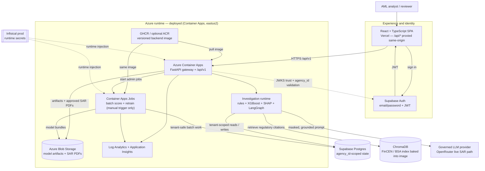

<div align="center">

# FraudLens

**Explainable, tenant-safe AML investigations — from masked transaction ingest to risk scoring,
analyst review, grounded SAR drafts, and governed model operations.**

[](#quick-start)
[](https://github.com/Kartik-Hirijaganer/FraudLens/actions/workflows/ci.yml)

[](LICENSE)
<br/>


**[Why](#why-fraudlens-exists)** · **[Capabilities](#what-it-does)** ·
**[Architecture](#how-it-works)** · **[Quick start](#quick-start)** ·
**[Engineering](#engineering-highlights)** · **[API](#api-surface)** ·
**[Docs](#documentation)**

> **Current status:** FraudLens is **live** at
> **[fraud-lens-amber.vercel.app](https://fraud-lens-amber.vercel.app)** — the SPA on Vercel with
> `/api/*` proxied same-origin to Azure Container Apps, state in Supabase Postgres. It also runs
> fully locally with no cloud account. Deploys are never automatic: each one needs the owner's
> approval on a protected environment. Recurring cost is ~$2.72/month under enforced hard caps
> ([cost model](docs/reference/cost-model.md), [ADR-029](docs/architecture/adr/ADR-029-recurring-operational-budget.md)).

**Three different things run in this repository, and only the first one is standing right now:**

| | What it is | Status | Evidence |
| --- | --- | --- | --- |
| **The deployment** | Azure Container Apps + Vercel + Supabase behind one public origin | **Standing.** ~$2.72/month under hard caps | [Live URL](https://fraud-lens-amber.vercel.app), [cost model](docs/reference/cost-model.md) |
| **The Kubernetes demonstration** | One Kustomize base on local kind and on Azure AKS, with a real HPA | **Ephemeral.** Applied, measured, destroyed in one approved session; $0 standing | [kind](docs/reference/benchmarks/k8s-hpa-scaling.md) · [AKS](docs/reference/benchmarks/aks-hpa-scaling.md) |
| **The inference benchmark** | Two RunPod RTX 4090 endpoints serving BF16 and AWQ for a 1,000-case matrix | **Ephemeral.** Both Pods and volumes verified deleted after export | [Gated cascade](docs/reference/benchmarks/vllm-gated-cascade-benchmark.md) · [raw arms](docs/reference/benchmarks/vllm-awq-sar-benchmark.md) |

> The demonstration runtime and the benchmark are **not** how the application is served. AKS is not
> the deploy target ([ADR-021](docs/architecture/adr/ADR-021-aks-ephemeral-kubernetes-demonstration.md)),
> and no GPU is provisioned outside an approved, torn-down session
> ([ADR-028](docs/architecture/adr/ADR-028-paid-experiment-governance.md)).

**Keywords:** AML · fraud detection · explainable AI · XGBoost · SHAP · LangGraph · regulatory RAG
· SAR drafting · multi-tenant SaaS · FastAPI · React · MLOps

</div>

---

## Why FraudLens exists

A fraud score by itself is not an investigation. An analyst also needs to know which signals fired,
why the model moved the score, what regulatory context applies, what action was taken, and whether
the entire decision can be reconstructed later. In a multi-tenant system, every one of those steps
must also preserve tenant isolation and prevent sensitive data from leaking through logs, prompts,
URLs, or errors.

FraudLens explores that complete decision path as a personal, production-hygiene project. It turns
public, synthetically generated AML transactions into explainable investigations and review-ready
alerts, while keeping analysts in control of alert decisions and SAR approval. The repository uses
no real PHI, stores only masked demo data, validates tenant identity from JWT claims, and keeps every
secret outside source control.

## What it does

- **Transaction ingest** — accepts single records, batches, or masked CSV uploads; list and search
  operations use tenant-scoped, keyset-paginated queries.
- **Hybrid risk scoring** — combines deterministic rules with a calibrated XGBoost model and assigns
  a risk band using the active model's operating points.
- **Explainable decisions** — records rule hits and additive SHAP feature contributions so analysts
  can see why a transaction moved toward or away from risk.
- **Thresholded investigation graph** — below-threshold runs stop after scoring; alerted runs continue
  through regulatory retrieval and SAR drafting, avoiding unnecessary LLM work.
- **Regulatory RAG** — retrieves versioned FinCEN/BSA context from ChromaDB, with a deterministic
  offline embedder for the default local demo and a guarded live embedding path as an opt-in.
- **Governed SAR drafting** — produces cited draft narratives through a provenance-derived,
  synthetic-only model-input allowlist, versioned prompt, strict schema, citation grounding, budget
  guard, replay cache, and mock/live provider seam.
- **Analyst workflow** — exposes dashboards, transaction search, live investigation progress, alert
  review actions, SAR review, and role-aware navigation for analyst, reviewer, auditor, and admin
  responsibilities.
- **Human-gated MLOps** — supports retrain → candidate → shadow → approval → canary → active, plus
  rollback, per-tenant promotion gates, last-known-good model fallback, and advisory drift reports.
- **Auditable operations** — records request IDs, investigation transitions, model versions, prompt
  provenance, review decisions, and administrative lifecycle actions without logging PHI.
- **Tenant-isolation research** — includes a committed, redacted graph-feature study and interactive
  typology view that makes the performance-versus-isolation boundary explicit without querying live
  tenant data.

## How it works

### Architecture diagram

This is the **deployed architecture**: everything in the Azure box below is applied and serving,
reached through the Vercel same-origin proxy. The main request and investigation path runs
top-to-bottom; dashed connections are runtime configuration or trust relationships.



The default developer stack maps those boundaries to Vite, local FastAPI, Docker Postgres, local
jobs/artifacts, the offline ChromaDB index, and the keyless mock SAR drafter. Infisical is used only
to inject the Kaggle token into the public IBM AML-Data fetch command; the token is removed before
database, backend, frontend, scoring, RAG, or SAR processes start.

### User flow — draft and submit a SAR for review

This is the implemented above-threshold happy path. The system generates the first grounded draft;
the analyst validates the evidence and sends it for internal review; the reviewer remains the human
approval gate. Regulatory filing is outside FraudLens.



```mermaid
flowchart TB
    subgraph analyst["Analyst"]
        direction TB
        signIn["Sign in"]
        transactions["Open Transactions"]
        select["Select or import a masked transaction"]
        start["Start investigation"]
        signIn --> transactions --> select --> start
    end

    subgraph system["FraudLens investigation"]
        direction TB
        authorize["Validate JWT, RBAC, and agency_id"]
        score["Run rules + active XGBoost model"]
        explain["Produce risk band + SHAP drivers"]
        threshold["Happy path: alert threshold crossed"]
        alert["Persist tenant-scoped alert"]
        retrieve["Retrieve FinCEN / BSA citations"]
        draft["Generate and persist masked, grounded SAR draft"]
        authorize --> score --> explain --> threshold --> alert --> retrieve --> draft
    end

    subgraph caseReview["Analyst case review"]
        direction TB
        evidence["Confirm Risk → Drivers → Citations → SAR draft"]
        regenerate["Regenerate the draft if needed, then confirm"]
        alertQueue["Open the generated alert in the Alerts queue"]
        submit["Click Send for review<br/>append action + audit event"]
        evidence --> regenerate --> alertQueue --> submit
    end

    subgraph reviewer["Reviewer"]
        direction TB
        openReview["Open the escalated alert"]
        assess["Review evidence, citations, narrative, and activity"]
        edit["Edit if needed<br/>persist a new masked draft version"]
        approve["Approve SAR"]
        complete["SAR approved<br/>PDF generation queued + audit trail updated"]
        openReview --> assess --> edit --> approve --> complete
    end

    start --> authorize
    draft --> evidence
    submit --> openReview
```

### Built with

| Layer | Stack |
| --- | --- |
| **Backend** | Python 3.11 · FastAPI · Pydantic v2 · SQLAlchemy 2 async · Alembic · structlog |
| **ML / investigation** | XGBoost · SHAP · scikit-learn · imbalanced-learn · LangGraph |
| **LLM / RAG** | Standalone governed LLM client · OpenRouter opt-in · versioned prompts · ChromaDB · deterministic hashing embeddings locally |
| **Frontend** | React 19 · TypeScript · Vite · Tailwind CSS · Wise design system · D3 force |
| **Data** | Docker Postgres 16 locally · Supabase Postgres in the cloud · local artifact and queue backends |
| **Security** | Fail-closed JWT/AuthZ · `agency_id` tenant enforcement · RBAC · PHI masking · Infisical secrets · gitleaks |
| **Infra / CI** | Docker · Terraform · GitHub Actions · Azure Container Apps + Blob · Vercel · ephemeral AKS |

## Quick start

### Prerequisites

- **Python 3.11** and [uv](https://docs.astral.sh/uv/)
- **Node.js 20+** and npm
- **Docker** with the daemon running
- **GNU Make** and Git
- **Infisical CLI** access to the FraudLens project, authenticated with `infisical login`
- Enough local space for the approximately 454 MB gitignored IBM AML-Data file plus Docker state

No Azure, Vercel, Supabase, or LLM-provider account is required for the default local demo.
Application/provider secrets never belong in `.env`; the optional `.env` file is for non-secret
local port and Docker overrides only.

### Install and run

```bash
git clone https://github.com/Kartik-Hirijaganer/FraudLens.git
cd FraudLens

infisical login       # one-time local authentication; the dataset fetch reads prod /ml
make install          # uv workspace sync + npm ci
make run              # clean local rebuild, ingest, score, then start API + frontend
```

`make run` is the normal, reproducible demo path. It:

1. drops the local Postgres volume and generated caches while preserving the downloaded IBM file;
2. verifies or fetches only `HI-Small_Trans.csv` from the public IBM AML-Data dataset;
3. removes the Kaggle token from the environment, starts Postgres, and applies migrations;
4. seeds foundation identity/config/rules and activates the best gates-passed local model bundle;
5. masks and ingests a bounded 1,600-row partition into the configured demo agency;
6. builds the offline regulatory index and batch-scores the rows through the production pipeline;
7. starts the FastAPI gateway and Vite frontend, then prints the actual local URLs.

Preferred URLs are:

| Surface | URL |
| --- | --- |
| Analyst application | [http://localhost:5173](http://localhost:5173) |
| API / gateway | [http://localhost:8000](http://localhost:8000) |
| Swagger UI | [http://localhost:8000/docs](http://localhost:8000/docs) |
| ReDoc | [http://localhost:8000/redoc](http://localhost:8000/redoc) |
| Liveness | [http://localhost:8000/healthz](http://localhost:8000/healthz) |
| Readiness | [http://localhost:8000/readyz](http://localhost:8000/readyz) |

If a default port is occupied, the runner selects a free fallback and prints it. Local mode enables
the development auth bypass only in the non-production environment, uses local storage/queue
backends, and uses the deterministic mock SAR drafter, so there is no provider cost.

> **Reset behavior:** `make run` intentionally rebuilds local database/generated state on each run.
> Use `make local-demo` when you want to keep the existing Docker volume and local state.

### Stop, preserve, or reset

```bash
# Stop the foreground API/frontend with Ctrl-C, then remove local containers but keep volumes:
make local-demo-down

# Start again without dropping the existing volume/state:
make local-demo

# Remove containers, volumes, generated state, AND the cached IBM download:
make local-demo-reset
```

`make local-demo-reset` is destructive only to gitignored local demo state. The next run must fetch
the IBM file again. For port overrides or troubleshooting, see the
[local development runbook](docs/runbooks/local-dev.md) and
[troubleshooting guide](docs/runbooks/troubleshooting.md).

### Optional live-service mode

`make run-live` keeps the frontend, backend, files, and job execution local but connects to real
Supabase Auth/Postgres and the guarded OpenRouter path. It is not the default demo and requires the
documented Supabase setup plus runtime values from Infisical `prod`; it never enables the auth
bypass. `make run-live-demo` additionally bootstraps the pinned portfolio story.

```bash
make ingest-rag-live
make run-live
```

Follow [Local development — Running live locally](docs/runbooks/local-dev.md#running-live-locally)
before using either live-service command.

## Engineering highlights

- **Tenant isolation is a boundary, not a filter.** Tenant-scoped tables and operations carry
  `agency_id`; authorization compares the verified JWT claim with the requested resource instead
  of trusting a client-supplied tenant ID. Offline graph research never becomes a cross-tenant
  serving dependency. → [Architecture](docs/architecture/ARCHITECTURE.md),
  [ADR-017](docs/architecture/adr/ADR-017-graph-feature-serving-boundary.md)
- **Explainability follows the exact served model.** Model bundles include feature metadata,
  calibration, a SHAP background, and checksums. Explanations are additive to the model margin, and
  the cache reloads when the active registry pointer changes. →
  [Model lifecycle](docs/runbooks/model-lifecycle.md)
- **Alert creation is earned by the pipeline.** Demo and production-shaped flows do not seed alerts
  directly: transactions run through scoring, threshold evaluation, persistence, retrieval, and
  drafting. Below-threshold runs short-circuit before RAG/LLM work. →
  [Architecture pipeline](docs/architecture/ARCHITECTURE.md#fraud-investigation-pipeline-target--opt-in-live-path)
- **SAR output is reviewable and reproducible.** Drafts retain prompt version/hash, grounded
  citations, safe structured output, token/cost metadata, and review state. Provider failure
  degrades to a completed investigation with score/evidence rather than losing the case. →
  [Architecture — SAR drafting](docs/architecture/ARCHITECTURE.md#sar-drafting--prompt-versioning)
- **Model promotion is quantitative and human-gated.** Candidates must clear global and per-tenant
  checks before shadow/canary/active transitions; canary evaluation can auto-abort, and rollback
  flips the pointer without a redeploy. → [Model lifecycle](docs/runbooks/model-lifecycle.md)
- **Local data provenance is explicit.** The default input is public, synthetically generated IBM
  AML-Data. Raw files remain gitignored; identifiers are masked before storage, and provenance is
  recorded. CI/tests remain reproducible on committed synthetic fixtures. →
  [ADR-018](docs/architecture/adr/ADR-018-portfolio-demo-data-provenance.md)
- **LLM access is policy-driven.** Provider/model selection, retention posture, data-class policy,
  retry/fallback eligibility, input masking, prompt-risk scans, output scans, and budgets are
  config-driven. The default local path is keyless. → [LLM configuration](config/README.md)
- **Local and CI gates share one contract.** The root Makefile drives lint, formatting, strict
  typing, branch coverage, changed-line coverage, tenancy checks, docs generation, duplication,
  secret scanning, dependency audits, Terraform validation, and container builds. →
  [Makefile](Makefile), [CI workflow](.github/workflows/ci.yml)
- **SAR quality/privacy is thresholded and provider-free.** `make quality-gates` checks all 32
  synthetic scenarios, adversarial unsupported claims, raw retry/fallback request bytes, and the
  published study binding without network or credentials. →
  [Quality gates](docs/reference/quality-gates.md),
  [ADR-026](docs/architecture/adr/ADR-026-synthetic-only-model-egress.md)

## Inference benchmark: vLLM + 4-bit AWQ

The frozen study compares BF16 and AWQ-Marlin on the same GPU, image, model family, prompt, and
1,000-case synthetic workload at concurrency 1, 8, and 32. The measured run used a temporary
RunPod Secure Cloud RTX 4090 after the admission gate passed; the Pod and its volume were deleted
and independently verified absent after export. AWQ is presented as an efficiency result, not a
quality-equivalent default — and release 0.5.0 measured exactly how far from equivalent it is.

<!-- AUTOGEN:vllm-benchmark -->
| Cases | BF16 weight memory | AWQ weight memory | Reduction | Acceptance |
| ---: | ---: | ---: | ---: | --- |
| 1000 | 14.25 GiB | 5.20 GiB | 63.5% | not met |

Acceptance NOT met (reference_validity). AWQ reduced parsed model-weight memory by 63.5%; AWQ throughput higher by 60.8% at concurrency 32.
<!-- /AUTOGEN:vllm-benchmark -->

See the [protocol and operator runbook](docs/runbooks/vllm-benchmark.md) and
[ADR-020](docs/architecture/adr/ADR-020-vllm-awq-self-hosted-sar-inference.md).

## Quality-gated SAR cascade

Quantization did not cost fluency; it cost **grounding**. Over the same 1,000 cases at concurrency
32, raw AWQ fabricated citations on 85 of them and BF16 on none. Every draft is therefore judged by
a deterministic gate before it is persisted or streamed, a citation-failed draft escalates to the
next model tier, and a cascade that exhausts every tier **fails explicitly** rather than serving a
plausible narrative. Nothing is silently repaired.

Each row below is one scenario at its highest measured concurrency, over the same 1,000 cases:

<!-- AUTOGEN:cascade-benchmark -->
| Scenario | Cases served | Citation fabrications | Escalated | Case p95 | GPU-hours / case | Endpoints |
| --- | ---: | ---: | ---: | ---: | ---: | ---: |
| bf16-baseline | 99.5% | 0 | 0.0% | 16,164 ms | 0.000116 | 1 |
| awq-raw | 90.9% | 85 | 0.0% | 16,228 ms | 0.000113 | 1 |
| awq-bf16-unconstrained | 99.7% | 0 | 9.2% | 17,184 ms | 0.000204 | 2 |

Gated awq-bf16-unconstrained served 99.7% of 1000 cases with 9.2% escalated; case p95 latency 6.3% higher than bf16-baseline at concurrency 32 across two endpoints, not one; AWQ model weights 63.5% smaller.
<!-- /AUTOGEN:cascade-benchmark -->

The cascade's p95 and GPU-time are measured across **two** simultaneously provisioned endpoints
against a one-endpoint baseline — an architecture comparison, not a same-hardware one. The published
report labels every row accordingly, and no figure in it is authored: the headline, the acceptance
table, and the comparisons are all derived from the persisted run.

See the [gated-cascade report](docs/reference/benchmarks/vllm-gated-cascade-benchmark.md) and
[ADR-030](docs/architecture/adr/ADR-030-quality-gated-sar-model-cascade.md).

## Training at scale: 68.2M IBM transactions

The public IBM source contains 68,228,066 rows across the three frozen inputs. That is the source
row count, not the number of model-fitting rows: usability rules, whole-account temporal folds,
calibration, and final holdout evaluation reduce the training population. The published aggregate
records all three candidates, reconciliation counts, temporal folds, runtime, and projected cost.

<!-- AUTOGEN:fulldata-training -->
| Candidate | Source rows | Usable rows | Training rows | Holdout rows | PR-AUC | Gates |
| --- | ---: | ---: | ---: | ---: | ---: | --- |
| hi-small | 5078345 | 5054380 | 3032849 | 1010853 | 0.2632 | failed |
| hi-medium | 31898238 | 31796234 | 19078362 | 6358506 | 0.3196 | passed |
| li-medium | 31251483 | 31157276 | 18695899 | 6231386 | 0.0839 | failed |
<!-- /AUTOGEN:fulldata-training -->

See the [data-batch runbook](docs/runbooks/data-batch.md) and
[model lifecycle](docs/runbooks/model-lifecycle.md#dataset-strategy).

## Kubernetes deployment: AKS, Terraform, and HPA

One Kustomize base runs on local kind and on Azure AKS. Both have now been measured, and each row
below comes from its own artifact — kind evidence is never cited as an AKS deployment. The AKS
session was human-approved, bounded, and destroyed afterwards with a verified-clean check, so the
cluster is **ephemeral by design**: what persists at $0 is the Terraform, the evidence, and the
workflow logs. AKS scale-out is slower than kind because pods bind on node capacity and trigger the
cluster autoscaler — that is node autoscaling on top of pod autoscaling, not a regression.

<!-- AUTOGEN:k8s-benchmark -->
| Platform | API replicas | First scale-up | Scale-back | Durable runs | Failed runs |
| --- | --- | ---: | ---: | ---: | ---: |
| kind | 1 → 5 → 1 | 46 s | 92 s | 100/100 | 0 |
| aks | 1 → 5 → 1 | 101 s | 117 s | 100/100 | 0 |
<!-- /AUTOGEN:k8s-benchmark -->

The AKS load exercised an authenticated API hard enough to drive scale-out, but the rate limiter
rejected almost all of it: **1,147 of 783,498 requests succeeded (0.15%)**. The rows above are a
real autoscaling result and are **not** a sustained-throughput result. The evidence validator now
refuses to publish a sub-95% served share unless the artifact states the measured counts.

Evidence: [kind report](docs/reference/benchmarks/k8s-hpa-scaling.md),
[AKS report](docs/reference/benchmarks/aks-hpa-scaling.md),
[ADR-021](docs/architecture/adr/ADR-021-aks-ephemeral-kubernetes-demonstration.md), and the
[AKS runbook](docs/runbooks/aks-deploy.md).

## Quality and privacy gates

Provider-free CI evaluates citation validity, required-fact coverage, abstention behavior,
unsupported claims, model-egress byte safety, tenant isolation, secrets, attribution, and
dependency/IaC posture. The alert review UI exposes the exact persisted, policy-projected model
input; it never reconstructs prompts from raw browser data. Drafting failure is a durable
`drafting-blocked` state, while risk and SHAP evidence remain available to the analyst.

## Working with AI agents

[`AGENTS.md`](AGENTS.md) is the contributor contract. Project skills are authored once under
`.claude/skills/` and deterministically mirrored to `.agents/skills/`; `make docs-check` rejects
drift. Agents may edit and verify, but cloud mutations, commits, pushes, tags, and releases remain
human-authorized actions. AI authorship or co-author trailers are prohibited.

## Cloud deployment status

FraudLens keeps always-on application hosting separate from temporary research compute. The
application is deployed; every paid experiment was destroyed after producing its evidence. RunPod
was used only for the completed temporary NVIDIA benchmark and has no continuing FraudLens
resources.

| Surface | Target | Current status |
| --- | --- | --- |
| Backend API | Azure Container Apps | **Deployed** and serving; scale-to-zero with a 1-replica hard cap, deploys gated by required production approval |
| Frontend | Vercel | **Live** at `fraud-lens-amber.vercel.app`; `/api/*` proxied same-origin to the backend |
| Database | Supabase Postgres | Provisioned; credentials resolve only from Infisical |
| AKS demonstration | Azure AKS | Applied, measured, and destroyed in one governed session; cluster is ephemeral, evidence is committed |
| GPU benchmark VM | Temporary RunPod RTX 4090 | 6,000-request benchmark and 100-case application pass completed; Pod and encrypted volume deleted |
| Data-batch VM | Temporary Azure CPU experiment | 68.2M-source-row aggregate published; resource group destroyed and clean teardown verified |
| Secrets | Infisical Cloud | Active source of truth; workloads use scoped, short-lived identity |

Recurring spend is bounded by caps, not alerts: one maximum replica, 0.1 GB/day log ingestion, a
$0.25/day LLM ceiling, and manual-only jobs, with $25/month budgets at both the resource-group and
subscription scopes and a daily read-only watchdog for leftover resources. See the
[cost model](docs/reference/cost-model.md) and
[ADR-029](docs/architecture/adr/ADR-029-recurring-operational-budget.md).

See the [Azure deployment runbook](docs/runbooks/azure-deploy.md), [paid-experiment ledger](docs/reference/experiments/ledger.md),
and [deployment/rollback runbook](docs/runbooks/deploy-rollback.md). Future inference, retraining,
or AKS sessions incur new cost and require fresh admission/approval.

## Project internals and reference

### Project structure

```text
.
├── backend/                    FastAPI service and deployable backend image
│   └── src/fraudlens_backend/ API, middleware, DB repositories, pipeline, jobs
├── packages/
│   ├── fraudlens-core/         Shared domain models and tenant enforcement
│   ├── fraudlens-llm/          Standalone governed provider client
│   └── fraudlens-ml/           Rules, scoring, SHAP, RAG, SAR protocols
├── frontend/                   React + TypeScript analyst/admin SPA
├── config/                     Layered non-secret app, LLM, and demo configuration
├── data/                       Committed synthetic fixtures and regulatory corpus
├── alembic/                    Postgres schema migrations
├── infra/terraform/            Azure IaC: deployed prod + budgets, ephemeral AKS
├── supabase/                   Auth-claim setup for optional live-local mode
├── scripts/                    Docs, ingest, training, demo, and governance tooling
├── tests/                      Unit, integration, security, smoke, and synthetic fixtures
├── docs/                       Architecture, runbooks, generated references
├── DESIGN.md                   Canonical Wise frontend design system
├── Makefile                    Single source of truth for developer and CI commands
└── docker-compose.local.yml    Local Postgres 16 stack
```

### API surface

Operational probes are deliberately unprefixed. Business APIs use `/api/v1`, camelCase payloads,
and the error envelope `{code, message, details, requestId}`.

| Resource | Representative path | Operations |
| --- | --- | --- |
| Operations | `/healthz`, `/readyz` | Liveness and dependency readiness |
| Transactions | `/api/v1/transactions` | Ingest one/batch/CSV · list/search · read |
| Investigations | `/api/v1/investigations` | Start · snapshot · SSE progress · regenerate SAR |
| Alerts | `/api/v1/alerts` | List/read · analyst action · SAR review |
| Rules | `/api/v1/rules` | List · create · update · delete |
| Dashboard | `/api/v1/dashboard/metrics` | Tenant-scoped risk and workload metrics |
| Models | `/api/v1/model-versions` | Registry versions and active pointer |
| Model lifecycle | `/api/v1/training-runs`, `/api/v1/model-deployment` | Retrain · shadow · approve · canary · evaluate · rollback · drift |
| Identity/admin | `/api/v1/me`, `/api/v1/users`, `/api/v1/config` | Current principal · invite user · system configuration |

The committed machine-readable contract is
[`openapi.json`](docs/reference/generated/api/openapi.json), with an equivalent
[`openapi.yaml`](docs/reference/generated/api/openapi.yaml) and a generated
[`standalone Scalar reference`](docs/reference/generated/api/index.html). When the backend is
running, use Swagger UI at `/docs`, ReDoc at `/redoc`, or Scalar at `/scalar`. For browser-based
schema editing, upload `openapi.json` to [editor.swagger.io](https://editor.swagger.io/); do not
send authenticated requests or secret-bearing examples to third-party tools.

### Developer commands

The root [Makefile](Makefile) is the single source of truth; CI invokes the same targets. This table
is regenerated from its help text.

<!-- AUTOGEN:make-targets -->
| Command | What it does |
| --- | --- |
| `make install` | Install all dependencies (uv workspace + frontend npm ci). |
| `make run` | Clean-reset generated state, ingest IBM AML, pipeline-score, then boot locally. |
| `make local-demo` | Boot the IBM-backed local stack; fetches via Infisical /ml when absent. |
| `make test` | Run tests for both stacks. |
| `make coverage` | Run tests with ≥90% coverage gate. |
| `make pre-pr` | Identity gate, format, regenerate docs, then the shared CI umbrella (writes). |
| `make pr-check` | Complete local PR preflight; mirrors all applicable GitHub PR checks (writes). |
| `make docs` | Regenerate the skill mirror, headers, OpenAPI, ERD, and architecture AUTOGEN (WRITES). |
| `make fulldata-pilot` | Run the approved bounded pilot (candidate + row target configurable). |
| `make fulldata-validate` | Revalidate the committed full-data report/frontend hash binding. |
| `make vllm-bench-validate` | Rebuild deterministic smoke cases and verify protocol/publication bindings. |
| `make runpod-gpu-plan` | Check live Secure Cloud capacity and budget admission. |
| `make kind-demo` | Build, deploy, smoke, prove HPA/durability, and always tear down local kind. |
| `make k8s-validate` | Render and statically validate every Kubernetes platform surface. |
| `make tf-validate` | Terraform fmt + validate (no backend) per discovered environment root. |
<!-- /AUTOGEN:make-targets -->

## Security and governance

- **No real PHI** in source, fixtures, logs, error messages, URLs, query strings, prompts, or demo
  data. Public source data is masked before persistence.
- **Tenant isolation** on every tenant-scoped query and background job through `agency_id`.
- **Fail-closed authorization** validates the JWT `agency_id` claim against the resource; the
  development bypass is explicitly enabled only outside production and is proven inert in prod.
- **Least privilege and auditability** for alert review, SAR decisions, configuration, training,
  promotion, canary, and rollback operations.
- **No secrets in `.env` or git.** Secrets resolve at runtime from the single Infisical `prod`
  environment; `.env` is limited to gitignored, non-secret local configuration.
- **Synthetic/public data only.** Do not introduce customer, patient, or production financial data
  into this repository or its demo workflows.

See [Security](docs/runbooks/security.md), [PHI guardrails](docs/runbooks/phi-guardrails.md), and
[Infisical secrets](docs/runbooks/infisical-secrets.md) before changing a data or trust boundary.

## Documentation

| Need | Source of truth |
| --- | --- |
| Architecture and implemented/target state | [docs/architecture/ARCHITECTURE.md](docs/architecture/ARCHITECTURE.md) |
| Local setup and live-local mode | [docs/runbooks/local-dev.md](docs/runbooks/local-dev.md) |
| Portfolio demo workflow | [docs/runbooks/portfolio-demo.md](docs/runbooks/portfolio-demo.md) |
| Model scoring, gates, canary, rollback, and drift | [docs/runbooks/model-lifecycle.md](docs/runbooks/model-lifecycle.md) |
| Security posture and PHI controls | [docs/runbooks/security.md](docs/runbooks/security.md) · [docs/runbooks/phi-guardrails.md](docs/runbooks/phi-guardrails.md) |
| Database schema and tenancy | [docs/reference/database.md](docs/reference/database.md) |
| Configuration and secrets boundary | [config/README.md](config/README.md) · [docs/reference/configuration.md](docs/reference/configuration.md) |
| Generated OpenAPI | [JSON](docs/reference/generated/api/openapi.json) · [YAML](docs/reference/generated/api/openapi.yaml) · [Scalar HTML](docs/reference/generated/api/index.html) |
| Contributor/agent rules | [AGENTS.md](AGENTS.md) |
| Retired implementation plans | [docs/architecture/retired-plans.md](docs/architecture/retired-plans.md) |

## License

FraudLens is available under the [MIT License](LICENSE).

---

**Safety note:** FraudLens is an engineering and research project, not a production compliance
service or legal determination system. Human review remains required for alert disposition and SAR
decisions.
