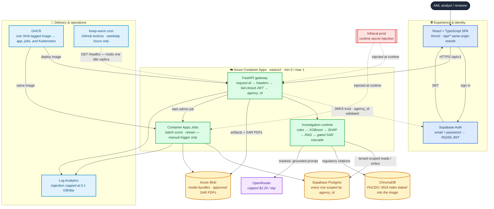
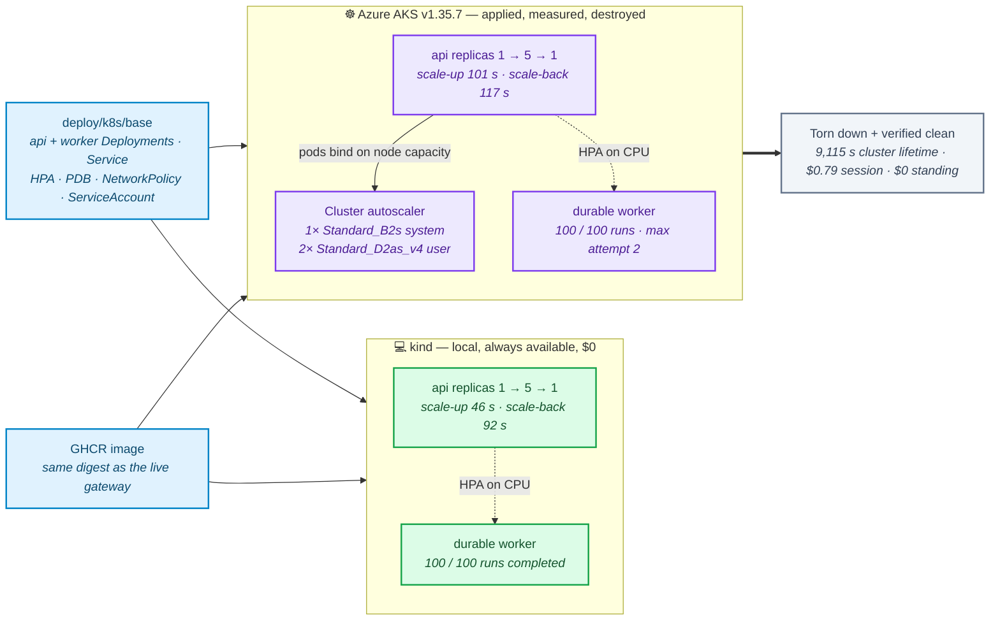

<div align="center">

# FraudLens

[](https://github.com/Kartik-Hirijaganer/FraudLens/actions/workflows/ci.yml)

[](LICENSE)
<br/>


**Keywords:** AML · fraud detection · explainable AI · XGBoost · SHAP · LangGraph · regulatory RAG
· SAR drafting · multi-tenant SaaS · FastAPI · React · MLOps


</div>

---

## Demo video


The clip above is a 17-second highlight. A persona sign-in, an unscored transaction, the investigation streaming its evidence, the persisted
model input the draft was built from, and a human approving the SAR. 

The **[full 47-second walkthrough](docs/demo/fraudlens-walkthrough.mp4)** plays at real reading speed.

## What is it?
FraudLens is a personal AML investigation project that turns synthetic transactions into explainable risk assessments and citation-backed Suspicious Activity Report (SAR) drafts. It connects detection, investigation, and review while keeping analysts in control of final decisions.

* **Detect and explain risk:** Rules and XGBoost score transactions; SHAP explains what drives each score.
* **Investigate and draft:** Flagged transactions trigger regulatory retrieval and a multi-agent workflow to draft SAR narratives with supporting citations.
* **Review and approve:** Dashboards support investigation tracking, alert decisions, and human approval of SARs.
* **Manage model changes:** Human-approved rollouts support shadow testing, canary releases, and rollback.
* **Trace decisions:** Tenant isolation and audit trails track model versions, workflow changes, and reviewer actions.

### Architecture diagram



🔵 browser and identity · 🟢 Azure compute · 🟡 durable state · 🟣 external model provider ·
🔴 secrets · 🩵 delivery and operations. Solid arrows carry requests or data; dashed arrows are
trust and configuration relationships, not a request path.

### The same image also ran on Kubernetes
I destroyed the AKS cluster to keep costs at $0.


## Measured results

| What was measured | Result | Where it ran | Detail |
| --- | --- | --- | --- |
| **Kubernetes autoscaling — AKS** | api replicas **1 → 5 → 1**, scale-up **101 s**, scale-back **117 s**, **100/100** durable runs | Azure AKS v1.35.7, 1× B2s + 2× D2as_v4, destroyed after the session | [AKS + HPA](#kubernetes-deployment-aks-terraform-and-hpa) |
| **Kubernetes autoscaling — kind** | api replicas **1 → 5 → 1**, scale-up **46 s**, scale-back **92 s**, **100/100** durable runs | Local kind, same Kustomize base and image | [AKS + HPA](#kubernetes-deployment-aks-terraform-and-hpa) |
| **Quantization efficiency** | AWQ cut model-weight memory **63.5%** (14.25 → 5.20 GiB); throughput **+60.8%** at concurrency 32 | RunPod RTX 4090, 1,000 synthetic cases, Pod + volume deleted | [Inference benchmark](#inference-benchmark-vllm--4-bit-awq) |
| **Grounding under quantization** | Raw AWQ fabricated citations on **85 / 1,000** cases; BF16 on **0** | Same host, image, prompt, and case set | [Gated cascade](#quality-gated-sar-cascade) |
| **Quality-gated cascade** | Served **99.7%** of 1,000 cases with **9.2%** escalated and **0** fabrications, vs **90.9%** raw AWQ | Two endpoints vs a one-endpoint baseline | [Gated cascade](#quality-gated-sar-cascade) |
| **Training at scale** | **68,228,066** source rows processed; best candidate PR-AUC **0.3196** on 6.36M holdout rows | Ephemeral Azure data-batch VM, torn down after export | [Training at scale](#training-at-scale-682m-ibm-transactions) |
| **Recurring cost** | **~$2.72/month**, bounded by hard caps rather than alerts | Azure Container Apps + Vercel + Supabase | [Cost model](docs/reference/cost-model.md) |

### User flow draft and submit a SAR for review

This is the implemented above-threshold happy path. The system generates the first grounded draft; the analyst validates the evidence and sends it for internal review; the reviewer remains the human approval gate.

```mermaid
flowchart TB
    subgraph analyst["Analyst"]
        direction TB
        signIn["Sign in"]
        transactions["Open Transactions"]
        select["Select or import a masked transaction"]
        start["Start investigation"]
        signIn --> transactions --> select --> start
    end

    subgraph system["FraudLens investigation"]
        direction TB
        authorize["Validate JWT, RBAC, and agency_id"]
        score["Run rules + active XGBoost model"]
        explain["Produce risk band + SHAP drivers"]
        threshold["Happy path: alert threshold crossed"]
        alert["Persist tenant-scoped alert"]
        retrieve["Retrieve FinCEN / BSA citations"]
        draft["Generate and persist masked, grounded SAR draft"]
        authorize --> score --> explain --> threshold --> alert --> retrieve --> draft
    end

    subgraph caseReview["Analyst case review"]
        direction TB
        evidence["Confirm Risk → Drivers → Citations → SAR draft"]
        regenerate["Regenerate the draft if needed, then confirm"]
        alertQueue["Open the generated alert in the Alerts queue"]
        submit["Click Send for review<br/>append action + audit event"]
        evidence --> regenerate --> alertQueue --> submit
    end

    subgraph reviewer["Reviewer"]
        direction TB
        openReview["Open the escalated alert"]
        assess["Review evidence, citations, narrative, and activity"]
        edit["Edit if needed<br/>persist a new masked draft version"]
        approve["Approve SAR"]
        complete["SAR approved<br/>PDF generation queued + audit trail updated"]
        openReview --> assess --> edit --> approve --> complete
    end

    start --> authorize
    draft --> evidence
    submit --> openReview
```




### Built with

| Layer | Stack |
| --- | --- |
| **Backend** | Python 3.11 · FastAPI · Pydantic v2 · SQLAlchemy 2 async · Alembic · structlog |
| **ML / investigation** | XGBoost · SHAP · scikit-learn · imbalanced-learn · LangGraph |
| **LLM / RAG** | Standalone governed LLM client · OpenRouter opt-in · versioned prompts · ChromaDB · deterministic hashing embeddings locally |
| **Frontend** | React 19 · TypeScript · Vite · Tailwind CSS · Wise design system · D3 force |
| **Data** | Docker Postgres 16 locally · Supabase Postgres in the cloud · local artifact and queue backends |
| **Security** | Fail-closed JWT/AuthZ · `agency_id` tenant enforcement · RBAC · PHI masking · Infisical secrets · gitleaks |
| **Infra / CI** | Docker · Terraform · GitHub Actions · Azure Container Apps + Blob · Vercel · ephemeral AKS |

## Quick start

Run FraudLens locally with demo data and mock SAR generation. No Azure, Vercel, Supabase, or LLM-provider account is required.

**1. Install prerequisites**

* Python 3.11 with `uv`
* Node.js 20+ with npm
* Docker, GNU Make, and Git
* Infisical CLI with access to the project's dataset credentials
* Disk space for the ~454 MB dataset plus Docker storage

**2. Clone and install**

```bash
git clone https://github.com/Kartik-Hirijaganer/FraudLens.git
cd FraudLens
infisical login
make install
```

**3. Start the demo**

```bash
make run
```

This downloads the dataset, prepares and scores 1,600 demo transactions, and starts the app.

**Note:** `make run` resets local state. To restart an existing demo without resetting it, use `make local-demo`.

**4. Open the app**

* App: http://localhost:5173
* API docs: http://localhost:8000/docs
  
**Stop or restart**

```bash
make local-demo-down  # Stop; preserve data
make local-demo       # Restart; preserve data
```

**By the numbers:** 68,228,066 IBM source rows processed · 1,000-case GPU benchmark matrix served at
99.7% under the gated cascade · ≥90% branch coverage gated on both stacks · ~$11.53/month recurring
under enforced hard caps.

## Deployment and cost control
Recurring spend is bounded by caps: one maximum replica, 0.1 GB/day log ingestion, a $2.25/day LLM ceiling, and manual-only jobs, with $25/month budgets at both the resource-group and subscription scopes and a daily read-only watchdog for leftover resources. Every paid experiment was destroyed after producing its evidence.

## License

FraudLens is available under the [MIT License](LICENSE).
