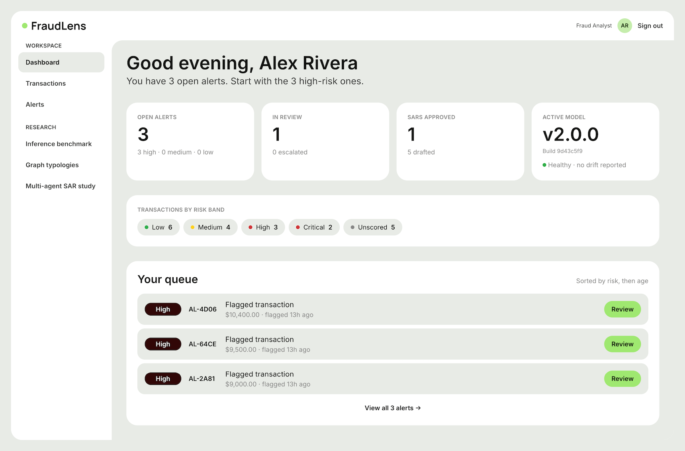
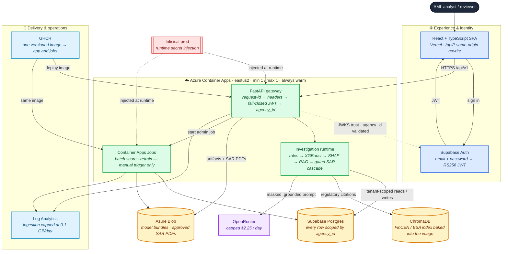

<div align="center">

# FraudLens

[](https://github.com/Kartik-Hirijaganer/FraudLens/actions/workflows/ci.yml)

[](LICENSE)
<br/>


**Keywords:** AML · fraud detection · explainable AI · XGBoost · SHAP · LangGraph · regulatory RAG
· SAR drafting · multi-tenant SaaS · FastAPI · React · MLOps



</div>

---

## Demo video


The clip above is a 17-second highlight. A persona sign-in, an unscored transaction, the investigation streaming its evidence, the persisted
model input the draft was built from, and a human approving the SAR. 

The **[full 47-second walkthrough](docs/demo/fraudlens-walkthrough.mp4)** plays at real reading speed, on one real run (`INV-3C17`) from sign-in to approval.

## What is it?
FraudLens is a personal AML investigation project that turns synthetic transactions into explainable risk assessments and citation-backed Suspicious Activity Report (SAR) drafts. It connects detection, investigation, and review while keeping analysts in control of final decisions.

* **Detect and explain risk:** Rules and XGBoost score transactions; SHAP explains what drives each score.
* **Investigate and draft:** Flagged transactions trigger regulatory retrieval and a multi-agent workflow to draft SAR narratives with supporting citations.
* **Review and approve:** Dashboards support investigation tracking, alert decisions, and human approval of SARs.
* **Manage model changes:** Human-approved rollouts support shadow testing, canary releases, and rollback.
* **Trace decisions:** Tenant isolation and audit trails track model versions, workflow changes, and reviewer actions.

## How it works

Three different things run in this repository, and only the first is standing right now:

| | What it is | Status |
| --- | --- | --- |
| **The deployment** | Azure Container Apps + Vercel + Supabase behind one public origin | **Standing.** ~$11.53/month under hard caps, always warm |
| **The Kubernetes demonstration** | One Kustomize base on local kind and on Azure AKS, with a real HPA | **Ephemeral.** Applied, measured, destroyed in one approved session; $0 standing |
| **The inference benchmark** | Two RunPod RTX 4090 endpoints serving BF16 and AWQ over a 1,000-case matrix | **Ephemeral.** Both Pods and volumes verified deleted after export |

Neither the demonstration runtime nor the benchmark is how the application is served: AKS is not a
deploy target ([ADR-021](docs/architecture/adr/ADR-021-aks-ephemeral-kubernetes-demonstration.md)),
and no GPU is provisioned outside an approved, torn-down session
([ADR-028](docs/architecture/adr/ADR-028-paid-experiment-governance.md)).

Below is the **deployed architecture** — everything in the Azure box is applied and serving, reached
through the Vercel same-origin proxy.



🔵 browser and identity · 🟢 Azure compute · 🟡 durable state · 🟣 external model provider ·
🔴 secrets · 🩵 delivery and operations. Solid arrows carry requests or data; dashed arrows are
trust and configuration relationships, not a request path.

Four properties of that picture are the ones worth reading closely. **The browser only ever sees one
hostname:** Vercel rewrites `/api/*` same-origin to the Container App, so the SPA makes no
cross-origin call at all and CORS is defence-in-depth rather than the mechanism that makes the demo
work. **The gateway fails closed before any database access:** the JWT is verified against Supabase
JWKS and `agency_id` is bound from the verified claim into the tenant context — a client-supplied
tenant header is never trusted, and a missing or mismatched claim is a 401/403 before a query is
ever issued. **The pipeline short-circuits below the risk threshold:** a low-risk transaction
terminates after rules, XGBoost, and SHAP, and never reaches ChromaDB or the LLM, which is why the
model bill is bounded by risk rather than by traffic. **Secrets are injected at runtime and the
application never calls Infisical itself:** the platform supplies them to the container, and
`/readyz` verifies the injection landed rather than reaching out for it.

Cost follows the same shape, and one line of it was deliberately bought back. The app holds a
single **always-warm** replica rather than scaling to zero: a cold start measured **111.8 s**
against 0.059 s warm, and a keep-warm cron only narrowed the window it happened in — 76% of the
week still met it, and a best-effort GitHub schedule left a one-minute margin against a 300 s
cooldown. Committing the replica removes the mechanism instead of tuning it, and moves compute from
$1.23 to $10.04/month. What still bounds the bill are caps, not alerts: `max_replicas = 1`, log
ingestion at 0.1 GB/day, the LLM path at $2.25/day, and $25 budgets at two scopes — roughly
$11.53/month in total
([ADR-029](docs/architecture/adr/ADR-029-recurring-operational-budget.md)).

The default developer stack maps those boundaries to Vite, local FastAPI, Docker Postgres, local
jobs/artifacts, the offline ChromaDB index, and the keyless mock SAR drafter. Infisical is used only
to inject the Kaggle token into the public IBM AML-Data fetch; the token is removed before database,
backend, frontend, scoring, RAG, or SAR processes start.

### Built with

| Layer | Stack |
| --- | --- |
| **Backend** | Python 3.11 · FastAPI · Pydantic v2 · SQLAlchemy 2 async · Alembic · structlog |
| **ML / investigation** | XGBoost · SHAP · scikit-learn · imbalanced-learn · LangGraph |
| **LLM / RAG** | Standalone governed LLM client · OpenRouter opt-in · versioned prompts · ChromaDB · deterministic hashing embeddings locally |
| **Frontend** | React 19 · TypeScript · Vite · Tailwind CSS · Wise design system · D3 force |
| **Data** | Docker Postgres 16 locally · Supabase Postgres in the cloud · local artifact and queue backends |
| **Security** | Fail-closed JWT/AuthZ · `agency_id` tenant enforcement · RBAC · PHI masking · Infisical secrets · gitleaks |
| **Infra / CI** | Docker · Terraform · GitHub Actions · Azure Container Apps + Blob · Vercel · ephemeral AKS |

## Quick start

**Prerequisites:** Python 3.11 + [uv](https://docs.astral.sh/uv/) · Node.js 20+ and npm · Docker ·
GNU Make and Git · [Infisical CLI](https://infisical.com/docs/cli/overview) authenticated with
`infisical login` · room for the ~454 MB gitignored IBM AML-Data file plus Docker state.

No Azure, Vercel, Supabase, or LLM-provider account is needed for the local demo, and no
provider cost is incurred: it uses the deterministic mock SAR drafter.

```bash
git clone https://github.com/Kartik-Hirijaganer/FraudLens.git
cd FraudLens

infisical login       # one-time; the dataset fetch reads prod /ml
make install          # uv workspace sync + npm ci
make run              # clean rebuild, ingest, score, then start API + frontend
```

`make run` resets local state, fetches `HI-Small_Trans.csv` from the public IBM AML-Data set, drops
the Kaggle token from the environment, migrates, seeds identity/config/rules, activates the best
gates-passed model bundle, masks and ingests a bounded 1,600-row partition, builds the offline
regulatory index, batch-scores through the production pipeline, then serves the app on
**localhost:5173** and the API on **localhost:8000** (`/docs`, `/redoc`, `/healthz`, `/readyz`) —
printing the ports it actually picked.

```bash
make local-demo-down    # stop containers, keep volumes
make local-demo         # restart without dropping state
make local-demo-reset   # also drop volumes and the cached IBM download
make run-live           # local app against real Supabase + guarded OpenRouter
```

`make run-live` never enables the auth bypass and needs the documented Supabase setup plus Infisical
`prod` values; `make run-live-demo` additionally bootstraps the pinned portfolio story. See the
[local development runbook](docs/runbooks/local-dev.md) and
[troubleshooting guide](docs/runbooks/troubleshooting.md).

**By the numbers:** 68,228,066 IBM source rows processed · 1,000-case GPU benchmark matrix served at
99.7% under the gated cascade · ≥90% branch coverage gated on both stacks · ~$11.53/month recurring
under enforced hard caps.

## Measured evidence

Every figure below is derived from a persisted run by the publishing pipeline — none is authored by
hand, and each report is regenerated into this README by `make docs`.

<details>
<summary><strong>Inference benchmark — vLLM + 4-bit AWQ</strong></summary>

BF16 versus AWQ-Marlin on the same GPU, image, model family, prompt, and 1,000-case workload at
concurrency 1, 8, and 32, on a temporary RunPod RTX 4090 deleted and verified absent after export.
AWQ is an efficiency result, not a quality-equivalent default.

<!-- AUTOGEN:vllm-benchmark -->
| Cases | BF16 weight memory | AWQ weight memory | Reduction | Acceptance |
| ---: | ---: | ---: | ---: | --- |
| 1000 | 14.25 GiB | 5.20 GiB | 63.5% | not met |

Acceptance NOT met (reference_validity). AWQ reduced parsed model-weight memory by 63.5%; AWQ throughput higher by 60.8% at concurrency 32.
<!-- /AUTOGEN:vllm-benchmark -->

[Protocol and runbook](docs/runbooks/vllm-benchmark.md) ·
[ADR-020](docs/architecture/adr/ADR-020-vllm-awq-self-hosted-sar-inference.md)

</details>

<details>
<summary><strong>Quality-gated SAR cascade</strong></summary>

Quantization did not cost fluency; it cost **grounding**. Over the same 1,000 cases at concurrency
32, raw AWQ fabricated citations on 85 and BF16 on none. Each row is one scenario at its highest
measured concurrency.

<!-- AUTOGEN:cascade-benchmark -->
| Scenario | Cases served | Citation fabrications | Escalated | Case p95 | GPU-hours / case | Endpoints |
| --- | ---: | ---: | ---: | ---: | ---: | ---: |
| bf16-baseline | 99.5% | 0 | 0.0% | 16,164 ms | 0.000116 | 1 |
| awq-raw | 90.9% | 85 | 0.0% | 16,228 ms | 0.000113 | 1 |
| awq-bf16-unconstrained | 99.7% | 0 | 9.2% | 17,184 ms | 0.000204 | 2 |

Gated awq-bf16-unconstrained served 99.7% of 1000 cases with 9.2% escalated; case p95 latency 6.3% higher than bf16-baseline at concurrency 32 across two endpoints, not one; AWQ model weights 63.5% smaller.
<!-- /AUTOGEN:cascade-benchmark -->

The cascade's p95 and GPU-time are measured across **two** simultaneously provisioned endpoints
against a one-endpoint baseline — an architecture comparison, not a same-hardware one.

[Gated-cascade report](docs/reference/benchmarks/vllm-gated-cascade-benchmark.md) ·
[ADR-030](docs/architecture/adr/ADR-030-quality-gated-sar-model-cascade.md)

</details>

<details>
<summary><strong>Training at scale — 68.2M IBM transactions</strong></summary>

The public IBM source holds 68,228,066 rows across three frozen inputs — the source count, not the
model-fitting count: usability rules, whole-account temporal folds, calibration, and holdout
evaluation all reduce the training population.

<!-- AUTOGEN:fulldata-training -->
| Candidate | Source rows | Usable rows | Training rows | Holdout rows | PR-AUC | Gates |
| --- | ---: | ---: | ---: | ---: | ---: | --- |
| hi-small | 5078345 | 5054380 | 3032849 | 1010853 | 0.2632 | failed |
| hi-medium | 31898238 | 31796234 | 19078362 | 6358506 | 0.3196 | passed |
| li-medium | 31251483 | 31157276 | 18695899 | 6231386 | 0.0839 | failed |
<!-- /AUTOGEN:fulldata-training -->

[Data-batch runbook](docs/runbooks/data-batch.md) ·
[dataset strategy](docs/runbooks/model-lifecycle.md#dataset-strategy)

</details>

<details>
<summary><strong>Kubernetes — AKS, Terraform, and HPA</strong></summary>

One Kustomize base on local kind and on Azure AKS; each row comes from its own artifact, and kind
evidence is never cited as AKS. AKS scale-out is slower because pods bind on node capacity and
trigger the cluster autoscaler — node autoscaling on top of pod autoscaling.

<!-- AUTOGEN:k8s-benchmark -->
| Platform | API replicas | First scale-up | Scale-back | Durable runs | Failed runs |
| --- | --- | ---: | ---: | ---: | ---: |
| kind | 1 → 5 → 1 | 46 s | 92 s | 100/100 | 0 |
| aks | 1 → 5 → 1 | 101 s | 117 s | 100/100 | 0 |
<!-- /AUTOGEN:k8s-benchmark -->

The AKS load drove real scale-out, but the rate limiter rejected almost all of it: **1,147 of
783,498 requests succeeded (0.15%)**. These rows are an autoscaling result, **not** a
sustained-throughput result; the evidence validator refuses to publish a sub-95% served share
unless the artifact states the measured counts.

[kind report](docs/reference/benchmarks/k8s-hpa-scaling.md) ·
[AKS report](docs/reference/benchmarks/aks-hpa-scaling.md) ·
[ADR-021](docs/architecture/adr/ADR-021-aks-ephemeral-kubernetes-demonstration.md)

</details>

## Project internals

<details>
<summary><strong>Project structure</strong></summary>

```text
.
├── backend/                    FastAPI service and deployable backend image
│   └── src/fraudlens_backend/ API, middleware, DB repositories, pipeline, jobs
├── packages/
│   ├── fraudlens-core/         Shared domain models and tenant enforcement
│   ├── fraudlens-llm/          Standalone governed provider client
│   └── fraudlens-ml/           Rules, scoring, SHAP, RAG, SAR protocols
├── frontend/                   React + TypeScript analyst/admin SPA
├── config/                     Layered non-secret app, LLM, and demo configuration
├── data/                       Committed synthetic fixtures and regulatory corpus
├── alembic/                    Postgres schema migrations
├── infra/terraform/            Azure IaC: deployed prod + budgets, ephemeral AKS
├── supabase/                   Auth-claim setup for optional live-local mode
├── scripts/                    Docs, ingest, training, demo, and governance tooling
├── tests/                      Unit, integration, security, smoke, and synthetic fixtures
├── docs/                       Architecture, runbooks, generated references
├── DESIGN.md                   Canonical Wise frontend design system
├── Makefile                    Single source of truth for developer and CI commands
└── docker-compose.local.yml    Local Postgres 16 stack
```

</details>

<details>
<summary><strong>API surface</strong></summary>

Operational probes are deliberately unprefixed. Business APIs use `/api/v1`, camelCase payloads,
and the error envelope `{code, message, details, requestId}`.

| Resource | Representative path | Operations |
| --- | --- | --- |
| Operations | `/healthz`, `/readyz` | Liveness and dependency readiness |
| Transactions | `/api/v1/transactions` | Ingest one/batch/CSV · list/search · read |
| Investigations | `/api/v1/investigations` | Start · snapshot · SSE progress · regenerate SAR |
| Alerts | `/api/v1/alerts` | List/read · analyst action · SAR review |
| Rules | `/api/v1/rules` | List · create · update · delete |
| Dashboard | `/api/v1/dashboard/metrics` | Tenant-scoped risk and workload metrics |
| Models | `/api/v1/model-versions` | Registry versions and active pointer |
| Model lifecycle | `/api/v1/training-runs`, `/api/v1/model-deployment` | Retrain · shadow · approve · canary · evaluate · rollback · drift |
| Identity/admin | `/api/v1/me`, `/api/v1/users`, `/api/v1/config` | Current principal · invite user · system configuration |

The machine-readable contract is
[`openapi.json`](docs/reference/generated/api/openapi.json), with an equivalent
[`openapi.yaml`](docs/reference/generated/api/openapi.yaml) and a generated
[Scalar reference](docs/reference/generated/api/index.html). With the backend running, use
Swagger UI at `/docs`, ReDoc at `/redoc`, or Scalar at `/scalar`.

</details>

<details>
<summary><strong>Developer commands</strong></summary>

The root [Makefile](Makefile) is the single source of truth; CI invokes the same targets. This table
is regenerated from its help text.

<!-- AUTOGEN:make-targets -->
| Command | What it does |
| --- | --- |
| `make install` | Install all dependencies (uv workspace + frontend npm ci). |
| `make run` | Clean-reset generated state, ingest IBM AML, pipeline-score, then boot locally. |
| `make local-demo` | Boot the IBM-backed local stack; fetches via Infisical /ml when absent. |
| `make test` | Run tests for both stacks. |
| `make coverage` | Run tests with ≥90% coverage gate. |
| `make pre-pr` | Identity gate, format, regenerate docs, then the shared CI umbrella (writes). |
| `make pr-check` | Complete local PR preflight; mirrors all applicable GitHub PR checks (writes). |
| `make docs` | Regenerate the skill mirror, headers, OpenAPI, ERD, and architecture AUTOGEN (WRITES). |
| `make fulldata-pilot` | Run the approved bounded pilot (candidate + row target configurable). |
| `make fulldata-validate` | Revalidate the committed full-data report/frontend hash binding. |
| `make vllm-bench-validate` | Rebuild deterministic smoke cases and verify protocol/publication bindings. |
| `make runpod-gpu-plan` | Check live Secure Cloud capacity and budget admission. |
| `make kind-demo` | Build, deploy, smoke, prove HPA/durability, and always tear down local kind. |
| `make k8s-validate` | Render and statically validate every Kubernetes platform surface. |
| `make tf-validate` | Terraform fmt + validate (no backend) per discovered environment root. |
<!-- /AUTOGEN:make-targets -->

</details>

<details>
<summary><strong>Deployment and cost control</strong></summary>

The backend runs on Azure Container Apps (one always-warm replica, 1-replica hard
cap), the SPA on Vercel, state in Supabase Postgres, secrets in Infisical. Every deploy job is gated behind required
production approval, so a green CI run alone ships nothing.

Recurring spend is bounded by caps, not alerts: one maximum replica, 0.1 GB/day log ingestion, a
$2.25/day LLM ceiling, and manual-only jobs, with $25/month budgets at both the resource-group and
subscription scopes and a daily read-only watchdog for leftover resources. Every paid experiment
was destroyed after producing its evidence.

[Cost model](docs/reference/cost-model.md) ·
[ADR-029](docs/architecture/adr/ADR-029-recurring-operational-budget.md) ·
[Azure runbook](docs/runbooks/azure-deploy.md) ·
[experiment ledger](docs/reference/experiments/ledger.md)

</details>

<details>
<summary><strong>Working with AI agents</strong></summary>

[`AGENTS.md`](AGENTS.md) is the contributor contract. Project skills are authored once under
`.claude/skills/` and deterministically mirrored to `.agents/skills/`; `make docs-check` rejects
drift. Agents may edit and verify, but cloud mutations, commits, pushes, tags, and releases remain
human-authorized. AI authorship and co-author trailers are prohibited. Run `make pre-pr` before
opening a PR — CI mirrors it exactly.

</details>

## Security and governance

- **No real PHI** in source, fixtures, logs, error messages, URLs, query strings, prompts, or demo
  data. Public source data is masked before persistence.
- **Tenant isolation** on every tenant-scoped query and background job through `agency_id`.
- **Fail-closed authorization** validates the JWT `agency_id` claim against the resource; the
  development bypass is enabled only outside production and is proven inert in prod by test.
- **Least privilege and auditability** for alert review, SAR decisions, configuration, training,
  promotion, canary, and rollback operations.
- **No secrets in `.env` or git.** Secrets resolve at runtime from the single Infisical `prod`
  environment; `.env` is limited to gitignored, non-secret local configuration.
- **Synthetic/public data only.** Do not introduce customer, patient, or production financial data
  into this repository or its demo workflows.

See [Security](docs/runbooks/security.md), [PHI guardrails](docs/runbooks/phi-guardrails.md), and
[Infisical secrets](docs/runbooks/infisical-secrets.md) before changing a data or trust boundary.

## License

FraudLens is available under the [MIT License](LICENSE).
