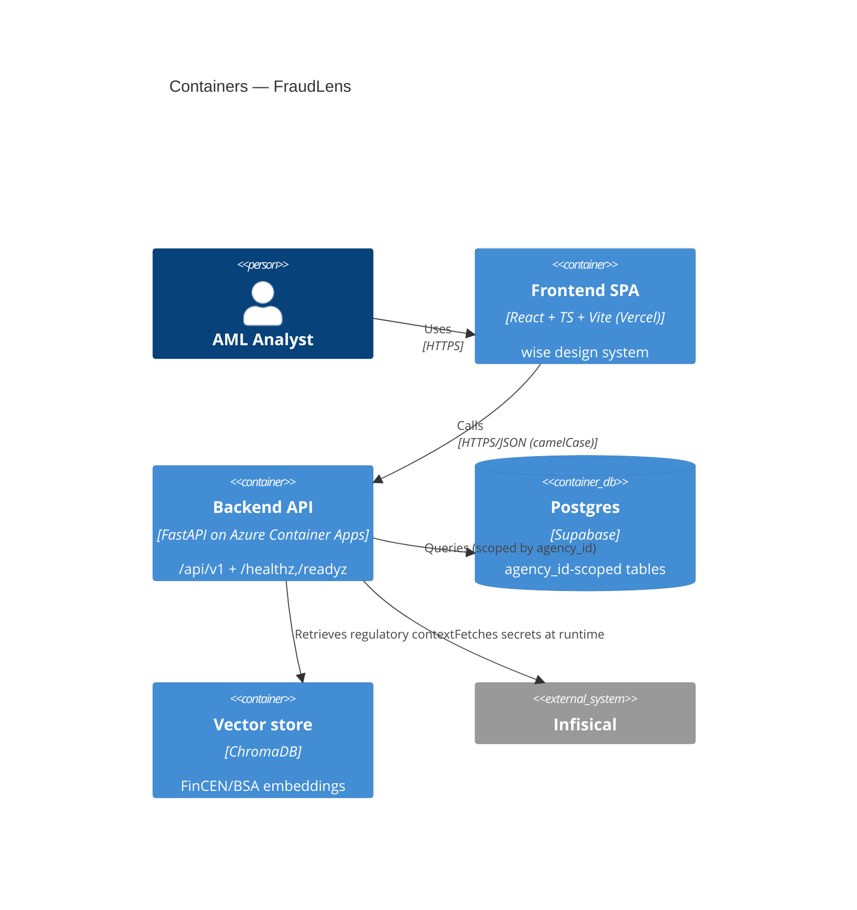
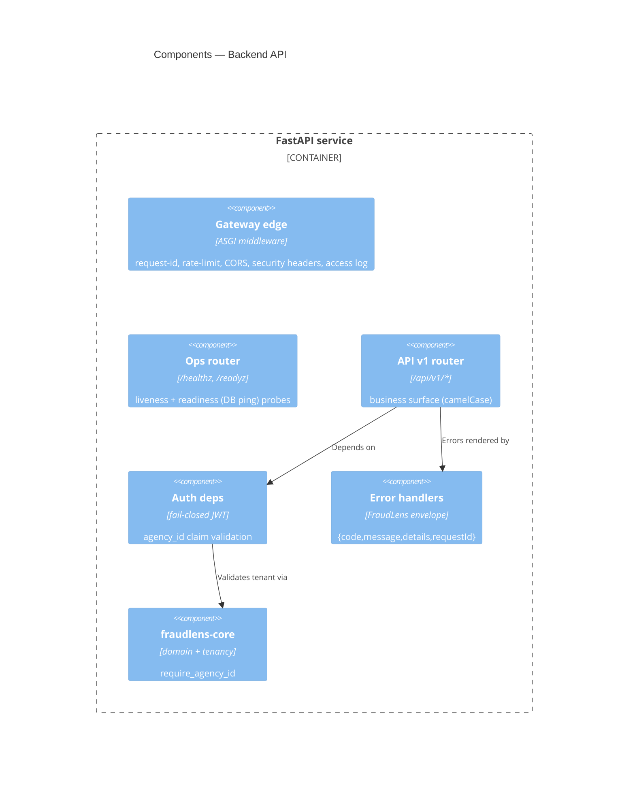
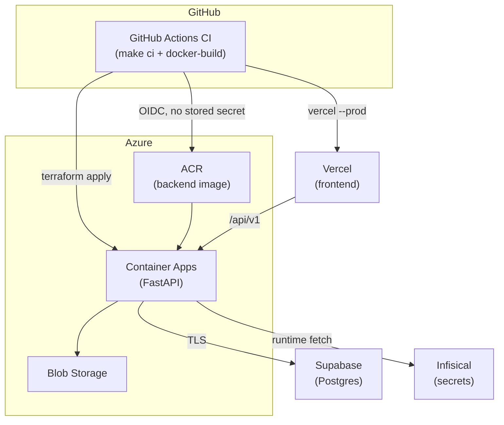
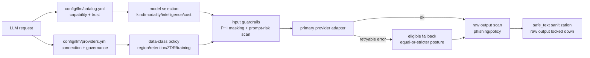
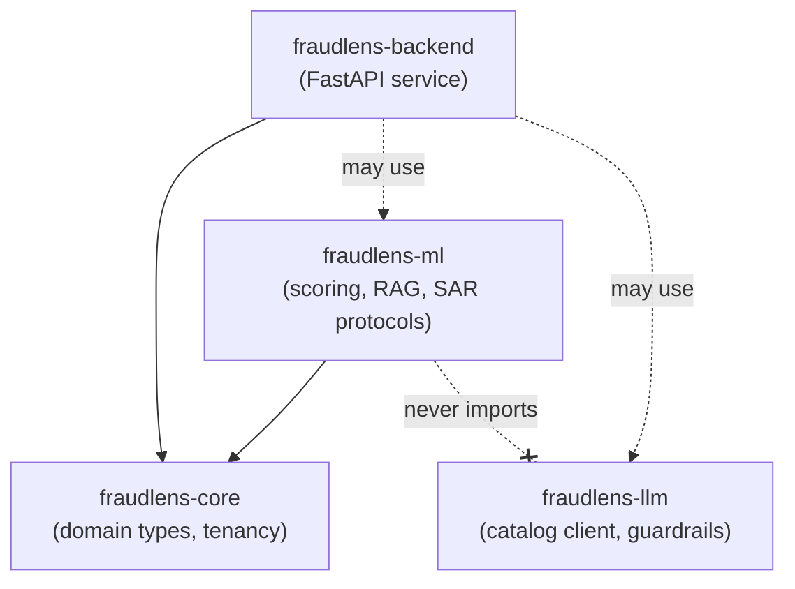

# FraudLens — Architecture

> **Diagrams are [Mermaid](https://mermaid.js.org/)** (text, diffable). The hand-authored
> sections capture intent; the `<!-- AUTOGEN:* -->` regions are regenerated from code by
> `make docs` and validated by CI (`make docs-check`) — **do not edit them by hand**.

FraudLens is an **AML fraud-investigation system**: transactions are risk-scored
(XGBoost + SHAP) through an investigation graph (LangGraph). Runs that cross the alert threshold
are enriched with FinCEN/BSA regulatory context and summarized into draft SARs; no-alert runs stop
after the deterministic score and explanation.
This document distinguishes the implemented defaults from opt-in or planned live behavior;
generated regions below stay synchronized with the codebase.

## Implemented behavior and target state

| Capability | Implemented now | Target / opt-in extension |
|---|---|---|
| Data + model lifecycle | Default local-demo input is a bounded, masked partition of the full public IBM AML-Data file; alerts come only from pipeline threshold decisions. The committed active `v0-fixture`, CI, tests, and retrain remain reproducible synthetic model artifacts. IBM/IEEE training registers source-tagged `CANDIDATE` models without moving the active pointer. | Human-reviewed promotion can activate a passing IBM-trained candidate; public raw data and derived artifacts are never committed. |
| Regulatory RAG | FinCEN/BSA chunks are stored in ChromaDB. The deterministic 256-dimensional `HashingEmbedder` remains the keyless default; `make ingest-rag-live` and `make run-live` opt into 1536-dimensional OpenRouter `text-embedding-3-small`. | Expand the curated regulatory corpus and authoritative source metadata without changing the embedding/index contract. |
| SAR drafting | `make run` / `make local-demo` uses deterministic `MockSarDrafter`. Live mode retains the single writer and adds a bounded four-agent implementation behind process and tenant flags; production defaults to the single writer. Both use the injected `SarDrafter` seam and the existing human review gate. | Publication requires a committed synthetic evaluation that compares both live arms through the real API; enable the agent path by default only when its measured quality benefit justifies the additional cost and latency ([ADR-019](adr/ADR-019-multi-agent-sar-drafting.md)). |

The diagrams below show the full system shape. Where a diagram names an LLM provider or semantic
RAG flow, treat it as the opt-in/target path described above, not the keyless local default.

## C4 — System Context


## C4 — Containers



## C4 — Components (Backend)



## Fraud-investigation pipeline (target / opt-in live path)

```mermaid
sequenceDiagram
    actor Analyst
    participant API as FastAPI
    participant Score as XGBoost+SHAP
    participant RAG as LangChain+ChromaDB
    participant Graph as LangGraph
    participant LLM as LLM (primary/fallback)
    Analyst->>API: Request investigation (agency_id from JWT)
    API->>Score: Score transaction (tenant-scoped)
    Score-->>API: risk_band + SHAP explanation
    API->>Graph: Persist score and evaluate alert threshold
    alt threshold crossed
        Graph->>Graph: Persist alert
        Graph->>RAG: Retrieve FinCEN/BSA context
        RAG-->>Graph: Relevant cited passages above similarity floor
        Graph->>LLM: Draft SAR narrative
        LLM-->>Graph: Draft (no PHI in prompts/logs)
        Graph-->>API: Alert + draft SAR + citations
        API-->>Analyst: Review-ready draft for internal approval
    else below threshold
        Graph-->>API: Completed no-alert analysis
        API-->>Analyst: Score + drivers; no RAG or SAR
    end
```

## Deployment topology



- **Azure via GitHub→Azure OIDC** (federated; no long-lived client secret in GitHub).
- **Vercel/Supabase credentials** are fetched **short-lived from Infisical at job/runtime**,
  masked, never persisted. Deploy is **inert** until the accounts + Terraform state exist.

## LLM catalog, routing, and guardrails



`fraudlens-llm` is a standalone async package. Model capability, pricing, and trust
metadata live in `config/llm/catalog.yml`; provider connection and governance posture
live in `config/llm/providers.yml`. API keys are env-var references only and resolve at
runtime from Infisical `/llm`.

Public provider calls enter through `LlmClient.generate()` or `LlmClient.embed()`. The client checks
provider data-class policy before any SDK call, masks PHI-like input locally, scans prompt
risk, prepends a fixed system policy, calls a private provider adapter, scans raw output
before sanitization, and returns only `safe_text` by default. Embeddings run policy and
masking before the provider call; vector storage and `agency_id` scoping remain backend
responsibilities. The backend's `build_embedder` factory is the single selector used by both index
ingest and pipeline retrieval: `offline` returns `HashingEmbedder`, while `live` adapts
`LlmClient.embed()` through a dedicated background event-loop thread so the synchronous retriever
can operate safely inside the application's active asyncio loop. Live calls route only through the
OpenRouter OpenAI-compatible provider and classify the PHI-free regulatory input under the
configured provider policy.

Every ChromaDB collection records embedding kind, model reference, dimensions, and RAG version.
Hashing indexes use `rag-v1`; the configured `text-embedding-3-small` space uses `rag-v2-te3s`.
Retrieval compares its embedder provenance to the collection before vector search. Missing metadata,
a model/version mismatch, or a dimension mismatch fails closed to deterministic lexical retrieval
and records `mode="lexical"`; incompatible vectors are never queried. Switching modes therefore
requires rebuilding the index (`make ingest-rag` or `make ingest-rag-live`). The committed/container-
baked index stays hashing-based and hermetic; a live index is local/deployment state, never committed.

Fallback is allowed only after retryable provider failures and only to providers that allow
the call's `DataClass` and maintain an equal-or-stricter governance posture. Fallback never
weakens region, retention, ZDR, or training-opt-out posture unless an explicit non-prod
override is set.

### SAR drafting & prompt versioning

SAR drafting reaches `fraudlens-ml` only through the injected `SarDrafter` protocol
(`fraudlens_ml.sar`), so ml never imports `fraudlens-llm`. The backend supplies three concrete
implementations: a deterministic, keyless **mock** (the `make local-demo` default — no provider,
no cost), the guarded **live single writer**, and a **bounded live four-agent** drafter selected only
when both the process setting and tenant-scoped runtime flag permit it. All consume a PHI-free
`SarInput` and return the same terminal contract, so draft persistence, SSE, review, approval, and
PDF generation do not fork into parallel workflows.

The agent graph is deterministic: Evidence Investigator and Regulatory Analyst run in parallel,
SAR Writer synthesizes their typed outputs, and Compliance Reviewer may request at most one
revision. Only the evidence and regulatory roles receive named, read-only, tenant-scoped tools;
Writer and Reviewer receive none. Code owns topology, tool capability, timeouts, output/tool-call
limits, and the preflight cost cap. Tenant-scoped execution attempts persist for audit and
restart-safe replay. The graph stops at `draft`; only the existing authenticated human endpoint can
approve a SAR or transition its alert. [ADR-019](adr/ADR-019-multi-agent-sar-drafting.md) records
these non-negotiable bounds and the synthetic-only evaluation protocol.

Prompts are **versioned templates** at `config/llm/prompts/sar/<id>.md` (YAML front-matter
semantic version + a static instruction body). Every draft records the template's
`prompt_version` (`<id>@<semver>`) and a `prompt_hash` (SHA-256 of the exact template bytes) on
`sar_drafts`, so which prompt produced which SAR is auditable and any template edit is detectable.
The model output is parsed into a strict structured schema. On the agent path, deterministic claim
and citation-set checks run before the reviewer, then citation grounding drops any id absent from the
supplied corpus only after review. The masked narrative, structured body, grounded citations, token
usage, estimated USD cost, served model, workflow mode, and agent attempt provenance persist for the
audit trail. Provider, guardrail, or agent-path failures either use the configured **live**
single-writer fallback or record a failed SAR while preserving score + SHAP + RAG; live mode never
silently substitutes the mock. Below-threshold runs never invoke RAG or SAR drafting.

## FraudLens governance mapping

| FraudLens invariant | Enforced by |
| --- | --- |
| No PHI in logs/URLs/errors/query params | `middleware/logging.py` (structlog redaction processor + key denylist, path-only access logs); `middleware/gateway.py` (request-id, security headers); `api/errors.py` (no raw input/stack) |
| Tenant isolation (`agency_id` on every scoped op) | `fraudlens_core.require_agency_id`; `api/deps.py` (`enforce_tenant`) |
| AuthZ validates JWT `agency_id` vs resource | `api/deps.py` (`authenticate` fails closed; dev bypass inert in prod) |
| FraudLens error envelope | `api/errors.py` → `{code, message, details, requestId}` |
| Secrets via Infisical, never repo | `config/*.yaml` (non-secret only); `gitleaks` + `scripts/check_no_secrets.py` |
| Generated docs stay in sync | `make docs` / `make docs-check` (this file's AUTOGEN regions, OpenAPI, ERD) |
| Graph-feature serving boundary: no cross-tenant graph topology in live scoring ([ADR-017](adr/ADR-017-graph-feature-serving-boundary.md)) | Offline-only `scripts/lib/gfp/` (never a runtime package); `snapml` confined to the benchmark-only `gfp` dependency group; served vector stays the 19 `FEATURE_NAMES`; identifier-free `RuleContext` |
| Bounded multi-agent SAR drafting preserves human authority ([ADR-019](adr/ADR-019-multi-agent-sar-drafting.md)) | Fixed four-role graph; read-only tenant-scoped tools with context-supplied `agency_id`; deterministic support checks; one revision maximum; preflight cost cap; human-only approval and alert transitions |

Decision records are indexed in [`adr/README.md`](adr/README.md). That index retains the historical
summaries for ADR-001…016 after their retired source plan was removed; ADR-017 and later have
standalone canonical records.

## Module map

<!-- AUTOGEN:module-map -->

<!-- /AUTOGEN:module-map -->

**Layering rule (ruff-enforced):** `fraudlens-core` imports nothing internal; `fraudlens-ml`
may import `core` but never `backend` **or `fraudlens-llm`** — SAR drafting reaches `ml` only
through an injected `SarDrafter` protocol, so the heavy ML package never depends on the LLM
client; `backend` may import `core`, `llm`, and `ml`.

## API endpoints

<!-- AUTOGEN:endpoints -->
| Method | Path | Handler |
| --- | --- | --- |
| GET | `/api/v1/agencies/{agencyId}` | `read_agency` |
| GET | `/api/v1/alerts` | `list_alerts` |
| GET | `/api/v1/alerts/{alertId}` | `get_alert` |
| POST | `/api/v1/alerts/{alertId}/actions` | `act_on_alert` |
| POST | `/api/v1/alerts/{alertId}/sar/review` | `review_sar` |
| GET | `/api/v1/config` | `list_config` |
| PATCH | `/api/v1/config` | `patch_config` |
| GET | `/api/v1/dashboard/metrics` | `read_dashboard_metrics` |
| POST | `/api/v1/dev/reset` | `dev_reset` |
| POST | `/api/v1/dev/seed` | `dev_seed` |
| GET | `/api/v1/drift-reports` | `list_drift_reports` |
| GET | `/api/v1/health` | `api_health` |
| POST | `/api/v1/investigations` | `start_investigation` |
| GET | `/api/v1/investigations/{runId}` | `get_investigation` |
| POST | `/api/v1/investigations/{runId}/sar/regenerate` | `regenerate_investigation_sar` |
| GET | `/api/v1/investigations/{runId}/stream` | `stream_investigation` |
| GET | `/api/v1/me` | `get_current_user` |
| GET | `/api/v1/model-deployment` | `get_deployment` |
| POST | `/api/v1/model-deployment/canary/evaluate` | `evaluate_canary` |
| POST | `/api/v1/model-deployment/rollback` | `rollback_deployment` |
| GET | `/api/v1/model-versions` | `list_model_versions` |
| GET | `/api/v1/model-versions/{versionId}` | `get_model_version` |
| POST | `/api/v1/model-versions/{versionId}/approve` | `approve_version` |
| POST | `/api/v1/model-versions/{versionId}/canary` | `set_canary` |
| POST | `/api/v1/model-versions/{versionId}/shadow` | `promote_to_shadow` |
| GET | `/api/v1/portfolio-demo/config` | `read_portfolio_demo_config` |
| GET | `/api/v1/rules` | `list_rules` |
| POST | `/api/v1/rules` | `create_rule` |
| DELETE | `/api/v1/rules/{ruleId}` | `delete_rule` |
| GET | `/api/v1/rules/{ruleId}` | `get_rule` |
| PATCH | `/api/v1/rules/{ruleId}` | `update_rule` |
| POST | `/api/v1/telemetry/client-error` | `report_client_error` |
| GET | `/api/v1/training-runs` | `list_training_runs` |
| POST | `/api/v1/training-runs` | `trigger_training_run` |
| GET | `/api/v1/transactions` | `list_transactions` |
| POST | `/api/v1/transactions` | `ingest_transaction` |
| POST | `/api/v1/transactions/batch` | `ingest_batch` |
| POST | `/api/v1/transactions/upload` | `upload_csv` |
| GET | `/api/v1/transactions/{transactionId}` | `get_transaction` |
| POST | `/api/v1/users` | `invite_user` |
| GET | `/healthz` | `healthz` |
| GET | `/readyz` | `readyz` |
<!-- /AUTOGEN:endpoints -->

Ops probes (`/healthz`, `/readyz`) are **unprefixed**; business APIs carry **`/api/v1/`**.

## Configuration keys

Non-secret config only (layered `config/*.yaml` → `FRAUDLENS_*` env). Secrets come from Infisical.

<!-- AUTOGEN:config-keys -->
| Key | Type | Default | Description |
| --- | --- | --- | --- |
| `app_name` | `str` | `'FraudLens'` | Human-readable service name. |
| `environment` | `Literal` | `'dev'` | Active deployment environment; gates the auth dev-bypass. |
| `log_level` | `str` | `'INFO'` | Python logging level name. |
| `api_v1_prefix` | `str` | `'/api/v1'` | Prefix for business APIs; ops endpoints stay unprefixed. |
| `request_id_header` | `str` | `'X-Request-Id'` | Response header carrying the per-request correlation id. |
| `auth_dev_bypass` | `bool` | `False` | Dev-only auth bypass; honored only when environment != 'prod'. |
| `auth_dev_bypass_role` | `Literal` | `'admin'` | RBAC role the dev bypass mints (default admin so local-demo can drive the model lifecycle); honored only when the bypass is enabled, so it is prod-inert. |
| `auth_jwks_url` | `str | None` | `None` | Supabase Auth JWKS URL for asymmetric (ES256/RS256) access-token verification; unset fails closed. |
| `auth_jwt_issuer` | `str | None` | `None` | Expected JWT issuer; unset skips issuer validation for local/integration tests. |
| `auth_jwt_audience` | `str | None` | `None` | Expected JWT audience; unset skips audience validation for local/integration tests. |
| `auth_jwt_algorithm` | `Literal` | `'ES256'` | JWT signing algorithm accepted from the configured JWKS. Supabase Auth signs ES256 (asymmetric) by default; RS256 is also accepted (e.g. a rotated RSA signing key). |
| `auth_agency_claim` | `str` | `'agency_id'` | JWT claim containing the tenant agency id. |
| `auth_role_claim` | `str` | `'user_role'` | JWT claim containing the FraudLens RBAC role. Supabase's built-in top-level `role` claim is reserved for `authenticated`, so FraudLens uses `user_role`. |
| `supabase_url` | `str | None` | `None` | Supabase project URL used by admin-invite provisioning; non-secret and read from env. |
| `supabase_service_role_key` | `str | None` | `None` | Supabase service-role key for admin user invites; secret from Infisical /backend. |
| `bootstrap_admin_user_id` | `str | None` | `None` | Optional first-admin auth.users id for scripts/seed.py bootstrap reconciliation. |
| `bootstrap_admin_email` | `str | None` | `None` | Optional first-admin email for scripts/seed.py bootstrap reconciliation. |
| `bootstrap_admin_display_name` | `str` | `'Bootstrap Admin'` | Display name used when scripts/seed.py upserts the optional first admin. |
| `portfolio_demo_enabled` | `bool` | `False` | Enable the config-driven portfolio demo story; a security gate that fails closed in code, so a missing YAML key leaves it off (like auth_dev_bypass). |
| `portfolio_demo_config_file` | `str` | `'portfolio-demo.yaml'` | Portfolio-demo story config FILENAME, resolved relative to find_config_dir(); absolute paths and upward traversal are rejected by the loader. |
| `demo_auth_password` | `str | None` | `None` | Public synthetic demo credential supplied by FRAUDLENS_DEMO_AUTH_PASSWORD / Infisical; deliberately non-secret demo data, but never an inline YAML value. |
| `cors_allow_origins` | `list` | `[]` | Exact allowed CORS origins; set per-env in config (never hardcoded). |
| `cors_allow_methods` | `list` | `['*']` | Allowed CORS methods for the gateway edge. |
| `cors_allow_headers` | `list` | `['*']` | Allowed CORS request headers for the gateway edge. |
| `cors_allow_credentials` | `bool` | `False` | Whether the gateway allows credentialed CORS requests. |
| `rate_limit_enabled` | `bool` | `True` | Enable the gateway fixed-window rate limiter. |
| `rate_limit_requests` | `int` | `120` | Max requests per client within the window before 429. |
| `rate_limit_window_seconds` | `float` | `60.0` | Length of the rate-limit fixed window, in seconds. |
| `security_headers` | `dict` | `{'X-Content-Type-Options': 'nosniff', 'X-Frame-Options': 'DENY', 'Referrer-Policy': 'no-referrer', 'Strict-Transport-Security': 'max-age=31536000; includeSubDomains'}` | Static security response headers applied to every gateway response. |
| `csp_enabled` | `bool` | `True` | Stamp a Content-Security-Policy header on every gateway response. |
| `content_security_policy` | `str` | `"default-src 'none'; base-uri 'none'; frame-ancestors 'none'; form-action 'none'"` | Strict CSP applied to the API surface (config-overridable, plan §12.3). |
| `content_security_policy_docs` | `str` | `''` | Relaxed CSP for the interactive docs UI (Swagger/ReDoc CDN); set in config. Empty falls back to the strict policy so the API surface is never weakened. |
| `docs_ui_paths` | `list` | `['/docs', '/redoc']` | Paths serving the interactive docs UI that receive the relaxed CSP. |
| `gateway_routes_file` | `str | None` | `None` | Override path to the gateway routing table; else discovered under config/. |
| `telemetry_enabled` | `bool` | `False` | Enable the optional OpenTelemetry → Azure Monitor exporter; OFF by default (stdout JSON → Log Analytics is the v1 telemetry path, the live exporter lands in P14). |
| `telemetry_service_name` | `str` | `'fraudlens-backend'` | Service name reported by telemetry export when enabled (App Insights / OTel). |
| `storage_backend` | `Literal` | `'local'` | Artifact/PDF storage backend selector (local-FS vs Azure Blob). |
| `storage_local_dir` | `str` | `'.local/artifacts'` | Root directory for the local-FS storage backend (gitignored). |
| `queue_backend` | `Literal` | `'local'` | Background-job backend selector (local runner vs Container Apps Jobs). |
| `local_job_execute_on_submit` | `bool` | `False` | When true, the local job backend executes known job commands synchronously after submission. Enabled by local-demo for browser UAT; off in hermetic tests. |
| `local_retrain_command` | `list` | `['uv', 'run', 'python', 'scripts/retrain.py']` | Command the local job backend runs for a retrain submission. |
| `llm_mode` | `Literal` | `'mock'` | SAR drafter mode: 'mock' needs no keys/cost; 'live' calls a provider. |
| `multi_agent_sar_enabled` | `bool` | `False` | Process-level gate for bounded multi-agent SAR drafting; the feature is active only when the tenant-scoped system_config flag is also enabled. |
| `multi_agent_config_file` | `str` | `'llm/agents.yml'` | Multi-agent configuration filename resolved below the config directory; absolute paths and upward traversal are rejected by the loader. |
| `model_artifacts_dir` | `str` | `'data/models'` | Root dir (by version label) for model artifact bundles; the committed fixture lives here, candidates are written here, prod points it at Blob. |
| `allow_candidate_scoring_in_dev` | `bool` | `False` | Allow scoring with the newest candidate when no deployment exists; honored only outside production for explicit live-local model evaluation. |
| `aml_data_dir` | `str` | `'.local/aml_data'` | Root dir for downloaded real AML training datasets (e.g. IBM AML-Data); relative paths anchor to the repo root like model_artifacts_dir. Gitignored and training-time only — raw data is never committed or served (real-AML plan Phase 1). |
| `rag_corpus_dir` | `str` | `'data/regulations'` | Committed source corpus dir (`*.md` provisions) ingest builds the index from. |
| `rag_index_dir` | `str` | `'.local/chroma'` | ChromaDB index dir (built by ingest-rag; baked into the prod image). |
| `rag_collection` | `str` | `'fincen_bsa'` | ChromaDB collection name holding the embedded regulatory chunks. |
| `rag_embedding_mode` | `Literal` | `'offline'` | RAG embedder mode: deterministic hashing or live OpenRouter embeddings. |
| `rag_version` | `str` | `'rag-v1'` | Offline corpus/index version; live mode reads its version from llm/rag.yml. |
| `rag_index_required` | `bool` | `False` | When true, a missing/empty RAG index fails /readyz (prod bakes the index). |
| `database_url` | `str | None` | `None` | Async SQLAlchemy URL (asyncpg driver); read from env, never committed YAML. |
| `db_connect_timeout_seconds` | `float` | `5.0` | Timeout for the /readyz database connectivity probe, in seconds. |
| `azure_managed_identity_token_url` | `str` | `''` | Managed-identity token endpoint URL, supplied by config/env in Azure. |
| `azure_managed_identity_api_version` | `str` | `'2018-02-01'` | Managed-identity token API version. |
| `azure_managed_identity_client_id` | `str | None` | `None` | User-assigned managed identity client id used for Azure data/control-plane calls. |
| `azure_arm_endpoint` | `str` | `''` | Azure Resource Manager endpoint base URL, supplied by config/env. |
| `azure_arm_token_resource` | `str` | `''` | Token resource/audience for Azure Resource Manager. |
| `azure_subscription_id` | `str | None` | `None` | Azure subscription id containing the Container Apps Jobs. |
| `azure_resource_group_name` | `str | None` | `None` | Azure resource group containing the Container Apps Jobs. |
| `azure_container_apps_api_version` | `str` | `'2024-03-01'` | Azure Container Apps Jobs ARM API version. |
| `azure_container_apps_retrain_job_name` | `str | None` | `None` | Container Apps Job name for model retraining. |
| `azure_container_apps_batch_score_job_name` | `str | None` | `None` | Container Apps Job name for batch scoring. |
| `azure_storage_account_name` | `str | None` | `None` | Azure Storage account name for artifact and SAR-PDF blobs. |
| `azure_storage_blob_host_suffix` | `str` | `'blob.core.windows.net'` | Azure Blob DNS suffix used to build the storage endpoint. |
| `azure_storage_blob_endpoint` | `str | None` | `None` | Optional full Azure Blob endpoint base URL; otherwise derived from account name. |
| `azure_storage_token_resource` | `str` | `''` | Token resource/audience for Azure Blob Storage. |
| `azure_storage_container_name` | `str` | `'artifacts'` | Blob container for model/artifact keys. |
| `azure_storage_sar_pdf_container_name` | `str` | `'sar-pdfs'` | Blob container for SAR PDF keys. |
| `azure_storage_blob_api_version` | `str` | `'2023-11-03'` | Azure Blob data-plane API version. |
| `azure_rest_timeout_seconds` | `float` | `10.0` | Timeout for Azure managed-identity, Blob, and ARM REST calls. |
| `ingest_max_batch_size` | `int` | `500` | Max transactions accepted in one /transactions/batch request. |
| `ingest_csv_max_bytes` | `int` | `5242880` | Max accepted /transactions/upload body size in bytes (413 above it). |
| `ingest_csv_max_rows` | `int` | `10000` | Max data rows accepted in one CSV upload (413 above it). |
| `ingest_sample_errors_limit` | `int` | `10` | Max per-row rejection samples returned by batch/CSV ingest. |
| `client_error_max_message_length` | `int` | `2000` | Max length of a client-error report message before truncation. |
| `client_error_rate_limit_requests` | `int` | `60` | Per-client request budget for the telemetry client-error sink within the rate-limit window — a stricter per-route limit layered on the global gateway limiter as defense-in-depth for this abuse-prone, client-driven endpoint (plan §16 Phase 13). |
| `investigation_history_window_hours` | `int` | `168` | Same-account history lookback fed to the rules engine + features (covers the widest built-in rule window, structuring at 7 days). |
| `investigation_history_max` | `int` | `100` | Cap on same-account history rows loaded per investigation (bounds the query). |
| `investigation_rag_top_k` | `int` | `4` | How many FinCEN/BSA chunks the investigation retrieves for citations. |
| `investigation_rag_min_similarity` | `float` | `0.2` | Minimum cosine similarity required to surface a vector RAG citation. |
| `batch_score_limit` | `int` | `2000` | Max un-investigated transactions one batch-score sweep investigates (covers the whole demo case pack; a cloud Job can raise it per run). |
| `review_low_confidence_margin` | `float` | `0.1` | Half-width around the 0.5 decision boundary inside which a run's model probability force-flags the alert as low-confidence for review (plan §8.5). |
| `sar_pdf_max_attempts` | `int` | `3` | Max attempts the deferred SAR-PDF task makes before giving up; PDF generation is best-effort and never blocks SAR approval (plan §16 Phase 9). |
| `retrain_min_labels_total` | `int` | `10` | Min matured reviewed labels (any class) before a retrain is eligible; below it the trigger returns insufficient_matured_labels (plan §9.4). Dev-friendly default. |
| `retrain_min_labels_per_class` | `int` | `2` | Min matured labels required for EACH of the fraud/benign classes before a retrain is eligible (guards a one-sided training set, plan §9.4). |
| `retrain_tenant_slices` | `int` | `2` | Deterministic holdout partitions used as per-tenant evaluation slices when computing the §9.4 per-tenant slice gate (synthetic-data MLOps stand-in for agencies). |
| `canary_guard_min_samples` | `int` | `20` | Min inference samples per arm (active/canary) before the canary auto-abort guard will act on a deviation (the §10.5.1 min-sample window). |
| `canary_guard_max_deviation` | `float` | `0.2` | Max absolute deviation between the canary's and active's mean predicted probability (alert-rate/precision proxy) before auto-abort → rollback (plan §10.5.1). |
<!-- /AUTOGEN:config-keys -->

## Data model (ERD)

```mermaid
erDiagram
    agencies {
        uuid id PK
        datetime created_at
        string name
        string slug
    }
    agent_executions {
        uuid id PK
        uuid agency_id FK
        enum agent
        integer attempt
        numeric cost_usd
        string error_code
        string input_hash
        integer input_tokens
        integer latency_ms
        integer model_call_count
        string model_id
        integer output_tokens
        string prompt_hash
        string prompt_version
        json result
        string result_hash
        uuid run_id FK
        enum status
        json tool_calls
        integer total_tokens
    }
    alert_actions {
        uuid id PK
        enum action
        uuid actor_id FK
        uuid agency_id FK
        uuid alert_id FK
        datetime created_at
        string from_status
        text note
        string to_status
    }
    alerts {
        uuid id PK
        uuid agency_id FK
        uuid assigned_to FK
        datetime created_at
        enum origin
        json review_flags
        uuid run_id FK
        enum severity
        enum status
        uuid transaction_id FK
        datetime updated_at
    }
    aml_rules {
        uuid id PK
        uuid agency_id FK
        string code
        datetime created_at
        text description
        boolean enabled
        string name
        json params
        enum rule_type
        enum severity
        datetime updated_at
        integer version
        numeric weight
    }
    analysis_results {
        uuid id PK
        uuid agency_id FK
        float combined_score
        datetime created_at
        float fraud_probability
        string model_version
        enum risk_band
        json rule_hits
        uuid run_id FK
        json shap_values
        json top_features
    }
    analysis_run_events {
        uuid id PK
        uuid agency_id FK
        datetime created_at
        enum event_type
        json payload
        uuid run_id FK
        integer seq
    }
    analysis_runs {
        uuid id PK
        uuid agency_id FK
        datetime created_at
        string error_code
        string graph_version
        string idempotency_key
        string model_version
        string prompt_version
        string rag_version
        enum risk_band
        float risk_score
        string rules_version
        enum status
        uuid transaction_id FK
        uuid triggered_by FK
        datetime updated_at
        string workflow_mode
    }
    audit_logs {
        uuid id PK
        string action
        uuid actor_id FK
        uuid agency_id FK
        datetime created_at
        json metadata
        string request_id
        string resource_id
        string resource_type
    }
    drift_reports {
        uuid id PK
        boolean advisory
        datetime created_at
        json metrics
        uuid model_version_id FK
        enum severity
        string window
    }
    job_executions {
        uuid id PK
        uuid agency_id FK
        integer attempts
        datetime created_at
        string error_code
        enum job_type
        json payload
        json result
        enum status
        datetime updated_at
    }
    model_deployments {
        uuid id PK
        uuid active_version_id FK
        integer canary_percent
        uuid canary_version_id FK
        uuid previous_active_version_id FK
        datetime updated_at
        uuid updated_by FK
    }
    model_evaluations {
        uuid id PK
        uuid baseline_version_id FK
        datetime created_at
        json metrics
        uuid model_version_id FK
        boolean passed
    }
    model_inference_logs {
        uuid id PK
        uuid agency_id FK
        datetime created_at
        string feature_hash
        float fraud_probability
        uuid model_version_id FK
        uuid run_id FK
        boolean was_canary
    }
    model_training_runs {
        uuid id PK
        string artifact_uri
        datetime created_at
        uuid created_by FK
        uuid dataset_id FK
        json metrics
        json params
        enum status
        enum trigger
        datetime updated_at
    }
    model_versions {
        uuid id PK
        datetime approved_at
        uuid approved_by FK
        string artifact_uri
        datetime created_at
        json feature_spec
        json metrics
        text notes
        enum status
        uuid training_run_id FK
        string version_label
    }
    rag_retrievals {
        uuid id PK
        uuid agency_id FK
        json chunks
        datetime created_at
        text query
        string rag_version
        uuid run_id FK
        integer top_k
    }
    sar_drafts {
        uuid id PK
        uuid agency_id FK
        uuid alert_id FK
        json citations
        text content
        numeric cost_usd
        datetime created_at
        uuid created_by FK
        string model_id
        string pdf_blob_url
        string prompt_hash
        string prompt_version
        uuid reviewed_by FK
        integer revision_count
        uuid run_id FK
        enum status
        json structured
        json token_usage
        datetime updated_at
        integer version
        string workflow
    }
    system_config {
        uuid id PK
        uuid agency_id FK
        string key
        datetime updated_at
        uuid updated_by FK
        json value
    }
    training_datasets {
        uuid id PK
        string content_hash
        datetime created_at
        json feature_spec
        string label_window
        integer row_count
        json snapshot_query
    }
    training_labels {
        uuid id PK
        uuid agency_id FK
        datetime created_at
        uuid created_by FK
        enum label
        datetime matured_at
        uuid run_id FK
        enum source
        uuid transaction_id FK
    }
    transactions {
        uuid id PK
        uuid agency_id FK
        numeric amount
        string channel
        string country
        datetime created_at
        string currency
        string dest_account
        string external_id
        string feature_hash
        json features
        datetime ingested_at
        uuid latest_run_id
        datetime occurred_at
        string origin_account
        enum risk_band
    }
    users {
        uuid id PK
        uuid agency_id FK
        datetime created_at
        string display_name
        string email
        enum role
        datetime updated_at
    }
    agencies ||--o{ agent_executions : "agency_id"
    agencies ||--o{ alert_actions : "agency_id"
    agencies ||--o{ alerts : "agency_id"
    agencies ||--o{ aml_rules : "agency_id"
    agencies ||--o{ analysis_results : "agency_id"
    agencies ||--o{ analysis_run_events : "agency_id"
    agencies ||--o{ analysis_runs : "agency_id"
    agencies ||--o{ audit_logs : "agency_id"
    agencies ||--o{ job_executions : "agency_id"
    agencies ||--o{ model_inference_logs : "agency_id"
    agencies ||--o{ rag_retrievals : "agency_id"
    agencies ||--o{ sar_drafts : "agency_id"
    agencies ||--o{ system_config : "agency_id"
    agencies ||--o{ training_labels : "agency_id"
    agencies ||--o{ transactions : "agency_id"
    agencies ||--o{ users : "agency_id"
    alerts ||--o{ alert_actions : "alert_id"
    alerts ||--o{ sar_drafts : "alert_id"
    analysis_runs ||--o{ agent_executions : "run_id"
    analysis_runs ||--o{ alerts : "run_id"
    analysis_runs ||--o{ analysis_results : "run_id"
    analysis_runs ||--o{ analysis_run_events : "run_id"
    analysis_runs ||--o{ model_inference_logs : "run_id"
    analysis_runs ||--o{ rag_retrievals : "run_id"
    analysis_runs ||--o{ sar_drafts : "run_id"
    analysis_runs ||--o{ training_labels : "run_id"
    model_training_runs ||--o{ model_versions : "training_run_id"
    model_versions ||--o{ drift_reports : "model_version_id"
    model_versions ||--o{ model_deployments : "active_version_id"
    model_versions ||--o{ model_deployments : "canary_version_id"
    model_versions ||--o{ model_deployments : "previous_active_version_id"
    model_versions ||--o{ model_evaluations : "baseline_version_id"
    model_versions ||--o{ model_evaluations : "model_version_id"
    model_versions ||--o{ model_inference_logs : "model_version_id"
    training_datasets ||--o{ model_training_runs : "dataset_id"
    transactions ||--o{ alerts : "transaction_id"
    transactions ||--o{ analysis_runs : "transaction_id"
    transactions ||--o{ training_labels : "transaction_id"
    users ||--o{ alert_actions : "actor_id"
    users ||--o{ alerts : "assigned_to"
    users ||--o{ analysis_runs : "triggered_by"
    users ||--o{ audit_logs : "actor_id"
    users ||--o{ model_deployments : "updated_by"
    users ||--o{ model_training_runs : "created_by"
    users ||--o{ model_versions : "approved_by"
    users ||--o{ sar_drafts : "created_by"
    users ||--o{ sar_drafts : "reviewed_by"
    users ||--o{ system_config : "updated_by"
    users ||--o{ training_labels : "created_by"
```

<!-- AUTOGEN:erd -->

<!-- /AUTOGEN:erd -->
