# FraudLens — Architecture

> **Diagrams are [Mermaid](https://mermaid.js.org/)** (text, diffable). The hand-authored
> sections capture intent; the `<!-- AUTOGEN:* -->` regions are regenerated from code by
> `make docs` and validated by CI (`make docs-check`) — **do not edit them by hand**.

FraudLens is an **AML fraud-investigation system**: transactions are risk-scored
(XGBoost + SHAP) through an investigation graph (LangGraph). Runs that cross the alert threshold
are enriched with FinCEN/BSA regulatory context and summarized into draft SARs; no-alert runs stop
after the deterministic score and explanation.
This document distinguishes the implemented defaults from opt-in or planned live behavior;
generated regions below stay synchronized with the codebase.

## Implemented behavior and target state

| Capability | Implemented now | Target / opt-in extension |
|---|---|---|
| Data + model lifecycle | Default local-demo input is a bounded, masked partition of the full public IBM AML-Data file; alerts come only from pipeline threshold decisions. The committed active `v0-fixture`, CI, tests, and retrain remain reproducible synthetic model artifacts. IBM/IEEE training registers source-tagged `CANDIDATE` models without moving the active pointer. | Human-reviewed promotion can activate a passing IBM-trained candidate; public raw data and derived artifacts are never committed. |
| Regulatory RAG | FinCEN/BSA chunks are stored in ChromaDB. The deterministic 256-dimensional `HashingEmbedder` remains the keyless default; `make ingest-rag-live` and `make run-live` opt into 1536-dimensional OpenRouter `text-embedding-3-small`. | Expand the curated regulatory corpus and authoritative source metadata without changing the embedding/index contract. |
| SAR drafting | `make run` / `make local-demo` uses deterministic `MockSarDrafter`. Live mode retains the single writer and adds a bounded four-agent implementation behind process and tenant flags; production defaults to the single writer. Both use the injected `SarDrafter` seam and the existing human review gate. | Publication requires a committed synthetic evaluation that compares both live arms through the real API; enable the agent path by default only when its measured quality benefit justifies the additional cost and latency ([ADR-019](adr/ADR-019-multi-agent-sar-drafting.md)). |
| SAR quality + model egress | `make quality-gates` enforces configured citation/fact/hallucination thresholds and byte-level retry/fallback privacy offline. Live prompts consume only frozen `SarModelInput` projections authorized from persisted synthetic source provenance ([ADR-023](adr/ADR-023-sar-quality-and-privacy-gates.md), [ADR-026](adr/ADR-026-synthetic-only-model-egress.md)). | Real customer data remains out of scope; enabling another data class/source requires a new privacy/compliance and provider-contract decision. |

The diagrams below show the full system shape. Where a diagram names an LLM provider or semantic
RAG flow, treat it as the opt-in/target path described above, not the keyless local default.

## C4 — System Context

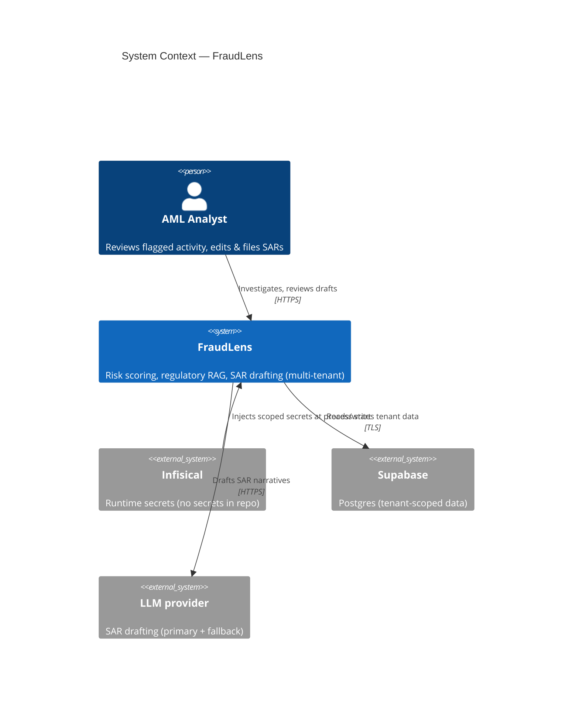

## C4 — Containers

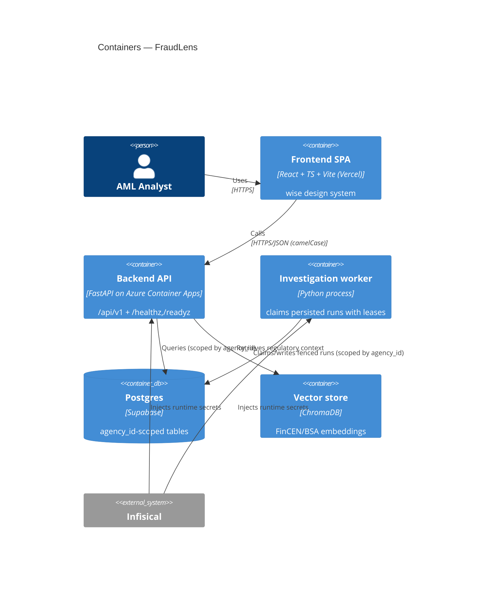

## C4 — Components (Backend)

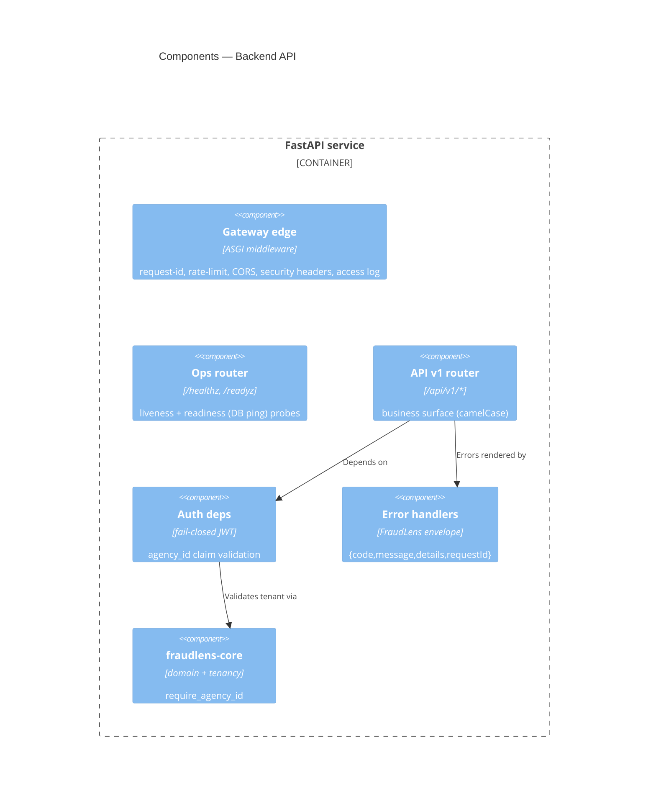

## Gateway request flow (the trust boundary)

The frontend is untrusted. The FastAPI gateway middleware is the public edge, and every business
router depends on identity the edge has already verified. The gateway runs in-process with the API
service; the contract is shaped so it could split into a separate internal service without the
frontend noticing.

The order matters more than any single control: each step is a precondition for the next, so no
router can be reached with an unverified identity or an unbound tenant.

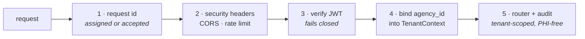

| Step | What happens | Why |
| --- | --- | --- |
| 1 | Gateway assigns or accepts `X-Request-Id`. | Every response, error, log, and audit row can be correlated. |
| 2 | Security headers, CORS allowlist, and rate limits are applied. | Cross-cutting controls cannot be skipped by individual routers. |
| 3 | Auth dependency verifies the bearer JWT or fails closed. | Missing or invalid credentials return 401 **before** any database access. |
| 4 | The `agency_id` claim is bound into `TenantContext`. | Tenant-scoped reads and writes never trust a client-supplied tenant id. |
| 5 | The router executes and writes audit rows for governed actions. | Compliance-critical actions are durable, tenant-scoped, and PHI-free. |

Surface contract: ops endpoints are unprefixed (`GET /healthz`, `GET /readyz`) and business APIs
carry `/api/v1/*`. API JSON is camelCase while Python internals stay snake_case through Pydantic
aliases, path parameters are camelCase in the public contract (`{agencyId}`, `{runId}`), and errors
use `{code, message, details, requestId}` — never a stack trace, an exception name, or raw input.

| Control | Code |
| --- | --- |
| Gateway middleware | [`middleware/gateway.py`](../../backend/src/fraudlens_backend/middleware/gateway.py) |
| Security headers | [`middleware/security.py`](../../backend/src/fraudlens_backend/middleware/security.py) |
| Auth and tenant enforcement | [`api/deps.py`](../../backend/src/fraudlens_backend/api/deps.py) |
| Error envelope | [`api/errors.py`](../../backend/src/fraudlens_backend/api/errors.py) |
| Audit writer | [`db/repositories/audit.py`](../../backend/src/fraudlens_backend/db/repositories/audit.py) |

## Fraud-investigation pipeline (target / opt-in live path)

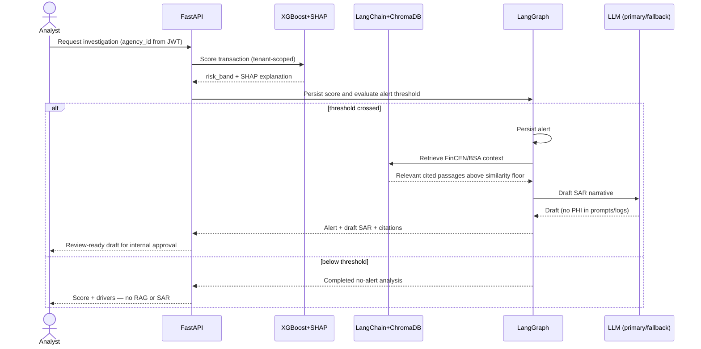

## Deployment topology

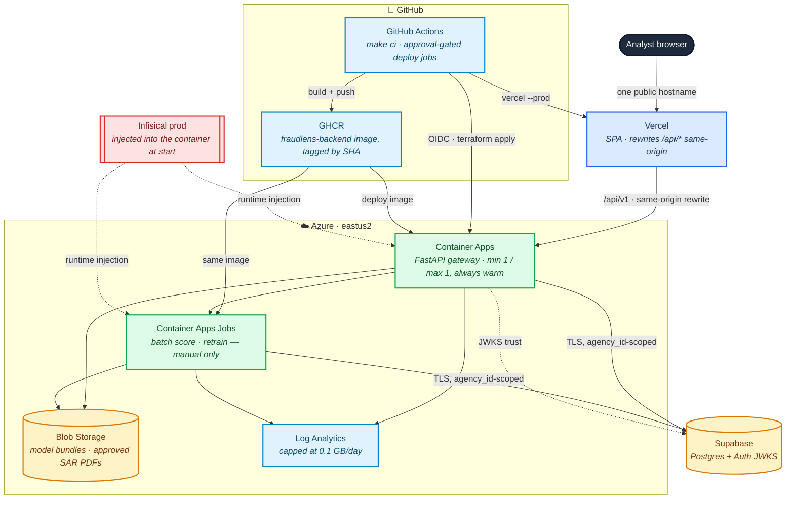

- **Azure via GitHub→Azure OIDC** (federated; no long-lived client secret in GitHub).
- **One public hostname.** Vercel serves the SPA and rewrites `/api/*` same-origin to the Container
  App, so the browser never issues a cross-origin request and CORS is defence-in-depth rather than
  the mechanism.
- **The image registry is GHCR**, not ACR: one SHA-tagged `fraudlens-backend` image is deployed to
  both the Container App and the jobs, so the API and its batch work are never version-skewed.
- **Vercel/Supabase credentials** are injected from Infisical at job/runtime, masked, and never
  persisted; the application never calls Infisical itself, and `/readyz` verifies the injection
  landed.
- **Deploys are approvable, never automatic.** Every Azure job runs under `environment: production`
  with the owner as required reviewer, so a push or a green CI run alone deploys nothing.

## Inference serving and benchmark

The production-shaped self-hosted path reuses the governed OpenAI-compatible client; it does not
introduce a benchmark-only prompt path. A random `VLLM_API_KEY` is injected into both vLLM and the
backend, and the endpoint is reached through an SSH tunnel during the temporary experiment. RunPod
Secure Cloud RTX 4090 hosted the measured release run; the Pod and encrypted volume were deleted
after export. The published result demonstrates efficiency and preserves the failed quality gate.

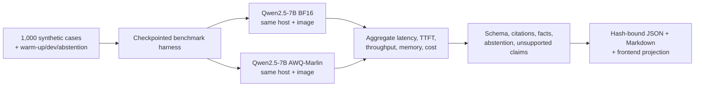

The primary comparison holds KV-cache utilisation equal; a separate maximum-safe-concurrency
observation describes capacity. Provider selection is a fresh quota/capacity/price decision at
STOP 3, pilot cost is projected with a 30% margin, and teardown is part of acceptance. See
[ADR-020](adr/ADR-020-vllm-awq-self-hosted-sar-inference.md) and the
[benchmark runbook](../runbooks/vllm-benchmark.md).

## Full-data training on ephemeral compute

The full-data pipeline processes frozen public IBM AML sources with DuckDB and Parquet in bounded,
checkpointed stages. Raw account identifiers exist only long enough to build namespaced temporal
windows; the published report contains reconciliation, timings, metrics, and provenance—not rows or
identifiers. Source rows, usable rows, training rows, calibration rows, and holdout rows are distinct
counts.

```mermaid
flowchart LR
    source["Frozen IBM CSVs<br/>68,228,066 source rows"] --> verify["Hash, row-count,<br/>schema verification"]
    verify --> parquet["Typed Parquet ingest"]
    parquet --> features["19 live-parity temporal features"]
    features --> parity["Live-builder parity sample"]
    parity --> folds["Whole-account chronological folds"]
    folds --> train["XGBoost + Platt calibration"]
    train --> gates["Holdout + shared promotion gates"]
    gates --> report["Aggregate evidence + candidate only"]
```

Phase 6 used an ephemeral Azure CPU VM with a measured admission gate, Blob checkpoints, automatic
deallocation, and explicit teardown. The published aggregate reconciles every frozen source and
records the three candidate evaluations; the temporary resource group was destroyed. See the
[data-batch runbook](../runbooks/data-batch.md).

## Kubernetes deployment: kind to AKS

One Kustomize base serves the local kind proof and the AKS overlay. The release measures HPA and
durable-worker behavior on kind, while Terraform, policy, and the inert workflow validate the AKS
shape without applying it.

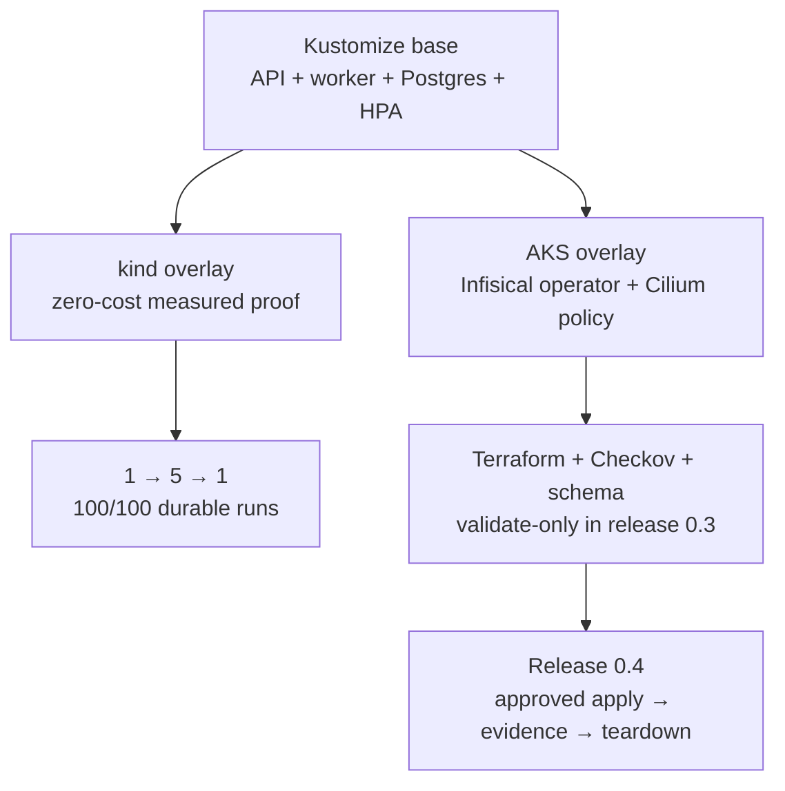

kindnet does not enforce the committed NetworkPolicies; Cilium is selected for AKS enforcement.
The supported claim is “deployable to Azure AKS; autoscaling and durability proven on Kubernetes
using kind,” not “deployed on AKS.” See [ADR-021](adr/ADR-021-aks-ephemeral-kubernetes-demonstration.md).

## Durable execution

The API owns run creation, not execution. A worker atomically claims eligible rows using a lease,
heartbeats while executing, and fences writes with its claim token. A reaper makes expired work
eligible for bounded retry. SSE remains a pure observer/replay surface.

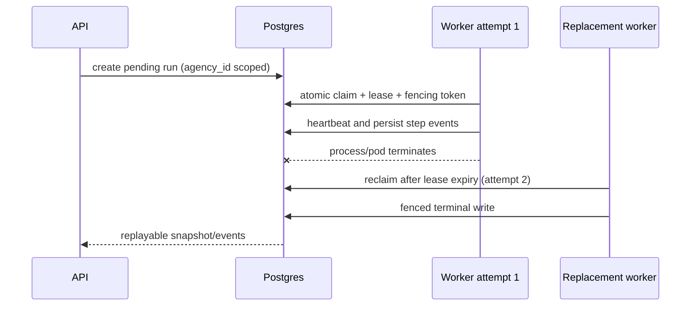

This is at-least-once execution with exactly-one accepted terminal write, not an exactly-once side
effect guarantee. Idempotent persistence and bounded attempts make replacement explicit. See
[ADR-027](adr/ADR-027-durable-investigation-execution.md).

## Model-egress boundary

Only persisted, allowlisted synthetic provenance may cross the model boundary. The backend rebuilds
the exact typed projection from tenant-scoped persisted facts, maps identifiers to run-local aliases,
checks the corpus binding and PHI policy, then sends bytes. The alert UI displays this same persisted
projection under “What the model saw”; it does not infer it from browser state.

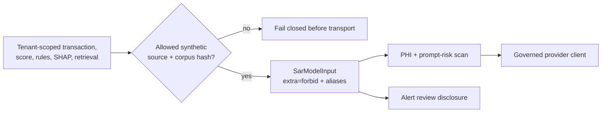

Raw account IDs, names, addresses, free-form database records, and client-supplied tenant IDs are
not model inputs. Extending allowed sources or data classes requires a new architecture/privacy
decision. See [ADR-026](adr/ADR-026-synthetic-only-model-egress.md).

## LLM catalog, routing, and guardrails

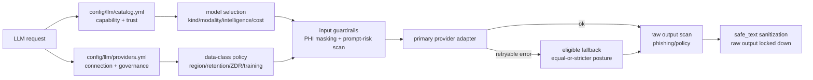

`fraudlens-llm` is a standalone async package. Model capability, pricing, and trust
metadata live in `config/llm/catalog.yml`; provider connection and governance posture
live in `config/llm/providers.yml`. API keys are env-var references only and resolve at
runtime from Infisical `/llm`.

Public provider calls enter through `LlmClient.generate()` or `LlmClient.embed()`. The client checks
provider data-class policy before any SDK call, masks PHI-like input locally, scans prompt
risk, prepends a fixed system policy, calls a private provider adapter, scans raw output
before sanitization, and returns only `safe_text` by default. Embeddings run policy and
masking before the provider call; vector storage and `agency_id` scoping remain backend
responsibilities. The backend's `build_embedder` factory is the single selector used by both index
ingest and pipeline retrieval: `offline` returns `HashingEmbedder`, while `live` adapts
`LlmClient.embed()` through a dedicated background event-loop thread so the synchronous retriever
can operate safely inside the application's active asyncio loop. Live calls route only through the
OpenRouter OpenAI-compatible provider and classify the PHI-free regulatory input under the
configured provider policy.

Every ChromaDB collection records embedding kind, model reference, dimensions, and RAG version.
Hashing indexes use `rag-v1`; the configured `text-embedding-3-small` space uses `rag-v2-te3s`.
Retrieval compares its embedder provenance to the collection before vector search. Missing metadata,
a model/version mismatch, or a dimension mismatch fails closed to deterministic lexical retrieval
and records `mode="lexical"`; incompatible vectors are never queried. Switching modes therefore
requires rebuilding the index (`make ingest-rag` or `make ingest-rag-live`). The committed/container-
baked index stays hashing-based and hermetic; a live index is local/deployment state, never committed.

Fallback is allowed only after retryable provider failures and only to providers that allow
the call's `DataClass` and maintain an equal-or-stricter governance posture. Fallback never
weakens region, retention, ZDR, or training-opt-out posture unless an explicit non-prod
override is set.

### SAR drafting & prompt versioning

SAR drafting reaches `fraudlens-ml` only through the injected `SarDrafter` protocol
(`fraudlens_ml.sar`), so ml never imports `fraudlens-llm`. The backend supplies three concrete
implementations: a deterministic, keyless **mock** (the `make local-demo` default — no provider,
no cost), the guarded **live single writer**, and a **bounded live four-agent** drafter selected only
when both the process setting and tenant-scoped runtime flag permit it. The mock consumes the broad
internal `SarInput`; every live path first derives an exact frozen `SarModelInput` from persisted
synthetic source provenance and returns the same terminal contract, so persistence, SSE, review, and
PDF generation do not fork into parallel workflows.

The agent graph is deterministic: Evidence Investigator and Regulatory Analyst run in parallel,
SAR Writer synthesizes their typed outputs, and Compliance Reviewer may request at most one
revision. Only the evidence and regulatory roles receive named, read-only, tenant-scoped tools;
Writer and Reviewer receive none. Code owns topology, tool capability, timeouts, output/tool-call
limits, and the preflight cost cap. Tenant-scoped execution attempts persist for audit and
restart-safe replay. The graph stops at `draft`; only the existing authenticated human endpoint can
approve a SAR or transition its alert. [ADR-019](adr/ADR-019-multi-agent-sar-drafting.md) records
these non-negotiable bounds and the synthetic-only evaluation protocol.

`SarModelInput` omits tenant/user/database ids, account values, free text, edited narratives, and
labels. It admits only verified transaction facts, controlled templated rule findings, numeric
served-schema SHAP drivers, and exact digest-bound public regulation excerpts. Agent tool results
are field-allowlisted and evidence ids become case aliases; output is remasked before another model
sees it. `unknown` or `api-upload` provenance blocks live drafting before transport while preserving
the deterministic investigation. The cache key includes tenant, projected evidence, prompt, model,
and generation settings. [The quality-gate reference](../reference/quality-gates.md) documents the
thresholds and socket-denied raw-request tests.

Prompts are **versioned templates** at `config/llm/prompts/sar/<id>.md` (YAML front-matter
semantic version + a static instruction body). Every draft records the template's
`prompt_version` (`<id>@<semver>`) and a `prompt_hash` (SHA-256 of the exact template bytes) on
`sar_drafts`, so which prompt produced which SAR is auditable and any template edit is detectable.
The model output is parsed into a strict structured schema and judged by the shipped deterministic
`SarQualityGate` **before** anything is persisted or streamed. On the agent path, the same claim and
citation-set checks also run before the reviewer. The masked narrative, structured body, grounded citations, token
usage, estimated USD cost, served model, workflow mode, and agent attempt provenance persist for the
audit trail. Provider, guardrail, or agent-path failures either use the configured **live**
single-writer fallback or record a failed SAR while preserving score + SHAP + RAG; live mode never
silently substitutes the mock. Below-threshold runs never invoke RAG or SAR drafting.

### The quality-gated cascade

A SAR routing **profile** (`config/llm/sar-vllm.yml`) is an ordered list of stages. A one-stage
profile behaves exactly as the pre-0.5.0 single-model path did; a multi-stage profile is a cascade.
Each stage is attempted once, in order. Quality escalation is deliberately *not* the client's
transport fallback: `LlmClient.fallbacks` handles a provider that is unreachable, a cascade stage
handles a draft that is wrong, and no cascade stage carries `fallbacks`
([ADR-030](adr/ADR-030-quality-gated-sar-model-cascade.md)).

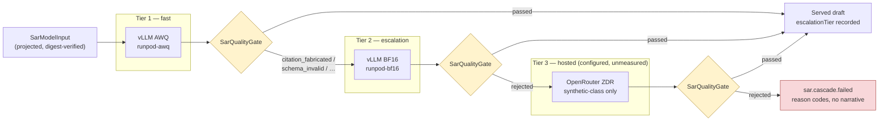

A rejected stage's narrative is **never** emitted — not to SSE, not to the database, not to a
reconnecting client replaying the stream. What is retained is the stage decision and its PHI-free
reason codes, so an analyst can see that tier 1 was rejected and why, without ever seeing what it
wrote. An exhausted cascade fails explicitly rather than degrading, and `sar_drafts.quality_status`
becomes a real `not_run` / `passed` / `failed` driven by an evaluator that actually ran.

The measured behaviour of this path over 1,000 synthetic cases is published in the
[gated-cascade benchmark](../reference/benchmarks/vllm-gated-cascade-benchmark.md); the benchmark
invokes these same profiles through the production drafter, so it cannot measure a path the product
does not run.

## FraudLens governance mapping

| FraudLens invariant | Enforced by |
| --- | --- |
| No PHI in logs/URLs/errors/query params | `middleware/logging.py` (structlog redaction processor + key denylist, path-only access logs); `middleware/gateway.py` (request-id, security headers); `api/errors.py` (no raw input/stack) |
| Tenant isolation (`agency_id` on every scoped op) | `fraudlens_core.require_agency_id`; `api/deps.py` (`enforce_tenant`) |
| AuthZ validates JWT `agency_id` vs resource | `api/deps.py` (`authenticate` fails closed; dev bypass inert in prod) |
| FraudLens error envelope | `api/errors.py` → `{code, message, details, requestId}` |
| Secrets via Infisical, never repo | `config/*.yaml` (non-secret only); `gitleaks` + `scripts/check_no_secrets.py` |
| Generated docs stay in sync | `make docs` / `make docs-check` (this file's AUTOGEN regions, OpenAPI, ERD) |
| Graph-feature serving boundary: no cross-tenant graph topology in live scoring ([ADR-017](adr/ADR-017-graph-feature-serving-boundary.md)) | Offline-only `scripts/lib/gfp/` (never a runtime package); `snapml` confined to the benchmark-only `gfp` dependency group; served vector stays the 19 `FEATURE_NAMES`; identifier-free `RuleContext` |
| Bounded multi-agent SAR drafting preserves human authority ([ADR-019](adr/ADR-019-multi-agent-sar-drafting.md)) | Fixed four-role graph; read-only tenant-scoped tools with context-supplied `agency_id`; deterministic support checks; one revision maximum; preflight cost cap; human-only approval and alert transitions |
| Synthetic-only live model egress ([ADR-026](adr/ADR-026-synthetic-only-model-egress.md)) | Persisted transaction source; frozen extra-forbid projection; controlled facts/rules/features; corpus digest binding; tool-result aliases; pre-transport refusal; transport byte tests |

Decision records are indexed in [`adr/README.md`](adr/README.md). That index retains the historical
summaries for ADR-001…016 after their retired source plan was removed; ADR-017 and later have
standalone canonical records.

## Module map

<!-- AUTOGEN:module-map -->
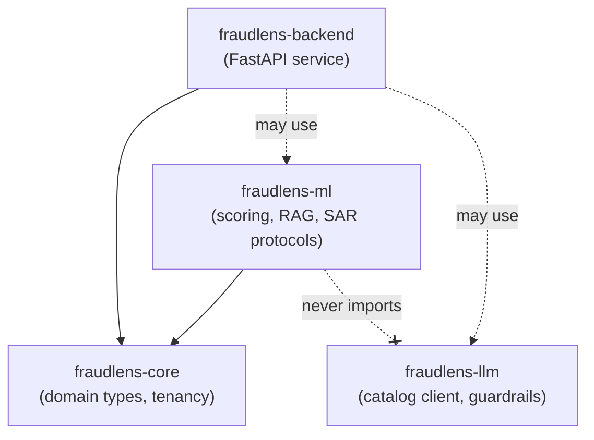
<!-- /AUTOGEN:module-map -->

**Layering rule (ruff-enforced):** `fraudlens-core` imports nothing internal; `fraudlens-ml`
may import `core` but never `backend` **or `fraudlens-llm`** — SAR drafting reaches `ml` only
through an injected `SarDrafter` protocol, so the heavy ML package never depends on the LLM
client; `backend` may import `core`, `llm`, and `ml`.

## API endpoints

<!-- AUTOGEN:endpoints -->
| Method | Path | Handler |
| --- | --- | --- |
| GET | `/api/v1/agencies/{agencyId}` | `read_agency` |
| GET | `/api/v1/alerts` | `list_alerts` |
| GET | `/api/v1/alerts/{alertId}` | `get_alert` |
| POST | `/api/v1/alerts/{alertId}/actions` | `act_on_alert` |
| POST | `/api/v1/alerts/{alertId}/sar/review` | `review_sar` |
| GET | `/api/v1/config` | `list_config` |
| PATCH | `/api/v1/config` | `patch_config` |
| GET | `/api/v1/dashboard/metrics` | `read_dashboard_metrics` |
| POST | `/api/v1/dev/reset` | `dev_reset` |
| POST | `/api/v1/dev/seed` | `dev_seed` |
| POST | `/api/v1/dev/transactions/{transactionId}/synthetic-provenance` | `mark_synthetic_provenance` |
| GET | `/api/v1/drift-reports` | `list_drift_reports` |
| GET | `/api/v1/health` | `api_health` |
| POST | `/api/v1/investigations` | `start_investigation` |
| GET | `/api/v1/investigations/{runId}` | `get_investigation` |
| POST | `/api/v1/investigations/{runId}/sar/regenerate` | `regenerate_investigation_sar` |
| GET | `/api/v1/investigations/{runId}/stream` | `stream_investigation` |
| GET | `/api/v1/me` | `get_current_user` |
| GET | `/api/v1/model-deployment` | `get_deployment` |
| POST | `/api/v1/model-deployment/canary/evaluate` | `evaluate_canary` |
| POST | `/api/v1/model-deployment/rollback` | `rollback_deployment` |
| GET | `/api/v1/model-versions` | `list_model_versions` |
| GET | `/api/v1/model-versions/{versionId}` | `get_model_version` |
| POST | `/api/v1/model-versions/{versionId}/approve` | `approve_version` |
| POST | `/api/v1/model-versions/{versionId}/canary` | `set_canary` |
| POST | `/api/v1/model-versions/{versionId}/shadow` | `promote_to_shadow` |
| GET | `/api/v1/portfolio-demo/config` | `read_portfolio_demo_config` |
| GET | `/api/v1/rules` | `list_rules` |
| POST | `/api/v1/rules` | `create_rule` |
| DELETE | `/api/v1/rules/{ruleId}` | `delete_rule` |
| GET | `/api/v1/rules/{ruleId}` | `get_rule` |
| PATCH | `/api/v1/rules/{ruleId}` | `update_rule` |
| POST | `/api/v1/telemetry/client-error` | `report_client_error` |
| GET | `/api/v1/training-runs` | `list_training_runs` |
| POST | `/api/v1/training-runs` | `trigger_training_run` |
| GET | `/api/v1/transactions` | `list_transactions` |
| POST | `/api/v1/transactions` | `ingest_transaction` |
| POST | `/api/v1/transactions/batch` | `ingest_batch` |
| POST | `/api/v1/transactions/upload` | `upload_csv` |
| GET | `/api/v1/transactions/{transactionId}` | `get_transaction` |
| POST | `/api/v1/users` | `invite_user` |
| GET | `/healthz` | `healthz` |
| GET | `/readyz` | `readyz` |
<!-- /AUTOGEN:endpoints -->

Ops probes (`/healthz`, `/readyz`) are **unprefixed**; business APIs carry **`/api/v1/`**.

## Configuration keys

Non-secret config only (layered `config/*.yaml` → `FRAUDLENS_*` env). Secrets come from Infisical.

<!-- AUTOGEN:config-keys -->
| Key | Type | Default | Description |
| --- | --- | --- | --- |
| `azure_managed_identity_token_url` | `str` | `''` | Managed-identity token endpoint URL, supplied by config/env in Azure. |
| `azure_managed_identity_api_version` | `str` | `'2018-02-01'` | Managed-identity token API version used against the IMDS token endpoint. |
| `azure_container_apps_identity_api_version` | `str` | `'2019-08-01'` | Managed-identity token API version used against the Container Apps identity endpoint. |
| `azure_managed_identity_client_id` | `str | None` | `None` | User-assigned identity client id for Azure data/control-plane calls. |
| `azure_arm_endpoint` | `str` | `''` | Azure Resource Manager endpoint base URL, supplied by config/env. |
| `azure_arm_token_resource` | `str` | `''` | Token resource/audience for Azure Resource Manager. |
| `azure_subscription_id` | `str | None` | `None` | Azure subscription id containing the Container Apps Jobs. |
| `azure_resource_group_name` | `str | None` | `None` | Azure resource group containing the Container Apps Jobs. |
| `azure_container_apps_api_version` | `str` | `'2024-03-01'` | Azure Container Apps Jobs ARM API version. |
| `azure_container_apps_retrain_job_name` | `str | None` | `None` | Container Apps Job name for model retraining. |
| `azure_container_apps_batch_score_job_name` | `str | None` | `None` | Container Apps Job name for batch scoring. |
| `azure_storage_account_name` | `str | None` | `None` | Azure Storage account name for artifact and SAR-PDF blobs. |
| `azure_storage_blob_host_suffix` | `str` | `'blob.core.windows.net'` | Azure Blob DNS suffix used to build the storage endpoint. |
| `azure_storage_blob_endpoint` | `str | None` | `None` | Optional Azure Blob endpoint; otherwise derived from the account name. |
| `azure_storage_token_resource` | `str` | `''` | Token resource/audience for Azure Blob Storage. |
| `azure_storage_container_name` | `str` | `'artifacts'` | Blob container for model/artifact keys. |
| `azure_storage_sar_pdf_container_name` | `str` | `'sar-pdfs'` | Blob container for SAR PDF keys. |
| `azure_storage_blob_api_version` | `str` | `'2023-11-03'` | Azure Blob data-plane API version. |
| `azure_rest_timeout_seconds` | `float` | `10.0` | Timeout for Azure managed-identity, Blob, and ARM REST calls. |
| `cors_allow_origins` | `list` | `[]` | Exact allowed CORS origins; set per-env in config (never hardcoded). |
| `cors_allow_methods` | `list` | `['*']` | Allowed CORS methods for the gateway edge. |
| `cors_allow_headers` | `list` | `['*']` | Allowed CORS request headers for the gateway edge. |
| `cors_allow_credentials` | `bool` | `False` | Whether the gateway allows credentialed CORS requests. |
| `rate_limit_enabled` | `bool` | `True` | Enable the gateway fixed-window rate limiter. |
| `rate_limit_requests` | `int` | `120` | Max requests per client within the window before 429. |
| `rate_limit_window_seconds` | `float` | `60.0` | Length of the rate-limit fixed window, in seconds. |
| `security_headers` | `dict` | `{'X-Content-Type-Options': 'nosniff', 'X-Frame-Options': 'DENY', 'Referrer-Policy': 'no-referrer', 'Strict-Transport-Security': 'max-age=31536000; includeSubDomains'}` | Static security response headers applied to every gateway response. |
| `csp_enabled` | `bool` | `True` | Stamp a Content-Security-Policy header on every gateway response. |
| `content_security_policy` | `str` | `"default-src 'none'; base-uri 'none'; frame-ancestors 'none'; form-action 'none'"` | Strict CSP applied to the API surface (config-overridable). |
| `content_security_policy_docs` | `str` | `''` | Relaxed CSP for the interactive docs UI; empty keeps the strict policy. |
| `docs_ui_paths` | `list` | `['/docs', '/redoc', '/scalar']` | Interactive documentation paths that receive the relaxed CSP. |
| `scalar_js_url` | `str` | `''` | Configured browser asset URL for the Scalar API reference runtime. |
| `gateway_routes_file` | `str | None` | `None` | Override path to the gateway routing table; else discovered under config/. |
| `telemetry_enabled` | `bool` | `False` | Enable the optional OpenTelemetry exporter; disabled by default. |
| `telemetry_service_name` | `str` | `'fraudlens-backend'` | Service name reported by telemetry export when enabled. |
| `run_execution_mode` | `Literal` | `'inline'` | Run investigations in-process or enqueue them for a durable worker. |
| `run_lease_seconds` | `int` | `60` | Worker lease lifetime before an abandoned run becomes recoverable. |
| `run_heartbeat_seconds` | `int` | `10` | Interval at which a worker extends its active run lease. |
| `run_max_attempts` | `int` | `3` | Maximum fenced worker claims before a run fails permanently. |
| `run_deadline_seconds` | `int` | `300` | Wall-clock deadline applied when a queued investigation is accepted. |
| `run_claim_batch` | `int` | `1` | Maximum runs a worker claims per scheduling pass. |
| `run_retry_backoff_seconds` | `int` | `5` | Base delay before an expired run is eligible for another attempt. |
| `run_worker_poll_seconds` | `float` | `1.0` | Idle delay between durable worker claim attempts. |
| `run_worker_heartbeat_file` | `str` | `'.local/worker/heartbeat'` | Worker liveness file updated while its scheduler loop is healthy. |
| `run_event_poll_ms` | `int` | `250` | Worker-mode SSE polling interval for persisted run events. |
| `run_event_poll_max_ms` | `int` | `2000` | Maximum worker-mode SSE polling backoff interval. |
| `run_event_heartbeat_seconds` | `int` | `15` | Maximum quiet interval before worker-mode SSE emits a keepalive comment. |
| `investigation_history_window_hours` | `int` | `168` | Same-account history lookback covering the widest built-in rule window. |
| `investigation_history_max` | `int` | `100` | Maximum same-account history rows loaded per investigation. |
| `investigation_rag_top_k` | `int` | `4` | Number of FinCEN/BSA chunks retrieved for investigation citations. |
| `investigation_rag_min_similarity` | `float` | `0.2` | Minimum cosine similarity required to surface a vector RAG citation. |
| `batch_score_limit` | `int` | `2000` | Maximum un-investigated transactions processed by one batch-score sweep. |
| `review_low_confidence_margin` | `float` | `0.1` | Decision-boundary half-width that forces analyst review. |
| `sar_pdf_max_attempts` | `int` | `3` | Maximum best-effort SAR PDF generation attempts. |
| `llm_daily_budget_usd` | `Decimal` | `Decimal('0.25')` | Deployment ceiling, in USD, on one tenant-day of live LLM spend. |
| `app_name` | `str` | `'FraudLens'` | Human-readable service name. |
| `environment` | `Literal` | `'dev'` | Active deployment environment; gates the auth dev-bypass. |
| `log_level` | `str` | `'INFO'` | Python logging level name. |
| `api_v1_prefix` | `str` | `'/api/v1'` | Prefix for business APIs; ops endpoints stay unprefixed. |
| `request_id_header` | `str` | `'X-Request-Id'` | Response header carrying the per-request correlation id. |
| `auth_dev_bypass` | `bool` | `False` | Dev-only auth bypass; honored only when environment != 'prod'. |
| `auth_dev_bypass_role` | `Literal` | `'admin'` | RBAC role the dev bypass mints (default admin so local-demo can drive the model lifecycle); honored only when the bypass is enabled, so it is prod-inert. |
| `auth_jwks_url` | `str | None` | `None` | Supabase Auth JWKS URL for asymmetric (ES256/RS256) access-token verification; unset fails closed. |
| `auth_jwt_issuer` | `str | None` | `None` | Expected JWT issuer; unset skips issuer validation for local/integration tests. |
| `auth_jwt_audience` | `str | None` | `None` | Expected JWT audience; unset skips audience validation for local/integration tests. |
| `auth_jwt_algorithm` | `Literal` | `'ES256'` | JWT signing algorithm accepted from the configured JWKS. Supabase Auth signs ES256 (asymmetric) by default; RS256 is also accepted (e.g. a rotated RSA signing key). |
| `auth_agency_claim` | `str` | `'agency_id'` | JWT claim containing the tenant agency id. |
| `auth_role_claim` | `str` | `'user_role'` | JWT claim containing the FraudLens RBAC role. Supabase's built-in top-level `role` claim is reserved for `authenticated`, so FraudLens uses `user_role`. |
| `supabase_url` | `str | None` | `None` | Supabase project URL used by admin-invite provisioning; non-secret and read from env. |
| `supabase_service_role_key` | `str | None` | `None` | Supabase service-role key for admin user invites; secret from Infisical /backend. |
| `bootstrap_admin_user_id` | `str | None` | `None` | Optional first-admin auth.users id for scripts/seed.py bootstrap reconciliation. |
| `bootstrap_admin_email` | `str | None` | `None` | Optional first-admin email for scripts/seed.py bootstrap reconciliation. |
| `bootstrap_admin_display_name` | `str` | `'Bootstrap Admin'` | Display name used when scripts/seed.py upserts the optional first admin. |
| `portfolio_demo_enabled` | `bool` | `False` | Enable the config-driven portfolio demo story; a security gate that fails closed in code, so a missing YAML key leaves it off (like auth_dev_bypass). |
| `portfolio_demo_config_file` | `str` | `'portfolio-demo.yaml'` | Portfolio-demo story config FILENAME, resolved relative to find_config_dir(); absolute paths and upward traversal are rejected by the loader. |
| `demo_auth_password` | `str | None` | `None` | Public synthetic demo credential supplied by FRAUDLENS_DEMO_AUTH_PASSWORD / Infisical; deliberately non-secret demo data, but never an inline YAML value. |
| `storage_backend` | `Literal` | `'local'` | Artifact/PDF storage backend selector (local-FS vs Azure Blob). |
| `storage_local_dir` | `str` | `'.local/artifacts'` | Root directory for the local-FS storage backend (gitignored). |
| `queue_backend` | `Literal` | `'local'` | Background-job backend selector (local runner vs Container Apps Jobs). |
| `local_job_execute_on_submit` | `bool` | `False` | When true, the local job backend executes known job commands synchronously after submission. Enabled by local-demo for browser UAT; off in hermetic tests. |
| `local_retrain_command` | `list` | `['uv', 'run', 'python', 'scripts/retrain.py']` | Command the local job backend runs for a retrain submission. |
| `llm_mode` | `Literal` | `'mock'` | SAR drafter mode: 'mock' needs no keys/cost; 'live' calls a provider. |
| `sar_config_file` | `str` | `'llm/sar.yml'` | SAR model-routing config resolved below the config directory. |
| `sar_profile` | `str` | `''` | Named cascade profile to run when the routing config declares profiles; empty selects the config's single-model route. |
| `multi_agent_sar_enabled` | `bool` | `False` | Process-level gate for bounded multi-agent SAR drafting; the feature is active only when the tenant-scoped system_config flag is also enabled. |
| `multi_agent_config_file` | `str` | `'llm/agents.yml'` | Multi-agent configuration filename resolved below the config directory; absolute paths and upward traversal are rejected by the loader. |
| `model_artifacts_dir` | `str` | `'data/models'` | Root dir (by version label) for model artifact bundles; the committed fixture lives here, candidates are written here, prod points it at Blob. |
| `allow_candidate_scoring_in_dev` | `bool` | `False` | Allow scoring with the newest candidate when no deployment exists; honored only outside production for explicit live-local model evaluation. |
| `aml_data_dir` | `str` | `'.local/aml_data'` | Root dir for downloaded real AML training datasets (e.g. IBM AML-Data); relative paths anchor to the repo root like model_artifacts_dir. Gitignored and training-time only — raw data is never committed or served (real-AML plan Phase 1). |
| `rag_corpus_dir` | `str` | `'data/regulations'` | Committed source corpus dir (`*.md` provisions) ingest builds the index from. |
| `rag_index_dir` | `str` | `'.local/chroma'` | ChromaDB index dir (built by ingest-rag; baked into the prod image). |
| `rag_collection` | `str` | `'fincen_bsa'` | ChromaDB collection name holding the embedded regulatory chunks. |
| `rag_embedding_mode` | `Literal` | `'offline'` | RAG embedder mode: deterministic hashing or live OpenRouter embeddings. |
| `rag_version` | `str` | `'rag-v1'` | Offline corpus/index version; live mode reads its version from llm/rag.yml. |
| `rag_index_required` | `bool` | `False` | When true, a missing/empty RAG index fails /readyz (prod bakes the index). |
| `infisical_secrets_delivery` | `Literal` | `'unconfigured'` | How Infisical secrets reach this process. 'unconfigured' declares no delivery mechanism, so the /readyz infisical check reports 'skipped'; 'externally_injected' declares that a CLI/CI job/deploy platform injects them as env, so the check verifies every infisical_required_env_keys name is present and non-blank. |
| `infisical_required_env_keys` | `list` | `[]` | Environment-variable NAMES (never values) the Infisical injection must supply; the /readyz infisical check reports 'down' when any is missing or blank, so a broken secret sync fails readiness instead of serving errors. Must be non-empty when infisical_secrets_delivery is 'externally_injected' (an injection claim with nothing to verify is rejected at boot). |
| `database_url` | `str | None` | `None` | Async SQLAlchemy URL (asyncpg driver); read from env, never committed YAML. |
| `db_connect_timeout_seconds` | `float` | `5.0` | Timeout for the /readyz database connectivity probe, in seconds. |
| `ingest_max_batch_size` | `int` | `500` | Max transactions accepted in one /transactions/batch request. |
| `ingest_csv_max_bytes` | `int` | `5242880` | Max accepted /transactions/upload body size in bytes (413 above it). |
| `ingest_csv_max_rows` | `int` | `10000` | Max data rows accepted in one CSV upload (413 above it). |
| `ingest_sample_errors_limit` | `int` | `10` | Max per-row rejection samples returned by batch/CSV ingest. |
| `client_error_max_message_length` | `int` | `2000` | Max length of a client-error report message before truncation. |
| `client_error_rate_limit_requests` | `int` | `60` | Per-client request budget for the telemetry client-error sink within the rate-limit window — a stricter per-route limit layered on the global gateway limiter as defense-in-depth for this abuse-prone, client-driven endpoint (plan §16 Phase 13). |
| `retrain_min_labels_total` | `int` | `10` | Min matured reviewed labels (any class) before a retrain is eligible; below it the trigger returns insufficient_matured_labels (plan §9.4). Dev-friendly default. |
| `retrain_min_labels_per_class` | `int` | `2` | Min matured labels required for EACH of the fraud/benign classes before a retrain is eligible (guards a one-sided training set, plan §9.4). |
| `retrain_tenant_slices` | `int` | `2` | Deterministic holdout partitions used as per-tenant evaluation slices when computing the §9.4 per-tenant slice gate (synthetic-data MLOps stand-in for agencies). |
| `canary_guard_min_samples` | `int` | `20` | Min inference samples per arm (active/canary) before the canary auto-abort guard will act on a deviation (the §10.5.1 min-sample window). |
| `canary_guard_max_deviation` | `float` | `0.2` | Max absolute deviation between the canary's and active's mean predicted probability (alert-rate/precision proxy) before auto-abort → rollback (plan §10.5.1). |
<!-- /AUTOGEN:config-keys -->

## Data model (ERD)

<!-- AUTOGEN:erd -->
```mermaid
erDiagram
    agencies {
        uuid id PK
        datetime created_at
        string name
        string slug
    }
    agent_executions {
        uuid id PK
        uuid agency_id FK
        enum agent
        integer attempt
        numeric cost_usd
        string error_code
        string input_hash
        integer input_tokens
        integer latency_ms
        integer model_call_count
        string model_id
        integer output_tokens
        string prompt_hash
        string prompt_version
        json result
        string result_hash
        uuid run_id FK
        enum status
        json tool_calls
        integer total_tokens
    }
    alert_actions {
        uuid id PK
        enum action
        uuid actor_id FK
        uuid agency_id FK
        uuid alert_id FK
        datetime created_at
        string from_status
        text note
        string to_status
    }
    alerts {
        uuid id PK
        uuid agency_id FK
        uuid assigned_to FK
        datetime created_at
        enum origin
        json review_flags
        uuid run_id FK
        enum severity
        enum status
        uuid transaction_id FK
        datetime updated_at
    }
    aml_rules {
        uuid id PK
        uuid agency_id FK
        string code
        datetime created_at
        text description
        boolean enabled
        string name
        json params
        enum rule_type
        enum severity
        datetime updated_at
        integer version
        numeric weight
    }
    analysis_results {
        uuid id PK
        uuid agency_id FK
        float combined_score
        datetime created_at
        float fraud_probability
        string model_version
        enum risk_band
        json rule_hits
        uuid run_id FK
        json shap_values
        json top_features
    }
    analysis_run_events {
        uuid id PK
        uuid agency_id FK
        datetime created_at
        enum event_type
        json payload
        uuid run_id FK
        integer seq
    }
    analysis_runs {
        uuid id PK
        uuid agency_id FK
        integer attempt
        datetime created_at
        datetime deadline_at
        string error_code
        integer fencing_token
        string graph_version
        datetime heartbeat_at
        string idempotency_key
        datetime lease_expires_at
        string lease_owner
        numeric llm_reserved_usd
        string model_override
        string model_version
        datetime next_attempt_at
        string prompt_version
        string rag_version
        string request_fingerprint
        enum risk_band
        float risk_score
        string rules_version
        enum status
        uuid transaction_id FK
        uuid triggered_by FK
        datetime updated_at
        string workflow_mode
    }
    audit_logs {
        uuid id PK
        string action
        uuid actor_id FK
        uuid agency_id FK
        datetime created_at
        json metadata
        string request_id
        string resource_id
        string resource_type
    }
    drift_reports {
        uuid id PK
        boolean advisory
        datetime created_at
        json metrics
        uuid model_version_id FK
        enum severity
        string window
    }
    job_executions {
        uuid id PK
        uuid agency_id FK
        integer attempts
        datetime created_at
        string error_code
        enum job_type
        json payload
        json result
        enum status
        datetime updated_at
    }
    model_deployments {
        uuid id PK
        uuid active_version_id FK
        integer canary_percent
        uuid canary_version_id FK
        uuid previous_active_version_id FK
        datetime updated_at
        uuid updated_by FK
    }
    model_evaluations {
        uuid id PK
        uuid baseline_version_id FK
        datetime created_at
        json metrics
        uuid model_version_id FK
        boolean passed
    }
    model_inference_logs {
        uuid id PK
        uuid agency_id FK
        datetime created_at
        string feature_hash
        float fraud_probability
        uuid model_version_id FK
        uuid run_id FK
        boolean was_canary
    }
    model_training_runs {
        uuid id PK
        string artifact_uri
        datetime created_at
        uuid created_by FK
        uuid dataset_id FK
        json metrics
        json params
        enum status
        enum trigger
        datetime updated_at
    }
    model_versions {
        uuid id PK
        datetime approved_at
        uuid approved_by FK
        string artifact_uri
        datetime created_at
        json feature_spec
        json metrics
        text notes
        enum status
        uuid training_run_id FK
        string version_label
    }
    rag_retrievals {
        uuid id PK
        uuid agency_id FK
        json chunks
        datetime created_at
        text query
        string rag_version
        uuid run_id FK
        integer top_k
    }
    sar_drafts {
        uuid id PK
        uuid agency_id FK
        uuid alert_id FK
        json citations
        text content
        numeric cost_usd
        datetime created_at
        uuid created_by FK
        string model_id
        string pdf_blob_url
        string prompt_hash
        string prompt_version
        json quality
        enum quality_status
        uuid reviewed_by FK
        integer revision_count
        uuid run_id FK
        enum status
        json structured
        json token_usage
        datetime updated_at
        integer version
        string workflow
    }
    sar_generation_attempts {
        uuid id PK
        uuid agency_id FK
        string connection
        numeric cost_usd
        datetime created_at
        uuid draft_id FK
        string error_code
        integer latency_ms
        string model_id
        integer ordinal
        string outcome
        string policy_hash
        string prompt_hash
        json quality
        json reason_codes
        integer retry_count
        uuid run_id FK
        string served_model
        string stage
        json token_usage
    }
    system_config {
        uuid id PK
        uuid agency_id FK
        string key
        datetime updated_at
        uuid updated_by FK
        json value
    }
    training_datasets {
        uuid id PK
        string content_hash
        datetime created_at
        json feature_spec
        string label_window
        integer row_count
        json snapshot_query
    }
    training_labels {
        uuid id PK
        uuid agency_id FK
        datetime created_at
        uuid created_by FK
        enum label
        datetime matured_at
        uuid run_id FK
        enum source
        uuid transaction_id FK
    }
    transactions {
        uuid id PK
        uuid agency_id FK
        numeric amount
        string channel
        string country
        datetime created_at
        string currency
        string dest_account
        string external_id
        string feature_hash
        json features
        datetime ingested_at
        uuid latest_run_id
        datetime occurred_at
        string origin_account
        enum risk_band
        enum source
    }
    users {
        uuid id PK
        uuid agency_id FK
        datetime created_at
        string display_name
        string email
        enum role
        datetime updated_at
    }
    agencies ||--o{ agent_executions : "agency_id"
    agencies ||--o{ alert_actions : "agency_id"
    agencies ||--o{ alerts : "agency_id"
    agencies ||--o{ aml_rules : "agency_id"
    agencies ||--o{ analysis_results : "agency_id"
    agencies ||--o{ analysis_run_events : "agency_id"
    agencies ||--o{ analysis_runs : "agency_id"
    agencies ||--o{ audit_logs : "agency_id"
    agencies ||--o{ job_executions : "agency_id"
    agencies ||--o{ model_inference_logs : "agency_id"
    agencies ||--o{ rag_retrievals : "agency_id"
    agencies ||--o{ sar_drafts : "agency_id"
    agencies ||--o{ sar_generation_attempts : "agency_id"
    agencies ||--o{ system_config : "agency_id"
    agencies ||--o{ training_labels : "agency_id"
    agencies ||--o{ transactions : "agency_id"
    agencies ||--o{ users : "agency_id"
    alerts ||--o{ alert_actions : "alert_id"
    alerts ||--o{ sar_drafts : "alert_id"
    analysis_runs ||--o{ agent_executions : "run_id"
    analysis_runs ||--o{ alerts : "run_id"
    analysis_runs ||--o{ analysis_results : "run_id"
    analysis_runs ||--o{ analysis_run_events : "run_id"
    analysis_runs ||--o{ model_inference_logs : "run_id"
    analysis_runs ||--o{ rag_retrievals : "run_id"
    analysis_runs ||--o{ sar_drafts : "run_id"
    analysis_runs ||--o{ sar_generation_attempts : "run_id"
    analysis_runs ||--o{ training_labels : "run_id"
    model_training_runs ||--o{ model_versions : "training_run_id"
    model_versions ||--o{ drift_reports : "model_version_id"
    model_versions ||--o{ model_deployments : "active_version_id"
    model_versions ||--o{ model_deployments : "canary_version_id"
    model_versions ||--o{ model_deployments : "previous_active_version_id"
    model_versions ||--o{ model_evaluations : "baseline_version_id"
    model_versions ||--o{ model_evaluations : "model_version_id"
    model_versions ||--o{ model_inference_logs : "model_version_id"
    sar_drafts ||--o{ sar_generation_attempts : "draft_id"
    training_datasets ||--o{ model_training_runs : "dataset_id"
    transactions ||--o{ alerts : "transaction_id"
    transactions ||--o{ analysis_runs : "transaction_id"
    transactions ||--o{ training_labels : "transaction_id"
    users ||--o{ alert_actions : "actor_id"
    users ||--o{ alerts : "assigned_to"
    users ||--o{ analysis_runs : "triggered_by"
    users ||--o{ audit_logs : "actor_id"
    users ||--o{ model_deployments : "updated_by"
    users ||--o{ model_training_runs : "created_by"
    users ||--o{ model_versions : "approved_by"
    users ||--o{ sar_drafts : "created_by"
    users ||--o{ sar_drafts : "reviewed_by"
    users ||--o{ system_config : "updated_by"
    users ||--o{ training_labels : "created_by"
```
<!-- /AUTOGEN:erd -->
