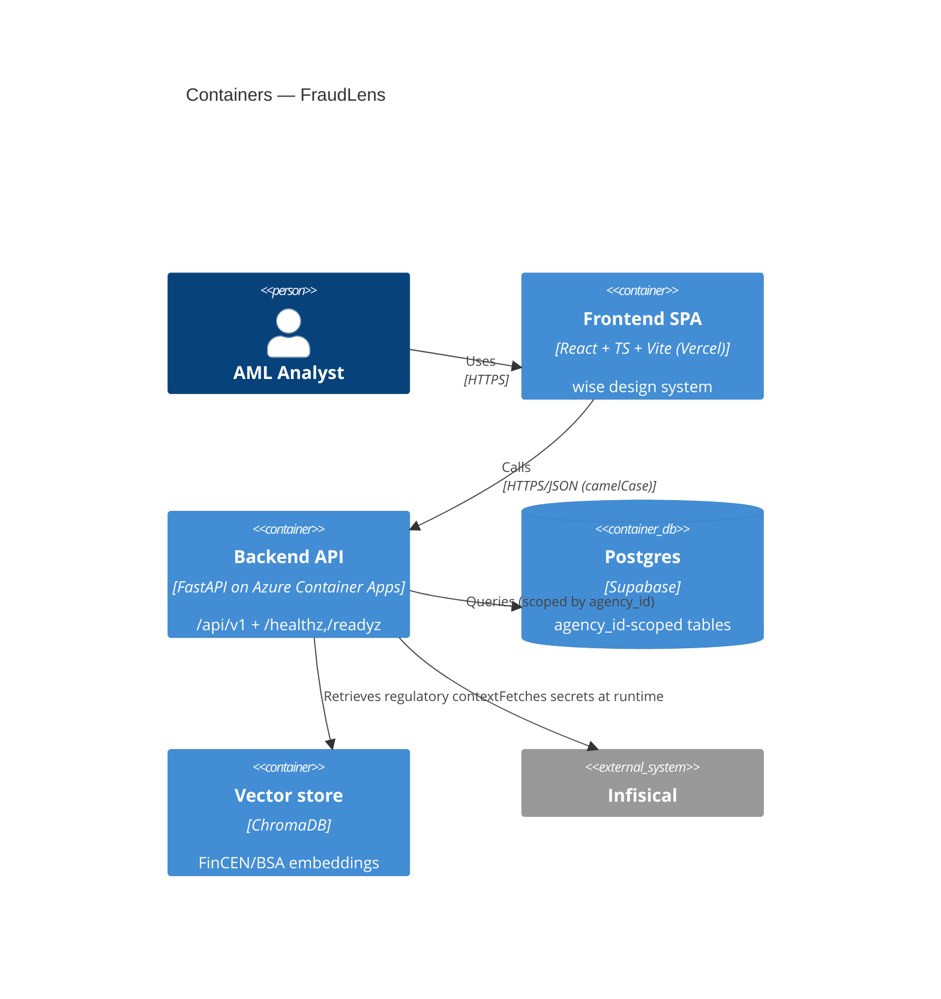
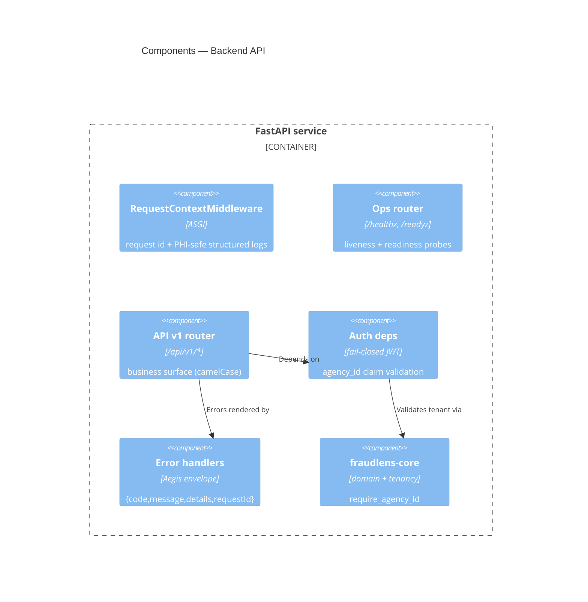
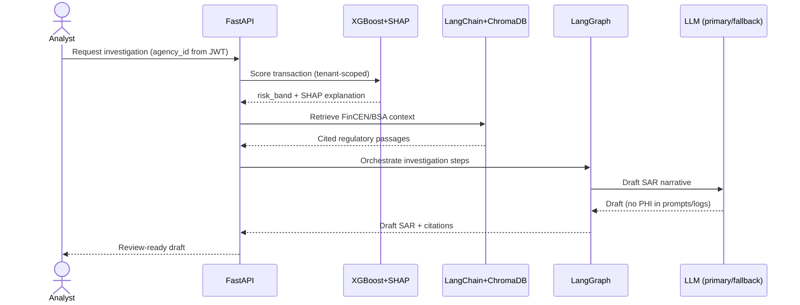
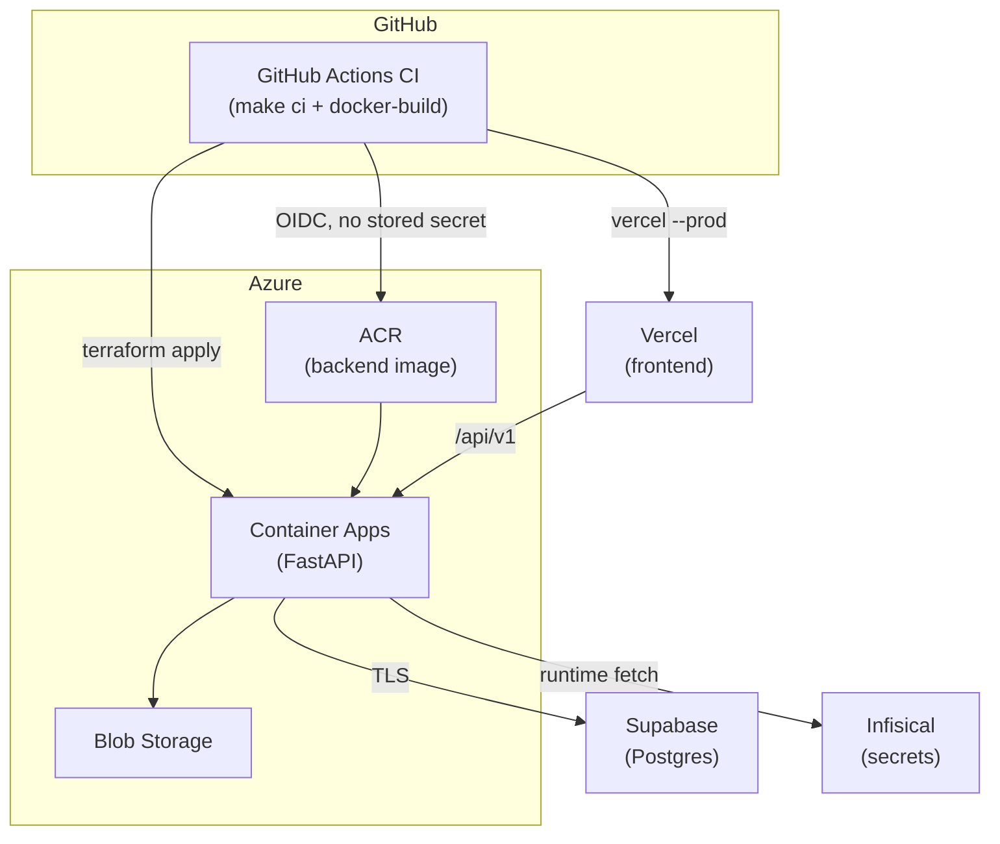
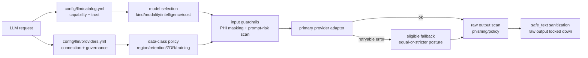
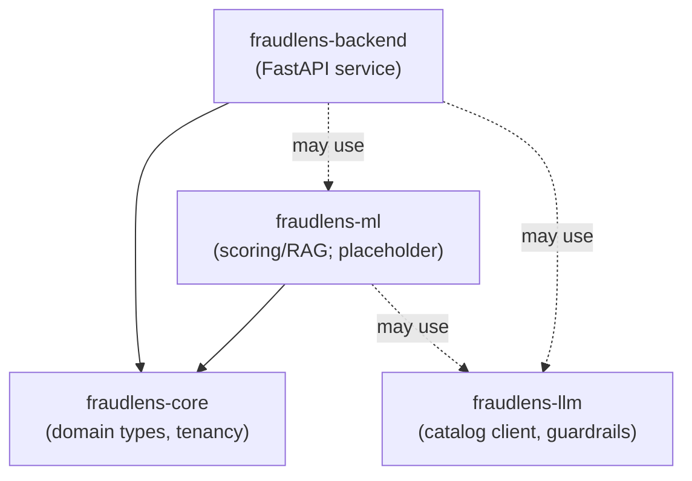

# FraudLens — Architecture

> **Diagrams are [Mermaid](https://mermaid.js.org/)** (text, diffable). The hand-authored
> sections capture intent; the `<!-- AUTOGEN:* -->` regions are regenerated from code by
> `make docs` and validated by CI (`make docs-check`) — **do not edit them by hand**.

FraudLens is an **AML fraud-investigation system**: transactions are risk-scored
(XGBoost + SHAP), enriched with regulatory context retrieved from FinCEN/BSA references
(LangChain + ChromaDB RAG), orchestrated through an investigation graph (LangGraph), and
summarized into draft SARs by an LLM. This document describes the **foundation/walking
skeleton**; ML/RAG/LLM features land in later plans, but the boundaries are drawn here.

## C4 — System Context


## C4 — Containers



## C4 — Components (Backend)



## Fraud-investigation pipeline (target)



## Deployment topology



- **Azure via GitHub→Azure OIDC** (federated; no long-lived client secret in GitHub).
- **Vercel/Supabase credentials** are fetched **short-lived from Infisical at job/runtime**,
  masked, never persisted. Deploy is **inert** until the accounts + Terraform state exist.

## LLM catalog, routing, and guardrails



`fraudlens-llm` is a standalone async package. Model capability, pricing, and trust
metadata live in `config/llm/catalog.yml`; provider connection and governance posture
live in `config/llm/providers.yml`. API keys are env-var references only and resolve at
runtime from Infisical `/llm`.

Public calls enter through `LlmClient.generate()` or `LlmClient.embed()`. The client checks
provider data-class policy before any SDK call, masks PHI-like input locally, scans prompt
risk, prepends a fixed system policy, calls a private provider adapter, scans raw output
before sanitization, and returns only `safe_text` by default. Embeddings run policy and
masking before the provider call; vector storage and `agency_id` scoping remain backend
responsibilities.

Fallback is allowed only after retryable provider failures and only to providers that allow
the call's `DataClass` and maintain an equal-or-stricter governance posture. Fallback never
weakens region, retention, ZDR, or training-opt-out posture unless an explicit non-prod
override is set.

## Aegis governance mapping

| Aegis invariant | Enforced by |
| --- | --- |
| No PHI in logs/URLs/errors/query params | `middleware/logging.py` (PHI scrub, path-only logs); `api/errors.py` (no raw input/stack) |
| Tenant isolation (`agency_id` on every scoped op) | `fraudlens_core.require_agency_id`; `api/deps.py` (`enforce_tenant`) |
| AuthZ validates JWT `agency_id` vs resource | `api/deps.py` (`authenticate` fails closed; dev bypass inert in prod) |
| Aegis error envelope | `api/errors.py` → `{code, message, details, requestId}` |
| Secrets via Infisical, never repo | `config/*.yaml` (non-secret only); `gitleaks` + `scripts/check_no_secrets.py` |
| Generated docs stay in sync | `make docs` / `make docs-check` (this file's AUTOGEN regions, OpenAPI, ERD) |

## Module map

<!-- AUTOGEN:module-map -->

<!-- /AUTOGEN:module-map -->

**Layering rule (ruff-enforced):** `fraudlens-core` imports nothing internal; `fraudlens-ml`
may import `core` but never `backend`; `backend` may import both.

## API endpoints

<!-- AUTOGEN:endpoints -->
| Method | Path | Handler |
| --- | --- | --- |
| GET | `/api/v1/agencies/{agency_id}` | `read_agency` |
| GET | `/api/v1/health` | `api_health` |
| GET | `/healthz` | `healthz` |
| GET | `/readyz` | `readyz` |
<!-- /AUTOGEN:endpoints -->

Ops probes (`/healthz`, `/readyz`) are **unprefixed**; business APIs carry **`/api/v1/`**.

## Configuration keys

Non-secret config only (layered `config/*.yaml` → `FRAUDLENS_*` env). Secrets come from Infisical.

<!-- AUTOGEN:config-keys -->
| Key | Type | Default | Description |
| --- | --- | --- | --- |
| `app_name` | `str` | `'FraudLens'` | Human-readable service name. |
| `environment` | `Literal` | `'dev'` | Active deployment environment; gates the auth dev-bypass. |
| `log_level` | `str` | `'INFO'` | Python logging level name. |
| `api_v1_prefix` | `str` | `'/api/v1'` | Prefix for business APIs; ops endpoints stay unprefixed. |
| `request_id_header` | `str` | `'X-Request-Id'` | Response header carrying the per-request correlation id. |
| `auth_dev_bypass` | `bool` | `False` | Dev-only auth bypass; honored only when environment != 'prod'. |
<!-- /AUTOGEN:config-keys -->

## Data model (ERD)

<!-- AUTOGEN:erd -->
```mermaid
erDiagram
    %% No SQLAlchemy models defined yet (foundation walking skeleton).
    %% Regenerated by `make docs`; every tenant-scoped table will carry
    %% agency_id (Aegis multi-tenant isolation).
```
<!-- /AUTOGEN:erd -->
