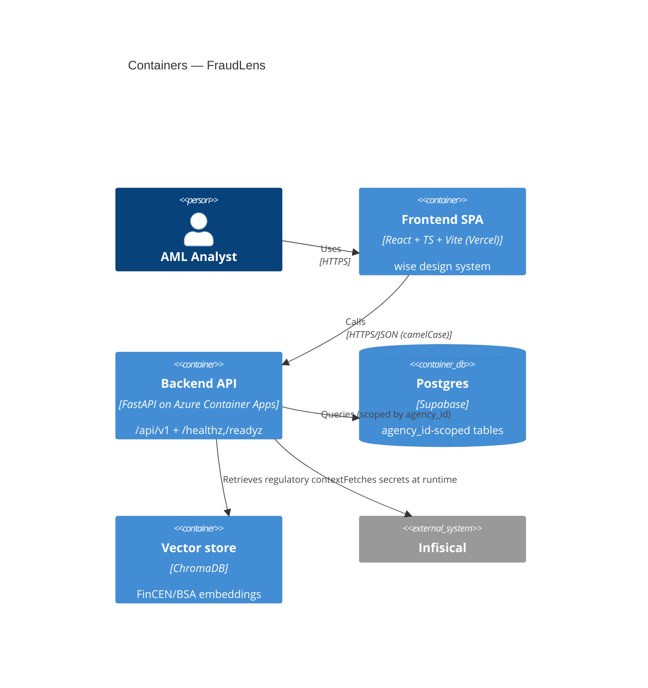
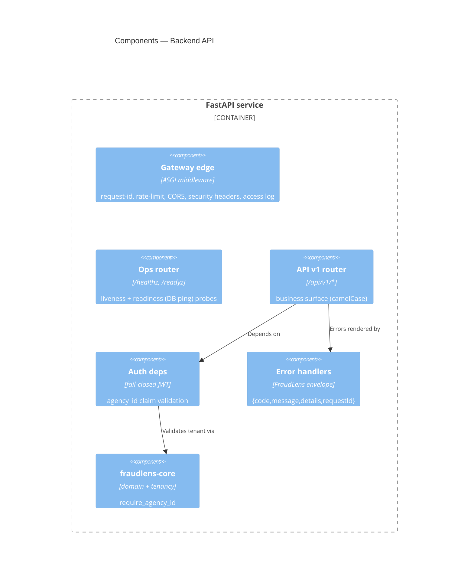
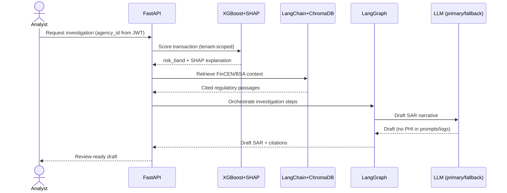
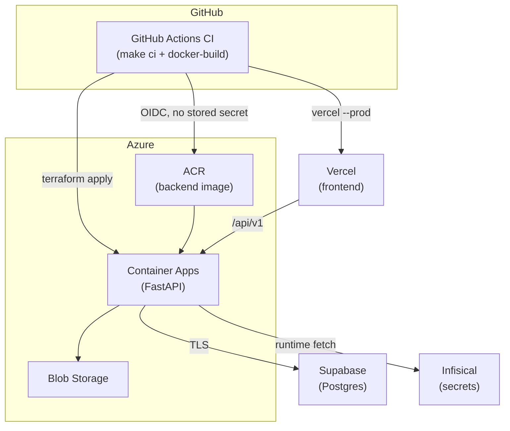
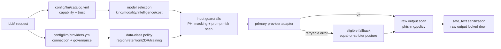
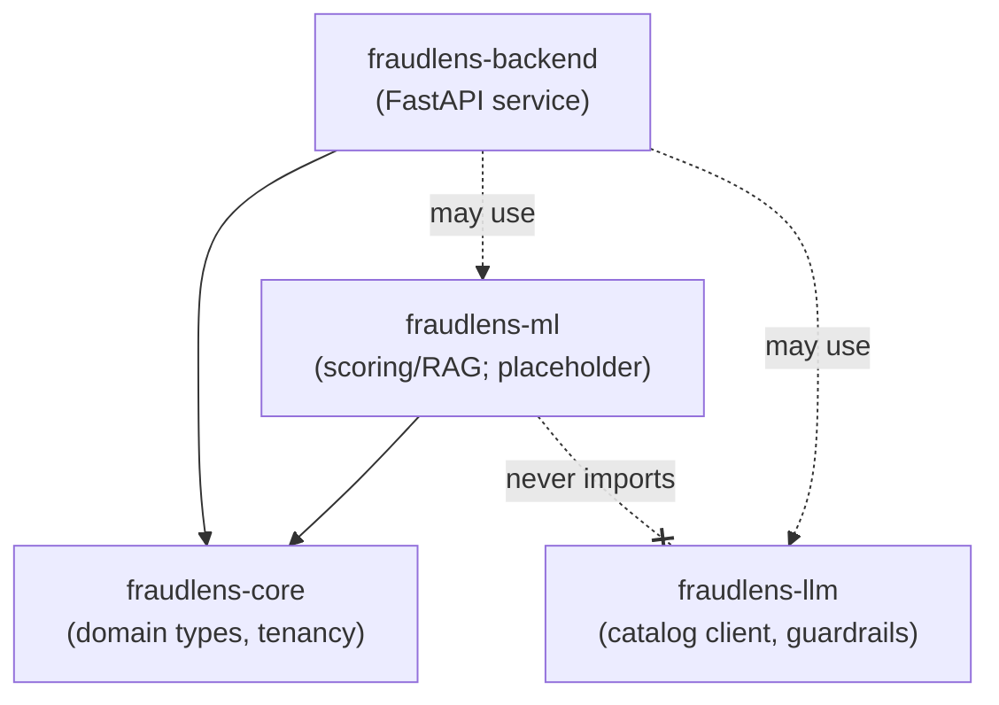

# FraudLens — Architecture

> **Diagrams are [Mermaid](https://mermaid.js.org/)** (text, diffable). The hand-authored
> sections capture intent; the `<!-- AUTOGEN:* -->` regions are regenerated from code by
> `make docs` and validated by CI (`make docs-check`) — **do not edit them by hand**.

FraudLens is an **AML fraud-investigation system**: transactions are risk-scored
(XGBoost + SHAP), enriched with regulatory context retrieved from FinCEN/BSA references
(LangChain + ChromaDB RAG), orchestrated through an investigation graph (LangGraph), and
summarized into draft SARs by an LLM. This document describes the **foundation/walking
skeleton**; ML/RAG/LLM features land in later plans, but the boundaries are drawn here.

## C4 — System Context

## C4 — Containers

## C4 — Components (Backend)

## Fraud-investigation pipeline (target)

## Deployment topology

- **Azure via GitHub→Azure OIDC** (federated; no long-lived client secret in GitHub).
- **Vercel/Supabase credentials** are fetched **short-lived from Infisical at job/runtime**,
  masked, never persisted. Deploy is **inert** until the accounts + Terraform state exist.

## LLM catalog, routing, and guardrails

`fraudlens-llm` is a standalone async package. Model capability, pricing, and trust
metadata live in `config/llm/catalog.yml`; provider connection and governance posture
live in `config/llm/providers.yml`. API keys are env-var references only and resolve at
runtime from Infisical `/llm`.

Public calls enter through `LlmClient.generate()` or `LlmClient.embed()`. The client checks
provider data-class policy before any SDK call, masks PHI-like input locally, scans prompt
risk, prepends a fixed system policy, calls a private provider adapter, scans raw output
before sanitization, and returns only `safe_text` by default. Embeddings run policy and
masking before the provider call; vector storage and `agency_id` scoping remain backend
responsibilities.

Fallback is allowed only after retryable provider failures and only to providers that allow
the call's `DataClass` and maintain an equal-or-stricter governance posture. Fallback never
weakens region, retention, ZDR, or training-opt-out posture unless an explicit non-prod
override is set.

## FraudLens governance mapping

| FraudLens invariant | Enforced by |
| --- | --- |
| No PHI in logs/URLs/errors/query params | `middleware/logging.py` (structlog redaction processor + key denylist, path-only access logs); `middleware/gateway.py` (request-id, security headers); `api/errors.py` (no raw input/stack) |
| Tenant isolation (`agency_id` on every scoped op) | `fraudlens_core.require_agency_id`; `api/deps.py` (`enforce_tenant`) |
| AuthZ validates JWT `agency_id` vs resource | `api/deps.py` (`authenticate` fails closed; dev bypass inert in prod) |
| FraudLens error envelope | `api/errors.py` → `{code, message, details, requestId}` |
| Secrets via Infisical, never repo | `config/*.yaml` (non-secret only); `gitleaks` + `scripts/check_no_secrets.py` |
| Generated docs stay in sync | `make docs` / `make docs-check` (this file's AUTOGEN regions, OpenAPI, ERD) |

## Module map

<!-- AUTOGEN:module-map -->

<!-- /AUTOGEN:module-map -->

**Layering rule (ruff-enforced):** `fraudlens-core` imports nothing internal; `fraudlens-ml`
may import `core` but never `backend` **or `fraudlens-llm`** — SAR drafting reaches `ml` only
through an injected `SarDrafter` protocol, so the heavy ML package never depends on the LLM
client; `backend` may import `core`, `llm`, and `ml`.

## API endpoints

<!-- AUTOGEN:endpoints -->
| Method | Path | Handler |
| --- | --- | --- |
| GET | `/api/v1/agencies/{agency_id}` | `read_agency` |
| GET | `/api/v1/health` | `api_health` |
| GET | `/api/v1/model-versions` | `list_model_versions` |
| GET | `/api/v1/model-versions/{version_id}` | `get_model_version` |
| GET | `/api/v1/rules` | `list_rules` |
| POST | `/api/v1/rules` | `create_rule` |
| DELETE | `/api/v1/rules/{rule_id}` | `delete_rule` |
| GET | `/api/v1/rules/{rule_id}` | `get_rule` |
| PATCH | `/api/v1/rules/{rule_id}` | `update_rule` |
| POST | `/api/v1/telemetry/client-error` | `report_client_error` |
| GET | `/api/v1/transactions` | `list_transactions` |
| POST | `/api/v1/transactions` | `ingest_transaction` |
| POST | `/api/v1/transactions/batch` | `ingest_batch` |
| POST | `/api/v1/transactions/upload` | `upload_csv` |
| GET | `/api/v1/transactions/{transaction_id}` | `get_transaction` |
| GET | `/healthz` | `healthz` |
| GET | `/readyz` | `readyz` |
<!-- /AUTOGEN:endpoints -->

Ops probes (`/healthz`, `/readyz`) are **unprefixed**; business APIs carry **`/api/v1/`**.

## Configuration keys

Non-secret config only (layered `config/*.yaml` → `FRAUDLENS_*` env). Secrets come from Infisical.

<!-- AUTOGEN:config-keys -->
| Key | Type | Default | Description |
| --- | --- | --- | --- |
| `app_name` | `str` | `'FraudLens'` | Human-readable service name. |
| `environment` | `Literal` | `'dev'` | Active deployment environment; gates the auth dev-bypass. |
| `log_level` | `str` | `'INFO'` | Python logging level name. |
| `api_v1_prefix` | `str` | `'/api/v1'` | Prefix for business APIs; ops endpoints stay unprefixed. |
| `request_id_header` | `str` | `'X-Request-Id'` | Response header carrying the per-request correlation id. |
| `auth_dev_bypass` | `bool` | `False` | Dev-only auth bypass; honored only when environment != 'prod'. |
| `cors_allow_origins` | `list` | `[]` | Exact allowed CORS origins; set per-env in config (never hardcoded). |
| `cors_allow_methods` | `list` | `['*']` | Allowed CORS methods for the gateway edge. |
| `cors_allow_headers` | `list` | `['*']` | Allowed CORS request headers for the gateway edge. |
| `cors_allow_credentials` | `bool` | `False` | Whether the gateway allows credentialed CORS requests. |
| `rate_limit_enabled` | `bool` | `True` | Enable the gateway fixed-window rate limiter. |
| `rate_limit_requests` | `int` | `120` | Max requests per client within the window before 429. |
| `rate_limit_window_seconds` | `float` | `60.0` | Length of the rate-limit fixed window, in seconds. |
| `security_headers` | `dict` | `{'X-Content-Type-Options': 'nosniff', 'X-Frame-Options': 'DENY', 'Referrer-Policy': 'no-referrer', 'Strict-Transport-Security': 'max-age=31536000; includeSubDomains'}` | Security response headers applied to every gateway response. |
| `gateway_routes_file` | `str | None` | `None` | Override path to the gateway routing table; else discovered under config/. |
| `storage_backend` | `Literal` | `'local'` | Artifact/PDF storage backend selector (local-FS vs Azure Blob). |
| `storage_local_dir` | `str` | `'.local/artifacts'` | Root directory for the local-FS storage backend (gitignored). |
| `queue_backend` | `Literal` | `'local'` | Background-job backend selector (local runner vs Container Apps Jobs). |
| `llm_mode` | `Literal` | `'mock'` | SAR drafter mode: 'mock' needs no keys/cost; 'live' calls a provider. |
| `model_artifacts_dir` | `str` | `'data/models'` | Root dir (by version label) for model artifact bundles; the committed fixture lives here, candidates are written here, prod points it at Blob. |
| `rag_corpus_dir` | `str` | `'data/regulations'` | Committed source corpus dir (`*.md` provisions) ingest builds the index from. |
| `rag_index_dir` | `str` | `'.local/chroma'` | ChromaDB index dir (built by ingest-rag; baked into the prod image). |
| `rag_collection` | `str` | `'fincen_bsa'` | ChromaDB collection name holding the embedded regulatory chunks. |
| `rag_version` | `str` | `'rag-v1'` | Corpus/index version recorded on each retrieval for the audit trail. |
| `rag_index_required` | `bool` | `False` | When true, a missing/empty RAG index fails /readyz (prod bakes the index). |
| `database_url` | `str | None` | `None` | Async SQLAlchemy URL (asyncpg driver); read from env, never committed YAML. |
| `db_connect_timeout_seconds` | `float` | `5.0` | Timeout for the /readyz database connectivity probe, in seconds. |
| `ingest_max_batch_size` | `int` | `500` | Max transactions accepted in one /transactions/batch request. |
| `ingest_csv_max_bytes` | `int` | `5242880` | Max accepted /transactions/upload body size in bytes (413 above it). |
| `ingest_csv_max_rows` | `int` | `10000` | Max data rows accepted in one CSV upload (413 above it). |
| `ingest_sample_errors_limit` | `int` | `10` | Max per-row rejection samples returned by batch/CSV ingest. |
| `client_error_max_message_length` | `int` | `2000` | Max length of a client-error report message before truncation. |
<!-- /AUTOGEN:config-keys -->

## Data model (ERD)

```mermaid
erDiagram
    agencies {
        uuid id PK
        datetime created_at
        string name
        string slug
    }
    alert_actions {
        uuid id PK
        enum action
        uuid actor_id FK
        uuid agency_id FK
        uuid alert_id FK
        datetime created_at
        string from_status
        text note
        string to_status
    }
    alerts {
        uuid id PK
        uuid agency_id FK
        uuid assigned_to FK
        datetime created_at
        json review_flags
        uuid run_id FK
        enum severity
        enum status
        uuid transaction_id FK
        datetime updated_at
    }
    aml_rules {
        uuid id PK
        uuid agency_id FK
        string code
        datetime created_at
        text description
        boolean enabled
        string name
        json params
        enum rule_type
        enum severity
        datetime updated_at
        integer version
        numeric weight
    }
    analysis_results {
        uuid id PK
        uuid agency_id FK
        float combined_score
        datetime created_at
        float fraud_probability
        string model_version
        enum risk_band
        json rule_hits
        uuid run_id FK
        json shap_values
        json top_features
    }
    analysis_run_events {
        uuid id PK
        uuid agency_id FK
        datetime created_at
        enum event_type
        json payload
        uuid run_id FK
        integer seq
    }
    analysis_runs {
        uuid id PK
        uuid agency_id FK
        datetime created_at
        string error_code
        string model_version
        string prompt_version
        string rag_version
        enum risk_band
        float risk_score
        string rules_version
        enum status
        uuid transaction_id FK
        uuid triggered_by FK
        datetime updated_at
    }
    audit_logs {
        uuid id PK
        string action
        uuid actor_id FK
        uuid agency_id FK
        datetime created_at
        json metadata
        string request_id
        string resource_id
        string resource_type
    }
    drift_reports {
        uuid id PK
        boolean advisory
        datetime created_at
        json metrics
        uuid model_version_id FK
        enum severity
        string window
    }
    job_executions {
        uuid id PK
        uuid agency_id FK
        integer attempts
        datetime created_at
        string error_code
        enum job_type
        json payload
        json result
        enum status
        datetime updated_at
    }
    model_deployments {
        uuid id PK
        uuid active_version_id FK
        integer canary_percent
        uuid canary_version_id FK
        uuid previous_active_version_id FK
        datetime updated_at
        uuid updated_by FK
    }
    model_evaluations {
        uuid id PK
        uuid baseline_version_id FK
        datetime created_at
        json metrics
        uuid model_version_id FK
        boolean passed
    }
    model_inference_logs {
        uuid id PK
        uuid agency_id FK
        datetime created_at
        string feature_hash
        float fraud_probability
        uuid model_version_id FK
        uuid run_id FK
        boolean was_canary
    }
    model_training_runs {
        uuid id PK
        string artifact_uri
        datetime created_at
        uuid created_by FK
        uuid dataset_id FK
        json metrics
        json params
        enum status
        enum trigger
        datetime updated_at
    }
    model_versions {
        uuid id PK
        datetime approved_at
        uuid approved_by FK
        string artifact_uri
        datetime created_at
        json feature_spec
        json metrics
        text notes
        enum status
        uuid training_run_id FK
        string version_label
    }
    rag_retrievals {
        uuid id PK
        uuid agency_id FK
        json chunks
        datetime created_at
        text query
        string rag_version
        uuid run_id FK
        integer top_k
    }
    sar_drafts {
        uuid id PK
        uuid agency_id FK
        uuid alert_id FK
        json citations
        text content
        numeric cost_usd
        datetime created_at
        uuid created_by FK
        string model_id
        string pdf_blob_url
        string prompt_hash
        string prompt_version
        uuid reviewed_by FK
        uuid run_id FK
        enum status
        json structured
        json token_usage
        datetime updated_at
        integer version
    }
    system_config {
        uuid id PK
        uuid agency_id FK
        string key
        datetime updated_at
        uuid updated_by FK
        json value
    }
    training_datasets {
        uuid id PK
        string content_hash
        datetime created_at
        json feature_spec
        string label_window
        integer row_count
        json snapshot_query
    }
    training_labels {
        uuid id PK
        uuid agency_id FK
        datetime created_at
        uuid created_by FK
        enum label
        datetime matured_at
        uuid run_id FK
        enum source
        uuid transaction_id FK
    }
    transactions {
        uuid id PK
        uuid agency_id FK
        numeric amount
        string channel
        string country
        datetime created_at
        string currency
        string dest_account
        string external_id
        string feature_hash
        json features
        datetime ingested_at
        uuid latest_run_id
        datetime occurred_at
        string origin_account
        enum risk_band
    }
    users {
        uuid id PK
        uuid agency_id FK
        datetime created_at
        string display_name
        string email
        enum role
        datetime updated_at
    }
    agencies ||--o{ alert_actions : "agency_id"
    agencies ||--o{ alerts : "agency_id"
    agencies ||--o{ aml_rules : "agency_id"
    agencies ||--o{ analysis_results : "agency_id"
    agencies ||--o{ analysis_run_events : "agency_id"
    agencies ||--o{ analysis_runs : "agency_id"
    agencies ||--o{ audit_logs : "agency_id"
    agencies ||--o{ job_executions : "agency_id"
    agencies ||--o{ model_inference_logs : "agency_id"
    agencies ||--o{ rag_retrievals : "agency_id"
    agencies ||--o{ sar_drafts : "agency_id"
    agencies ||--o{ system_config : "agency_id"
    agencies ||--o{ training_labels : "agency_id"
    agencies ||--o{ transactions : "agency_id"
    agencies ||--o{ users : "agency_id"
    alerts ||--o{ alert_actions : "alert_id"
    alerts ||--o{ sar_drafts : "alert_id"
    analysis_runs ||--o{ alerts : "run_id"
    analysis_runs ||--o{ analysis_results : "run_id"
    analysis_runs ||--o{ analysis_run_events : "run_id"
    analysis_runs ||--o{ model_inference_logs : "run_id"
    analysis_runs ||--o{ rag_retrievals : "run_id"
    analysis_runs ||--o{ sar_drafts : "run_id"
    analysis_runs ||--o{ training_labels : "run_id"
    model_training_runs ||--o{ model_versions : "training_run_id"
    model_versions ||--o{ drift_reports : "model_version_id"
    model_versions ||--o{ model_deployments : "active_version_id"
    model_versions ||--o{ model_deployments : "canary_version_id"
    model_versions ||--o{ model_deployments : "previous_active_version_id"
    model_versions ||--o{ model_evaluations : "baseline_version_id"
    model_versions ||--o{ model_evaluations : "model_version_id"
    model_versions ||--o{ model_inference_logs : "model_version_id"
    training_datasets ||--o{ model_training_runs : "dataset_id"
    transactions ||--o{ alerts : "transaction_id"
    transactions ||--o{ analysis_runs : "transaction_id"
    transactions ||--o{ training_labels : "transaction_id"
    users ||--o{ alert_actions : "actor_id"
    users ||--o{ alerts : "assigned_to"
    users ||--o{ analysis_runs : "triggered_by"
    users ||--o{ audit_logs : "actor_id"
    users ||--o{ model_deployments : "updated_by"
    users ||--o{ model_training_runs : "created_by"
    users ||--o{ model_versions : "approved_by"
    users ||--o{ sar_drafts : "created_by"
    users ||--o{ sar_drafts : "reviewed_by"
    users ||--o{ system_config : "updated_by"
    users ||--o{ training_labels : "created_by"
```

<!-- AUTOGEN:erd -->

<!-- /AUTOGEN:erd -->
