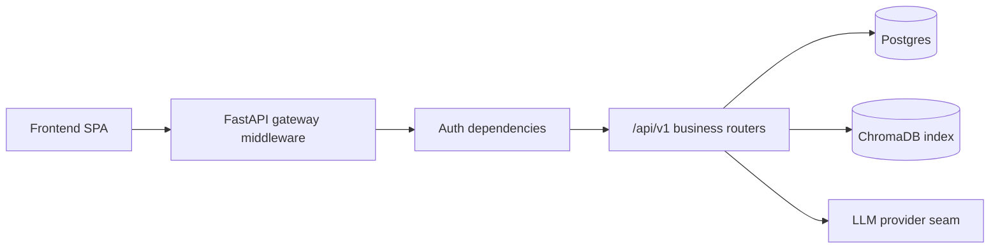

# Gateway Architecture

FraudLens uses a gateway-first boundary: the frontend is untrusted, the FastAPI gateway
middleware is the public edge, and all business routers depend on verified identity from that edge.
In v1 the gateway runs in-process with the API service; the contract is shaped so it can split into
separate internal services later without changing the frontend.

## Request Flow

| Step | What Happens | Why |
| --- | --- | --- |
| 1 | Gateway assigns or accepts `X-Request-Id`. | Every response, error, log, and audit row can be correlated. |
| 2 | Security headers, CORS allowlist, and rate limits are applied. | Cross-cutting controls cannot be skipped by individual routers. |
| 3 | Auth dependency verifies bearer JWT or fails closed. | Missing/invalid credentials return 401 before database access. |
| 4 | `agency_id` claim is bound into `TenantContext`. | Tenant-scoped reads/writes never trust client-supplied tenant ids. |
| 5 | Router executes and writes audit rows for governed actions. | Compliance-critical actions are durable, tenant-scoped, and PHI-free. |

## Contracts

- Ops endpoints are unprefixed: `GET /healthz`, `GET /readyz`.
- Business APIs are prefixed: `/api/v1/*`.
- API JSON is camelCase; Python internals remain snake_case through Pydantic aliases.
- Errors use `{code, message, details, requestId}` and never expose stack traces or raw input.
- Path parameters are camelCase in the public contract, for example `{agencyId}` and `{runId}`.

## Controls

| Control | Code |
| --- | --- |
| Gateway middleware | [`backend/src/fraudlens_backend/middleware/gateway.py`](../../backend/src/fraudlens_backend/middleware/gateway.py) |
| Security headers | [`backend/src/fraudlens_backend/middleware/security.py`](../../backend/src/fraudlens_backend/middleware/security.py) |
| Auth and tenant enforcement | [`backend/src/fraudlens_backend/api/deps.py`](../../backend/src/fraudlens_backend/api/deps.py) |
| Error envelope | [`backend/src/fraudlens_backend/api/errors.py`](../../backend/src/fraudlens_backend/api/errors.py) |
| Audit writer | [`backend/src/fraudlens_backend/db/repositories/audit.py`](../../backend/src/fraudlens_backend/db/repositories/audit.py) |

## Deployment Notes

Azure Container Apps terminates HTTPS and forwards to the FastAPI process. Vercel calls only the
gateway/API origin. Secrets are resolved from Infisical at runtime; no gateway secret is stored in
source, `.env`, or GitHub Actions.
