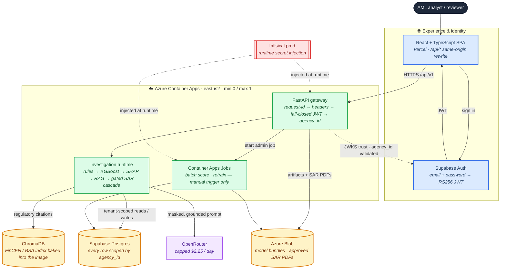

# Portfolio polish — live demo login, repo cleanup, recruiter README

> **Status: working document, in flight.** This is the plan behind the 2026-09-18 portfolio
> polish work, kept here because Phases 3-6 are still open. It is not a deliverable and not a
> maintained record: when the work lands, the durable outputs are the ADRs, runbooks, reports, and
> tests it produced (Golden Rule 4), and this file goes.

## Context

FraudLens is a personal portfolio repo whose public face is `https://fraud-lens-amber.vercel.app`.
Six things are wrong or missing for that audience:

1. **The live demo cannot be used at all.** The "Demo · sign in as" picker is missing from the
   deployed login screen, and underneath that the whole sign-in path is broken.
2. `plans/` was deleted in the working tree, which silently breaks CI.
3. `.gitignore` has real gaps (editor dirs, `.env.*` variants, non-auto tfvars, merge leftovers).
4. The README is a 592-line evidence dossier, not a 60-second recruiter read.
5. There is no "here's what to click" scenario anywhere in the README.
6. The architecture diagram is monochrome and has no accompanying explanation.

### What the investigation actually found (item 1 is not what it looks like)

The dropdown was **never removed from the code**. It is live at
[Login.tsx:306-403](../../frontend/src/pages/Login.tsx:306), fed by
[portfolioDemo.ts](../../frontend/src/lib/portfolioDemo.ts) from
`GET /api/v1/portfolio-demo/config`, whose personas come from
[config/portfolio-demo.yaml](../../config/portfolio-demo.yaml) (the `picker_name` / `picker_tag` /
`picker_accent` fields exist precisely for this UI). It renders only when
`isDemoPickerEnabled()` is true — see [loginEnvironment.ts](../../frontend/src/pages/loginEnvironment.ts).

The live bundle (`/assets/index-CRIENiVz.js`) was downloaded and the env object Vite inlined at
build time inspected. Four independent breakages, all confirmed empirically:

| # | Evidence | Consequence |
|---|---|---|
| A | Inlined env object is `{BASE_URL, DEV:!1, MODE, PROD, SSR, VITE_API_BASE_URL:"", VITE_VERCEL_*…}` — **no `VITE_DEMO_AUTH_ENABLED`** | `isDemoPickerEnabled()` is false → picker compiled out |
| B | Config module reads `T_={VITE_API_BASE_URL:""}`; `supabaseUrl:a.VITE_SUPABASE_URL??""` resolves to `""` | Supabase sign-in impossible even if the picker showed |
| C | `GET /api/v1/health` and `/api/v1/portfolio-demo/config` both return `content-type: text/html` with `x-vercel-cache: HIT` | The `/api/*` rewrite is **not active**; `${AZURE_API_ORIGIN}` was never substituted for the serving deployment. Requests fall through to the SPA catch-all |
| D | `config/default.yaml:27` → `portfolio_demo_enabled: false`, no prod override | The persona endpoint would 404 even with the proxy fixed |

`VITE_DEMO_AUTH_ENABLED: "true"` **is** set at
[deploy-frontend.yml:88](../../.github/workflows/deploy-frontend.yml:88) — but as a step-level env var,
which does not reach the framework build that `vercel build` runs. Combined with (C), the
deployment currently being served was not produced by that workflow's substitution step. The
post-deploy smoke that would have caught this is gated behind
`vars.PORTFOLIO_DEMO_BOOTSTRAP_ENABLED == 'true'`.

**Intended outcome:** a recruiter opens the live URL, picks a persona, signs in, and follows a
five-step investigation to a human approval — and the README gets them there in under a minute.

---

## Phase 1 — Restore the working demo login

Goal: persona picker visible **and** sign-in functional on `fraud-lens-amber.vercel.app`.

**1.1 Confirm the live deploy path first.** Before changing anything, establish whether the
serving deployment came from `deploy-frontend.yml` or from Vercel's Git integration. Check the
Vercel project's deployment source and whether Git auto-deploy is enabled. This decides where the
env vars have to live — a workflow-side fix is inert if Git auto-deploy is what actually ships.

**1.2 Pin the demo flag in the committed build config.** Add `VITE_DEMO_AUTH_ENABLED=true` to
`frontend/.env.production`, alongside the existing `VITE_API_BASE_URL=` pin. This is the only
fix that works under **both** deploy paths, and it matches the precedent already in that file.

> Implementation note: `.env*` reads are denied to Claude Code by
> [.claude/settings.json](../../.claude/settings.json), so Read/Edit will fail on this file. Append it
> with a shell redirect, or paste the one line by hand.

**1.3 Supply the Supabase vars to the build.** `VITE_SUPABASE_URL` and `VITE_SUPABASE_ANON_KEY`
are absent from the built bundle and are **not** in `.env.production` or any workflow build step.
Set them in the **Vercel project's Production environment variables** — that source is honored by
both `vercel pull` (CLI path) and native Git deploys. Do not commit the anon key to
`.env.production`; Golden Rule 3 keeps credential values out of the repo even when the value is a
publishable client key. If the CLI workflow is retained, additionally write them into
`.vercel/.env.production.local` after `vercel pull` from the Infisical secrets the workflow
already fetches, so the governed path is self-sufficient.

**1.4 Restore the `/api/*` proxy.** [frontend/vercel.json](../../frontend/vercel.json) ships a literal
`${AZURE_API_ORIGIN}` placeholder that only `deploy-frontend.yml` substitutes. Either:

- **(preferred)** disable Vercel Git auto-deploy so `deploy-frontend.yml` is the only path that
  can publish — this is also what restores the governed `environment: production` approval gate; or
- resolve the origin at build time in a way Git deploys also honor.

Then re-verify: `curl -sI https://fraud-lens-amber.vercel.app/api/v1/portfolio-demo/config`
must return `application/json`, not `text/html`.

**1.5 Enable the backend projection in prod.** `portfolio_demo_enabled` defaults to `false` in
`config/default.yaml:27` and is documented as a fail-closed security gate. Set it `true` in
`config/prod.yaml` only. Without this the endpoint 404s and the picker shows
"Demo personas unavailable".

**1.6 Ensure the four persona users exist in Supabase Auth.** Run
[scripts/provision_demo_auth.py](../../scripts/provision_demo_auth.py) against the prod project so the
four personas defined in [config/portfolio-demo.yaml](../../config/portfolio-demo.yaml) exist with
`app_metadata = {agency_id, user_role}` and the password from
`FRAUDLENS_DEMO_AUTH_PASSWORD` (Infisical `prod`, path `/`). This is a mutating cloud action —
Golden Rule 7 applies, so confirm before running.

**1.7 Turn the deploy smoke on.** Set repo variable `PORTFOLIO_DEMO_BOOTSTRAP_ENABLED=true` so
the existing proxy + authenticated-API + SSE smoke at
[deploy-frontend.yml:163-180](../../.github/workflows/deploy-frontend.yml:163) runs and this class of
regression fails the deploy instead of reaching the public URL.

**Files:** `frontend/.env.production`, [frontend/vercel.json](../../frontend/vercel.json),
[.github/workflows/deploy-frontend.yml](../../.github/workflows/deploy-frontend.yml), `config/prod.yaml`.
No frontend component changes — [Login.tsx](../../frontend/src/pages/Login.tsx),
[portfolioDemo.ts](../../frontend/src/lib/portfolioDemo.ts) and
[loginEnvironment.ts](../../frontend/src/pages/loginEnvironment.ts) are already correct.

**Acceptance:** the live URL renders the picker with four personas; picking one and submitting
lands on the dashboard; the proxy returns JSON.

---

## Phase 2 — Cleanup

**2.1 Retire `plans/` and repair the fallout.** `make docs-links-check` (inside `make ci` and
`make pre-pr`) validates every relative link; 8 dangle once `plans/` is gone:

| File | Link |
|---|---|
| [AGENTS.md:49-50](../../AGENTS.md:49) | `plans/`, `plans/README.md` |
| [README.md:582](../../README.md:582) | `plans/` |
| `docs/handoff/0.5.0-phase4-live-run.md:10` | the retired plan file |
| `docs/runbooks/security.md:4`, `docs/runbooks/model-lifecycle.md:9` | `plans/README.md#retired-plans` |
| `docs/architecture/adr/ADR-018-…md:8`, `ADR-017-…md:7,97` | `plans/README.md#retired-plans` |

Convert each to plain text or repoint at the replacement ADR. Then rewrite the governance that
now describes a workflow that no longer exists:

- **Golden Rule 4** in [AGENTS.md](../../AGENTS.md) — replace the "plans live in `plans/`" rule.
- The `## Plans & drift-check` section of AGENTS.md.
- [CLAUDE.md:19-20](../../CLAUDE.md:19) — the plan-mode and `drift-check` plan-path instructions.
- The repo-layout table row for `plans/`.
- `.claude/skills/drift-check/` + its `.agents/skills/` mirror still take a plan path as input.
  **Open decision:** retire drift-check with the workflow, or keep it for ad-hoc plan files.
  Either way **regenerate the mirror with `make docs`**; never hand-edit `.agents/skills/`.
- `scripts/lib/skills.py:82-83` asserts every skill `default_prompt` contains the string
  `plans/`. If skill prompts change, this check changes with them.

> **Note:** this plan file itself lives in `plans/`. Retire it along with the directory once the
> work lands, or relocate it to `docs/handoff/` if the record is worth keeping.

**2.2 Delete verified orphans.** All confirmed to have zero inbound references:

- `scripts/runpod_bench.py` — absent from the Makefile, every workflow, and `.pre-commit-config.yaml`.
- `docs/FraudLensScreens.html` (768 KB).
- `docs/handoff/0.3.0-additions.md`, `docs/reference/cost.md` (superseded by the generated
  `cost-model.md`), `docs/reference/rules.md`, `docs/runbooks/kind-local.md`,
  `docs/runbooks/release.md`.
- `docs/architecture/gateway.md` — **before deleting**, fold its 5-step request-flow narrative
  (request-id → security headers/CORS/rate limit → fail-closed JWT → `agency_id` bound into
  `TenantContext` → router + PHI-free audit) and its Mermaid diagram into the hand-authored
  section of `docs/architecture/ARCHITECTURE.md`. ARCHITECTURE.md currently documents the
  governance mapping and config keys but not this flow; it is the only prose description of the
  trust boundary and the new README will reference the concept.
- On-disk only (untracked): `docs/.DS_Store`.

**2.3 Reclaim local scratch (~13 GB, untracked, already gitignored — nothing leaves git):**
`.local/` (12 G), `htmlcov/`, `coverage.xml`, `.coverage`, `.mypy_cache/`, the three stale model
bundles under `data/models/` (`retrain-fs1-989b03438c`, `xgb-ibm-aml-fs1-b456671153`,
`xgb-ibm-aml-fs1-c6c2ad946b`), and leftover `infra/terraform/environments/*/.terraform/` dirs
plus generated `backend.tf` files. **Do not touch**
`data/models/xgb-ibm-aml-fs2-9d43c5f92a/` — it is deliberately tracked and baked into the image.

**Acceptance:** `make docs-links-check` reports zero issues; `git status --porcelain` shows only
intended deletions.

---

## Phase 3 — `.gitignore`

Root [.gitignore](../../.gitignore) is the upstream Python template plus four FraudLens sections. Add a
consolidated FraudLens block; every addition below was verified as currently **not** ignored:

- **Editors:** uncomment `.idea/` and `.vscode/`; add `*.code-workspace`.
- **Env variants:** `.env.local`, `.env.*.local`, `.env.development` — with an explicit
  **`!frontend/.env.production`** negation, since that file is tracked and the build depends on it.
- **Terraform:** non-auto `*.tfvars`, `.terraformrc`, `terraform.rc`, `override.tf`, `*_override.tf`.
- **Merge/editor leftovers:** `*.orig`, `*.rej`, `*.swp`, `*.swo`, `*~`.
- **macOS beyond `.DS_Store`:** `._*`, `.AppleDouble`, `.LSOverride`, `.Spotlight-V100`, `.Trashes`.
- **Windows:** `Thumbs.db`, `ehthumbs.db`, `Desktop.ini`, `$RECYCLE.BIN/`.
- **Frontend tooling:** `.eslintcache`, `*.tsbuildinfo`, `.vite/`, `.turbo/`.
- **`.direnv/`** (`.envrc` is ignored, its cache dir is not).
- Promote **`.claude/worktrees/`** out of `.git/info/exclude` — that file is machine-local, so
  every other clone sees the directory as untracked.

**Acceptance:** `git check-ignore -v <path>` confirms each new rule; `git status --porcelain`
stays clean; `frontend/.env.production` remains tracked.

---

## Phase 4 — README restructure

Target the [Briefed](https://github.com/Kartik-Hirijaganer/Briefed) shape: ~250–300 lines, down
from 592.

**Hard constraint:** the five `<!-- AUTOGEN:* -->` / `<!-- /AUTOGEN:* -->` marker pairs
(`vllm-benchmark`, `cascade-benchmark`, `fulldata-training`, `k8s-benchmark`, `make-targets`)
must survive verbatim. `replace_region` in
[scripts/lib/docs_arch.py:143](../../scripts/lib/docs_arch.py:143) raises `ValueError` if a region is
missing, which breaks `make docs` **and** `make docs-check`, i.e. all of CI. Regions may be
**moved** (it is a whole-document regex) but never renamed, split, or edited by hand. To change
which make targets appear, edit the tuple at
[scripts/lib/docs_benchmarks.py:36](../../scripts/lib/docs_benchmarks.py:36) — not the README.

New section order:

1. **Centered header** (`<div align="center">`): title, one-line tagline, three badge rows
   (demo/video/CI · coverage/license · stack), `·`-separated nav links, `**Keywords:**` line,
   then the hero screenshot ``.
2. `---`
3. **`## Demo video`** — GIF placeholder ``
   plus a "What it shows:" bullet list. Create `docs/screenshots/` and `docs/demo/` with
   `.gitkeep` so the paths resolve; leave a short HTML comment marking where the real files go.
4. **`## Why FraudLens exists`** — condensed from the current L52 section.
5. **`## What it does`** — bolded feature bullets.
6. **`## Try it in 60 seconds`** — Phase 5 below.
7. **`## How it works`** — the new diagram + explanation (Phase 6) + the stack table.
8. **`## Quick start`** — prereqs, `make install`, `make run`, ports.
9. **`## Engineering highlights`** — trimmed to ~8 bullets, each linking an ADR, closing with a
   **By the numbers:** one-liner.
10. **`## Measured evidence`** — the four benchmark AUTOGEN regions, moved here intact and wrapped
    in `<details><summary>` so they stop dominating the scroll.
11. **`## Project internals`** — `<details>`-wrapped: structure tree, API surface table,
    `AUTOGEN:make-targets`, coding standards, deployment, git workflow.
12. **`## Security and governance`**, **`## Documentation`**, **`## License`**.

**Claims discipline:** [docs/reference/claims.md](../../docs/reference/claims.md) has a
`## Current README claims` section that exists specifically to stop README language outrunning
evidence. Every claim sentence that changes needs its row updated there. Cite only the published
figures — e.g. gated cascade served 99.7% of 1,000 cases vs. 90.9% raw AWQ with 85 terminal
citation fabrications; `gate_verdict_parity` held across all 1,092 attempts; 68,228,066 IBM rows
processed; ~$2.72/month recurring under hard caps. Carry the AKS disclosure (the load served
1,147 of 783,498 requests — HPA convergence, not sustained throughput) wherever that result appears.

A product screenshot/GIF does not conflict with the Mermaid-only rule in `docs/README.md` — that
rule is scoped to **diagrams**. Add a one-line carve-out there for product media to keep it
unambiguous.

**Acceptance:** `make docs` is a no-op on the prose; `git diff` shows the five AUTOGEN regions
byte-identical; `make docs-links-check` passes.

---

## Phase 5 — The demo scenario (short, in the README)

One scenario only, five steps, as `## Try it in 60 seconds`. It exercises rules → XGBoost → SHAP
→ threshold → RAG → LLM → quality gate → human gate, all visible in the UI:

````markdown
## Try it in 60 seconds

1. Open the [live demo](https://fraud-lens-amber.vercel.app) → pick **Fraud Analyst** from
   *Demo · sign in as* (synthetic credentials auto-fill) → **Sign in**.
2. Open **Transactions** and click any row in the **unscored** band.
3. Watch the investigation stream: **Risk → Drivers → Citations → SAR draft**. Each step
   unlocks only once its own evidence has arrived — nothing is pre-rendered.
4. Expand **"What the model saw"** — the exact persisted input the draft was built from.
5. **Approve**, or **reject with a reason**. No SAR is ever filed without a human.

Low-risk transactions terminate at *Risk → Drivers → Outcome* and never imply a SAR exists.
````

Routes involved: `#/transactions` → `#/investigations/:runId` → `#/alerts/:id`
([Transactions.tsx](../../frontend/src/pages/Transactions.tsx),
[Investigation.tsx](../../frontend/src/pages/Investigation.tsx),
[AlertDetail.tsx](../../frontend/src/pages/AlertDetail.tsx)). Step 1 depends on Phase 1 landing.

The longer 20-node user-flow Mermaid at README L157-202 is cut — this replaces it.

**Acceptance:** the five steps are reproducible against the live URL by someone with no context.

---

## Phase 6 — Colorful architecture diagram + explanation

Replace the monochrome `flowchart TB` at README L100-144. Both README Mermaid blocks are
hand-authored and outside AUTOGEN, so they are freely editable. Fold in the corrections the
current diagram misses: GHCR (not ACR), scale-to-zero min 0 / max 1, the Vercel same-origin
rewrite, and the keep-warm cron.

Use `classDef` with explicit `fill` **and** `color` so it renders correctly in GitHub light and
dark themes — never rely on inherited text color.



Follow it with a short colour legend and a prose paragraph covering: the browser only ever sees
one hostname (so CORS is defence-in-depth, not the mechanism); the gateway fails closed before
any DB access and binds `agency_id` from the verified claim, never a client header; the pipeline
short-circuits below the risk threshold and never invokes RAG or the LLM; secrets are injected at
runtime and the app never calls Infisical itself.

Also refresh the stale "Deployment topology" diagram in
`docs/architecture/ARCHITECTURE.md` L111-132 (it still shows ACR and omits the Vercel rewrite) —
hand-authored, outside AUTOGEN, safe to edit.

**Acceptance:** both diagrams render on GitHub in light and dark themes with legible labels.

---

## Verification

Run in order; every one of these is already the canonical gate.

```bash
make docs && make docs-check && make docs-links-check
```

Then:

```bash
make pre-pr
```

`pre-pr` = `deploy-identity-check fmt docs ci`, so it regenerates docs and runs the full gate
including `docs-links-check`, `header-check`, `file-length-check`, `secrets-scan`,
`demo-literals-check` and `attribution-check`. Expected failure mode if Phase 2.1 is incomplete:
`docs-links-check` reporting `missing_target` for a `plans/` link.

**Frontend + login:**

```bash
cd frontend && npm run test -- Login
```

Then locally: `make run-live-demo`, confirm the picker lists four personas, pick Fraud Analyst,
sign in, and walk the Phase 5 scenario to an approval.

**Live deployment (after Phase 1):**

```bash
curl -sI https://fraud-lens-amber.vercel.app/api/v1/portfolio-demo/config | head -3
```

Must report `content-type: application/json` — `text/html` means the `/api/*` rewrite is still
inactive. Then re-download the bundle and confirm `VITE_DEMO_AUTH_ENABLED`, `VITE_SUPABASE_URL`
and `VITE_SUPABASE_ANON_KEY` now appear in the inlined env object:

```bash
curl -s https://fraud-lens-amber.vercel.app/ | grep -oE '/assets/[A-Za-z0-9._-]+\.js'
```

Finally open the live URL in a browser, sign in as a persona, and complete the scenario.

**README:** render locally to confirm the Mermaid parses and the `<details>` blocks collapse;
confirm `git diff` shows the five AUTOGEN regions byte-identical.

---

## Risks

- **Phase 2.1 is the CI-breaking one.** Removing `plans/` without fixing all 8 links fails
  `make ci`. `plans/README.md` is also the only record mapping 8 retired plans to their
  replacement ADRs — that history is not duplicated anywhere, so capture anything worth keeping
  before it goes.
- **Phase 1.3/1.4 touch the Vercel project and Supabase** — outward-facing and partly outside the
  repo. Confirm before each mutating step (Golden Rule 7); 1.6 provisions real auth users.
- **`demo-literals-check`** derives its forbidden-literal list from
  [config/portfolio-demo.yaml](../../config/portfolio-demo.yaml) and scans `docs/`, `README.md` and
  `.github/`. Do not paste persona emails or the agency id into the README or the scenario —
  refer to personas by picker name only.
- **No commits or pushes** without explicit approval, and no AI attribution trailers anywhere
  (Golden Rules 1 and 2; `make attribution-check` scans every local ref).
