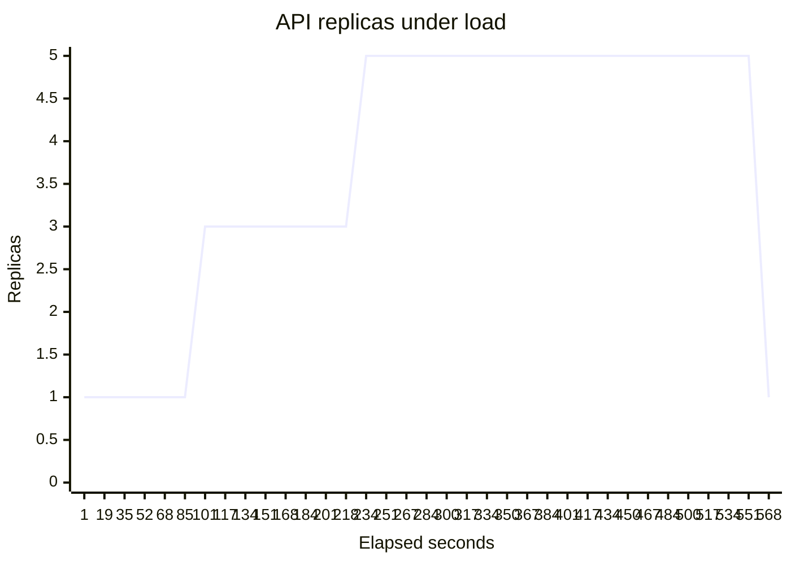
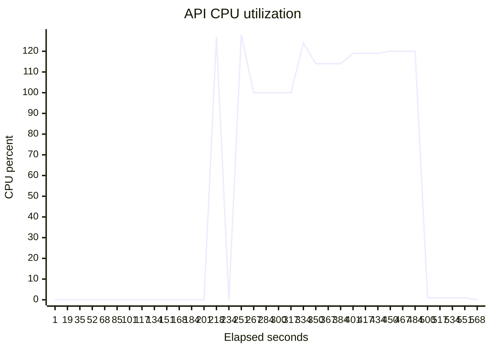

# Kubernetes HPA and durable-worker evidence

Evidence SHA-256: `34fa26d68c4db3136bff971dcf81f7403f8dc4566c4d3c26463f708e654a0416`

Measured commit: `11166600b6e240f71ba2302e3c15fce8d3b0ed40` on `aks` / `v1.35.7`.

| Result | Observed |
|---|---:|
| API replica range | 1 → 5 → 1 |
| First scale-up | 101 s |
| Scale-back to minimum | 117 s |
| Health requests succeeded | 1147 / 783498 |
| Durable runs completed | 100 / 100 |
| Max worker attempt | 2 |
| Paid session run id | aks-demo-20260915-01 |
| Execution source | local |
| Execution id | local-20260916-140528 |
| Rendered manifest SHA-256 | `a71705fa8ffd11a6018f604a59b6a31370e136f2f2982fe39e435987c3386013` |
| Image digest | `sha256:53d98c514d739e121d7fa1528fbcadb1e918ad5af95d65602f4372304f5f279e` |
| Cluster lifetime at capture | 9115 s |
| Projected session cost | $0.79 |

### Node pools

| Pool | VM size | Nodes |
|---|---|---:|
| system | Standard_B2s | 1 |
| user | Standard_D2as_v4 | 2 |

## Samples

| Elapsed (s) | Current replicas | Desired replicas | CPU % |
|---:|---:|---:|---:|
| 1 | 1 | 1 | — |
| 19 | 1 | 1 | — |
| 35 | 1 | 1 | — |
| 52 | 1 | 1 | — |
| 68 | 1 | 1 | — |
| 85 | 1 | 1 | — |
| 101 | 3 | 3 | — |
| 117 | 3 | 3 | — |
| 134 | 3 | 3 | — |
| 151 | 3 | 3 | — |
| 168 | 3 | 3 | — |
| 184 | 3 | 3 | — |
| 201 | 3 | 3 | — |
| 218 | 3 | 5 | 127 |
| 234 | 5 | 5 | — |
| 251 | 5 | 5 | 128 |
| 267 | 5 | 5 | 100 |
| 284 | 5 | 5 | 100 |
| 300 | 5 | 5 | 100 |
| 317 | 5 | 5 | 100 |
| 334 | 5 | 5 | 124 |
| 350 | 5 | 5 | 114 |
| 367 | 5 | 5 | 114 |
| 384 | 5 | 5 | 114 |
| 401 | 5 | 5 | 119 |
| 417 | 5 | 5 | 119 |
| 434 | 5 | 5 | 119 |
| 450 | 5 | 5 | 120 |
| 467 | 5 | 5 | 120 |
| 484 | 5 | 5 | 120 |
| 500 | 5 | 5 | 1 |
| 517 | 5 | 5 | 1 |
| 534 | 5 | 5 | 1 |
| 551 | 5 | 1 | 1 |
| 568 | 1 | 1 | 0 |

## Disclosures

- AKS uses Azure CNI Overlay with the Cilium data plane and network policy.
- The durability pass uses synthetic transactions; it measures recovery, not the separate GPU benchmark's model latency.
- This is paid AKS evidence and must carry its resource-session ledger record.
- Paid session aks-demo-20260915-01 ran through the governed local execution local-20260916-140528.
- The user pool uses Standard_D2as_v4 instead of the ADR-021 Standard_D2as_v5 shape because the DASv5 family quota is zero.
- Only 1147 of 783498 scaling-load requests succeeded (0.15%); the remainder were rejected by the API rate limiter. The load proves CPU-driven HPA scale-out and convergence, NOT sustained served throughput.
