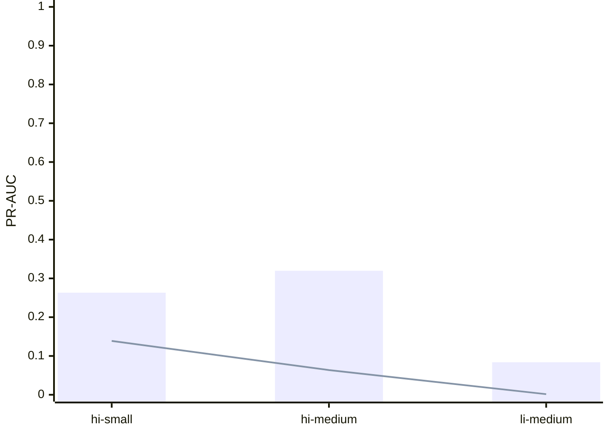

# IBM AML full-data temporal training study

- Run: `fulldata-b55c4ae63ed8bbae` (measured)
- Config SHA-256: `5835992a6919461386c35da050fece4e8cb0d0e62ad4f879b720d71ef992804d`
- Commit: `ad2dd247d899`
- Application candidate (pre-registered): `hi-medium`

## Reconciliation and temporal evaluation

| Candidate | Input SHA | Model SHA | Source rows | Usable | Rejected | Train (prev.) | Tuning (prev.) | Calibration (prev.) | Holdout (prev.) |
|---|---|---|---:|---:|---:|---:|---:|---:|---:|
| hi-small | `b19d39f515523373f991b689c07e11e7b0b95c17a2c27a87d91584ae16c5b040` | `2de2450f059440ba6d78033e7c219055da2aea77c00a6fb1a826428e22953a1b` | 5078345 | 5054380 | 23965 | 3032849 (0.00075803) | 505342 (0.00110222) | 505336 (0.00103693) | 1010853 (0.00177672) |
| hi-medium | `3126afb8155e7c8815d62bc5370549a7b5ae6bf7dfe872b3cd7813e66a3d7ff5` | `cd3f50cf010ad9995d09bba51454ae0b1bcdc800531decd8c6207fdc3a561468` | 31898238 | 31796234 | 102004 | 19078362 (0.00081406) | 3179892 (0.00174660) | 3179474 (0.00110238) | 6358506 (0.00167209) |
| li-medium | `0fc89584453c97472b1bfde7ca746e21d7167140c22a6c4875272b197a4a3910` | `e8d0bd9b7f75da3791350afba1b282ed981816f4be721179ccac37b550f7f516` | 31251483 | 31157276 | 94207 | 18695899 (0.00043502) | 3114546 (0.00080718) | 3115445 (0.00051582) | 6231386 (0.00060677) |

## Candidate versus capped logistic baseline

| Candidate | PR-AUC | Baseline PR-AUC | Recall@budget | Gates | Threshold source |
|---|---:|---:|---:|---|---|
| hi-small | 0.263219 | 0.138738 | 0.722160 | fail | calibration |
| hi-medium | 0.319599 | 0.063682 | 0.778969 | pass | calibration |
| li-medium | 0.083912 | 0.001510 | 0.567046 | fail | calibration |

## Runtime and cost

| Stage | Seconds | Peak RSS MiB |
|---|---:|---:|
| features:ibm-aml | 39.608 | 3637.66 |
| features:ibm-aml-hi-medium | 680.125 | 23483.37 |
| features:ibm-aml-li-medium | 673.544 | 23016.61 |
| folds:ibm-aml | 1.027 | 3465.58 |
| folds:ibm-aml-hi-medium | 13.289 | 16242.85 |
| folds:ibm-aml-li-medium | 13.411 | 15926.37 |
| ingest:ibm-aml | 19.464 | 2104.94 |
| ingest:ibm-aml-hi-medium | 1057.610 | 11323.41 |
| ingest:ibm-aml-li-medium | 1036.728 | 11346.87 |
| parity:ibm-aml | 1.324 | 610.69 |
| parity:ibm-aml-hi-medium | 17.848 | 940.99 |
| parity:ibm-aml-li-medium | 22.791 | 958.85 |
| train:ibm-aml | 9.582 | 3757.64 |
| train:ibm-aml-hi-medium | 324.420 | 10269.00 |
| train:ibm-aml-li-medium | 317.709 | 10091.15 |

Total recorded stage time: 4228.479 seconds.

Peak RSS: 23483.37 MiB. Host: `Azure Standard_E16ads_v5 (Medium) + local arm64 (HI-Small)`. Projected cost: 2.489219235254673. Actual cost: pending.

Cross-file overlap is reported in the JSON manifest before treating source files as independent evidence. Dataset rows are transactions, not SAR cases.
