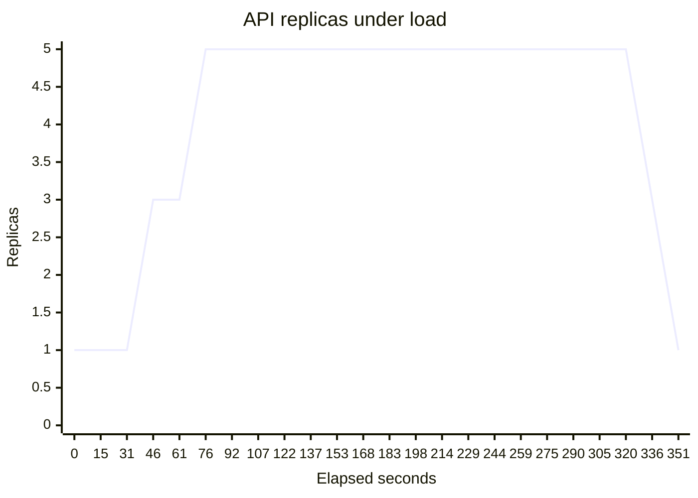
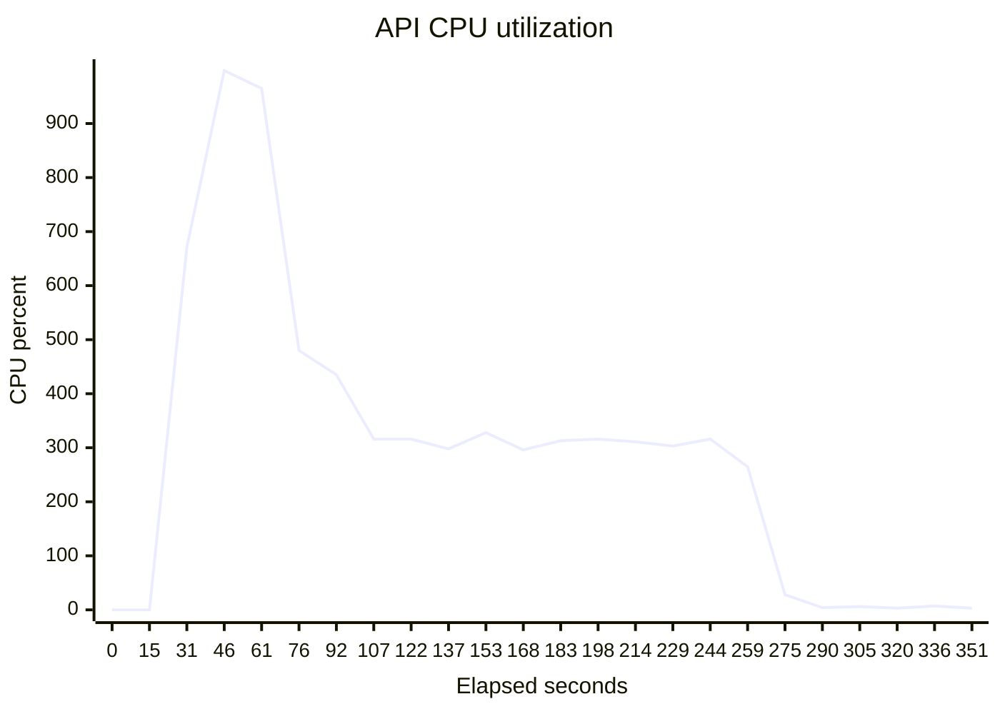

# Kubernetes HPA and durable-worker evidence

Evidence SHA-256: `4261c29a4bfeab7a35503acc9606dfba420234006d6db4acebdefea8ea3c388f`

Measured commit: `ad2dd247d8992873b6db1fc6db782fddd92c7f63` on `kind` / `v1.32.8`.

| Result | Observed |
|---|---:|
| API replica range | 1 → 5 → 1 |
| First scale-up | 46 s |
| Scale-back to minimum | 91 s |
| Health requests succeeded | 1306235 / 1306235 |
| Durable runs completed | 100 / 100 |
| Max worker attempt | 2 |

## Samples

| Elapsed (s) | Current replicas | Desired replicas | CPU % |
|---:|---:|---:|---:|
| 0 | 1 | 0 | — |
| 15 | 1 | 0 | — |
| 31 | 1 | 3 | 671 |
| 46 | 3 | 3 | 998 |
| 61 | 3 | 5 | 965 |
| 76 | 5 | 5 | 480 |
| 92 | 5 | 5 | 435 |
| 107 | 5 | 5 | 316 |
| 122 | 5 | 5 | 316 |
| 137 | 5 | 5 | 298 |
| 153 | 5 | 5 | 328 |
| 168 | 5 | 5 | 296 |
| 183 | 5 | 5 | 313 |
| 198 | 5 | 5 | 316 |
| 214 | 5 | 5 | 311 |
| 229 | 5 | 5 | 303 |
| 244 | 5 | 5 | 316 |
| 259 | 5 | 5 | 265 |
| 275 | 5 | 5 | 28 |
| 290 | 5 | 5 | 4 |
| 305 | 5 | 5 | 6 |
| 320 | 5 | 3 | 3 |
| 336 | 3 | 1 | 7 |
| 351 | 1 | 1 | 3 |

## Disclosures

- kind uses kindnet, which does not enforce NetworkPolicy; enforcement is structural here and runs through Cilium on AKS.
- The durability pass uses synthetic transactions and the keyless mock SAR provider; it measures recovery, not production model latency.
- This is a zero-cost local execution. No Azure or RunPod resources were created.
