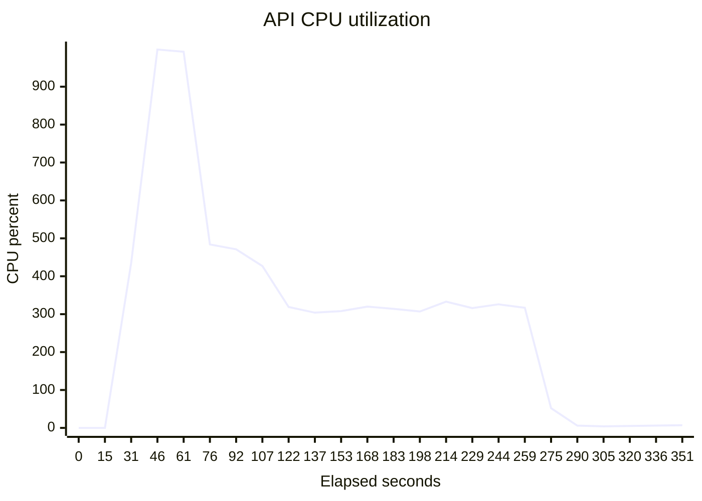

# Kubernetes HPA and durable-worker evidence

Evidence SHA-256: `397b610eebeb1a73b7150c4f976b2eea6122403fa4d95a153242e5f5fb4835d8`

Measured commit: `67aa7949ab69850fc9e03cbe3143e1ea6f817829` on `kind` / `v1.32.8`.

| Result | Observed |
|---|---:|
| API replica range | 1 → 5 → 1 |
| First scale-up | 46 s |
| Scale-back to minimum | 92 s |
| Health requests succeeded | 1317568 / 1317568 |
| Durable runs completed | 100 / 100 |
| Max worker attempt | 2 |

## Samples

| Elapsed (s) | Current replicas | Desired replicas | CPU % |
|---:|---:|---:|---:|
| 0 | 1 | 0 | — |
| 15 | 1 | 0 | — |
| 31 | 1 | 3 | 435 |
| 46 | 3 | 3 | 998 |
| 61 | 3 | 3 | 992 |
| 76 | 3 | 5 | 484 |
| 92 | 5 | 5 | 471 |
| 107 | 5 | 5 | 427 |
| 122 | 5 | 5 | 319 |
| 137 | 5 | 5 | 304 |
| 153 | 5 | 5 | 308 |
| 168 | 5 | 5 | 320 |
| 183 | 5 | 5 | 314 |
| 198 | 5 | 5 | 307 |
| 214 | 5 | 5 | 333 |
| 229 | 5 | 5 | 316 |
| 244 | 5 | 5 | 326 |
| 259 | 5 | 5 | 317 |
| 275 | 5 | 5 | 52 |
| 290 | 5 | 5 | 6 |
| 305 | 5 | 5 | 4 |
| 320 | 5 | 5 | 5 |
| 336 | 5 | 1 | 6 |
| 351 | 1 | 1 | 7 |

## Disclosures

- kind uses kindnet, which does not enforce NetworkPolicy; enforcement is structural here and runs through Cilium on AKS.
- The durability pass uses synthetic transactions and the keyless mock SAR provider; it measures recovery, not production model latency.
- This is a zero-cost local execution. No Azure or RunPod resources were created.
