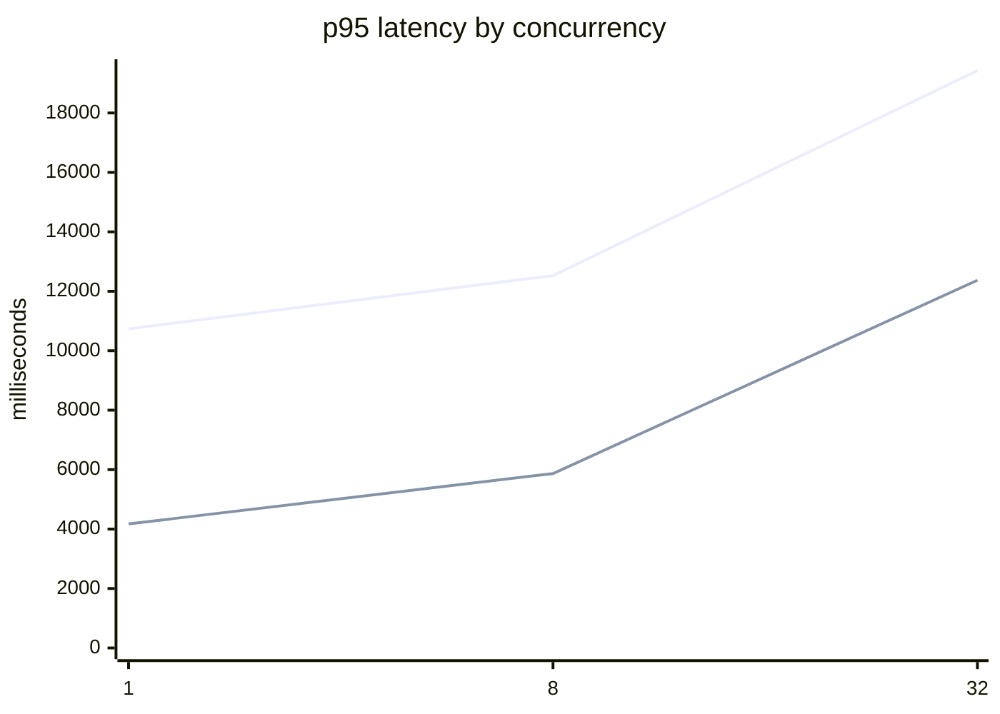

# vLLM BF16 versus 4-bit AWQ SAR benchmark

> Acceptance NOT met (reference_validity). AWQ reduced parsed model-weight memory by 63.5%; AWQ throughput higher by 60.8% at concurrency 32.

- Run: `vllm-bench-f810b57a7b8ae05a`
- Profile: `full`; case source: `ibm-final-test`
- Cases: 1000 measured + 20 abstention fixtures
- Config SHA-256: `b52e68d9ae6d288a6be3f2b2a158062ce64268c360d5c0446547c53be75bf240`
- Cases SHA-256: `b3367d9e742a73f0cad90c6388fb587f96838a2c8830a8d098e9dd99e9fcee0b`
- Prompt: `v1@1.0.0` (`9b55faf4deb757d077a84214f130dfa5333182e35b7fc77bca9a1a5a14b752d4`)
- KV-cache comparison: `equal_utilization`

## Acceptance

| Criterion | Observed | Required | Result |
|---|---:|---:|---|
| profile_full | full | full | PASS |
| case_count | 1000 | 1000 | PASS |
| complete_matrix | 6 complete levels | 6 arms-by-levels with 1000 cases | PASS |
| weight_memory_reduction | 0.634804 | >=0.500000 | PASS |
| error_rate | max 0.000000 | <=0.000000 | PASS |
| gpu_telemetry | min 272 samples | at least one sample per level | PASS |
| token_accounting_drift | max 0.000000 | <=0.050000 | PASS |
| schema_valid_rate | min 1.000000 | >=0.990000 | PASS |
| reference_validity | min 0.839134 | >=1.000000 | FAIL |

## Performance

| Arm | Concurrency | p50 ms | p95 ms | p99 ms | TTFT p95 ms | req/s | tok/s | useful/s | selected cost/1k | spot cost/1k | PAYG cost/1k |
|---|---:|---:|---:|---:|---:|---:|---:|---:|---:|---:|---:|
| BF16 | 1 | 8299.2 | 10738.9 | 11921.4 | 147.7 | 0.119 | 59.28 | 0.089 | $1.7222 | n/a | $1.7222 |
| BF16 | 8 | 9732.3 | 12527.9 | 13743.1 | 169.9 | 0.807 | 399.91 | 0.612 | $0.2547 | n/a | $0.2547 |
| BF16 | 32 | 15036.3 | 19425.5 | 21307.1 | 293.7 | 2.083 | 1037.54 | 1.552 | $0.0987 | n/a | $0.0987 |
| AWQ | 1 | 3121.8 | 4173.7 | 4578.3 | 147.8 | 0.313 | 140.61 | 0.132 | $0.6564 | n/a | $0.6564 |
| AWQ | 8 | 4454.3 | 5868.6 | 6481.6 | 185.8 | 1.750 | 786.51 | 0.744 | $0.1175 | n/a | $0.1175 |
| AWQ | 32 | 9329.2 | 12372.6 | 13542.8 | 315.4 | 3.351 | 1496.05 | 1.340 | $0.0613 | n/a | $0.0613 |

## Memory and quality

Parsed model-weight reduction: 63.5%.
Safetensors-size reduction (secondary): 63.4%.

| Metric | AWQ - BF16 (percentage points) | Warning |
|---|---:|---|
| schema_valid_rate | +0.000 | no |
| reference_validity | -14.208 | YES |
| citation_recall | -12.157 | YES |
| required_fact_coverage | -7.052 | YES |
| abstention_correctness | +0.000 | no |
| truncation_rate | +0.000 | no |

## Provenance

### BF16

- Model: `Qwen/Qwen2.5-7B-Instruct@a09a35458c702b33eeacc393d103063234e8bc28`
- Tokenizer: `Qwen/Qwen2.5-7B-Instruct@a09a35458c702b33eeacc393d103063234e8bc28`
- Image: `vllm/vllm-openai:v0.10.2@sha256:df2607b26bdda2875de4832f4d08da0055b4b6e3570347f3a849bcc652771dd6`
- GPU/driver: `NVIDIA GeForce RTX 4090` / `580.159.04`
- Host: `runpod` `NVIDIA GeForce RTX 4090` `secure-cloud` `pay_as_you_go`
- Price: $0.740000/h, verified 2026-09-14 (https://www.runpod.io/pricing)
- Weights/KV/max concurrency: 14.249 GiB / 123968 tokens / 15.13x

### AWQ

- Model: `Qwen/Qwen2.5-7B-Instruct-AWQ@b25037543e9394b818fdfca67ab2a00ecc7dd641`
- Tokenizer: `Qwen/Qwen2.5-7B-Instruct@a09a35458c702b33eeacc393d103063234e8bc28`
- Image: `vllm/vllm-openai:v0.10.2@sha256:df2607b26bdda2875de4832f4d08da0055b4b6e3570347f3a849bcc652771dd6`
- GPU/driver: `NVIDIA GeForce RTX 4090` / `580.159.04`
- Host: `runpod` `NVIDIA GeForce RTX 4090` `secure-cloud` `pay_as_you_go`
- Price: $0.740000/h, verified 2026-09-14 (https://www.runpod.io/pricing)
- Weights/KV/max concurrency: 5.204 GiB / 293488 tokens / 35.83x
