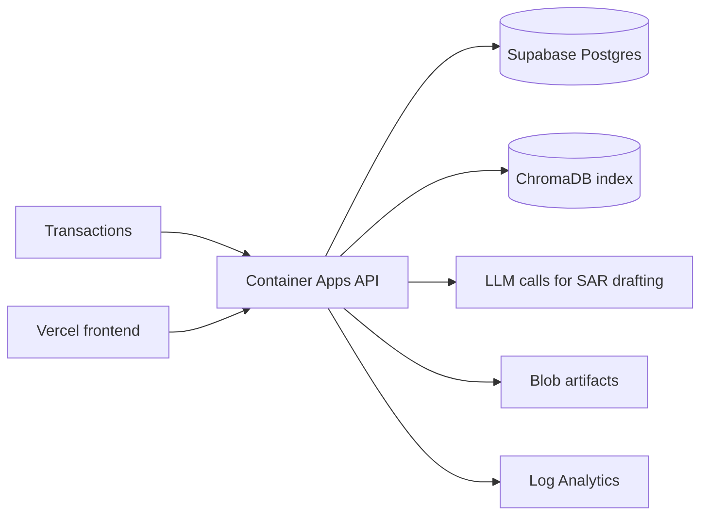

# Cost Reference

FraudLens is designed to stay inexpensive for local development and predictable in deployed
environments. This page tracks cost drivers, controls, and owner actions. Provider prices change;
verify exact numbers in Azure, Vercel, Supabase, Infisical, and LLM-provider calculators before a
real deployment.

## Cost Flow

## Drivers And Controls

| Driver | Cost Risk | Control |
| --- | --- | --- |
| Container Apps API | Idle or over-provisioned compute | Scale-to-zero for non-prod; keep CPU/memory right-sized. |
| Supabase Postgres | Storage growth, long retention | Synthetic data only; retention windows for jobs/inference; indexes scoped to query patterns. |
| Blob artifacts | SAR PDFs and model artifacts | Store generated artifacts only; keep local dev on filesystem backend. |
| Log Analytics | High-volume access/error logs | 30-day retention, daily cap, sampled app logs, no request bodies. |
| LLM SAR drafting | Token usage and retries | Mock mode for `make run`; OpenRouter only for `make run-live`; per-session/day budget guard; cache replay for identical drafts. |
| Vercel frontend | Build/runtime usage | Static Vite SPA; no server-rendered runtime in v1. |
| Dependency/security tooling | CI runtime | Consolidated `make` targets; avoid duplicated gates. |

## Local Development

Local demo cost is intended to be zero beyond the developer machine:

| Component | Local Mode |
| --- | --- |
| Database | Docker Postgres |
| Storage | `.local/artifacts` |
| Jobs | In-process/local backend |
| SAR drafting | Mock drafter, no provider key |
| RAG | Local ChromaDB persistent index |

## Runtime Budget Signals

| Signal | Source | Action |
| --- | --- | --- |
| SAR token/cost totals | `sar_drafts.token_usage`, `sar_drafts.cost_usd` | Alert on daily cost approaching the configured budget. |
| LLM call logs | `fraudlens.llm` structured events | Investigate fallback loops or unexpectedly large prompts. |
| Job counts | `job_executions` | Check repeated retrain/drift jobs before raising schedule frequency. |
| Log volume | Azure Monitor ingestion | Lower sampling or retention before increasing caps. |
| DB storage | Supabase dashboard | Archive synthetic runs or reduce retention windows. |

## Cost Guardrails

- Keep `FRAUDLENS_LLM_MODE=mock` for local demo and tests.
- Keep secrets and provider keys out of local `.env`; `make run-live` requires Infisical and
  `OPENROUTER_API_KEY`.
- Treat `system_config` budget keys as runtime tunables; audit changes via `/api/v1/config`.
- Prefer bounded batch sizes and CSV row caps over unbounded imports.
- Re-run `make deps-audit` after dependency upgrades; security fixes can change transitive cost or
  footprint.

## Paid experiment budget

Release 0.3 has one shared $75 ceiling, enforced by
[`config/experiments/budget.yaml`](../../config/experiments/budget.yaml) and reconciled in the
[`experiment ledger`](experiments/ledger.md). A measured pilot projects remaining work with a 30%
margin; admission fails if the allocation or overall ceiling would be exceeded.

| Allocation | Ceiling | Default path | Current evidence status |
| --- | ---: | --- | --- |
| Azure CPU full-data batch | $15 | E16ads v5 PAYG | Pilots executed; final aggregate/teardown pending |
| GPU benchmark | $25 | RunPod Secure Cloud RTX 4090 | Not created; requires STOP 3 report and approval |
| 100-case application pass | $5 | Same approved GPU session | Not run |
| Supporting resources | $5 | Ephemeral storage/networking | Reconciled per resource session |
| Reserve | $25 | Exceptions only | Unallocated |

Every paid session needs a ledger row before creation, automatic shutdown/watchdog protection,
artifact export before deletion, settled cost, and read-only proof that scoped resources are gone.
Deallocation or a stopped Pod is not teardown because disks/volumes and support resources may bill.

## Pre-Deploy Checklist

| Check | Command Or Owner Action |
| --- | --- |
| API/resource sizing reviewed | Azure calculator using planned Container Apps CPU/memory and scale settings |
| Supabase tier selected | Supabase calculator or dashboard |
| Vercel project limits reviewed | Vercel dashboard |
| LLM provider budget set | Provider dashboard plus FraudLens runtime budget config |
| Log Analytics cap set | Terraform observability module before apply |
| Local checks green | `make pre-pr && make deps-audit` |
