# Runbook — Azure Deploy (fast & reliable)

> **Status: wired, validated, INERT.** The Azure / Vercel / Supabase accounts do not exist yet, so
> the Terraform is `fmt`/`validate`-checked in CI but **never applied**, and the deploy workflows
> only run their cloud jobs when the repo variables `AZURE_DEPLOY_ENABLED` / `VERCEL_DEPLOY_ENABLED`
> are `'true'`. This runbook is the procedure for once the accounts and the Terraform state backend
> exist (Golden Rule 1: no apply/push until then). Rollback lives in
> [`deploy-rollback.md`](deploy-rollback.md).

Implements plan §15 (Terraform & Azure Deployment) and §15.7 (fast & reliable deploy, ADR-013).

## 1. Topology (v1 — single external gateway app)

The gateway edge and the in-process service modules ship as **one Container App** with
`ingress: external` and `allow_insecure_connections = false`. The internal `service_app` split
(`ingress: internal`) is **scaffolded + validated but not applied** (`services_split_enabled =
false`); flipping it true later deploys one internal app per service in the *same* environment with
no code rewrite (ADR-004). Container Apps Jobs run the **retrain cron** + the **on-demand
batch-score** job. State is Supabase Postgres; artifacts/SAR-PDFs are Azure Blob; the ChromaDB index
is **baked into the image**; observability flows to Log Analytics + Application Insights.

```mermaid
flowchart LR
    CI["CI: make ci + build ONE image (SHA)<br/>FROM fraudlens-base + cached layers"] --> PUSH["push thin image to GHCR"]
    PUSH --> INFRA{infra changed?}
    INFRA -->|yes| TF["terraform plan + apply (locked)"]
    INFRA -->|no| REV
    TF --> REV["new Container Apps revision @ 0% traffic"]
    REV --> MIG["migrations: expand/contract, gated, timeout+retry"]
    MIG --> SMOKE["smoke: /healthz + /readyz + pytest -m smoke"]
    SMOKE -->|green| PROMOTE["shift traffic to 100% (zero-downtime)"]
    SMOKE -->|fail| ABORT["auto-abort: previous revision stays @ 100%"]
    PROMOTE --> WATCH["post-deploy alerts"]
    WATCH -.regression.-> ROLLBACK["traffic-shift back + model-pointer rollback (seconds)"]
```



## 2. Fast & reliable deploy (what the workflow does)

| Property | How |
|---|---|
| **Build-once, promote-many** | [`deploy-backend.yml`](../../.github/workflows/deploy-backend.yml) builds **one** image tagged by commit SHA, pushes it to GHCR, and reuses that exact ref through stage → promote (never rebuilt). |
| **Thin, cached builds** | The app image is `FROM fraudlens-base` (the weekly [`build-base.yml`](../../.github/workflows/build-base.yml) prebuilds the xgboost/shap/chromadb/langchain layer); BuildKit + GHCR registry cache + GHA cache mean only changed layers rebuild. |
| **App rollout ≠ infra** | `terraform apply` runs **only when `plan -detailed-exitcode` reports changes**; the common code deploy is a fast `az containerapp update` (a new revision) — seconds, no terraform. |
| **Revision @0% → promote-or-abort** | The new revision is staged at 0% traffic (`--revision-suffix`, Multiple revision mode); gated migration → smoke → promote to 100% only if green, else **auto-abort** (the previous revision keeps serving 100%). |
| **Gated expand/contract migrations** | Alembic `upgrade head` runs as a pre-promote step (own timeout + retry). Migrations are backward-compatible, so old + new revisions coexist during the shift and a failed migration blocks promotion without breaking the live revision. |
| **Cold-start-safe probes** | The gateway `startup_probe` budget (`failure_count_threshold × interval`) **exceeds the ≤75s cold start** so the platform never kills a still-loading ML container; liveness engages only after startup; `/readyz` (DB + ChromaDB + active model + Infisical) gates traffic. |
| **Resilience** | Per-job timeouts, step retries with backoff, `concurrency` that never cancels an in-flight deploy. |

The `tests/integration/test_deploy_flow.py` suite (`pytest -k deploy`) asserts these invariants
against the committed workflow + Terraform files.

## 3. Prebuilt ML base image

`build-base.yml` (weekly + on-demand) builds [`backend/Dockerfile.base`](../../backend/Dockerfile.base)
— python + uv + the heavy ML dependency closure — and pushes `ghcr.io/<owner>/fraudlens-base`.
`backend/Dockerfile` defaults `BASE_IMAGE` to `python:3.11-slim-bookworm` (so `make docker-build`
is self-contained), and the deploy build overrides it to the prebuilt base for seconds-scale builds.

## 4. State backend bootstrap (one-time, out-of-band)

1. Create the state storage out of band (avoids a chicken-and-egg with the config it would manage):
   ```bash
   az group create -n fraudlens-tfstate-rg -l eastus
   az storage account create -n fraudlenstfstate -g fraudlens-tfstate-rg -l eastus \
     --sku Standard_LRS --min-tls-version TLS1_2
   az storage container create -n tfstate --account-name fraudlenstfstate
   ```
2. In each environment, rename `backend.tf.template` → `backend.tf` (keys `dev.terraform.tfstate`,
   `prod.terraform.tfstate`).
3. `terraform -chdir=infra/terraform/environments/<env> init` now configures the azurerm backend.

## 5. GitHub → Azure OIDC (no stored secrets)

The pipeline authenticates with a **federated credential** (no client secret in GitHub):

1. Create an Entra app + service principal; grant Contributor on the subscription (and User Access
   Administrator if it must create role assignments).
2. Add a federated credential trusting this repo's GitHub OIDC token (subject e.g.
   `repo:Kartik-Hirijaganer/FraudLens:ref:refs/heads/release/*` and the `production` environment).
3. Workflows set `permissions: id-token: write`, use `azure/login@v2`, and Terraform's
   `provider "azurerm" { use_oidc = true }` — no secret needed.

**Account ids** (subscription/tenant/client) are non-secret and supplied via `TF_VAR_*` /
`azure/login`. **App + DB secrets** (DATABASE_URL, JWT keys, provider keys) are fetched at runtime
from **Infisical** by the app/Jobs — never Terraform inputs, never baked into the image. See
[`infisical-secrets.md`](infisical-secrets.md).

## 6. Image source — GHCR (default) vs ACR

`acr_enabled = false` (default) → the gateway pulls a **public GHCR** image anonymously (free, no
registry credential). Set `acr_enabled = true` in the env tfvars to provision ACR and pull via the
user-assigned identity's `AcrPull` role instead.

## 7. Enabling deploy (one time)

1. Provision Azure + Vercel + Supabase; bootstrap state (§4) and rename the `backend.tf.template`s.
2. Configure OIDC federation (§5); set repo **variables** (not secrets): `AZURE_CLIENT_ID`,
   `AZURE_TENANT_ID`, `AZURE_SUBSCRIPTION_ID`, `VITE_API_BASE_URL` (HTTPS gateway URL), `FRONTEND_URL`,
   `INFISICAL_PROJECT_SLUG`, `INFISICAL_GITHUB_ACTIONS_IDENTITY_ID`.
3. Flip `AZURE_DEPLOY_ENABLED=true` and/or `VERCEL_DEPLOY_ENABLED=true`.

## 8. Documented switch paths (off by default)

- **Internal service split (ADR-004):** set `services_split_enabled = true` to deploy
  internal-ingress `service_app`s behind the gateway; add APIM Consumption in front for managed
  policies/portal/keys.
- **Azure Database for PostgreSQL (ADR-011):** Supabase is the default; the all-in-Azure Burstable
  alternative is documented as a switch path (not built in v1).
- **Azure Key Vault (ADR-010):** intentionally **not** the app secret store — secrets stay in
  Infisical. No Key Vault module is included by governance.
- **Azure OpenAI (ADR-003):** the compliance-upgrade LLM path, selectable via the LLM catalog config
  with no code change when real PHI is in scope.

## 9. Verification & rollback

- **Smoke** hits the **staged** revision's `/healthz` + `/readyz` and runs `pytest -m smoke` before
  any traffic shift; promotion is conditional on green smoke.
- **Rollback** is a traffic shift back to the prior revision (seconds) + model-registry pointer
  rollback (no redeploy) + Vercel rollback — see [`deploy-rollback.md`](deploy-rollback.md).
