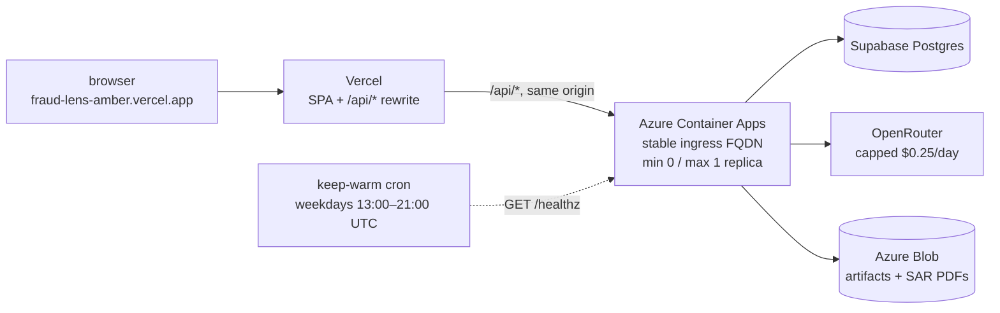

# Runbook — Azure Deploy (fast & reliable)

> **Status: LIVE since 2026-09-16.** The application is deployed and serving at
> [`https://fraud-lens-amber.vercel.app`](https://fraud-lens-amber.vercel.app) — the SPA on Vercel,
> `/api/*` proxied same-origin to the Azure Container App. `AZURE_DEPLOY_ENABLED` and
> `VERCEL_DEPLOY_ENABLED` are `'true'`, so this runbook describes an operating system, not a plan.
> **Deploying is still not automatic:** every Azure job runs under `environment: production`, which
> requires the owner's approval before it starts, and a push or a green CI run alone never deploys.
> Recurring cost is governed by [ADR-029](../architecture/adr/ADR-029-recurring-operational-budget.md)
> and projected in the generated [cost model](../reference/cost-model.md); rollback lives in
> [`deploy-rollback.md`](deploy-rollback.md).

Implements plan §15 (Terraform & Azure Deployment) and §15.7 (fast & reliable deploy, ADR-013).

## 1. Topology (v1 — single external gateway app)

The gateway edge and the in-process service modules ship as **one Container App** with
`ingress: external` and `allow_insecure_connections = false`. The internal `service_app` split
(`ingress: internal`) is **scaffolded + validated but not applied** (`services_split_enabled =
false`); flipping it true later deploys one internal app per service in the *same* environment with
no code rewrite (ADR-004). Container Apps Jobs run retrain and batch-score — both **manual-trigger
only**: a cron schedule is recurring compute the operational budget does not admit (ADR-029). State
is Supabase Postgres; artifacts/SAR-PDFs are Azure Blob; the ChromaDB index is **baked into the
image**; observability flows to Log Analytics + Application Insights. The environment is
**platform-managed** — no custom VNet, and therefore no Standard Load Balancer and no public IP to
pay for; the app makes only outbound calls to public Supabase, OpenRouter, and Infisical endpoints,
so there is nothing a private network would buy.

### The public request path

One hostname reaches the user. `frontend/vercel.json` rewrites `/api/*` to `AZURE_API_ORIGIN` — the
**stable** ingress FQDN — before the SPA fallback, and `frontend/.env.production` pins
`VITE_API_BASE_URL` empty, so the browser never learns the Container Apps hostname. CORS is a
defence-in-depth backstop behind a same-origin request, not the mechanism that makes it work.
Authorization headers and unbuffered SSE streams pass through the rewrite unchanged.



The gateway runtime uses managed identity for both operational backends:

- **Azure Blob artifacts/SAR PDFs:** `FRAUDLENS_AZURE_STORAGE_ACCOUNT_NAME`,
  `FRAUDLENS_AZURE_STORAGE_CONTAINER_NAME`, and
  `FRAUDLENS_AZURE_STORAGE_SAR_PDF_CONTAINER_NAME` are injected by Terraform; the app derives the
  Blob endpoint and requests a `https://storage.azure.com/` token from managed identity.
- **Container Apps Jobs:** `FRAUDLENS_AZURE_SUBSCRIPTION_ID`,
  `FRAUDLENS_AZURE_RESOURCE_GROUP_NAME`,
  `FRAUDLENS_AZURE_CONTAINER_APPS_RETRAIN_JOB_NAME`, and
  `FRAUDLENS_AZURE_CONTAINER_APPS_BATCH_SCORE_JOB_NAME` are injected by Terraform; the app starts
  jobs through ARM with a `https://management.azure.com/` token.

The same managed-identity client id and Blob settings are also injected into the Job containers,
so retrain/batch work can read/write artifacts without stored credentials.



```mermaid
flowchart LR
    CI["CI: make ci + build ONE image (SHA)<br/>FROM fraudlens-base + cached layers"] --> PUSH["push thin image to GHCR"]
    PUSH --> INFRA{infra changed?}
    INFRA -->|yes| TF["terraform plan + apply (locked)"]
    INFRA -->|no| REV
    TF --> REV["new Container Apps revision @ 0% traffic"]
    REV --> MIG["migrations: expand/contract, gated, timeout+retry"]
    MIG --> SMOKE["smoke: /healthz + /readyz + pytest -m smoke"]
    SMOKE -->|green| PROMOTE["shift traffic to 100% (zero-downtime)"]
    SMOKE -->|fail| ABORT["auto-abort: previous revision stays @ 100%"]
    PROMOTE --> WATCH["post-deploy alerts"]
    WATCH -.regression.-> ROLLBACK["traffic-shift back + model-pointer rollback (seconds)"]
```

## 2. Fast & reliable deploy (what the workflow does)

| Property | How |
|---|---|
| **Build-once, promote-many** | [`deploy-backend.yml`](../../.github/workflows/deploy-backend.yml) builds **one** image tagged by commit SHA, pushes it to GHCR, and reuses that exact ref through stage → promote (never rebuilt). |
| **Thin, cached builds** | The app image is `FROM fraudlens-base` (the weekly [`build-base.yml`](../../.github/workflows/build-base.yml) prebuilds the xgboost/shap/chromadb/langchain layer); BuildKit + GHCR registry cache + GHA cache mean only changed layers rebuild. |
| **App rollout ≠ infra** | `terraform apply` runs **only when `plan -detailed-exitcode` reports changes**; the common code deploy is a fast `az containerapp update` (a new revision) — seconds, no terraform. |
| **Revision @0% → promote-or-abort** | The new revision is staged at 0% traffic (`--revision-suffix`, Multiple revision mode); gated migration → smoke → promote to 100% only if green, else **auto-abort** (the previous revision keeps serving 100%). |
| **Gated expand/contract migrations** | Alembic `upgrade head` runs as a pre-promote step (own timeout + retry). Migrations are backward-compatible, so old + new revisions coexist during the shift and a failed migration blocks promotion without breaking the live revision. |
| **Cold-start-safe probes** | The gateway `startup_probe` budget (`failure_count_threshold × interval`) **exceeds the ≤75s cold start** so the platform never kills a still-loading ML container; liveness engages only after startup; `/readyz` (DB + ChromaDB + active model + Infisical) gates traffic. |
| **Resilience** | Per-job timeouts, step retries with backoff, `concurrency` that never cancels an in-flight deploy. |

The `tests/integration/test_deploy_flow.py` suite (`pytest -k deploy`) asserts these invariants
against the committed workflow + Terraform files.

## 3. Prebuilt ML base image

`build-base.yml` (weekly + on-demand) builds [`backend/Dockerfile.base`](../../backend/Dockerfile.base)
— python + uv + the heavy ML dependency closure — and pushes `ghcr.io/<owner>/fraudlens-base`.
`backend/Dockerfile` defaults `BASE_IMAGE` to `python:3.11-slim-bookworm` (so `make docker-build`
is self-contained), and the deploy build overrides it to the prebuilt base for seconds-scale builds.

## 4. State backend bootstrap (one-time, out-of-band) — ✅ DONE 2026-09-13

State storage exists: RG `fraudlens-tfstate-rg` (eastus), storage account `fraudlenstfstate`
(Standard_LRS, TLS1_2 min, public blob access **disabled**, versioning **on**), container
`tfstate` with keys `dev.terraform.tfstate` / `prod.terraform.tfstate`.

```bash
az group create -n fraudlens-tfstate-rg -l eastus
az storage account create -n fraudlenstfstate -g fraudlens-tfstate-rg -l eastus \
  --sku Standard_LRS --min-tls-version TLS1_2 --allow-blob-public-access false --kind StorageV2
az storage account blob-service-properties update -n fraudlenstfstate \
  -g fraudlens-tfstate-rg --enable-versioning true
az storage container create -n tfstate --account-name fraudlenstfstate
```

`backend.tf` is **generated, never renamed** — `backend.tf.template` stays committed, the
deploy job does `cp backend.tf.template backend.tf`, and the generated file is gitignored.
Locally: `cp backend.tf.template backend.tf && terraform init`.

## 5. GitHub → Azure OIDC (no stored secrets) — ✅ DONE 2026-09-13

The pipeline authenticates with a **federated credential** — no client secret in GitHub.
Entra app `fraudlens-github-oidc` holds `Contributor` + `User Access Administrator` at
subscription scope (the latter is needed because the `identity` module creates the
`acr_pull` / `blob_contributor` role assignments).

Registered federated subjects:

| Subject | Why |
|---|---|
| `repo:Kartik-Hirijaganer/FraudLens:environment:production` | all Azure jobs run under `environment: production` |
| `repo:Kartik-Hirijaganer/FraudLens:environment:Production` | the stored GitHub environment is capital-P; the `sub` claim must match exactly |
| `repo:Kartik-Hirijaganer/FraudLens:ref:refs/heads/dev` | deploy triggers on `dev` |
| `repo:Kartik-Hirijaganer/FraudLens:ref:refs/heads/main` | headroom for main-triggered jobs |

> Adding a subject in **zsh**: always brace the variable (`repo:${REPO}:environment:…`).
> Bare `$REPO:e` / `$REPO:r` are zsh *parameter modifiers* and will silently eat the `:e`
> of `:environment` and the `:r` of `:ref`, producing a malformed subject that fails auth
> at runtime with no obvious cause.

Workflows set `permissions: id-token: write`, use `azure/login@v2`, and Terraform's
`provider "azurerm" { use_oidc = true }` — no secret needed.

**Account ids** (subscription/tenant/client) are non-secret and supplied via `TF_VAR_*` /
`azure/login`. **App + DB secrets** (DATABASE_URL, JWT keys, provider keys) are fetched at runtime
from **Infisical** by the app/Jobs — never Terraform inputs, never baked into the image. See
[`infisical-secrets.md`](infisical-secrets.md).

## 6. Image source — GHCR (default) vs ACR

`acr_enabled = false` (default) → the gateway pulls a **public GHCR** image anonymously (free, no
registry credential). Set `acr_enabled = true` in the env tfvars to provision ACR and pull via the
user-assigned identity's `AcrPull` role instead.

## 7. The switches — what is on, and what each one still gates

Every enabling step is complete. The switches stay *on* and the human gate stays *in front of them*:
`environment: production` requires the owner's approval before any Azure job starts, so "enabled"
means "can be approved", never "runs by itself".

| # | Step | State |
|---|---|---|
| 1 | Azure account + state backend (§4) | ✅ 2026-09-13 |
| 2 | OIDC federation (§5) | ✅ 2026-09-13 |
| 2b | Repo **variables** `AZURE_CLIENT_ID`, `AZURE_TENANT_ID`, `AZURE_SUBSCRIPTION_ID` | ✅ set |
| 2c | `FRONTEND_URL`, `INFISICAL_PROJECT_SLUG`, `INFISICAL_GITHUB_ACTIONS_IDENTITY_ID` | ✅ pre-existing |
| 2d | `AZURE_BUDGET_CONTACT_EMAIL`, `AZURE_BUDGET_START_DATE` (`^\d{4}-\d{2}-01T00:00:00Z$`) | ✅ set before the first apply |
| 3 | `Production` environment with the owner as required reviewer | ✅ blocking verified on a dispatched run |
| 4 | `AZURE_DEPLOY_ENABLED=true` | ✅ backend deploys are approvable |
| 5 | `AZURE_API_ORIGIN` = the **stable** ingress origin, then `VERCEL_DEPLOY_ENABLED=true` | ✅ frontend deploys are approvable |
| 6 | `BACKEND_URL` = the same stable origin, then `KEEP_WARM_ENABLED=true` | ✅ cold start measured first (§7.2) |
| — | `AKS_DEPLOY_ENABLED` | ⬜ **stays `false`** except during an approved evidence run ([`aks-deploy.md`](aks-deploy.md)) |

Flipping one back off is a single variable and takes effect on the next dispatch:

```bash
gh variable set AZURE_DEPLOY_ENABLED --body false --repo Kartik-Hirijaganer/FraudLens
```

With a flag `false`, every Azure job in `deploy-backend.yml` / `deploy-frontend.yml` is gated by
`if: ${{ vars.AZURE_DEPLOY_ENABLED == 'true' }}` and skips — nothing runs and nothing new bills,
though the already-deployed app keeps serving. Local development is unaffected either way.

**Steps 5 and 6 take the STABLE ingress origin, never a revision FQDN.** A revision FQDN changes
with every deploy, so the public URL would break on the next promotion (D1). The `promote` job
prints the right value to its run summary; the same value is `app_fqdn` in the Terraform outputs.
Both variables currently hold that stable origin, which is why promoting a new revision does not
touch Vercel.

### 7.1 Which Vercel project is authoritative

The team holds two Vercel projects pointed at this repository's history, and only one of them is
real:

| Project | Root directory | Owns | Git-linked |
|---|---|---|---|
| **`fraud-lens`** (`prj_Pm2dTfz7M8lAZHG3BaVdm2HMDr0C`) | `frontend` | `fraud-lens-amber.vercel.app` — the public URL | **yes** |
| `frontend` (`prj_IUs42n3Kqgg8NnGYGIMO0cxcHzLc`) | *unset* — the repository root | nothing | no — unlinked 2026-09-16 |

The second one was created by accident, exactly as the warning in
[`deploy-frontend.yml`](../../.github/workflows/deploy-frontend.yml) describes: `vercel pull --yes`
with no project link does not fail, it **creates** a project named after the working directory. It
was left Git-connected, so every push rebuilt the repository root — where there is no
`package.json` — and posted a failing `Vercel – frontend` commit status on every pull request
(`vite build` exiting 127). Unlinking it stops the noise without deleting anything.

`VERCEL_ORG_ID` and `VERCEL_PROJECT_ID` are what keep the deploy on the right project. They are
non-secret identifiers, the same posture as the Azure subscription and client ids, and
`deploy-frontend.yml` refuses to run without them — a deploy that silently invents a new project
would leave `FRONTEND_URL` serving the old one with nothing obviously wrong.

### 7.2 The warm window, and why it is a purchase

Step 6 was a decision, not a formality. `min_replicas = 0` is the single largest saving on the
recurring bill, and the thing it costs is the first request after an idle period. That request was
**measured, not estimated**, and the figure lives in the generated
[cost model](../reference/cost-model.md) along with the 5-second threshold and the resulting
verdict — measure it again with two sequential `curl`s after idling past the cooldown, record it in
`config/cost-model.yaml`, and regenerate with `make azure-cost-plan`. No monthly figure is repeated
here: the generated document owns it, and a second copy would go stale the next time a rate or a
region moves.

That end-to-end number is **not** the container's own start-up budget in §2. It measures the whole
scale-from-zero path a visitor experiences — platform scheduling, image pull, container start, then
model and ChromaDB load — while `cold_start_budget_seconds` bounds only the last part, after the
container is running, which is why the startup probe does not trip on a cold visit.

[`keep-warm.yml`](../../.github/workflows/keep-warm.yml) hides that first request across the hours a
visitor would plausibly click — every 4 minutes, weekdays 13:00–21:00 UTC (09:00–17:00 ET) — with
one unauthenticated `GET /healthz`. It holds no cloud identity: no `azure/login`, no OIDC, no
Infisical, no secrets. A warm replica that is not serving bills at the Container Apps *idle* rate,
roughly an eighth of the active one, which is what makes the window far cheaper than a paid
`min_replicas = 1` floor. Below the 5 s threshold the cron buys nothing anyone would notice: unset
`KEEP_WARM_ENABLED` and the compute line leaves the recurring total. Scheduled triggers are
best-effort, so treat the window edges as soft — a missed ping costs one cold start, not money.

The SPA receives **no** absolute API base. `frontend/.env.production` pins `VITE_API_BASE_URL`
empty and `frontend/vercel.json` proxies `/api/*` to `AZURE_API_ORIGIN`, so the browser only ever
sees one hostname and CORS is a backstop rather than the mechanism.

### Runtime secret injection

Container Apps has no secret store of its own, so `deploy-backend.yml`'s `stage` job is the
injection mechanism. It fetches from Infisical `prod` over OIDC (`/backend`, `/llm`, `/`) and
writes **exactly four** values as app-scoped Container Apps secrets, referenced by env vars in the
same update that stamps the image — so the staged revision boots with them and `/readyz` verifies
the injection before any traffic shift:

| Container Apps secret | Injected env var | Infisical path |
| --- | --- | --- |
| `database-url` | `DATABASE_URL` | `/backend` |
| `supabase-service-role-key` | `SUPABASE_SERVICE_ROLE_KEY` | `/backend` |
| `demo-auth-password` | `FRAUDLENS_DEMO_AUTH_PASSWORD` | `/` |
| `openrouter-api-key` | `OPENROUTER_API_KEY` | `/llm` |

`FRAUDLENS_AUTH_JWKS_URL` and `FRAUDLENS_AUTH_JWT_ISSUER` are **derived** from `SUPABASE_URL`
rather than stored a second time. No value reaches Terraform state, tfvars, a job output, or an
artifact, and `ignore_changes = [secret]` on the Container App stops the next apply removing them.

**The ownership boundary is the point.** Terraform owns the app, its scaling, its non-secret
environment, and the secret *reference names*; the deploy job owns the secret *values* and nothing
else. Neither can do the other's half, which is what keeps Golden Rule 3 and ADR-010 true
mechanically rather than by convention. The app never calls Infisical itself — `/readyz`'s
`infisical` probe only verifies the injection landed, and reports a **count**, never a key name.
After rotating a secret in Infisical, re-run the staged deploy so the references are rewritten, and
confirm `/readyz` returns 200 with all five probes `ok` without ever printing a value.

## 8. Documented switch paths (off by default)

- **Internal service split (ADR-004):** set `services_split_enabled = true` to deploy
  internal-ingress `service_app`s behind the gateway; add APIM Consumption in front for managed
  policies/portal/keys.
- **Azure Database for PostgreSQL (ADR-011):** Supabase is the default; the all-in-Azure Burstable
  alternative is documented as a switch path (not built in v1).
- **Azure Key Vault (ADR-010):** intentionally **not** the app secret store — secrets stay in
  Infisical. No Key Vault module is included by governance.
- **Azure OpenAI (ADR-003):** the compliance-upgrade LLM path, selectable via the LLM catalog config
  with no code change when real PHI is in scope.

## 9. Verification & rollback

- **Smoke** hits the **staged** revision's `/healthz` + `/readyz` and runs `pytest -m smoke` before
  any traffic shift; promotion is conditional on green smoke. The suite is **authenticated**: two
  personas are signed in with the public synthetic password, so it exercises real role separation,
  tenant-safe refusals, one live investigation with grounded citations, and the SSE stream. The job
  then reads the revision's own log back and fails on any secret, JWT, PHI, or stack-trace leak.
- **The proxy** is exercised separately: `deploy-frontend.yml` re-runs the same authenticated
  selection against `FRONTEND_URL`, which is the only thing that proves the `/api` rewrite forwards
  an `Authorization` header and an unbuffered event stream.
- **Rollback** is a traffic shift back to the prior revision (seconds) + model-registry pointer
  rollback (no redeploy) + Vercel rollback — see [`deploy-rollback.md`](deploy-rollback.md).

## 10. What bounds the bill

Budgets **alert**; they never stop a resource, and their data lags by hours. The caps are what
actually bind, and they are enforced where the resource is defined — [ADR-029](../architecture/adr/ADR-029-recurring-operational-budget.md)
is the decision record, and the generated [cost model](../reference/cost-model.md) carries the
current numbers and their sources.

| Control | Value | Behavior when reached |
|---|---|---|
| `max_replicas` (`prod.tfvars`) | 1 | The platform cannot schedule a second replica. Load queues; the bill does not scale. |
| `daily_quota_gb` (Log Analytics) | 0.1 GB/day | The workspace **stops ingesting** for the rest of the UTC day rather than billing on. Expect a telemetry gap, not a charge. |
| `llm_daily_budget_usd` (`config/prod.yaml`) | $0.25/day | The investigation path fails closed and returns the standard `{code, message, details, requestId}` envelope — never a raw provider error. |
| Container Apps Jobs | manual trigger only | No schedule exists to fire, so retrain/batch compute is never recurring. |
| `fraudlens-prod-budget` | $25/month, RG-scoped | Email at 50 / 80 / 100% actual and 100% forecast. Alert only. |
| `fraudlens-cost-guardrails-budget` | $25/month, subscription-wide, unfiltered | The only instrument that sees a resource created outside a named resource group. Alert only. |

[`cost-watchdog.yml`](../../.github/workflows/cost-watchdog.yml) runs daily at 13:00 UTC with
read-only `az` calls and **fails the run** — reaching you through ordinary Actions notifications —
when an AKS resource group survives or month-to-date cost passes its threshold. It reports; it never
deletes. Teardown stays an explicitly approved human action (Golden Rule 7).

Verify month-to-date spend yourself at any time:

```bash
az consumption budget list -o table
```

**If a budget alert fires**, read the meters before changing anything: a **Load Balancer** meter
means a custom VNet came back (+~$22/month — check `apps_subnet_prefixes = []` in `prod.tfvars`), an
**Environment Management** meter means a workload-profile environment replaced the Consumption one
(+~$73/month), and an ingestion spike means something is logging in a loop. Each has a different
fix; raising the budget is not one of them.

## 11. Recovery

| Symptom | First check | Action |
|---|---|---|
| Public URL returns the SPA but every `/api` call 404s | `AZURE_API_ORIGIN` points at a **revision** FQDN, not the stable one | Reset it to `app_fqdn` and redeploy the frontend |
| First request takes a minute, later ones are instant | Expected scale-from-zero outside the warm window | Nothing. Widen the window in `keep-warm.yml` only if it matters (§7.2) |
| `/readyz` returns 503 | Which of the five probes is not `ok` — the body names each one | `database`/`supabaseAuth` → upstream; `infisical` → re-run the staged deploy to rewrite secret references; `llmProvider` → check the daily LLM cap before the provider |
| Smoke fails after a deploy | The staged revision is at 0% traffic and the previous one still serves | Nothing is down. Read the smoke log, fix, redeploy — the auto-abort already protected the live revision |
| A bad revision was promoted | Traffic weights on the app | Shift back to the prior revision — seconds, no rebuild ([`deploy-rollback.md`](deploy-rollback.md)) |
| Telemetry stops mid-day | Log Analytics daily quota reached | Expected cap behavior; find what is logging in a loop rather than raising the quota |
| No dashboard data, app healthy | Demo story state | Re-run the portfolio demo bootstrap ([`portfolio-demo.md`](portfolio-demo.md)) |
| Deploy job never starts | `environment: production` approval, then the `*_DEPLOY_ENABLED` flag | Approve the run, or flip the flag (§7). Both are deliberate gates |

Losing the Container App entirely is recoverable and costs no data: state lives in Supabase,
artifacts in Blob, secrets in Infisical, and the image on GHCR. Re-apply the `prod` root, re-run the
staged deploy so secret references are rewritten, confirm `/readyz`, then re-point
`AZURE_API_ORIGIN` and `BACKEND_URL` if the FQDN changed.
