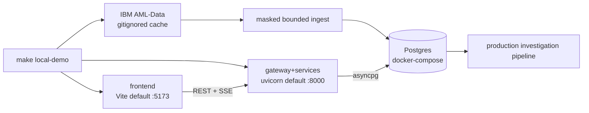

# Local development — one-command demo

> Run the whole application stack locally. The app uses Docker Postgres, local file/job backends,
> and the **keyless mock SAR drafter**; only the idempotent IBM dataset fetch receives the Infisical
> `/ml` Kaggle token, and that token is removed before any other child starts.

## Prerequisites

- **Docker** (daemon running) — for the local Postgres.
- **uv** — Python toolchain / workspace runner (`uv sync --all-packages` once).
- **Node + npm** — for the Vite frontend (`npm --prefix frontend ci` once).
- **Infisical CLI login** — supplies `KAGGLE_API_TOKEN` from `prod` `/ml` when the public IBM file
  is not already cached.

No Azure, Vercel, Supabase, or LLM-provider account is required for the default demo.

## Start it cleanly

Use this as the normal local application command:

```bash
make run
```

`make run` drops the local Postgres volume and generated caches, but preserves the 454 MB
gitignored IBM download. It then verifies/fetches the configured `HI-Small_Trans.csv`, applies
migrations, foundation-seeds identity/config/rules, masks and ingests 300 IBM rows across three
demo tenants, builds RAG, and batch-investigates the primary tenant before starting the servers.
It never falls back to IEEE/sample alerts. Postgres uses port `55432` by default:

```bash
POSTGRES_PORT=5432 make run
```

## Start without reset

```bash
make local-demo
```

This lower-level command keeps existing local data/volumes and idempotently runs
[`scripts/local_demo.py`](../../scripts/local_demo.py), which:

1. verifies/fetches the public IBM file (Infisical `/ml` supplies the credential only here);
2. removes the Kaggle token from the child environment;
3. starts Postgres via [`docker-compose.local.yml`](../../docker-compose.local.yml) and waits
   for its healthcheck;
4. applies migrations and the foundation-only seed;
5. ingests masked IBM rows, builds the regulatory index, and runs batch investigations;
6. starts the gateway+services (`uvicorn`) and the frontend (Vite) with
   `FRAUDLENS_ENVIRONMENT=dev`, local storage/queue backends,
   `FRAUDLENS_LOCAL_JOB_EXECUTE_ON_SUBMIT=true`, and `FRAUDLENS_LLM_MODE=mock`;
7. waits for `GET /healthz`, prints the URL, and blocks until `Ctrl-C`, then shuts the child
   processes down cleanly.

Open the URL printed by the command. Preferred defaults are **http://localhost:5173** for the app
and **http://localhost:8000** for the gateway/API; if another project owns those ports, the script
selects free fallbacks and prints the actual URLs. The runner holds a repository-scoped process
lock: starting a second `run`, `run-live`, or smoke stack fails with a clear instruction instead of
silently creating a second FraudLens URL.



## Running live locally

Use this when you want local dev ergonomics (local filesystem storage and local job runner) while
exercising the real Supabase Auth, real Supabase Postgres, and live OpenRouter SAR drafting path.

### What

`make run-live` starts the backend and Vite frontend without Docker Postgres. It sets:

| Setting | Value |
| --- | --- |
| `FRAUDLENS_ENVIRONMENT` | `dev` |
| `FRAUDLENS_AUTH_DEV_BYPASS` | `false` |
| `VITE_AUTH_DEV_BYPASS` | `false` (live mode never accepts tokenless sessions) |
| `VITE_DEMO_AUTH_ENABLED` | `true` (shows personas backed by real Supabase users) |
| `FRAUDLENS_AUTH_JWKS_URL` | `<SUPABASE_PROJECT_URL>/auth/v1/.well-known/jwks.json` |
| `FRAUDLENS_AUTH_JWT_ISSUER` | `<SUPABASE_PROJECT_URL>/auth/v1` |
| `FRAUDLENS_AUTH_JWT_AUDIENCE` | `authenticated` |
| `FRAUDLENS_AUTH_ROLE_CLAIM` | `user_role` |
| `FRAUDLENS_ALLOW_CANDIDATE_SCORING_IN_DEV` | `true` (non-production fallback only when no active deployment exists) |
| `FRAUDLENS_LLM_MODE` | `live` |
| `FRAUDLENS_STORAGE_BACKEND` / `FRAUDLENS_QUEUE_BACKEND` | `local` |

### Why

This avoids `config/prod.yaml`'s Azure storage and queue settings while proving the live auth,
database, and LLM path before any Azure deployment.

### How

1. In Supabase, enable RSA JWT signing, enable email/password auth, and disable open signup.
2. Apply [`supabase/2026-07-06-auth-claims.sql`](../../supabase/2026-07-06-auth-claims.sql).
   The hook stamps top-level `agency_id` and `user_role` claims from `public.users`.
3. Store secrets in Infisical `prod`:

| Path | Key |
| --- | --- |
| `/backend` | `DATABASE_URL` using the direct/non-pooled connection for migrations, plus `SUPABASE_SERVICE_ROLE_KEY` |
| `/llm` | `OPENROUTER_API_KEY` |
| `/` | `SUPABASE_URL` and publishable `VITE_SUPABASE_ANON_KEY` |

4. Run migrations. `make run-live` then idempotently creates/updates the four synthetic demo
   identities through the server-only Supabase Admin API and mirrors their Auth UUIDs into the
   demo tenant before starting either dev server:

```bash
infisical run --env=prod --path=/ --recursive -- make db-migrate
```

5. Build the live RAG index once, optionally ingest the bounded IBM AML demo rows, then start the
   live-local app:

```bash
make ingest-rag-live
make ingest-aml-demo        # optional: 300 actual IBM AML rows, masked across 3 tenants
make run-live
```

Real users sign in with Supabase email/password. In live mode, the demo persona picker selects one
of the four provisioned Supabase users; it never creates a tokenless session or enables the backend
auth bypass. When the actual-data training gates leave models as candidates and no active deployment
exists, `make run-live` evaluates the newest candidate without promoting it or creating a deployment
row. This fallback is disabled by default and remains inert whenever `FRAUDLENS_ENVIRONMENT=prod`.

## Companion commands

| Command | What it does |
|---|---|
| `make run` | Reset DB/caches, preserve/fetch IBM data, ingest + pipeline-score, then boot. |
| `make run-live` | Boot backend + frontend against real Supabase/Postgres + OpenRouter via Infisical. |
| `make rebuild` | Alias for `make run`. |
| `make local-demo` | Idempotently ingest/score IBM data, boot, and print the URL. |
| `make local-demo-down` | Stop the stack (containers removed, data volume kept). |
| `make local-demo-reset` | Stop, drop the volume, and remove `.local/` including IBM data. |
| `make local-demo-smoke` | Headless gate: boot Postgres + backend, assert `/healthz` + `/readyz`, tear down. |
| `make ingest-aml-demo` | Ingest a bounded actual IBM AML prefix across three synthetic tenants. |

## Configuration & backends

- **Non-secret config** is layered `config/default.yaml → config/dev.yaml → FRAUDLENS_* env`
  (see [`docs/architecture/ARCHITECTURE.md`](../architecture/ARCHITECTURE.md) for the key
  table). Boot-critical edge config (CORS allowlist, rate limits, security headers, gateway
  routes) is loaded at startup and never depends on the database.
- **Backends** are config-driven (`FRAUDLENS_STORAGE_BACKEND`, `FRAUDLENS_QUEUE_BACKEND`):
  `local` uses the filesystem (`.local/artifacts`) and a local job runner. In `make run` /
  `make local-demo`, the Model Admin retrain button executes `uv run python scripts/retrain.py`
  synchronously via `FRAUDLENS_LOCAL_JOB_EXECUTE_ON_SUBMIT=true`, so local browser UAT creates a
  real candidate model instead of only acknowledging a job id. The cloud backends (Azure Blob /
  Container Apps Jobs) activate in production.
- **LLM** runs in `mock` mode locally (`FRAUDLENS_LLM_MODE=mock`) — a deterministic, keyless
  SAR drafter. Live providers are opt-in via Infisical in deployed environments.
- Copy [`.env.example`](../../.env.example) to `.env` to override the non-secret local
  values (ports, Postgres credentials). The demo also works with no `.env`.

## Data lifecycle

| Command | Purpose | Lands in |
|---|---|---|
| `make db-migrate` | Apply Alembic migrations | Phase 2 |
| `make db-seed` | Seed identity/config/rules/model pointer only; no operational evidence | Phase 2 |
| `make import-ieee` | Import the synthetic IEEE-CIS sample | Phase 3 |
| `make ingest-rag` | Build the FinCEN/BSA RAG index | Phase 6 |
| `make train-model` | Train + register an XGBoost model | Phase 5 |
| `make retrain` | Matured reviewed labels → gated candidate model | Phase 10 |

## Troubleshooting

- **Docker not running** → `make local-demo` exits with a clear "missing required tools" /
  daemon error; start Docker and retry.
- **Port already in use** → unset `BACKEND_PORT` / `FRONTEND_PORT` to let the script choose free
  fallbacks, or set `BACKEND_PORT` / `FRONTEND_PORT` / `POSTGRES_PORT` in `.env` explicitly.
- **`/readyz` reports the database as `down`** → Postgres is not up yet or `DATABASE_URL` is
  wrong; `make local-demo-down` then `make local-demo`. With no `DATABASE_URL` the database
  check reports `skipped` (the app still boots).
- **Reset everything** → `make local-demo-reset` (drops the volume and `.local/`).
- **Reset the DB but keep the large IBM download** → `make run`.
- **IBM fetch fails** → authenticate the Infisical CLI and confirm `KAGGLE_API_TOKEN` exists at
  `prod` `/ml`; startup intentionally has no sample-data fallback.
