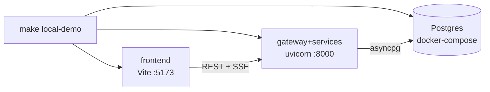

# Local development — one-command demo

> Run the whole stack on your machine with **no cloud and no secrets**. This is the
> primary developer path (plan §3.4); it uses a docker Postgres, local file/job backends,
> and the **keyless mock SAR drafter**, so nothing reaches Azure, Vercel, Supabase, or any
> LLM provider.

## Prerequisites

- **Docker** (daemon running) — for the local Postgres.
- **uv** — Python toolchain / workspace runner (`uv sync --all-packages` once).
- **Node + npm** — for the Vite frontend (`npm --prefix frontend ci` once).

No API keys, Infisical login, or cloud accounts are required for the demo.

## Start it cleanly

Use this as the normal local application command:

```bash
make run
```

`make run` resets the FraudLens local Docker stack, drops the local Postgres volume, clears
generated local caches/state, frees FraudLens-owned dev listeners, re-applies migrations/seed/RAG
indexing, then starts the backend and frontend. It uses `POSTGRES_PORT=55432` by default to avoid
colliding with a local Postgres already bound to `5432`; override it if needed:

```bash
POSTGRES_PORT=5432 make run
```

## Start without reset

```bash
make local-demo
```

This lower-level command keeps existing local data/volumes and runs
[`scripts/local_demo.py`](../../scripts/local_demo.py), which:

1. checks the required tools are on `PATH`;
2. starts Postgres via [`docker-compose.local.yml`](../../docker-compose.local.yml) and waits
   for its healthcheck;
3. applies migrations + seed **when they exist** (they land in Phase 2 and are skipped, not
   failed, until then);
4. starts the gateway+services (`uvicorn` on `:8000`) and the frontend (Vite on `:5173`)
   with `FRAUDLENS_ENVIRONMENT=dev`, local storage/queue backends, and `LLM_MODE=mock`;
5. waits for `GET /healthz`, prints the URL, and blocks until `Ctrl-C`, then shuts the child
   processes down cleanly.

Open **http://localhost:5173** (the gateway/API is at **http://localhost:8000**).



## Companion commands

| Command | What it does |
|---|---|
| `make run` | Clean reset + reseed + boot the full stack. Default app command. |
| `make rebuild` | Alias for `make run`. |
| `make local-demo` | Boot the full stack and print the URL (blocks until `Ctrl-C`). |
| `make local-demo-down` | Stop the stack (containers removed, data volume kept). |
| `make local-demo-reset` | Stop the stack, **drop the volume**, and remove `.local/`. |
| `make local-demo-smoke` | Headless gate: boot Postgres + backend, assert `/healthz` + `/readyz`, tear down. |

## Configuration & backends

- **Non-secret config** is layered `config/default.yaml → config/dev.yaml → FRAUDLENS_* env`
  (see [`docs/architecture/ARCHITECTURE.md`](../architecture/ARCHITECTURE.md) for the key
  table). Boot-critical edge config (CORS allowlist, rate limits, security headers, gateway
  routes) is loaded at startup and never depends on the database.
- **Backends** are config-driven (`FRAUDLENS_STORAGE_BACKEND`, `FRAUDLENS_QUEUE_BACKEND`):
  `local` uses the filesystem (`.local/artifacts`) and an in-process job runner; the cloud
  backends (Azure Blob / Container Apps Jobs) activate in production (Phase 14).
- **LLM** runs in `mock` mode locally (`FRAUDLENS_LLM_MODE=mock`) — a deterministic, keyless
  SAR drafter. Live providers are opt-in via Infisical in deployed environments.
- Copy [`.env.example`](../../.env.example) to `.env` to override the non-secret local
  values (ports, Postgres credentials). The demo also works with no `.env`.

## Data lifecycle (scaffolded; lands in later phases)

These targets wrap the canonical commands; the scripts they invoke arrive with their phases.

| Command | Purpose | Lands in |
|---|---|---|
| `make db-migrate` | Apply Alembic migrations | Phase 2 |
| `make db-seed` | Seed the demo dataset (dev/demo only) | Phase 2 |
| `make import-ieee` | Import the synthetic IEEE-CIS sample | Phase 3 |
| `make ingest-rag` | Build the FinCEN/BSA RAG index | Phase 6 |
| `make train-model` | Train + register an XGBoost model | Phase 5 |

## Troubleshooting

- **Docker not running** → `make local-demo` exits with a clear "missing required tools" /
  daemon error; start Docker and retry.
- **Port already in use** → set `BACKEND_PORT` / `FRONTEND_PORT` / `POSTGRES_PORT` in `.env`.
- **`/readyz` reports the database as `down`** → Postgres is not up yet or `DATABASE_URL` is
  wrong; `make local-demo-down` then `make local-demo`. With no `DATABASE_URL` the database
  check reports `skipped` (the app still boots).
- **Reset everything** → `make local-demo-reset` (drops the volume and `.local/`).
