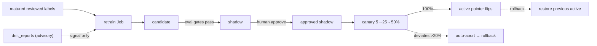

# Model lifecycle — scoring, SHAP & the promotion gates

> How FraudLens trains, scores, explains, and (quantitatively) gates the XGBoost fraud
> model. The foundation plan's Phase 5 ships **scoring + SHAP + the active-pointer registry
> resolution + the
> §10.5.1 promotion gates**; Phase 10 adds the **human-gated MLOps workflow** —
> retrain → candidate → shadow → approve → canary → active → rollback, advisory drift, and
> tenant-safe training — all with **no redeploy**. See plan
> [§10.5 / §10.5.1](../../plans/2026-06-12-aml-fraud-detection-system.md) and
> [§9.2 / §9.4](../../plans/2026-06-12-aml-fraud-detection-system.md) (model-lifecycle tables + tenant-safe policy).

## The pieces

| Piece | Where | Role |
|---|---|---|
| Feature extraction | [`fraudlens_ml/scoring/features.py`](../../packages/fraudlens-ml/src/fraudlens_ml/scoring/features.py) | Deterministic, PHI-free `RuleContext` → fixed-order feature vector (the single `FEATURE_NAMES` source of truth). |
| Scorer | [`scoring/scorer.py`](../../packages/fraudlens-ml/src/fraudlens_ml/scoring/scorer.py) | Loads the active model via the pointer, predicts the raw margin, applies the Platt calibration → `fraud_probability ∈ [0,1]`. |
| Explainer | [`scoring/explainer.py`](../../packages/fraudlens-ml/src/fraudlens_ml/scoring/explainer.py) | SHAP `TreeExplainer` (cached background) → per-feature contributions, **exactly additive** to the margin; cached per version (sub-ms warm). |
| Artifacts + cache | [`scoring/artifacts.py`](../../packages/fraudlens-ml/src/fraudlens_ml/scoring/artifacts.py) | Bundle = booster + metadata (feature spec, calibration, SHAP background, checksum). `ModelCache` resolves the registry pointer, reloads on a flip, and serves the **last-known-good** model if the active artifact is missing/corrupt. |
| Promotion gates | [`scoring/gates.py`](../../packages/fraudlens-ml/src/fraudlens_ml/scoring/gates.py) | The §10.5.1 metrics + pass/fail logic (incl. the per-tenant slice gate), reused by training (Phase 5) and retrain (Phase 10). |
| Canary router | [`scoring/router.py`](../../packages/fraudlens-ml/src/fraudlens_ml/scoring/router.py) | Deterministic active-vs-canary split by routing key; wired into the pipeline in [`pipeline_wiring.resolve_scoring_pointer`](../../backend/src/fraudlens_backend/pipeline_wiring.py) (Phase 10). |
| Lifecycle repo | [`db/repositories/model_lifecycle.py`](../../backend/src/fraudlens_backend/db/repositories/model_lifecycle.py) | The platform lifecycle WRITES (shadow/approve/canary/activate/rollback) + matured-label counting + canary inference stats. |
| Lifecycle API | [`api/v1/model_lifecycle.py`](../../backend/src/fraudlens_backend/api/v1/model_lifecycle.py) | Admin (RBAC) endpoints 19-26: retrain trigger, training-runs, shadow/approve/canary, rollback, canary-evaluate, drift-reports. |
| Training | [`scripts/train_model.py`](../../scripts/train_model.py), [`scripts/train_baseline.py`](../../scripts/train_baseline.py) | Train + calibrate + gate the XGBoost candidate (and the LR baseline it must beat). |
| Retrain / drift Jobs | [`scripts/retrain.py`](../../scripts/retrain.py), [`scripts/drift_scan.py`](../../scripts/drift_scan.py) | The scheduled/manual retrain Job (matured labels → candidate) and the advisory drift scan. |

## How scoring resolves the model

The model registry is **global** (one shared registry; models are not tenant-scoped — labels
and inference logs are, per ADR-015). The backend reads `model_deployments` + `model_versions`
via [`ModelRegistryRepository.build_pointer`](../../backend/src/fraudlens_backend/db/repositories/model_registry.py)
and hands the scorer a `DeploymentPointer` (active version + uri, plus the previous active as
the last-known-good fallback). The `ModelCache` lazily loads + caches by version label and
**reloads on a pointer flip** — so promoting or rolling back a model needs **no redeploy**
(plan §10.5). If the active artifact fails its checksum or is missing, the cache falls back to
the previous version; if neither loads it raises, so `/readyz` can fail closed (plan §10.6).

`GET /api/v1/model-versions` exposes the registry (and which version is active) read-only.

## The promotion gates (§10.5.1)

Promotion is human-gated **and** quantitatively gated, so approval is testable, not
subjective. Thresholds live in `system_config.modelGates` (the seeded defaults are the
canonical `ModelGates` defaults below). A candidate must clear **all** applicable gates:

| Gate | Default | Meaning |
|---|---|---|
| `pr_auc_floor` | ≥ `min(0.45, 150 × base rate)` | PR-AUC floor. The absolute `0.45` bar was calibrated for the synthetic ~3.5% base rate and stays binding there; at rare-event base rates the `prAucLiftMin` (`150×`) cap keeps an equivalent-strength, attainable bar (PR-AUC is base-rate-dependent). |
| `no_active_regression` | ≥ active − `0.02` | No material PR-AUC regression vs the current active model (skipped when there is no active model). |
| `beats_baseline` | ≥ baseline + `0.02` | Beats the logistic-regression baseline on PR-AUC by a margin. |
| `recall_at_budget` | ≥ `0.60` | Recall when flagging the top `alertBudgetFraction` (`0.05`) of scored volume (base-rate-robust; unchanged for rare events). |
| `precision_at_top_pct` | ≥ `min(0.20, 20 × base rate)` | Precision within the top `topPctFraction` (top 1%). At a 0.1% base rate the absolute `0.20` is **mathematically unattainable** (positives are scarcer than 20% of the slice — max ≈ base rate ÷ fraction), so the `precisionLiftMin` (`20×`) cap applies instead. |
| `calibration_ece` | ≤ `0.05` | Expected calibration error (Brier tracked alongside) so `fraud_probability` is meaningful for banding. |

The effective thresholds are reported per gate check, so an evaluation row always shows the
bar the candidate was actually held to. `mediumReviewFraction` (`0.15`) is not a gate — it is
the scored-volume fraction whose holdout quantile anchors the MEDIUM risk operating point
(below).

### Per-model risk operating points

A calibrated rare-event probability never approaches the fixed `0.30/0.60/0.85` risk bands,
so each rare-event model version persists `ModelRiskThresholds` — the holdout score quantiles
at the gates' own capacity fractions (`mediumReviewFraction`, `alertBudgetFraction`,
`topPctFraction`). At scoring time the risk step normalizes the raw probability through a
monotone piecewise-linear map anchored so a score AT an operating point (with zero rule hits)
lands exactly on that band's lower bound; rules still add on top through the unchanged convex
blend, and CRITICAL deliberately requires rule corroboration at the default blend weight. The
raw calibrated probability is persisted unmodified in `analysis_results.fraud_probability`
(honesty); only the banding normalizes. Legacy artifacts (and the synthetic fixture) carry no
thresholds and keep the identity behavior.

The **per-tenant slice gate** (`tenant_slice_max_regression`, default `0.05`) — no per-tenant
evaluation slice may regress more than that below the active model (§9.4) — and the **canary
auto-abort rule** are part of the same gate family, enforced by the Phase 10 retrain/eval +
canary flow. All thresholds are documented defaults and configurable via
`system_config.modelGates`; the retrain eligibility + canary-guard knobs are `FRAUDLENS_RETRAIN_*`
/ `FRAUDLENS_CANARY_GUARD_*` settings.

### The portfolio demo pins one model version

The portfolio demo story ([`config/portfolio-demo.yaml`](../../config/portfolio-demo.yaml)) declares
a `model.version_label` and `model.feature_spec_version`, because its pinned band distribution is
only meaningful against the bundle it was calibrated on — a different bundle has different calibrated
probabilities and its own `ModelRiskThresholds`, which is precisely the map from model score onto the
band scale described above.

`make activate-model` is unaffected and stays generic: it discovers the best gates-passed local bundle
and promotes it, knowing nothing about the demo. The **bootstrap** is the piece that cares, and it
resolves a four-way model state rather than assuming one:

| State found | What the bootstrap does |
|---|---|
| The configured version is already active | Verify provenance and continue |
| No active model | Register the configured bundle and promote it |
| The seed's fixture pointer is active | Promote the configured bundle, with an audit row |
| A different non-fixture model is active | **Fail** — a demo scored by an unpinned model is not the pinned story |

The fixture label itself lives in `db/repositories/model_registry.FIXTURE_MODEL_LABEL`, imported by
both the seed and the bootstrap so the two can never disagree. Re-pinning `model.version_label` is a
Tier-3 change: it requires re-running `make portfolio-demo-probe` and pinning a new `expected:` block
by hand (see [portfolio-demo.md](portfolio-demo.md)).

## Dataset strategy

FraudLens separates demo input data from the active model lifecycle. The default local application
ingests a bounded partition of the full public IBM AML-Data file and scores it through the normal
pipeline. CI, tests, retraining, and the committed active `v0-fixture` remain reproducible synthetic
model artifacts until a human promotes a passing IBM-trained candidate.

| Source | Role | Split | License / provenance | Deployment posture |
|---|---|---|---|---|
| `synthetic` | Default for `make train-model`, CI, tests, LR baseline, retrain, and `v0-fixture` | Seeded random | Project-generated, PHI-free | The only committed and served fixture |
| `ibm-aml` | Default local-demo input and primary public AML training source (`HI-Small_Trans.csv`) | Chronological, whole accounts kept together | IBM-generated synthetic public data, CDLA-Sharing-1.0; hash/row count/schema/source/transform recorded | Masked bounded demo rows; training produces candidate artifact only |
| `ieee-cis` | Optional secondary card/e-commerce fraud track | Chronological, whole cards kept together | Kaggle Competition Rules; locally supplied file provenance recorded | Local/offline input; candidate artifact only |

Raw public data stays under gitignored `.local/aml_data/` and is never committed, copied into
an image, or written to the database. Only the fixed numeric features plus the label leave
the loader. Bank/account/card identifiers exist transiently for per-account window grouping and
are then discarded. The global training manifest is PHI-free and contains no raw identifiers or
`agency_id`.

**Feature space v2 (19 features).** The v1 ten features are extended with direction-split flow
(`inbound_velocity_24h`, `inbound_amount_24h_log`), burstiness (`seconds_since_prev_txn_log`),
structuring share (`round_amount_share_24h`, `distinct_channels_24h`), and counterparty
fan-in/pass-through signals from the destination account's window (`dest_fan_in_24h`,
`dest_inbound_amount_24h_log`, `dest_outbound_velocity_24h`, `dest_outbound_amount_24h_log`).
Every one is computed at inference from the SAME windowed `same_account_history` queries
(origin + destination, `RuleContext.counterparty_history`) with the SAME
`investigation_history_max` most-recent cap the offline builder mirrors — the anti-skew tests
pin per-row equality. Old 10-feature artifacts keep scoring: the scorer orders vectors by the
LOADED artifact's persisted spec. On the full IBM HI-Small split, v2 features + swept
rare-event hyperparameters lift holdout PR-AUC from 0.108 (v1 candidate) to ≈0.26 (~160× mean
lift), clearing every gate.

### Canonical dataset mapping

The scorer's `FEATURE_NAMES` contract dictates the transformation: no one-hot encoding, learned
category encoding, or training-only feature is allowed. Both training and ingestion use
[`scripts/lib/aml_mapping.py`](../../scripts/lib/aml_mapping.py), then apply the scorer's actual
`channel_risk` and `country_risk` functions.

| IBM AML-Data `Payment Format` | Canonical channel |
|---|---|
| `ACH` | `ach` |
| `Wire` | `wire` |
| `Cash` | `cash` |
| `Credit Card` | `card` |
| `Bitcoin` | `crypto` |
| `Cheque`, `Reinvestment`, blank, or unknown | `other` (scorer default risk) |

IBM AML-Data has currency but no country field, so currency is an explicit country proxy:

| Payment currency | Country proxy |
|---|---|
| US Dollar / Euro / UK Pound | `US` / `DE` / `GB` |
| Canadian Dollar / Australian Dollar | `CA` / `AU` |
| Brazil Real / Mexican Peso | `BR` / `MX` |
| Ruble / Yuan / Yen / Rupee | `RU` / `CN` / `JP` / `IN` |
| Swiss Franc / Saudi Riyal / Shekel | `CH` / `SA` / `IL` |
| Bitcoin, blank, or unknown | `ZZ` (scorer default risk) |

| IEEE-CIS field | Canonical proxy |
|---|---|
| `ProductCD=W` or `C` | channel `card` |
| `ProductCD=R` / `H` / `S` | channel `ach` / `wire` / `cash` |
| Unknown `ProductCD` | channel `other` |
| `addr2=87`, blank, or unknown | country `US` (documented US-centric default) |
| `TransactionDT` | UTC timestamp relative to `2017-12-01T00:00:00Z` |

For IBM, `From Bank + Account` is the transient 24-hour window key; IEEE uses `card1`.
Training rows represent the outbound transaction under review, matching the live scorer. Real
sources are ordered by each account's earliest transaction and assigned as whole accounts to
train, calibration, then holdout. This chronological split prevents future leakage and keeps
rare laundering/card subgraphs intact. Synthetic data intentionally retains its seeded random
split for hermetic reproducibility.

## Fetch, train, and register

The normal path remains synthetic:

```bash
make train-model            # synthetic; train, gate, and register a CANDIDATE (needs a DB)
```

For the primary public AML path, first fetch exactly the configured `HI-Small_Trans.csv` file,
then train it. Both commands are refused when `environment == "prod"`:

```bash
make fetch-data             # /ml supplies KAGGLE_API_TOKEN; writes .local/aml_data/ only
make ingest-aml-demo        # masks + partitions a bounded prefix across three demo agencies
make train-aml-sample       # fast 50k-row real-data candidate smoke (configurable)
make train-aml              # recursive / supplies DATABASE_URL and /ml configuration
```

`make fetch-data` never downloads the full multi-variant Kaggle bundle. Training never
auto-downloads: a missing file fails fast. `make train-aml` builds a chronological split,
SMOTE-resamples only the training fold, fits XGBoost, **Platt-calibrates** on the calibration
fold, and evaluates the unchanged §10.5.1 gates on holdout. The same-source LR baseline is used
for comparison. The versioned dataset manifest records source, license, per-file hash and row
count, consumed schema, dataset version (`slug:variant`), and deterministic transform id without
raw data.

`make ingest-aml-demo` is the interactive investigation path rather than a training shortcut. It
defaults to 1600 case-pack rows (`AML_DEMO_ROWS=<n>` overrides it), hashes deterministic external
ids, and persists through the same canonical masking repository as API uploads. The **case pack**
replaces the old CSV prefix (whose first 300 rows contained zero laundering context): anchor
accounts are the earliest distinct laundering senders, each contributing its complete
account/time neighborhood (sender and receiver legs, ±3 days, capped) with a 60/20/20 tenant
spread favoring the primary demo agency, plus benign stride-sampled controls across the whole
file. Each neighborhood stays inside ONE tenant so served history windows match training
windows. The public dataset label steers offline selection only — it is never persisted and
never converted into an alert. `make train-aml-sample` uses 50,000 actual rows by default
(`AML_SAMPLE_ROWS=<n>` overrides it) as a mechanical end-to-end candidate-registration smoke —
note its metrics are structurally pessimistic because random row sampling shreds the per-account
windows; the full `make train-aml` remains the honest release-candidate path.

`make run` performs fetch → foundation seed → **model activation** (`make activate-model`:
register + promote the best gates-PASSED local bundle through the real
shadow→approve→activate chain; the seeded fixture stays active when none exists — a
gates-failed candidate is never promoted) → case-pack ingest → RAG build → batch scoring
automatically. The seed does not create transactions, labels, analysis runs, alerts, actions, or
SARs. A low-scoring IBM row remains a completed no-alert investigation; it is not inserted into the
Alerts queue merely to make the demo look populated.

Both training commands persist an artifact bundle and register a `CANDIDATE` `model_versions` row, a
`model_evaluations` gate verdict, and a `job_executions(train)` row. Registration is idempotent
by source-tagged version label. A failed gate is reported honestly: committed thresholds are not
lowered, and the candidate is never promoted automatically. Training does **not** touch the
active pointer; promotion remains human-gated.

The committed local-demo fixture model (`data/models/v0-fixture/`, the seed's ACTIVE pointer)
is always regenerated from synthetic data, even if real data exists locally:

```bash
uv run python scripts/train_model.py --fixture
```

Inspect the LR baseline a candidate must beat:

```bash
uv run python scripts/train_baseline.py
```

## Live LLM SAR verification

Live SAR drafting is opt-in and routes both the primary model and fallback through OpenRouter.
Normal CI excludes the registered `llm_live` marker and needs no provider credentials. Run the
real-provider E2E explicitly with the `/llm` Infisical path:

```bash
infisical run --env=prod --path=/llm -- uv run pytest -m llm_live
```

The test uses the model selected by `config/llm/sar.yml` and a synthetic, PHI-free `SarInput`. It
asserts schema parsing, citation grounding (fabricated ids cannot survive), prompt provenance,
token usage, estimated USD cost, and terminal failure behavior for a forced provider error. One
run should cost well under a few cents with the configured model; verify the reported usage/cost
rather than assuming a fixed amount because provider tokenization can change.

The live path uses OpenRouter's native token stream between the provider and the backend. Raw
chunks are assembled server-side. The complete JSON must then pass schema validation, citation
grounding, output-policy/phishing scans, and sanitization before any narrative is emitted to the
analyst. Browser-facing SAR deltas therefore start only after validation and contain the safe
rendered narrative—not raw partial JSON. The mock drafter remains deterministic, keyless, and the
default for `make run`, tests, and CI.

## The human-gated lifecycle (Phase 10)

Everything below is **admin-only** (the JWT `role` claim must be `admin`; a non-admin gets
`admin_role_required`, 403) and changes the active/canary pointer **in place** — running
processes pick up the new model on the next investigation with **no redeploy** (the scorer's
cache keys by version label).



### 1 · Retrain → candidate

```bash
make retrain                # scripts/retrain.py: matured labels → a gated CANDIDATE (needs a DB)
```

Eligibility is gated first: only **matured** (`matured_at <= now`) reviewed `training_labels`
count, and they must clear the total + per-class thresholds (`FRAUDLENS_RETRAIN_MIN_LABELS_TOTAL`
= 10, `FRAUDLENS_RETRAIN_MIN_LABELS_PER_CLASS` = 2) — else `insufficient_matured_labels` (422 at
the API). The candidate trains on the same deterministic synthetic dataset as Phase 5 (labelled
real volume is tiny in a demo), is gated against the §10.5.1 metrics **+ the active model (no
regression) + the per-tenant slice gate**, and is recorded as a `CANDIDATE` `model_versions` row
with overall + per-slice metrics in `model_evaluations`. **It never touches the active pointer.**
The API trigger submits the Job through the config-driven backend and acknowledges 202. Plain
`queue_backend=local` returns a local job id only; `make run` / `make local-demo` also sets
`FRAUDLENS_LOCAL_JOB_EXECUTE_ON_SUBMIT=true`, so the Model Admin retrain button executes
`uv run python scripts/retrain.py` synchronously and creates a real local candidate for browser
UAT. In production, the same trigger starts the configured Container Apps Job through Azure ARM
using managed identity. The retrain Job also accepts `--trigger scheduled`; the **monthly** cron
that fires it is the Container Apps Jobs schedule wired with the deploy IaC.

The `make local-demo` seed ships a balanced set of **pre-matured** labels, so `make retrain` and
the Model Admin retrain button are eligible immediately for the demo.

### 2 · Shadow → approve → canary → active

| Step | API (admin) | Effect |
|---|---|---|
| Promote to shadow | `POST /api/v1/model-versions/{id}/shadow` | candidate → `shadow` (only with a **passing evaluation**). |
| Human approve | `POST /api/v1/model-versions/{id}/approve` | stamps `approved_by`/`approved_at` (the human gate). |
| Canary ramp | `POST /api/v1/model-versions/{id}/canary` `{percent: 5\|25\|50}` | `shadow` → `canary`; the deployment points a % of traffic at it. |
| Promote to active | `POST .../canary` `{percent: 100}` | flips the active pointer; the outgoing active is archived + retained as `previous_active` for rollback. |
| Rollback | `POST /api/v1/model-deployment/rollback` | aborts an in-progress canary, else restores the previous active. |
| Canary auto-abort | `POST /api/v1/model-deployment/canary/evaluate` | if the canary's mean score deviates `> FRAUDLENS_CANARY_GUARD_MAX_DEVIATION` (0.20) from active over `≥ FRAUDLENS_CANARY_GUARD_MIN_SAMPLES` (20) per arm → auto-rollback. |

During a canary, `resolve_scoring_pointer` routes each transaction to the active or canary model
by a **stable hash of the transaction id** (so re-runs/replays route identically), and the
hash-only `model_inference_logs` record which arm scored (`was_canary`) — that is how the
auto-abort guard compares the two arms ("canary logs both models").

### 3 · Advisory drift

```bash
make drift-scan             # scripts/drift_scan.py: PSI of the active model's recent scores
```

Drift is **advisory only** (`drift_reports.advisory = true` always) — it never gates serving or
rolls back on its own. It computes the Population Stability Index of the active model's recent
inference probabilities vs an earlier window (inference logs are hash-only, so this is **score**
drift), classifies a severity band, and records a `drift_reports` row. `GET /api/v1/drift-reports`
lists them; a human decides whether to retrain.

### Tenant-safe training (ADR-015)

Models are **global**; labels and inference logs are **tenant-scoped**. Training never leaks one
tenant into another: the `training_datasets` manifest holds only the feature spec + counts + a
content hash (**no PHI, no raw ids, no `agency_id`**), `model_inference_logs` are hash-only, and
`model_evaluations` records **per-tenant slice** metrics so a candidate that is good on average
but harmful for one agency is rejected by the per-tenant slice gate.

## Graph-feature tenant-isolation study (offline only; ADR-017)

A separate offline study measures IBM Snap ML `GraphFeaturePreprocessor` (GFP) multi-hop
graph features against the served 19-feature model, and how much of any lift changes when the
graph is restricted to the transaction-owner tenant. Its serving boundary is fixed by
[ADR-017](../architecture/adr/ADR-017-graph-feature-serving-boundary.md): **GFP features are
measured offline and never served** in either scope. Nothing here changes the shipped pipeline
— the scored vector stays exactly the 19 `FEATURE_NAMES`, `RuleContext` carries no node/edge
identifiers, and none of `scripts/lib/gfp/` (nor the `snapml` engine, the pure reference engine,
or the research-page visual) is imported by `backend`/`fraudlens_ml`/`fraudlens_core` or reaches
live scoring.

**Offline-only flow.** All graph code lives in `scripts/lib/gfp/` (outside the runtime
packages); `snapml` lives only in the root benchmark-only `gfp` dependency group (never in
default sync, CI installs, or the deploy image). The benchmark refuses `environment == "prod"`,
opens no DB connection, and never writes the model registry, activates a pointer, or touches
artifact dirs. Run output stays under gitignored `.local/gfp-study/<run-id>/`; only the
aggregated, opaque, PHI-free report is promoted to the committed artifacts by an explicit
`publish` step.

```text
fetch-gfp-data ─▶ gfp-benchmark (snapml) ─▶ .local/gfp-study/<run-id>/study.json + motifs.json
                                                     │  (validate: snapml engine, complete grid,
                                                     ▼   three motifs, redaction)
                              gfp-publish GFP_RUN=<run-id>
                                     │
      ┌──────────────────────────────┴───────────────────────────────┐
      ▼                                                                ▼
docs/reference/benchmarks/gfp-tenant-isolation-study.{json,md}   frontend/src/data/
  (committed report; A/B/C × scope, signed isolation delta)      gfp-tenant-isolation-study.json
                                                                 (curated motifs; embeds report hash)
```

**Datasets & sampling** (frozen in `config/gfp-benchmark.yaml`; node-induced subgraphs preserve
retained topology rather than random row sampling, which would destroy cycles/paths):

| Dataset | Graph context | Targets | Purpose |
|---|---|---|---|
| HI-Small (`ibm-aml`) | every servable row | all | primary full-data result |
| HI-Medium (`ibm-aml-hi-medium`) | label-blind node-induced subgraph | ≤1,000,000 stratified | scale / base-rate replication |
| LI-Medium (`ibm-aml-li-medium`) | label-blind node-induced subgraph | ≤1,000,000 stratified | illicit-ratio comparison (HI≈0.1% vs LI≈0.05%) |

Tenant ownership uses the study's own offline partitions (`RESEARCH_PARTITIONS` in
`scripts/lib/gfp/partitions.py` + `demo_agency_index` — the same mapping as `map_ibm_demo_row`).
These are analysis partitions, never runtime tenants, and are an **experimental proxy, not a
claim about real legal ownership**. Arms: **A** = the 19 `FEATURE_NAMES`; **B** = A + GFP
fan/degree/vertex features; **C** = B + scatter-gather + temporal/simple-cycle features. The
signed `isolationDelta = globalMetric − perTenantMetric` is reported (called "cost of isolation"
only when positive). See the published report for the actual numbers.

**Reproduction commands** (local, non-production; on Apple Silicon the snapml commands run inside
a throwaway pinned Python-3.11 x86-64 container via `make gfp-container`, since snapml ships no
arm64-mac wheel):

```bash
make fetch-gfp-data          # Infisical-backed Kaggle; one file at a time (never auto-downloads)
make gfp-reference-test      # portable reference/fake engines, ≥90% branch coverage on scripts/lib/gfp
make gfp-test                # real snapml adapter parity (x86-64; FAILS if snapml absent, never skips)
make gfp-benchmark           # full three-dataset snapml study -> .local/gfp-study/<run-id>/
make gfp-publish GFP_RUN=<run-id>   # validate completeness/redaction, then write the committed artifacts
# arm64 host: wrap the x86-64 steps, e.g.
make gfp-container CMD='make gfp-benchmark'
```

**Resource budget (measured).** The `ibm-aml` full-context arm (~5.05M edges, every servable
row a target) peaks at roughly **20 GiB RAM** while materializing the two scope feature matrices
and training the paired XGBoost arms — so the full three-dataset run needs a native x86-64 host
with ≥24 GiB (or ≥32 GiB with headroom); an emulated arm64/QEMU VM at 16–20 GiB OOM-kills on
this arm. The node-induced Medium arms (≤1M targets over ~2.3–2.6M context edges) are lighter.
On an 8-vCPU x86-64 host the full run completes in roughly an hour. If a host cannot hold the
full HI-Small graph, node-sample it too (`graph_context: node_induced`) and record the deviation.

**Limitations (reported, not hidden).** Node-induced Medium samples omit paths crossing
discarded nodes, biasing graph-pattern counts downward. GFP's per-batch transform is
paper-aligned batch-causal, **not** strict row-at-a-time serving parity — the anti-skew evidence
covers only Arm A's 19 served features. A static artifact behind login is not confidentiality
authorization; it is safe only because the data is public-synthetic, aggregated, and opaque. If
the isolation delta is zero or negative, that is a valid result — only explanatory copy changes,
never the protocol, metrics, or the ADR's operational rationale.

## Why synthetic remains the default

FraudLens uses **no real PHI** anywhere. The synthetic generator is deterministic, PHI-free,
and small enough for CI; it keeps tests, the served demo model, baseline comparisons, and
retraining reproducible without credentials or a multi-gigabyte download. Public AML data adds
an honest local benchmarking and candidate-training path without changing shipped behavior.

## Tests

`pytest -k "scoring or train_model or model_versions or model_registry"` covers feature
determinism, probability bounds, SHAP additivity, the quantitative gates (on a holdout),
artifact load/checksum/cache + last-known-good fallback, canary routing, the registry API, and
that a freshly trained candidate clears every gate and reproduces the committed fixture.

`pytest -k "model_lifecycle or retrain or drift_scan or canary_routing"` covers the Phase 10
lifecycle: admin RBAC, the candidate→shadow→approve→canary→activate state machine (illegal
transitions → 409), 100%→active pointer flip + rollback, the canary auto-abort guard, retrain
eligibility (immature labels excluded) + candidate-only registration + the per-tenant slice gate,
tenant-safe manifests, the in-process canary routing, and the advisory drift scan.
