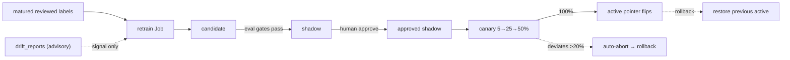

# Model lifecycle — scoring, SHAP & the promotion gates

> How FraudLens trains, scores, explains, and (quantitatively) gates the XGBoost fraud
> model. Phase 5 ships **scoring + SHAP + the active-pointer registry resolution + the
> §10.5.1 promotion gates**; Phase 10 adds the **human-gated MLOps workflow** —
> retrain → candidate → shadow → approve → canary → active → rollback, advisory drift, and
> tenant-safe training — all with **no redeploy**. See plan
> [§10.5 / §10.5.1](../../plans/2026-06-12-aml-fraud-detection-system.md) and
> [§9.2 / §9.4](../../plans/2026-06-12-aml-fraud-detection-system.md) (model-lifecycle tables + tenant-safe policy).

## The pieces

| Piece | Where | Role |
|---|---|---|
| Feature extraction | [`fraudlens_ml/scoring/features.py`](../../packages/fraudlens-ml/src/fraudlens_ml/scoring/features.py) | Deterministic, PHI-free `RuleContext` → fixed-order feature vector (the single `FEATURE_NAMES` source of truth). |
| Scorer | [`scoring/scorer.py`](../../packages/fraudlens-ml/src/fraudlens_ml/scoring/scorer.py) | Loads the active model via the pointer, predicts the raw margin, applies the Platt calibration → `fraud_probability ∈ [0,1]`. |
| Explainer | [`scoring/explainer.py`](../../packages/fraudlens-ml/src/fraudlens_ml/scoring/explainer.py) | SHAP `TreeExplainer` (cached background) → per-feature contributions, **exactly additive** to the margin; cached per version (sub-ms warm). |
| Artifacts + cache | [`scoring/artifacts.py`](../../packages/fraudlens-ml/src/fraudlens_ml/scoring/artifacts.py) | Bundle = booster + metadata (feature spec, calibration, SHAP background, checksum). `ModelCache` resolves the registry pointer, reloads on a flip, and serves the **last-known-good** model if the active artifact is missing/corrupt. |
| Promotion gates | [`scoring/gates.py`](../../packages/fraudlens-ml/src/fraudlens_ml/scoring/gates.py) | The §10.5.1 metrics + pass/fail logic (incl. the per-tenant slice gate), reused by training (Phase 5) and retrain (Phase 10). |
| Canary router | [`scoring/router.py`](../../packages/fraudlens-ml/src/fraudlens_ml/scoring/router.py) | Deterministic active-vs-canary split by routing key; wired into the pipeline in [`pipeline_wiring.resolve_scoring_pointer`](../../backend/src/fraudlens_backend/pipeline_wiring.py) (Phase 10). |
| Lifecycle repo | [`db/repositories/model_lifecycle.py`](../../backend/src/fraudlens_backend/db/repositories/model_lifecycle.py) | The platform lifecycle WRITES (shadow/approve/canary/activate/rollback) + matured-label counting + canary inference stats. |
| Lifecycle API | [`api/v1/model_lifecycle.py`](../../backend/src/fraudlens_backend/api/v1/model_lifecycle.py) | Admin (RBAC) endpoints 19-26: retrain trigger, training-runs, shadow/approve/canary, rollback, canary-evaluate, drift-reports. |
| Training | [`scripts/train_model.py`](../../scripts/train_model.py), [`scripts/train_baseline.py`](../../scripts/train_baseline.py) | Train + calibrate + gate the XGBoost candidate (and the LR baseline it must beat). |
| Retrain / drift Jobs | [`scripts/retrain.py`](../../scripts/retrain.py), [`scripts/drift_scan.py`](../../scripts/drift_scan.py) | The scheduled/manual retrain Job (matured labels → candidate) and the advisory drift scan. |

## How scoring resolves the model

The model registry is **global** (one shared registry; models are not tenant-scoped — labels
and inference logs are, per ADR-015). The backend reads `model_deployments` + `model_versions`
via [`ModelRegistryRepository.build_pointer`](../../backend/src/fraudlens_backend/db/repositories/model_registry.py)
and hands the scorer a `DeploymentPointer` (active version + uri, plus the previous active as
the last-known-good fallback). The `ModelCache` lazily loads + caches by version label and
**reloads on a pointer flip** — so promoting or rolling back a model needs **no redeploy**
(plan §10.5). If the active artifact fails its checksum or is missing, the cache falls back to
the previous version; if neither loads it raises, so `/readyz` can fail closed (plan §10.6).

`GET /api/v1/model-versions` exposes the registry (and which version is active) read-only.

## The promotion gates (§10.5.1)

Promotion is human-gated **and** quantitatively gated, so approval is testable, not
subjective. Thresholds live in `system_config.modelGates` (the seeded defaults are the
canonical `ModelGates` defaults below). A candidate must clear **all** applicable gates:

| Gate | Default | Meaning |
|---|---|---|
| `pr_auc_floor` | ≥ `0.45` | PR-AUC floor (the primary metric at the ~3.5% base rate). |
| `no_active_regression` | ≥ active − `0.02` | No material PR-AUC regression vs the current active model (skipped when there is no active model). |
| `beats_baseline` | ≥ baseline + `0.02` | Beats the logistic-regression baseline on PR-AUC by a margin. |
| `recall_at_budget` | ≥ `0.60` | Recall when flagging the top `alertBudgetFraction` (`0.05`) of scored volume. |
| `precision_at_top_pct` | ≥ `0.20` | Precision within the top `topPctFraction` (`0.01`, i.e. top 1%). |
| `calibration_ece` | ≤ `0.05` | Expected calibration error (Brier tracked alongside) so `fraud_probability` is meaningful for banding. |

The **per-tenant slice gate** (`tenant_slice_max_regression`, default `0.05`) — no per-tenant
evaluation slice may regress more than that below the active model (§9.4) — and the **canary
auto-abort rule** are part of the same gate family, enforced by the Phase 10 retrain/eval +
canary flow. All thresholds are documented defaults and configurable via
`system_config.modelGates`; the retrain eligibility + canary-guard knobs are `FRAUDLENS_RETRAIN_*`
/ `FRAUDLENS_CANARY_GUARD_*` settings.

## Train + register a model

```bash
make train-model            # train, gate, and register a CANDIDATE version (needs a DB)
```

This generates a deterministic, synthetic IEEE-CIS-shaped dataset (FraudLens ships no real
PHI), SMOTE-resamples the training fold, fits XGBoost, **Platt-calibrates** on a held-out fold
(so the ECE gate holds), evaluates the §10.5.1 gates on the holdout, persists the artifact
bundle, and registers a `CANDIDATE` `model_versions` row + a `model_evaluations` row recording
the gate verdict + a `job_executions(train)` row. It does **not** touch the active pointer —
promotion is human-gated (Phase 10). Registration is idempotent by version label.

The committed local-demo fixture model (`data/models/v0-fixture/`, the seed's ACTIVE pointer)
is regenerated deterministically with:

```bash
uv run python scripts/train_model.py --fixture
```

Inspect the LR baseline a candidate must beat:

```bash
uv run python scripts/train_baseline.py
```

## The human-gated lifecycle (Phase 10)

Everything below is **admin-only** (the JWT `role` claim must be `admin`; a non-admin gets
`admin_role_required`, 403) and changes the active/canary pointer **in place** — running
processes pick up the new model on the next investigation with **no redeploy** (the scorer's
cache keys by version label).



### 1 · Retrain → candidate

```bash
make retrain                # scripts/retrain.py: matured labels → a gated CANDIDATE (needs a DB)
```

Eligibility is gated first: only **matured** (`matured_at <= now`) reviewed `training_labels`
count, and they must clear the total + per-class thresholds (`FRAUDLENS_RETRAIN_MIN_LABELS_TOTAL`
= 10, `FRAUDLENS_RETRAIN_MIN_LABELS_PER_CLASS` = 2) — else `insufficient_matured_labels` (422 at
the API). The candidate trains on the same deterministic synthetic dataset as Phase 5 (labelled
real volume is tiny in a demo), is gated against the §10.5.1 metrics **+ the active model (no
regression) + the per-tenant slice gate**, and is recorded as a `CANDIDATE` `model_versions` row
with overall + per-slice metrics in `model_evaluations`. **It never touches the active pointer.**
The API trigger submits the Job through the config-driven backend (local runner / Container Apps
Job) and acknowledges 202. The retrain Job also accepts `--trigger scheduled`; the **monthly** cron
that fires it is the Container Apps Jobs schedule wired with the deploy IaC in Phase 14 (the v1
code — the script, the `scheduled` trigger, and the job-backend seam — is complete and tested).

The `make local-demo` seed ships a balanced set of **pre-matured** labels, so `make retrain` is
eligible immediately for the demo.

### 2 · Shadow → approve → canary → active

| Step | API (admin) | Effect |
|---|---|---|
| Promote to shadow | `POST /api/v1/model-versions/{id}/shadow` | candidate → `shadow` (only with a **passing evaluation**). |
| Human approve | `POST /api/v1/model-versions/{id}/approve` | stamps `approved_by`/`approved_at` (the human gate). |
| Canary ramp | `POST /api/v1/model-versions/{id}/canary` `{percent: 5\|25\|50}` | `shadow` → `canary`; the deployment points a % of traffic at it. |
| Promote to active | `POST .../canary` `{percent: 100}` | flips the active pointer; the outgoing active is archived + retained as `previous_active` for rollback. |
| Rollback | `POST /api/v1/model-deployment/rollback` | aborts an in-progress canary, else restores the previous active. |
| Canary auto-abort | `POST /api/v1/model-deployment/canary/evaluate` | if the canary's mean score deviates `> FRAUDLENS_CANARY_GUARD_MAX_DEVIATION` (0.20) from active over `≥ FRAUDLENS_CANARY_GUARD_MIN_SAMPLES` (20) per arm → auto-rollback. |

During a canary, `resolve_scoring_pointer` routes each transaction to the active or canary model
by a **stable hash of the transaction id** (so re-runs/replays route identically), and the
hash-only `model_inference_logs` record which arm scored (`was_canary`) — that is how the
auto-abort guard compares the two arms ("canary logs both models").

### 3 · Advisory drift

```bash
make drift-scan             # scripts/drift_scan.py: PSI of the active model's recent scores
```

Drift is **advisory only** (`drift_reports.advisory = true` always) — it never gates serving or
rolls back on its own. It computes the Population Stability Index of the active model's recent
inference probabilities vs an earlier window (inference logs are hash-only, so this is **score**
drift), classifies a severity band, and records a `drift_reports` row. `GET /api/v1/drift-reports`
lists them; a human decides whether to retrain.

### Tenant-safe training (ADR-015)

Models are **global**; labels and inference logs are **tenant-scoped**. Training never leaks one
tenant into another: the `training_datasets` manifest holds only the feature spec + counts + a
content hash (**no PHI, no raw ids, no `agency_id`**), `model_inference_logs` are hash-only, and
`model_evaluations` records **per-tenant slice** metrics so a candidate that is good on average
but harmful for one agency is rejected by the per-tenant slice gate.

## Why synthetic data

FraudLens uses **no real PHI** anywhere (governance). The training data is a deterministic,
seeded generator that mimics IEEE-CIS feature distributions and concentrates fraud in
nonlinear feature interactions, so a real XGBoost model can learn it, beat a linear baseline,
and clear the gates — reproducibly, in CI, with no multi-gigabyte download. The dataset
manifest stored in `training_datasets` carries only the feature spec + a content hash (no PHI,
no raw identifiers, no `agency_id`), per the tenant-safe global-training policy (ADR-015).

## Tests

`pytest -k "scoring or train_model or model_versions or model_registry"` covers feature
determinism, probability bounds, SHAP additivity, the quantitative gates (on a holdout),
artifact load/checksum/cache + last-known-good fallback, canary routing, the registry API, and
that a freshly trained candidate clears every gate and reproduces the committed fixture.

`pytest -k "model_lifecycle or retrain or drift_scan or canary_routing"` covers the Phase 10
lifecycle: admin RBAC, the candidate→shadow→approve→canary→activate state machine (illegal
transitions → 409), 100%→active pointer flip + rollback, the canary auto-abort guard, retrain
eligibility (immature labels excluded) + candidate-only registration + the per-tenant slice gate,
tenant-safe manifests, the in-process canary routing, and the advisory drift scan.
