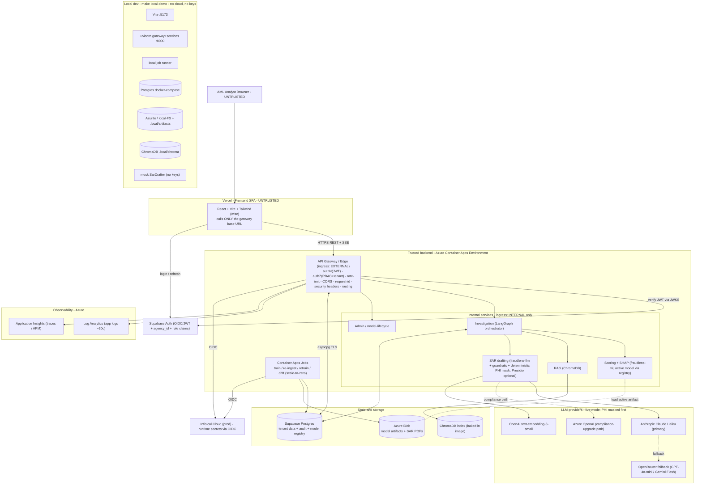
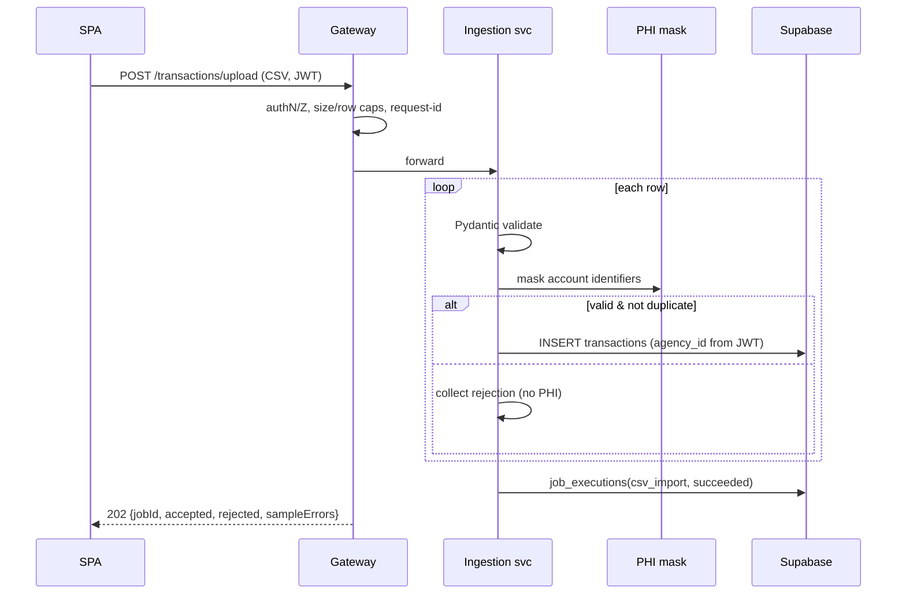
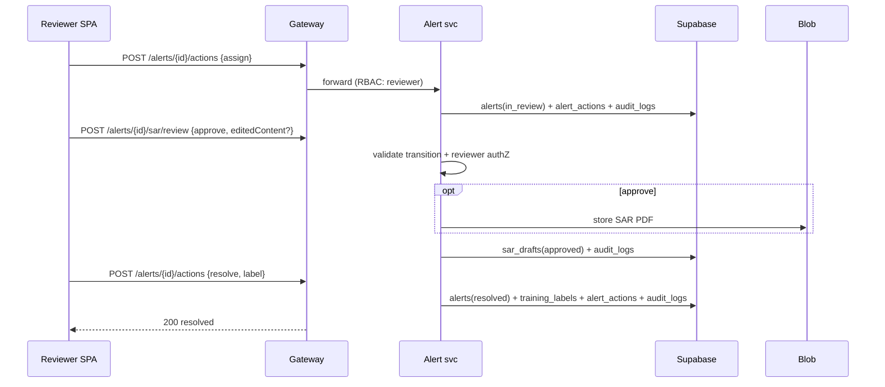
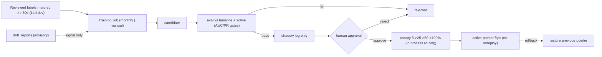
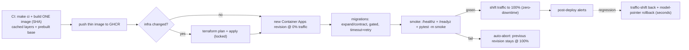

# AML / Fraud Detection System — Production-Grade Implementation Plan (target release `v1.0.0`)

> **Status:** Plan (no code changes). Canonical deliverable; lives at
> `plans/2026-06-12-aml-fraud-detection-system.md` (Golden Rule 3).
> **Author context:** Senior Principal Engineer / Technical Architect.
> **Date:** 2026-06-12 · **Repo:** `Kartik-Hirijaganer/FraudLens` · **Branch base:** `main`.
> **Release goal:** `v1.0.0` — the first *complete*, locally-demoable, production-grade release,
> fully user-testable locally via one command **before** any cloud deploy.
>
> **Governance reconciliations (see Decision Records §22):** secrets stay on **Infisical**
> (not Azure Key Vault, per AGENTS.md) — ADR-010; the database stays **Supabase Postgres**
> (not Azure Database for PostgreSQL) for cost — ADR-011. Both alternatives are documented with
> switch triggers.

---

## Context — why this plan (and this revision) exists

FraudLens already has a complete, green **walking skeleton**: uv workspace; FastAPI backend
(health/ops, fail-closed JWT auth, `agency_id` tenancy, error envelope, settings, structured
logging); `fraudlens-core` (domain types + tenancy); a **fully built** `fraudlens-llm` (async
client, model catalog, Anthropic/OpenAI adapters, 5 guardrails, fallback); React + Vite +
Tailwind frontend on the `wise` design system; layered config; Azure Terraform modules
(scaffolded/inert); Makefile/CI/release tooling. **`fraudlens-ml` is an intentional empty
placeholder.**

This plan turns that skeleton into the AML fraud-investigation system from
[`docs/handoff/AML_Fraud_System_Handoff.docx`](docs/handoff/AML_Fraud_System_Handoff.docx):
deterministic rules + XGBoost scoring → SHAP explainability → LangChain + ChromaDB RAG over
FinCEN/BSA → LangGraph orchestration → an LLM (Claude Haiku) that drafts a streamed
**Suspicious Activity Report (SAR)** — plus a **controlled model lifecycle**, a **one-command
local demo**, and (this revision) a **gateway-first trust boundary**, **PHI masking**,
**dedicated observability**, **configuration discipline**, **notifications + animation UX**, and
**Architecture Decision Records**.

**Confirmed decisions (standing):** ① backend on **Azure Container Apps** (scale-to-zero),
frontend on **Vercel**, Postgres on **Supabase**, secrets in **Infisical**. ② multi-tenant
`agency_id` + fail-closed JWT with a dev/demo bypass (inert in prod). ③ interactive investigation
runs **synchronously + SSE** (queue-ready), with **scale-to-zero Jobs** for training/batch (no
standing worker/queue in v1).

**Engineering bar:** the 11 `AGENTS.md` code rules (Pydantic boundaries, SUMMARY headers, ≥90%
branch coverage, no committed secrets, no duplication, fresh Mermaid docs, error envelope,
camelCase API/snake_case Python, `/api/v1` + unprefixed `/healthz` `/readyz`) at lowest viable
Azure cost (~$0 idle, ~$3–10/mo active), with **one-command local runnability** and **no
hardcoded values** (§12).

---

## Table of contents
1. [Executive Summary](#1-executive-summary) · 2. [Requirements & Assumptions](#2-requirements--assumptions) ·
3. [Final Architecture + Diagram](#3-final-architecture--diagram) · 4. [Gateway & Trust-Boundary Design](#4-gateway--trust-boundary-design) ·
5. [API Strategy & Design](#5-api-strategy--design) · 6. [Authentication & Authorization](#6-authentication--authorization) ·
7. [LLM Integration & Design](#7-llm-integration--design) · 8. [Guardrails & PHI Protection](#8-guardrails--phi-protection) ·
9. [Database Design](#9-database-design) · 10. [Processing Flow](#10-processing-flow) ·
11. [Logging, Observability & Retention](#11-logging-observability--retention) · 12. [Configuration Management](#12-configuration-management) ·
13. [Notifications & User Feedback](#13-notifications--user-feedback) · 14. [UI/UX: Loading, Skeletons & Animations](#14-uiux-loading-skeletons--animations) ·
15. [Terraform & Azure Deployment](#15-terraform--azure-deployment) · 16. [Phase-Based Implementation Plan](#16-phase-based-implementation-plan) ·
17. [Testing & Validation Strategy](#17-testing--validation-strategy) · 18. [Documentation Plan](#18-documentation-plan) ·
19. [Cost Estimate (daily + monthly)](#19-cost-estimate-daily--monthly) · 20. [Release & Maintenance Plan](#20-release--maintenance-plan) ·
21. [Assumptions, Risks & Open Questions](#21-assumptions-risks--open-questions) · 22. [Decision Records (ADRs)](#22-decision-records-adrs) ·
23. [Final Deliverable Format](#23-final-deliverable-format)

---

## 1. Executive Summary

**Simple explanation.** A bank flags a suspicious transaction. Normally an analyst spends 6–8
hours: reviewing it, looking up the right anti-money-laundering regulation, and writing a
"Suspicious Activity Report" (SAR). FraudLens does the heavy lifting in ~15–20 seconds: it scores
how fraudulent the transaction looks (a trained **XGBoost** model), explains *why* in plain
features (**SHAP**), finds the exact **FinCEN/BSA** rule that applies (**RAG** search over the
regulations), and **drafts the SAR** with an LLM — streamed live like ChatGPT. A human always
reviews and approves before anything is final.

**What it does / who it's for.** An analyst dashboard: a table of flagged transactions →
**Investigate** → live progress (rules → score → SHAP → regulation citations → streamed SAR) →
**review/approve** → **resolve**. Admins can **retrain and safely promote** the scoring model
(shadow → canary → active → rollback) with no redeploy. For AML analysts, compliance officers,
SAR writers, risk managers — and as a portfolio piece demonstrating multi-agent AI, RAG,
explainable ML, MLOps, gateway-first security, and low-cost Azure delivery.

**Problem it solves.** Collapses a multi-hour manual investigation to minutes while preserving a
**defensible, explainable, audited** trail (SHAP + cited regulations + rule provenance + human
sign-off + immutable audit log).

**Main workflows.** Run locally in one command (`make local-demo`); ingest transactions
(CSV/REST); investigate (streamed); triage/review/resolve alerts; operate the model
(retrain→shadow→canary→promote/rollback); monitor (dashboard).

**Expected output.** Per investigation: risk score + band, top SHAP features, which rules fired,
regulatory citations, a reviewable SAR draft. System-wide: an audit trail of every run, LLM call
(cost/tokens), human action, and model deployment, plus advisory drift reports.

**Why this architecture fits a low-cost, production-grade personal project.** Gateway-first trust
boundary realized **for free** on Container Apps (one external app + internal-only services);
everything heavy warm in one container (model + SHAP + ChromaDB baked in image); deterministic
core with the LLM only at the edge (testable, auditable, cheap, safe); **PHI masked before any
LLM/log**; scale-to-zero compute + Jobs + free SaaS tiers ⇒ ~$0 idle; the foundation already
enforces tenancy, fail-closed auth, secrets discipline, ≥90% coverage, and doc freshness.

---

## 2. Requirements & Assumptions

(Full risks + open questions in §21; decision rationales in §22.)

**Functional.** FR-1 ingest (single/batch/CSV); FR-2 deterministic rules; FR-3 XGBoost+SHAP via
the **active model registry pointer**; FR-4 RAG citations; FR-5 LangGraph orchestration as a
persisted run; FR-6 streamed SAR (mock + live); FR-7 alerts on threshold; FR-8 review workflow
(resolution → training labels); FR-9 dashboard metrics; FR-10 rules/config CRUD; FR-11 model
selector; FR-12 model lifecycle (retrain→eval→shadow→canary→active→rollback, human-gated);
FR-13 one-command local demo; FR-14 health + dev utilities; **FR-15 all external traffic via a
single API gateway**; **FR-16 PHI masking before LLM/log**; **FR-17 toasts + loading/skeleton/
animation UX**.

**Non-functional.** ≥90% branch (Py) / ≥90% (FE) / changed-line ≥90%; warm investigation ≤20s,
SAR first token ≤3s, cold start ≤75s; ~$0 idle / ≤$10/mo active; **graceful degradation around a deterministic core** +
retries/circuit-breakers + last-known-good model + cached JWKS/secrets + idempotent resumable steps
+ graceful SSE (§10.6); **local needs no cloud and no real secrets**; Makefile is the
single source of truth (local = CI = deploy); WCAG AA + reduced-motion.

**Security.** Single external entry (gateway); fail-closed JWT; `agency_id` claim validated vs
resource; **no PHI/PII/secrets/tokens in logs, errors, URLs, prompts, artifacts, inference logs,
or analytics**; envelope `{code, message, details, requestId}`; secrets only from Infisical
`prod`; LLM guardrails + PHI masking; RAG-as-data injection defense; least privilege (managed
identity → registry pull + Blob + Infisical OIDC); HTTPS/TLS everywhere (§3, §15).

**Compliance-sensitive.** SAR is regulatory output → always human-reviewed, never auto-filed;
model promotion human-gated; training labels only from **matured reviewed** decisions; SHAP +
citations + rule provenance + model version = the audit trail; every PHI access/transformation
audited; **no real PHI** in repo/logs/artifacts (synthetic IEEE-CIS only) — PHI controls are
defense-in-depth for the healthcare-adjacent multi-tenant posture.

**Cost.** Free tiers (Vercel Hobby, Supabase, Infisical, GitHub Actions); Container Apps
consumption + Jobs (scale-to-zero); GHCR over ACR; Claude Haiku + cached embeddings + budget
guard; gateway via Container Apps internal ingress ($0), APIM optional.

**Local dev.** `make local-demo` is the primary path: Docker Postgres + Azurite/local-FS + local
ChromaDB + **mock LLM** + seed → prints `http://localhost:5173`; companions `local-demo-down/
reset/smoke`. No Azure/Vercel/Supabase/keys required.

**Production deploy.** Gateway (external) + services (internal) on Container Apps; Jobs for
training/batch; Vercel frontend; Supabase DB; Infisical OIDC; deploy re-runs `make ci` +
`docker-build` then smoke (parity spine); IaC gated by `AZURE_DEPLOY_ENABLED`/`VERCEL_DEPLOY_ENABLED`.

**Key assumptions (full list §21):** real XGBoost on IEEE-CIS (SMOTE/class-weight); ChromaDB
index baked at build; rules in `fraudlens-core`, ML/RAG/LangGraph in `fraudlens-ml`; `SarDrafter`
protocol so `ml` never imports `llm`; **resources scoped by JWT `agency_id` claim** (top-level,
not nested path); Supabase Auth JWKS for JWT; SQLAlchemy 2.0 async + Alembic; **gateway-first
realized as one external Container App in v1, splittable to internal services later**; models
are **global** via the registry, labels/inference are tenant-scoped.

---

## 3. Final Architecture + Diagram

### 3.1 Trust boundary (the governing principle)
- **Frontend is untrusted.** The SPA holds no secrets and is treated as hostile input.
- **One external entry point: the API Gateway.** Every frontend request (REST + SSE) goes through
  it; it is the only component with public ingress.
- **Backend services are trusted and internal.** They are reachable **only** from the gateway (or
  each other) over the Container Apps environment's private network — never directly from the
  browser.
- **Service-to-service is internal.** Trusted services call each other over internal ingress;
  none is publicly addressable.

### 3.2 High-level architecture
A **gateway/edge** (the only `ingress: external`) enforces authN/Z, rate limiting, CORS,
request-id, security headers, and routing. Behind it, **trusted services** run the investigation
(LangGraph), scoring/SHAP (active model via registry pointer), RAG (ChromaDB), SAR drafting
(`fraudlens-llm` + guardrails + PHI masking), and admin/model-lifecycle. State is **Supabase
Postgres**; artifacts/PDFs in **Azure Blob**; the **ChromaDB** index is baked into the image.
**Container Apps Jobs** (scale-to-zero) run training/ingest/retrain/drift. Secrets come from
**Infisical** at runtime; identity from **Supabase Auth** (JWT). Observability flows to **Log
Analytics + Application Insights**.

> **v1 physical realization (cost-aware):** the gateway edge and the services are **one Container
> App** — the gateway is the FastAPI edge middleware stack, the services are in-process modules
> with clean interfaces. The diagram shows the **logical** boundary and the **physical split**
> (internal-ingress service apps) that the scale-up path adopts with no code rewrite. This gives
> the full trust boundary at **$0** today and a clean separation later (ADR-004).

### 3.3 Architecture diagram



### 3.4 Local development architecture
`make local-demo` → `scripts/local_demo.py`: prereq checks → `docker compose -f
docker-compose.local.yml up` (Postgres + optional Azurite) → `alembic upgrade head` → seed (demo
agency, analyst+reviewer, synthetic transactions, default rules, **active fixture model version**
+ artifacts, local RAG fixture index) → start gateway+services (:8000) + job runner + frontend
(:5173) with `FRAUDLENS_ENVIRONMENT=dev`, `AUTH_DEV_BYPASS=true`, `LLM_MODE=mock`,
`QUEUE_BACKEND=local`, `STORAGE_BACKEND=local` → startup smoke → print URL → prefixed logs →
clean Ctrl-C shutdown.

### 3.5 Azure production architecture
Container Apps environment with: **gateway app** (`ingress: external`, `minReplicas=0`), **service
apps** (`ingress: internal`, scale-to-zero) — in v1 a single app, split later; **Jobs** (cron
retrain + on-demand); **Blob**; **Log Analytics + App Insights**; **managed identity** (registry
pull + Blob + Infisical OIDC). Supabase Postgres over TLS. Optional **Azure API Management
(Consumption)** in front of the gateway as a managed upgrade (ADR-004).

### 3.6 Cross-cutting flows
Ingestion (§10.3), fraud/AML analysis using the active/canary model (§10.2), LLM/SAR with PHI mask
+ guardrails (§7, §8), alert/review producing labels (§10.4), model lifecycle (§10.5), failure
handling & retries (§10.6), auth (§6), config (§12), observability (§11).

---

## 4. Gateway & Trust-Boundary Design

### 4.1 Why gateway-first
A single, hardened entry point centralizes the cross-cutting concerns that must never be
duplicated or skipped:
- **Security:** one place to enforce JWT verification, tenant/RBAC checks, CORS allowlist,
  security headers (HSTS/CSP/…), request size limits, and to keep services off the public
  internet (reduced attack surface, no direct service exposure).
- **Observability:** one choke point that generates/propagates the **request-id**, emits uniform
  access logs + traces, and gives end-to-end correlation across services.
- **Rate limiting:** global + per-tenant + per-route throttles applied once at the edge (protects
  every downstream service and the LLM budget).
- **Authentication:** verify once at the gateway; pass a **validated identity context**
  (`agency_id`, `userId`, roles) to internal services via a signed header — services trust the
  edge, not the client.
- **Future scalability:** services scale independently behind the gateway; the gateway is the
  stable contract for the SPA, so internal topology (split services, add a worker/queue, add APIM)
  changes without touching the frontend.

### 4.2 Responsibilities
**Gateway (edge):** TLS termination (Container Apps ingress), JWT verify (Supabase JWKS), RBAC +
tenant scoping, CORS allowlist, security headers, request-id issue/propagate, rate limiting,
request validation/size caps, routing to internal services, uniform access logging, error-envelope
normalization. **Services (trusted):** business logic only; trust the gateway-provided identity
context; never publicly addressable; emit logs/traces with the propagated request-id; re-enforce
`agency_id` at the data layer (defense-in-depth).

### 4.3 Realization & routing config
- **v1:** FastAPI app, `ingress: external`. The **edge** is a middleware stack
  (`middleware/gateway.py`: authN, rate-limit, CORS, request-id, security headers) in front of
  in-process **service modules** (`services/{investigation,scoring,rag,sar,admin}.py`). The SPA's
  `API_BASE_URL` is the gateway URL only.
- **Scale-up (ADR-004):** extract services into Container Apps with `ingress: internal`; the
  gateway routes by internal DNS; add **APIM Consumption** if managed policies/portal/keys are
  wanted. Routing table is **config-driven** (no hardcoded service URLs) —
  `config/gateway/routes.yaml` (`route → internalServiceUrl + requiredRole + rateLimit`).
- **Rate limits, CORS origins, routes, security headers** are **boot-critical config loaded from
  typed YAML/env at startup** (§12.3) — available *before* DB readiness and *during* DB outages,
  never hardcoded, never DB-dependent.

### 4.4 Tests (see §17)
Gateway routing; authN/authZ at edge; CORS allow/deny; rate-limit 429; security headers present;
request-id propagation into service logs; **no-direct-service-access** (internal-only ingress
asserted in the Terraform plan).

---

## 5. API Strategy & Design

### 5.1 Why REST (not GraphQL) — recommendation (ADR-001)
**REST is the right base now.** It maps cleanly to resources (transactions, investigations, alerts,
model-versions), auto-generates OpenAPI (already wired via `make docs`) for **auditability +
agent-driven implementation**, is trivial to **route at the gateway** and **rate-limit per
endpoint**, needs **no extra server/runtime** (low cost), and pairs with **SSE** for token
streaming. GraphQL's strengths (client-shaped queries, one round-trip for nested reads) don't pay
off for a fixed analyst UI and would complicate gateway routing, per-field authZ, rate limiting,
caching, streaming, and audit. **Tradeoffs considered:** REST can over/under-fetch nested data
(mitigated with purpose-built read endpoints + `?expand=`); versioning is per-URL. **When GraphQL
helps later:** many heterogeneous clients, deeply nested/variable read shapes, or a federated
multi-service read model — revisit then. **Verdict: REST + SSE.** I do **not** recommend GraphQL
or a hybrid for v1.

### 5.2 Conventions
camelCase surface (Pydantic alias) / snake_case internals; `/api/v1` business prefix; unprefixed
`/healthz` `/readyz`; **all routes via the gateway**; every business route requires a valid JWT and
is **scoped by the verified `agency_id` claim** (mismatch ⇒ 403, missing/invalid ⇒ 401);
admin/model routes require `role=admin`; error envelope `{code, message, details, requestId}`;
pagination `?limit&cursor`; ingest idempotency via `externalId`; **API version in the URL**
(`/api/v1`), additive-only; breaking ⇒ `/api/v2`.

### 5.3 Endpoint catalog

| # | Method | Path | Purpose | Auth |
|---|---|---|---|---|
| 1 | POST | `/api/v1/transactions` | Ingest one | JWT |
| 2 | POST | `/api/v1/transactions/batch` | Ingest many | JWT |
| 3 | POST | `/api/v1/transactions/upload` | CSV upload | JWT |
| 4–5 | GET | `/api/v1/transactions[/{id}]` | List / detail | JWT |
| 6 | POST | `/api/v1/investigations` | Start run | JWT |
| 7 | GET | `/api/v1/investigations/{runId}` | Status + snapshot | JWT |
| 8 | GET | `/api/v1/investigations/{runId}/stream` | SSE steps + SAR tokens | JWT |
| 9–10 | GET | `/api/v1/alerts[/{id}]` | List / detail | JWT |
| 11 | POST | `/api/v1/alerts/{id}/actions` | Review action (resolve→label) | JWT |
| 12 | POST | `/api/v1/alerts/{id}/sar/review` | Approve / reject / edit | JWT |
| 13 | GET | `/api/v1/dashboard/metrics` | Aggregates | JWT |
| 14 | CRUD | `/api/v1/rules[/{id}]` | AML rules | JWT |
| 15 | GET/PATCH | `/api/v1/config` | System config | JWT (admin) |
| 16 | GET | `/api/v1/agencies/{agencyId}` | Tenant lookup (exists) | JWT |
| 17 | GET | `/healthz` `/readyz` `/api/v1/health` | Health | none |
| 18 | POST | `/api/v1/dev/{seed,reset}` | Dev utilities (env!=prod) | dev |
| 19–26 | — | model lifecycle (admin): training-runs / versions / shadow / approve / canary / rollback / drift | JWT (admin) |
| 27 | POST | `/api/v1/telemetry/client-error` | FE error sink (PHI-scrubbed, rate-limited) | JWT |

### 5.4 Representative contracts (validation / authZ / errors / tests)

**POST `/api/v1/transactions`** — Req `{externalId, amount>0, currency(ISO-4217), occurredAt(not
future), originAccount, destAccount, channel, country(ISO-3166), features?}`; Resp 201
`{transactionId, externalId, agencyId, …, riskBand:null}`; `extra="forbid"`; `agencyId` from JWT
only; errors 400 / 409 `duplicate_external_id` / 401; tests: valid, dup→409, bad fields→422, no
token→401, cross-tenant invisible.

**POST `/api/v1/investigations`** *(starts & OWNS the run)* — `{transactionId}` (the `modelOverride`
selector is added with the Phase 10 model lifecycle; v1 scores via the active pointer) +
optional `Idempotency-Key` (dedup → returns the existing `runId`); **202 `{runId}`**. The pipeline
runs as an **in-process background task** that persists ordered events to `analysis_run_events` and
the SAR to `sar_drafts`, **independent of any stream** (ADR-016).
**GET `/api/v1/investigations/{runId}/stream`** *(pure observer/replay)* — SSE; **replays persisted
events from `Last-Event-ID`** then tails live: `run.started → step.rules.completed →
step.scoring.completed{fraudProbability,modelVersion} → step.shap.completed →
step.rag.completed{citations} → sar.token* → run.completed{riskScore,riskBand,sarDraftId} |
run.failed{code}`. **Never starts the run**; never-connect/reconnect-safe (the run completes
regardless); `GET /investigations/{runId}` is the authoritative snapshot; cross-tenant runId→404;
a deterministic-core failure→`run.failed`+partial persisted, while an LLM/provider failure degrades
to `sarStatus=failed` and the run still `run.completed` (graceful degradation, §10.6 / §7.5); canary
logs both models.

**POST `/api/v1/alerts/{id}/actions`** — `{action:assign|comment|escalate|resolve|dismiss,
assigneeId?, note?}`; legal transitions only (409 else); `note` ≤2k, PHI-masked; **resolve writes
a `training_label`**; audited.

**Model lifecycle (19–26, admin):** trigger training Job (candidate only; 422 insufficient matured
labels; 409 in-progress); approve only after eval+shadow; canary `{percent:5|25|50|100}`
(100→active); rollback restores prior pointer; **running process reloads on pointer change**;
non-admin→403.

Full DB-backed details in §9; per-endpoint tests in §17.

---

## 6. Authentication & Authorization

### 6.1 Why JWT (recommendation, ADR-002)
**JWT (RS256, verified via Supabase Auth JWKS)** for user identity: **stateless** (no session
store ⇒ lower cost + simpler scale-to-zero), verifiable at the **gateway** without a DB round-trip,
carries `agency_id` + `role` claims for tenant + RBAC decisions, native to Supabase Auth. The
foundation already has a pluggable `TokenVerifier` + fail-closed `authenticate()`.

**Alternatives considered:** *opaque session tokens + introspection* (revocable, but per-request
introspection store/latency — overkill); *server-side sessions* (stateful; Redis/sticky — cost,
breaks easy scale-to-zero); *API keys* (right for machine/service identity, not interactive users —
used only for jobs via managed identity); *OAuth-only flows* (Supabase Auth **is** OIDC/OAuth2;
JWT is the resulting token); *Azure Managed Identity* (used for **service→Azure** — Blob, registry,
Infisical OIDC — and optionally service→service, not end-user auth).

**Verdict:** JWT for users at the gateway; managed identity for service→Azure; signed
gateway-issued context for service→service. Reconsideration: if token-revocation latency becomes
critical, add short TTLs + denylist or move to opaque+introspection.

### 6.2 Token expiration & refresh
Short-lived **access token** (default **30 min**, configurable) + **rotating refresh token** via
Supabase Auth (default ~30 days, configurable). Frontend stores per Supabase SDK guidance (httpOnly
cookie preferred; else secure in-memory + silent refresh). Gateway rejects expired/invalid (401).
**All TTLs are config, not hardcoded** (§12).

### 6.3 RBAC
Roles `analyst | reviewer | admin` in the JWT claim. Analysts ingest/investigate/triage; reviewers
approve SARs; **admins** manage rules/config/model-lifecycle. Enforced at the gateway and
re-checked in services.

### 6.4 Tenant/agency isolation
`agency_id` claim is the **sole** source of tenant scope (never client body/path). Gateway attaches
it to the identity context; every repository query is scoped by it
(`fraudlens_core.require_agency_id`); cross-tenant access returns 404 (no existence leak) or 403.
DB invariant test ensures every tenant table carries indexed `agency_id` (§9).

### 6.5 Service identity validation
Internal services trust the **gateway-signed identity header** (short-lived HMAC/JWT minted by the
gateway with `agency_id`+roles+requestId) and reject requests without it. With internal-only
ingress, services aren't reachable from outside the environment regardless.

### 6.6 PHI access restriction & audit
PHI-bearing fields are access-controlled by role + agency. **v1 persists only masked/tokenized
values + hashes — raw PHI is never stored** (e.g. `transactions.origin_account`/`dest_account` are
stored masked, alongside a `feature_hash`), so **there is no raw-view path and all roles see masked
data** (ADR-014). PHI is masked before any LLM call or log (§8). **Every PHI-record access and every
masking transformation writes an `audit_logs` row** (`action in (phi_access, phi_mask)`; actor,
resource, requestId — **never the value**). Raw retention is **out of scope for v1**; the future
encrypted-field design (encrypted columns + field-level decrypt + strict RBAC + decrypt-audit +
tests) is captured as deferred scope in ADR-014.

---

## 7. LLM Integration & Design

### 7.1 Provider strategy (ADR-003)
- **Direct provider (Anthropic Claude Haiku)** — cheapest/fastest; **v1 default** (handoff).
- **OpenRouter** — fallback routing (GPT-4o-mini → Gemini Flash); already in `fraudlens-llm`.
- **Azure OpenAI** — **preferred *if real PHI/compliance applies*** (in-region, BAA, no-training,
  private networking). We **mask PHI before any call** and use synthetic data, so direct Anthropic
  is appropriate for v1; **Azure OpenAI is the documented compliance-upgrade path**, selectable via
  config with no code change (the catalog models region/retention/ZDR/training-opt-out/BAA).

**Verdict:** default **Anthropic Haiku + OpenRouter fallback**; flip the catalog default to **Azure
OpenAI** when real PHI is in scope. Embeddings: **text-embedding-3-small** (→ Azure OpenAI
embeddings on the compliance path).

### 7.2 Provider/model selection (config-driven)
Selection lives in `config/llm/{catalog.yml, providers.yml}` + `FRAUDLENS_LLM_*` env; **never
hardcoded model names** (§12). The model-selector UI passes a catalog id; budget guard caps spend.

### 7.3 Prompt versioning
SAR prompts are **versioned templates** in `config/llm/prompts/sar/{vN}.md` with a semantic version;
every call records `prompt_version` + `prompt_hash` in `sar_drafts`. Prompt changes are tracked,
diffable, testable (golden tests §17); enables A/B + audit of which prompt produced which SAR.

### 7.4 Safe LLM logging
Log model id, prompt **version + hash**, token usage, cost, latency, fallback hops — **never**
prompt/response content or raw inputs. Content referenced by hash; full (PHI-masked) content lives
in `sar_drafts` under tenant scope, not app logs.

### 7.5 Retries, timeouts, fallback
`fraudlens-llm` typed errors: bounded retry on rate-limit/timeout/transient → fallback chain
(equal/stricter governance) → total failure ⇒ run completes with score+SHAP+RAG and
`sarStatus=failed`. Timeouts/retry counts are **config**.

### 7.6 Cost control
Default Haiku; `max_tokens` cap; per-session + daily USD budget in `system_config` (429 on exceed);
SAR/RAG/embedding caches (replay, no spend); embeddings one-time at build + cached.

### 7.7 Local testing (mock/stub)
`FRAUDLENS_LLM_MODE=mock` injects a deterministic in-process `SarDrafter` streaming a templated SAR
— **no provider, no keys, no cost** — full UX offline. Live mode opt-in via Infisical. Mode is a
wiring choice (injected drafter), not a code fork.

### 7.8 PHI before any LLM (and whether to send it)
**Policy: never send raw PHI.** Inputs are **PHI-masked** (§8) before prompt assembly; the SAR is
built from rule hits + SHAP feature names + citations + a **masked** transaction summary. If real
PHI ever had to be sent, **only** via a BAA-covered provider (Azure OpenAI), minimized + masked,
explicitly configured + audited. For v1 (synthetic + masking) this holds by construction.

---

## 8. Guardrails & PHI Protection

### 8.1 Pre/post-LLM guardrails (reuse `fraudlens-llm/security/`)
- **Input:** `redaction.py` masks PII/PHI-shaped tokens; `prompt_risk.py` scans the assembled
  prompt (esp. RAG snippets) for injection; RAG text wrapped/escaped as **data, not instructions**.
- **Output:** `policy.py` + `phishing.py` scan; `output.py` → `safe_text`; citation-grounding (no
  fabricated regulation ids); `SarDraft` schema validation.

### 8.2 PHI/PII detection & masking — recommendation (ADR-006)
**No Azure dependency.** Detection/masking runs entirely in-process; **deterministic masking is the
default**, with an optional open-source NER enhancer that is off by default.
- **Primary (default, zero-dependency): deterministic masking** in `fraudlens-core/phi/` — pure
  Python: regex + validators (PAN/card via **Luhn**, account/routing/IBAN via **`python-stdnum`**,
  SSN-like, email, phone). Fast, predictable, fully testable, **no NLP model, no Azure, no network,
  $0**, negligible container weight — so it stays inside the ≤75s cold-start budget. This covers the
  real PHI surface here (structured account identifiers + known patterns), since SAR inputs are
  assembled from structured fields we control.
- **Optional (off by default): Microsoft Presidio** — *open-source MIT Python library, runs
  in-container, **not** an Azure service, $0/no keys/no network*. Adds NLP NER (names/locations) for
  **free-text** fields (e.g., analyst notes). Gated by the `phiNerMasking` feature flag because it
  pulls spaCy + a language model (container weight + cold-start cost); enable only if free-text PII
  detection is needed.
- **Explicitly NOT used: Azure AI Language PII detection** — it is a managed **Azure** service (adds
  cloud coupling + per-call cost), which conflicts with the minimal-Azure-dependency stance. Left as
  a documented-only option in ADR-006, not part of v1.
- **Where:** `fraudlens-core/phi/` (deterministic rules) + `services/phi_mask.py` (deterministic by
  default; layers in Presidio only when `phiNerMasking` is on). Applied at **ingest** (store masked +
  `feature_hash`), **before any LLM prompt**, and in the **logging redaction processor**.

### 8.3 PHI audit trail
Every mask/access → `audit_logs` (`phi_access`/`phi_mask`, actor, resource, requestId, counts — **no
values**). Reproducible (deterministic rules + recorded recognizer-config version).

### 8.4 Preventing PHI leakage (logs, prompts, analytics, errors)
**Logs:** structlog redaction processor runs masking on every record + key denylist; tests assert
no PHI in emitted logs (§17). **Prompts:** masked inputs only. **Analytics:** none third-party;
client errors via the gateway, PHI-scrubbed. **Errors:** envelope carries only safe
`{code, message, details(field+reason), requestId}` — no values/stack/PHI.

### 8.5 Human review for low-confidence / high-risk
SAR drafts are **always** human-reviewed before approval. **Force-flag for review** when: a
guardrail trips, model confidence is low (config threshold), risk band is `critical`, or the LLM
fell back. Flags (`alerts.review_flags`) surface in the UI with the reason.

---

## 9. Database Design

**Engine:** Supabase Postgres (ADR-011). **ORM:** SQLAlchemy 2.0 async (asyncpg) + Alembic.
**Tenancy:** every **tenant-scoped** table has `agency_id UUID NOT NULL` (FK→`agencies`),
indexed/leading; **platform tables** (`agencies`, model-registry/training tables) carry no
`agency_id` and are CI-allowlisted. **Audit fields:** `created_at`, `updated_at`,
`created_by`/`updated_by` where a human acts. **IDs:** UUID v4. **Money:** `NUMERIC(18,2)` +
`currency CHAR(3)`. **JSONB** for blobs.

### 9.1 Core tenant tables
- **`agencies`** *(platform)* — `id PK`, `name`, `slug UNIQUE`, `created_at`.
- **`users`** — `id PK`, `agency_id FK`, `email UNIQUE`, `display_name`,
  `role enum(analyst|reviewer|admin)`, audit. Idx `(agency_id,email)`.
- **`transactions`** — `id PK`, `agency_id FK`, `external_id`, `amount`, `currency`, `occurred_at`,
  `origin_account`(masked), `dest_account`(masked), `channel`, `country`, `features JSONB`,
  `risk_band NULL`, `latest_run_id NULL`, `ingested_at`, `created_at`. **UNIQUE `(agency_id,
  external_id)`**; idx `(agency_id,occurred_at)`, `(agency_id,risk_band)`. Retention 365d.
- **`aml_rules`** — `id PK`, `agency_id FK NULL`(global), `code`, `name`, `description`,
  `rule_type enum`, `params JSONB`, `severity`, `weight`, `enabled`, `version`, audit.
- **`analysis_runs`** — `id PK`, `agency_id FK`, `transaction_id FK`,
  `status enum(pending|running|completed|failed)`, `risk_score NULL`, `risk_band NULL`,
  `model_version`, `rules_version`, `rag_version`, `prompt_version`, `triggered_by FK NULL`,
  `error_code NULL`, timestamps. Idx `(agency_id,status)`, `(agency_id,created_at)`.
- **`analysis_results`** *(immutable)* — `id PK`, `run_id FK UNIQUE`, `agency_id FK`,
  `fraud_probability`, `shap_values JSONB`, `top_features JSONB`, `rule_hits JSONB`,
  `combined_score`, `risk_band`, `model_version`, `created_at`.
- **`rag_retrievals`** — `id PK`, `run_id FK UNIQUE`, `agency_id FK`, `query`, `top_k`,
  `chunks JSONB`, `rag_version`, `created_at`.
- **`alerts`** — `id PK`, `agency_id FK`, `transaction_id FK`, `run_id FK`,
  `status enum(open|in_review|resolved|dismissed)`, `severity`, `assigned_to FK NULL`,
  `review_flags JSONB`, audit. Idx `(agency_id,status)`, `(agency_id,assigned_to)`.
- **`alert_actions`** *(append-only)* — `id PK`, `alert_id FK`, `agency_id FK`, `actor_id FK`,
  `action enum`, `note TEXT NULL`(masked), `from_status`, `to_status`, `created_at`.
- **`sar_drafts`** — `id PK`, `run_id FK`, `alert_id FK NULL`, `agency_id FK`, `version`,
  `model_id`, `prompt_version`, `prompt_hash`, `content TEXT`(masked), `structured JSONB`,
  `citations JSONB`, `status enum(draft|reviewed|approved|rejected|failed)`, `token_usage JSONB`,
  `cost_usd`, `pdf_blob_url NULL`, `created_by FK NULL`, `reviewed_by FK NULL`, timestamps.
- **`system_config`** *(DB — tenant/runtime tunables only; **boot-critical gateway/CORS/rate-limit/
  security config lives in YAML/env**, §12.3)* — `id PK`, `agency_id FK NULL`, `key`, `value JSONB`,
  `updated_by FK NULL`, `updated_at`. UNIQUE `(agency_id,key)`. Keys: `riskBandThresholds`,
  `alertThreshold`, `llmDailyBudgetUsd`, `llmSessionBudgetUsd`, `defaultModelId`, `retentionDays`,
  `labelMaturityDays`, `canaryPercent`, `modelGates`, `featureFlags`. Reads use **safe cached
  in-process defaults** so a DB outage never breaks request handling.
- **`analysis_run_events`** *(persisted ordered event log — backs SSE replay, ADR-016)* — `id PK`,
  `run_id FK`, `agency_id FK`, `seq int`, `event_type`(run.started|step.rules.completed|
  step.scoring.completed|step.shap.completed|step.rag.completed|sar.started|run.completed|run.failed),
  `payload JSONB`(masked, no PHI), `created_at`. UNIQUE `(run_id, seq)`; idx `(agency_id, run_id, seq)`.
  Token-level `sar.token`s stream live; the authoritative SAR is persisted in `sar_drafts` on
  completion. Retention follows `analysis_runs`.
- **`job_executions`** — `id PK`, `agency_id FK NULL`, `job_type enum`, `status`, `payload JSONB`,
  `result JSONB`, `error_code NULL`, `attempts`, timestamps. Retention 90d.
- **`audit_logs`** *(append-only, no PHI)* — `id PK`, `agency_id FK NULL`, `actor_id FK NULL`,
  `action`(incl. `phi_access`/`phi_mask`/`model_deploy`/`auth_fail`), `resource_type`,
  `resource_id NULL`, `metadata JSONB`(scrubbed), `request_id`, `created_at`. Idx
  `(agency_id,created_at)`, `(resource_type,resource_id)`. Retention 2y.

### 9.2 Model-lifecycle tables
- **`training_labels`** *(agency)* — `id PK`, `agency_id FK`, `transaction_id FK`, `run_id FK`,
  `label enum(confirmed_fraud|false_positive|false_negative|benign)`, `source(analyst_review)`,
  `matured_at`, `created_by FK`, `created_at`.
- **`training_datasets`** *(platform)* — `id PK`, `snapshot_query JSONB`, `label_window`,
  `row_count`, `feature_spec JSONB`, `created_at`.
- **`model_training_runs`** *(platform)* — `id PK`, `trigger enum(manual|scheduled)`,
  `dataset_id FK`, `status`, `params JSONB`, `metrics JSONB`, `artifact_uri NULL`, timestamps,
  `created_by FK NULL`.
- **`model_versions`** *(platform; registry)* — `id PK`, `version_label UNIQUE`,
  `training_run_id FK`, `artifact_uri`, `feature_spec JSONB`, `metrics JSONB`,
  `status enum(candidate|shadow|canary|active|archived|rejected)`, `approved_by FK NULL`,
  `approved_at NULL`, `notes`, `created_at`.
- **`model_evaluations`** *(platform)* — `id PK`, `model_version_id FK`, `baseline_version_id FK`,
  `metrics JSONB`(auc, pr_auc, precision@k), `passed bool`, `created_at`.
- **`model_deployments`** *(platform; pointer)* — `id PK`, `active_version_id FK`,
  `canary_version_id FK NULL`, `canary_percent int=0`, `previous_active_version_id FK NULL`,
  `updated_by FK NULL`, `updated_at` (single live row).
- **`model_inference_logs`** *(agency)* — `id PK`, `agency_id FK`, `run_id FK`,
  `model_version_id FK`, `was_canary bool`, `fraud_probability`, `feature_hash`, `created_at`.
  Retention 90d. No PHI (hash only).
- **`drift_reports`** *(platform; advisory)* — `id PK`, `model_version_id FK`, `window`,
  `metrics JSONB`(PSI/feature drift), `severity enum`, `advisory bool=true`, `created_at`.

### 9.3 Tenancy invariant, migrations, seed
- **Invariant (CI `scripts/check_tenancy.py`):** every tenant-scoped table has indexed `agency_id`;
  platform tables explicitly allowlisted.
- **Migrations:** Alembic, hand-reviewed, **expand/contract** (backward-compatible) so backend
  rollback never needs DB rollback; applied **pre-traffic** on deploy/Job; `/readyz` checks schema
  version; up/down tested; ERD auto-generated by `make docs`.
- **Seed (`scripts/seed.py`, dev/demo only, idempotent):** demo agency, analyst+reviewer, 6 baseline
  rules, default config, ~50 curated IEEE-CIS transactions, an **active fixture model version** +
  artifacts, local RAG fixture index. Never runs in prod.

### 9.4 Tenant-safe global model training policy (ADR-015)
Models are **global** (one shared registry) while labels/inference are tenant-scoped, so training
must not leak one tenant's behavior into another via datasets, artifacts, SHAP, or metrics:
- **No PHI / no raw identifiers in datasets:** a `training_datasets` manifest holds **only the
  `feature_spec` + numeric features + `feature_hash`** — never PHI, raw account/row identifiers, or
  `agency_id` as a feature. The manifest is **immutable + content-hashed** for reproducibility.
- **Minimum label counts:** a run is eligible only above configured per-class + total thresholds
  (else `422 insufficient_matured_labels`); labels are **matured** + sourced only from reviewed
  decisions.
- **Per-tenant evaluation slices:** `model_evaluations` records metrics **overall and per-tenant
  slice**; a candidate must not regress beyond the per-tenant tolerance on any slice (guards a model
  good on average but harmful for one agency).
- **Tenant-safe artifacts:** model artifacts, SHAP outputs, and metrics carry **only feature
  names/contributions** — no tenant identifiers/PHI; `model_inference_logs` are **hash-only +
  tenant-scoped**.
- **Tests (§17):** dataset manifest has no PHI/raw IDs/`agency_id`; per-tenant eval-slice gate
  enforced; artifacts + inference logs proven tenant-safe.

---

## 10. Processing Flow

### 10.1 End-to-end narrative
Ingest → validate (Pydantic, PHI-mask) → persist → (Investigate via gateway) create run → rules →
XGBoost (active/canary model) → SHAP → combined score+band → persist results + inference log → RAG
citations → PHI-mask → SAR draft (streamed, mock/live, guardrailed) → persist `sar_drafts(draft)` →
band ≥ threshold ⇒ `alerts(open)` → human review (assign/edit/approve/reject) → **resolve writes
`training_labels`** → audit everywhere → dashboard updates. Separately: training Job → candidate →
eval → shadow → approve → canary → active / rollback (advisory drift).

### 10.2 Investigation sequence (most important)

```mermaid
sequenceDiagram
    participant U as Analyst SPA
    participant GW as API Gateway
    participant INV as Investigation svc
    participant DB as Supabase
    participant R as Rules (core)
    participant M as Scorer+SHAP (active model)
    participant V as ChromaDB RAG
    participant P as PHI mask (deterministic; Presidio optional)
    participant L as SarDrafter (mock | Claude Haiku)

    U->>GW: POST /investigations {transactionId} (JWT, Idempotency-Key?)
    GW->>GW: verify JWT, agency_id, rate-limit, request-id
    GW->>INV: forward + identity context
    INV->>DB: claim/INSERT analysis_runs(running) [idempotent by Idempotency-Key]
    INV->>INV: START pipeline as in-process background task (RUN OWNS EXECUTION)
    GW-->>U: 202 {runId}
    Note over INV,DB: pipeline runs to completion regardless of any stream connection
    INV->>R: deterministic rules
    R-->>INV: ruleHits
    INV->>DB: append analysis_run_events(step.rules.completed)
    INV->>M: score + SHAP (active/canary)
    M-->>INV: fraudProbability + shap + modelVersion
    INV->>DB: results + model_inference_logs + events(scoring, shap)
    INV->>V: retrieve FinCEN/BSA top-k
    V-->>INV: citations
    INV->>DB: append events(step.rag.completed)
    INV->>P: mask summary + inputs
    P-->>INV: masked inputs (audit phi_mask)
    INV->>L: draft SAR (guardrails in/out, stream)
    loop tokens
      L-->>INV: token
      INV-->>INV: stream live + buffer
    end
    INV->>DB: sar_drafts(draft) + events(run.completed) + run completed
    alt band >= threshold
      INV->>DB: alerts(open)
    end
    Note over U,DB: SSE is a pure OBSERVER/REPLAY (reconnect-safe), never starts the run
    U->>GW: GET /investigations/{runId}/stream (SSE, Last-Event-ID?)
    GW->>INV: subscribe(runId, fromSeq)
    INV->>DB: read analysis_run_events from Last-Event-ID
    INV-->>U: replay persisted step events, then tail live (sar.token…) until run.completed/failed
```
> **Run/stream ownership (ADR-016):** `POST /investigations` **starts and owns** the run as an
> **idempotent in-process background task** (dedup by `Idempotency-Key` → returns the existing
> `runId`); the pipeline persists ordered **step events** to `analysis_run_events` and the final SAR
> to `sar_drafts`. `GET …/stream` is a **pure observer**: it replays persisted events from
> `Last-Event-ID`, then tails live `sar.token`s until `run.completed/failed`. So a stream that never
> connects, drops, or reconnects twice never strands or duplicates a run; `GET /investigations/{runId}`
> always returns the authoritative snapshot.

### 10.3 Ingestion sequence



### 10.4 Alert review & resolution (produces labels)



### 10.5 Model lifecycle



### 10.5.1 Model promotion gates (quantitative + configurable)
Promotion is human-gated **and** quantitatively gated — thresholds live in
`system_config.modelGates` (defaults below) so approval is **testable, not subjective**. A candidate
must pass **all** to be eligible for shadow → canary → active:
- **PR-AUC floor** ≥ `0.45` (primary metric at the ~3.5% base rate) **and ≥ active − `0.02`** (no
  material regression vs the current active model).
- **Beats the logistic-regression baseline** on PR-AUC by ≥ `0.02`.
- **Recall at the alert budget** ≥ `0.60` at the threshold that yields ≤ the configured daily alert
  budget; **precision@top-1%** ≥ `0.20` (tune on real data).
- **Calibration:** ECE ≤ `0.05` (Brier tracked) so `fraud_probability` is meaningful for banding.
- **Per-tenant slices:** no tenant slice worse than active − `0.05` PR-AUC (§9.4).
- **Canary abort rule:** during canary, if the candidate's live alert-rate / precision proxy deviates
  > `20%` from active over the configured min-sample window → **auto-abort → pointer rollback**.

All values are **documented defaults, configurable**; the human approver reviews the eval report +
per-tenant slices before approving. Enforced by the model-gates + lifecycle suites (§17).

### 10.6 Reliability, failure handling & fallback (ADR-012)

**Governing principle — graceful degradation around a deterministic core.** An investigation is
designed as **tiers**: the **deterministic core** (rules → XGBoost score → SHAP → risk band) must
always complete and persist a result; the **soft enhancers** (RAG citations, LLM SAR draft) are
**best-effort** and degrade without failing the run. So a failure in RAG or the LLM still yields a
**risk decision + explanation + alert** — never a dead end. The system is **fail-closed for
security** (auth/tenant) but **fail-soft for enrichment**.

**Cross-cutting mechanisms (all config-driven, no hardcoded values):**
- **Timeouts** on every outbound call (LLM, embeddings, DB, Blob, JWKS, Infisical) — config per
  dependency.
- **Bounded retry with exponential backoff + jitter** on transient/idempotent failures (caps to
  protect latency + LLM budget).
- **Circuit breakers** per external dependency (LLM, embeddings) — open after N consecutive
  failures to stop hammering a down provider (and burning budget), half-open probe to recover.
- **Idempotency** — ingest by `(agency_id, externalId)`; investigation start accepts an optional
  `Idempotency-Key` (dedupes double-clicks → returns the existing `runId`); pipeline steps are
  idempotent + persisted so a re-run resumes rather than duplicates.
- **Readiness gating** — `/readyz` (DB + ChromaDB + active model + Infisical reachable) keeps
  traffic off a not-ready replica; **liveness** `/healthz` + Container Apps health probes
  **auto-restart** a wedged replica; unhealthy revision ⇒ traffic stays on the last good revision.
- **Last-known-good** — on active-model load failure, fall back to `previous_active_version_id`
  (serve last good model) instead of a hard outage; on bad canary, instant pointer rollback.
- **Caching as a fallback buffer** — JWKS keys, Infisical secrets (fetched once at startup, kept
  in-process), embeddings, and SAR/RAG results are cached so a transient upstream blip doesn't take
  down a **warm** container.

**Component fallback matrix:**

| Component | Failure mode | Detection | Fallback / mitigation | User-facing behavior |
|---|---|---|---|---|
| **LLM provider** | down / rate-limit / timeout | typed error + breaker | retry+backoff → **Haiku→GPT-4o-mini→Gemini** (equal/stricter governance) → **mock-able**; breaker opens | SAR streams from fallback; if all fail, run completes with score+SHAP+RAG, `sarStatus=failed` + **Retry** |
| **Embeddings API** | down / timeout | error + breaker | **query-embedding cache** → **lexical/BM25 retrieval** over the baked corpus → else `citations=[]`+flag | citations may be lexical or empty; investigation still completes |
| **RAG / ChromaDB** | unavailable / empty | startup + per-call check | baked read-only index (very stable); if missing at boot `/readyz` fails; per-call ⇒ `citations=[]`+flag | "regulatory citations unavailable" note; SAR + decision still produced |
| **XGBoost model** | active artifact missing/corrupt | load check + checksum | **fall back to `previous_active` (last-known-good)**; if none, `/readyz` fails (no silent bad scores) | cold-start progress UI; never a wrong-but-confident score |
| **Deterministic rules** | a single rule throws | per-rule try/except | **fault-isolated**: log + skip the bad rule, continue others (run not aborted) | unaffected; rule logged for fix |
| **Database (Supabase)** | transient disconnect / pool exhaustion | asyncpg pool errors | connection **pool + retry/backoff**; use Supabase pooler; transient ⇒ retry | on hard outage: 503 envelope + **Retry** (DB is system of record; no silent data path) |
| | free-tier **pause** after idle | first-request latency/err | **pre-warm before demos**; readiness retry; (scale path: Azure PG, ADR-011) | brief wait then normal; documented |
| **Auth / JWKS** | JWKS endpoint unreachable | fetch error | **cached JWKS** (TTL + stale-while-revalidate) — keys rotate rarely | warm users unaffected during a transient JWKS blip |
| **Secrets / Infisical** | unreachable at runtime | fetch error | secrets **fetched once at startup, cached in-process**; startup retry; `/readyz` checks reachability | warm container unaffected; cold start waits/retries |
| **Blob (artifacts/PDF)** | read fail at boot | load check | model cached in memory after first load; **PDF write is deferred/retried, never blocks SAR approval** | approval succeeds; PDF appears when Blob recovers |
| **SSE stream** | mid-stream disconnect | client onerror | **15s heartbeat**; reconnect → `GET /investigations/{runId}` **snapshot**; **fallback to polling** if SSE unsupported; **SAR persisted only on completion** (no partial-as-final) | progress resumes or shows completed result; offer **Retry** |
| **Background Jobs** (train/ingest/retrain/drift) | job fails | `job_executions` status + attempts | **retryable + idempotent**; failure leaves serving untouched (candidate just isn't created) | admin sees failed job + reason; can re-trigger |
| **Gateway/container** | crash / OOM | liveness probe | Container Apps **auto-restart**; revision rollback | brief unavailability; auto-recovers |

**Proportionality (cost-aware).** v1 runs **single-replica, scale-to-zero** — acceptable for a
personal project; the trade is a brief unavailability window during restart/cold-start, mitigated by
health-probe auto-restart, readiness gating, and the progress UI. **Multi-replica HA, DB failover,
and multi-region are documented scale-ups** (cost), not enabled in v1.

---

## 11. Logging, Observability & Retention

### 11.1 Backend logging library
**`structlog`** over stdlib `logging`, emitting **JSON** in prod and a pretty console renderer in
dev. Chosen for its **processor pipeline**, which lets us run a **PHI/secret redaction processor**
on every record and bind contextvars (requestId, agencyId, userId) automatically. (The foundation's
`middleware/logging.py` is extended to structlog; `python-json-logger` is the fallback if structlog
is undesired.) Processors: contextvar-merge → **PHI redaction (deterministic; Presidio optional)** →
key-denylist drop (`token`, `authorization`, `password`, `secret`, `*_key`, `database_url`,
`origin_account`, `dest_account`) → JSON render.

### 11.2 Frontend logging
Minimal by design: dev → `console` via a thin `lib/logger.ts`; prod → an `ErrorBoundary` + window
error/unhandledrejection handlers post **scrubbed** client errors to `POST /api/v1/telemetry/
client-error` **through the gateway** (rate-limited), so retention/PHI policy is centralized
server-side. No third-party analytics SDK by default (privacy + cost). Optional: Application
Insights JS SDK (sampled) if web vitals are wanted later — config-gated, off by default.

### 11.3 What to log / never log
**Log:** access (method, path, status, latencyMs, requestId, agencyId, userId, route), domain
events (run.started/completed/failed, alert.transition, model.deploy), **security events**
(auth_fail, rate_limited, tenant_mismatch, guardrail_block), LLM calls (model, promptVersion,
promptHash, tokens, costUsd, latencyMs, fallbackHops), job executions, errors (server-side stack).
**Never log:** PHI/PII, secrets, tokens/JWTs, credentials, connection strings, raw request bodies,
prompt/response content, full feature payloads.

### 11.4 Structure & correlation IDs
All logs JSON with stable keys (`ts, level, event, msg, requestId, agencyId, userId, …`). The
**gateway** issues/accepts `X-Request-Id`, binds it to the structlog contextvar, returns it in the
response header, and **propagates it to internal services** via the signed identity header; SSE
events and the error envelope carry it; client errors reference it. End-to-end correlation across
gateway → services → jobs.

### 11.5 Azure storage & retention
Container Apps stream stdout JSON → **Azure Monitor → Log Analytics workspace**; **Application
Insights** (connected to the workspace) for traces/APM. **Retention by type:**

| Log type | Store | Retention | Why |
|---|---|---|---|
| App/access logs | Log Analytics | **30d** (capped + sampled) | cost control |
| Traces/APM | App Insights | 30d | cost control |
| **Audit logs** | **Postgres `audit_logs`** | **2y** | compliance, durable, tenant-scoped, queryable |
| Security events | Log Analytics + `audit_logs` | 90d / 2y | alerting + durable record |
| LLM cost/usage | `sar_drafts` + Log Analytics | 90d / per-row kept | cost dashboards |
| `model_inference_logs` | Postgres | 90d | drift/shadow, hash-only |
| `job_executions` | Postgres | 90d | ops |

### 11.6 Audit logs vs application logs
**Audit** = durable, immutable, business/security facts ("who did what to which resource, when,
under which requestId") in **Postgres** (tenant-scoped, 2y, queryable for compliance). **App logs**
= ephemeral operational telemetry in Log Analytics (30d). PHI-access events are **audit** events.

### 11.7 Errors, warnings, security & PHI-access tracking
Error envelope + server-side stack (scrubbed) at `ERROR`; recoverable issues at `WARNING`; security
events as structured events at `WARNING/ERROR` **and** an `audit_logs` row; PHI access/mask as
`audit_logs` (`phi_access`/`phi_mask`). Azure Monitor alerts on: smoke failure, error-rate spike,
auth-fail spike, cost spike.

### 11.8 Local development logging
structlog console renderer, `DEBUG`, requestId bound, no external sink; `make local-demo` shows
prefixed streams (`api`/`worker`/`frontend`). A test asserts the redaction processor strips seeded
PHI locally.

---

## 12. Configuration Management

### 12.1 Principle — no hardcoded values (enforced)
**Hardcoded URLs, credentials, tenant IDs, model names, timeout values, polling intervals,
retention periods, notification timeouts, animation timings, gateway routes, rate limits, CORS
origins, and any environment-specific value are NOT allowed.** Everything resolves from
**config files**, **environment variables**, or the **secret store**. Enforcement: ruff `PLR2004`
(magic values), `scripts/check_no_secrets.py`, a new `scripts/check_no_hardcoding.py` (flags literal
`http(s)://`, IPs, model-id patterns, and bare ms/seconds literals outside config), plus code review
+ the `extra="forbid"` Pydantic settings.

### 12.2 Layering & precedence
`config/default.yaml` → `config/{dev,staging,prod}.yaml` → `FRAUDLENS_*` env vars → (secrets)
**Infisical** at runtime. Backend config is a **`pydantic-settings`** model (`extra="forbid"`);
frontend reads **build/runtime env** (`VITE_*`) for non-secret values (e.g., `VITE_API_BASE_URL`).

### 12.3 What lives where
- **Boot-critical / edge config → typed YAML + env (loaded at startup; available *before* DB
  readiness and *during* DB outages):** gateway routes (`config/gateway/routes.yaml`), **CORS
  origins, rate limits, security headers**, `apiV1Prefix`, API base, LLM mode + default model id
  (catalog ref), storage/queue backend selectors, deploy settings. **These must never depend on the
  DB** — the gateway/security posture is fully determined at boot.
- **Other non-secret config (`config/*.yaml` + `FRAUDLENS_*` / `VITE_*`):** retention days, polling
  intervals, notification timeouts, animation timings (FE values surfaced via the bootstrap config
  endpoint).
- **DB runtime tunables (`system_config`, with safe cached in-process defaults):** risk-band
  thresholds, alert threshold, LLM budgets, default model id, label-maturity days, canary percent,
  model gates, feature flags — per-tenant/runtime, flips without redeploy; **never boot-critical**.
- **Secrets (Infisical `prod`, runtime):** `DATABASE_URL`, `JWT_*`/`SUPABASE_JWKS_URL`,
  `ANTHROPIC_API_KEY`, `OPENAI_API_KEY`, `OPENROUTER_API_KEY`, `GEMINI_API_KEY`, `VERCEL_TOKEN`.
  **Not** Azure Key Vault (ADR-010).

### 12.4 Per-environment
- **Local:** `dev.yaml` + `.env` (non-secret) + `infisical run` (only when exercising live mode);
  defaults make `make local-demo` work with **no secrets** (mock LLM, local backends).
- **Staging:** `staging.yaml`; Infisical `prod` path (single Infisical env per AGENTS.md) with
  staging-specific non-secret config; deploy to a staging Container App revision.
- **Production:** `prod.yaml`; Infisical OIDC at runtime; deploy gates on.

### 12.5 Feature flags
`system_config.featureFlags` (DB, per-agency/global) for staged rollout (e.g., `modelSelectorUi`,
`azureOpenAiProvider`, `phiNerMasking`); read at request time; flips without redeploy. Frontend
flags via the bootstrap config endpoint.

### 12.6 Tests (see §17)
Settings load + precedence; unknown key rejected; **no-hardcoding** check; CORS/rate-limit/route
config honored; flag toggles change behavior; secret never present in config/logs.

---

## 13. Notifications & User Feedback

### 13.1 Frontend toasts (recommend **Sonner**)
**Sonner** (lightweight, accessible, reduced-motion-aware; pairs well with Vercel/React 19) — or
`react-hot-toast` as an alternative. Variants **success / info / warning / error**. **Timeout is
configurable** (`config animationTimingsMs.toast*` / `notificationTimeoutsMs`, surfaced to the FE
via bootstrap config). **Critical errors stay visible** (no auto-dismiss) and offer an **actionable
retry** (e.g., re-run a failed investigation).

### 13.2 Standardized notification events
A single shape `{ type, severity: success|info|warning|error, code, message, requestId, action? }`,
derived from the **error catalog** (§ error contract) so user-facing copy is consistent and never
exposes internals. Frontend maps `code → friendly message + action` via `lib/errors.ts`.

### 13.3 Backend-triggered notifications via the gateway
Backend signals flow to the SPA **only through the gateway** — inline REST responses, SSE events
(`step.*`, `sar.token`, `run.completed/failed`), and a notification envelope on errors. No service
pushes directly to the browser.

### 13.4 Background job/progress feedback
Long-running work surfaces **user-friendly progress**: the investigation SSE step events drive the
progress UI; training/retrain Jobs expose status via `job_executions` polled by the model-admin UI
with friendly labels ("Training candidate model…", "Evaluating…").

### 13.5 User-facing vs internal
The **user** sees the safe `message` + `requestId` + optional retry; **internals** (stack, raw
cause) go to logs only, correlated by `requestId`. Tests assert no internal detail reaches toasts.

---

## 14. UI/UX: Loading, Skeletons & Animations

### 14.1 Approach (recommend **CSS/Tailwind transitions + minimal Framer Motion**, ADR-008)
Default to **CSS transitions + Tailwind** for most motion (zero bundle cost, professional, minimal);
use **Framer Motion** ("motion") only where orchestration helps (progress-step reveal, streaming
SAR, list enter/exit). Honor the `wise` design system (`DESIGN.md`). Keep motion subtle and fast.

### 14.2 States to implement
- **Skeleton loaders** for page/list loads (transactions, alerts, dashboard).
- **Button loading states** (spinner + disabled) on submit/investigate/approve.
- **Empty states** (friendly illustration + CTA) for no transactions/alerts.
- **Error states** (inline + toast, with retry).
- **Retry states** (failed run/SSE → "Retry" action).
- **Cold-start experience** — the handoff's step-by-step progress UI ("Waking up engine…",
  "Scoring…", "Generating SHAP…", "Retrieving regulations…", "Drafting SAR…") driven by `/readyz`
  + SSE step events.
- **Streaming/progressive updates** — SAR tokens render as they stream; gauges/charts animate from
  0 to value.

### 14.3 Configurable timings & accessibility
All durations come from config (`config animationTimingsMs` → CSS variables / motion props), never
hardcoded. **Reduced motion:** respect `prefers-reduced-motion` (disable non-essential animation,
keep instant state changes); meet **WCAG AA**, ≥48px touch targets, focus-visible, ARIA live
regions for streaming SAR + toasts.

### 14.4 Tests (see §17)
Skeleton renders during load; button shows loading; empty/error/retry render from fixtures;
cold-start progress sequence; reduced-motion disables animation; toasts render per variant +
auto-dismiss timing (configurable) + critical persists.

---

## 15. Terraform & Azure Deployment

### 15.1 Module structure (`infra/terraform/`)
```
modules/
  networking/        # Container Apps environment + (optional) VNet/subnet
  identity/          # user-assigned managed identity (ACR/GHCR pull, Blob, Infisical OIDC fed cred)
  registry/          # GHCR (default, free) | ACR (optional) — image source
  container_app_env/ # shared environment + Log Analytics workspace link
  gateway_app/       # Container App, ingress: EXTERNAL, allowInsecure=false
  service_app/       # Container App(s), ingress: INTERNAL — scaffolded + validated; NOT applied in v1 (services_split_enabled=false); deployed only on split (ADR-004)
  jobs/              # Container Apps Jobs: train/retrain/ingest/drift (cron + manual)
  blob/              # Storage account + containers (artifacts, sar-pdfs) + lifecycle policy
  observability/     # Log Analytics workspace + Application Insights
  apim/              # OPTIONAL Azure API Management (Consumption) in front of gateway
environments/
  dev/  staging/  prod/   # main.tf, providers.tf (use_oidc=true), variables.tf, <env>.tfvars,
                          # outputs.tf, backend.tf (post state-bootstrap), .terraform.lock.hcl
```

### 15.2 Environment-specific variables
Per-env `*.tfvars`: `location`, `resource_group_name`, `environment`, `image_tag`,
`min_replicas`(0), `max_replicas`, cpu/memory, `gateway_cors_origins`, `log_retention_days`,
`blob_lifecycle_days`, `apim_enabled`(false), `acr_enabled`(false→GHCR), `infisical_identity_id`,
`services_split_enabled`(**false in v1** — gateway is a single external app; `true` deploys
internal-ingress service apps as the scale-up).
**No secrets in tfvars** — secrets via Infisical at runtime; sensitive infra inputs via
`TF_VAR_*` from Infisical/OIDC at apply time.

### 15.3 Azure resources (cost-conscious defaults)
- **Resource group** per environment.
- **Compute: Azure Container Apps** (consumption, scale-to-zero) — **recommended over App Service**
  (App Service has no true scale-to-zero; Container Apps fits the cold-start/low-idle model and
  supports internal ingress for the trust boundary). ADR-007.
- **PostgreSQL: Supabase** (default, ADR-011) — *Azure Database for PostgreSQL Flexible Server
  (Burstable B1ms)* documented as the all-in-Azure alternative (~$12–15/mo) with a `postgres/`
  module stub, off by default.
- **Secrets: Infisical** (ADR-010) — *Azure Key Vault* intentionally **not** the app secret store;
  a Key Vault module is **not** included (governance). Switch path documented in ADR-010.
- **Storage: Azure Blob** (LRS) for model artifacts + SAR PDFs, with **lifecycle policy** (cool tier
  + expiry per `blob_lifecycle_days`).
- **Observability: Log Analytics + Application Insights** (capped retention).
- **Gateway: Container Apps external ingress** ($0); **APIM Consumption** optional (ADR-004).
- **Managed identities:** user-assigned MI for registry pull + Blob + Infisical OIDC federation.
- **Networking/security:** ingress TLS (`allowInsecure=false`), internal-only ingress for services
  **(scale-up split only; v1 = single external gateway app, ADR-004)**,
  HSTS/secure headers at the app, CORS allowlist; optional VNet integration when justified.

### 15.4 CI/CD integration & workflow
`make ci` + `make docker-build` gate. **App rollout and infra provisioning are separated** (§15.7):
most deploys are a **fast app rollout** (new image tag → new Container Apps revision → smoke →
promote, seconds), and **`terraform apply` runs only when infrastructure actually changes** — not on
every code deploy. **Plan/apply workflow:** PR runs `terraform fmt -check` + `validate` + `plan` (no
apply); merge to `dev`/`release/*` (gated) runs `apply` **only if the plan is non-empty**. State in
an Azure Storage remote backend (bootstrapped once; `backend.tf.template` → `backend.tf`;
`-lock-timeout` set). `.terraform.lock.hcl` committed. Deploy workflows **pin action + base-image
digests**, set a job **timeout**, use **concurrency: cancel-in-progress** (no overlapping deploys),
and **retry** transient steps (push / apply / OIDC / Infisical).

### 15.5 Local-to-cloud parity & docs
Same container image + same `make` targets locally and in CI/deploy; local uses Azurite/local-FS +
Supabase-or-local Postgres. `infra/terraform/README.md` + `docs/runbooks/azure-deploy.md`: state
bootstrap, OIDC federation, Infisical→`TF_VAR_*`, gateway/internal-ingress, enabling deploy gates,
APIM/Azure-PG/Key-Vault switch paths.

### 15.6 Tests (see §17)
`terraform fmt -check` + `validate` per module/env in CI (no apply until accounts exist);
plan asserts gateway `ingress=external, allowInsecure=false`; the internal `service_app` module
**validates but is NOT applied in v1** (`services_split_enabled=false`); blob lifecycle present;
smoke after apply; deploy-flow assertions (probe budgets, promote-or-abort).

### 15.7 Fast & reliable deployment (ADR-013)
**Goal: seconds-not-minutes deploys that fail safe.** The two root causes of slow/breaking deploys
for a heavy ML container are addressed head-on — (1) rebuilding/pushing a large image every time,
and (2) health probes too tight for a slow-loading model.

**Speed:**
- **Build-once, promote-many:** CI builds **one immutable image** (tagged by commit SHA); the *same
  artifact* is promoted dev→staging→prod — never rebuilt per environment (no drift, no repeat build).
- **Layered, cached builds:** multi-stage Dockerfile on `python:3.11-slim`; **uv** for fast locked
  installs; heavy ML deps in a **separate rarely-changing layer** from app code; **BuildKit cache** +
  GHCR **registry layer cache** + GitHub Actions cache so only changed layers rebuild/push; tight
  `.dockerignore`; build `linux/amd64` natively (no emulation).
- **Prebuilt ML base image:** a weekly workflow builds `fraudlens-base` (xgboost/shap/sklearn/
  langchain/chromadb [+optional spaCy]); the app image `FROM`s it, so per-commit builds are **thin
  and fast** (seconds). The baked ChromaDB index is its own cached layer (or pulled from Blob at
  startup — tradeoff in §15.3/ADR-013).
- **Fast app rollout:** a code deploy = push thin image + **new Container Apps revision** + traffic
  shift; **no `terraform apply`** unless infra changed (§15.4) — the slow step is skipped on the
  common path. uv + npm caches; parallel backend/frontend CI jobs.

**Reliability — fail-safe, zero-downtime:**
- **Correctly tuned probes (the #1 fix for "deploy breaks"):** a **startup probe** with a generous
  budget (covers model + ChromaDB load, ≤75s; `failureThreshold × period` > worst cold start) so the
  platform never kills a still-loading ML container; **liveness** engages only after startup
  succeeds; **readiness** (`/readyz`: DB + ChromaDB + active model + Infisical) gates traffic.
- **Atomic promote-or-abort:** new revision deployed at **0% traffic** → migrations → **smoke**
  (`/healthz` + `/readyz` + `pytest -m smoke`) → **promote to 100% only if green; else auto-abort**
  with the previous revision still serving 100%. **A broken new version never reaches users.**
- **Migrations decoupled + safe:** **expand/contract** (backward-compatible) Alembic migrations run
  as a **gated pre-promote step** (own timeout + retry); old and new revisions coexist during the
  shift, so a slow/failed migration **blocks promotion without breaking the live revision**.
- **Instant rollback:** revision **traffic-shift back** (seconds) + **model-registry pointer
  rollback** (no redeploy) + Vercel `rollback` — a first-class, tested path.
- **Resilient steps:** pinned digests, step retries/backoff, job timeout, concurrency
  cancel-in-progress, deterministic locked builds; **post-deploy** smoke + Azure Monitor alerts
  (smoke fail, error/latency spike) → rollback.



Frontend (Vercel) deploys are already atomic with instant rollback; pin Node version, cache npm,
HTTPS-only API base URL.

---

## 16. Phase-Based Implementation Plan

15 phases (the requested 12, with LLM-analysis split into scoring/RAG/SAR/orchestration + dedicated
MLOps and frontend phases; gateway/observability/config/PHI/notifications/animations threaded as
cross-cutting). Each phase: obey the 11 `AGENTS.md` rules; SUMMARY headers; Pydantic boundaries;
≥90% branch + changed-line coverage; **keep `make local-demo` green**; run `make pre-pr` +
`drift-check plans/2026-06-12-aml-fraud-detection-system.md phase=<N>`; no commit/push without
explicit permission. The **summary table** below is a quick index; the **full per-phase detail**
follows it (Goal · Scope · Features · Files · DB · API · UI · Background jobs · Tests · Lint/type ·
Docs · Acceptance · Risks · Dependencies · Complexity). Consolidated test matrix in §17.

| Phase | Goal & key scope | DB / API / Files | Acceptance | Deps · Cx |
|---|---|---|---|---|
| **1 Foundation, gateway edge, config, logging** | DB session; **gateway middleware** (authN/Z, rate-limit, CORS, request-id, security headers); **structlog** + redaction; **config-driven backends** (storage/queue/LLM mode); `docker-compose.local.yml`; **`make local-demo`** scaffold; ML/RAG deps in `fraudlens-ml`; **ruff layering: `fraudlens-ml` bans importing `fraudlens_llm` + `fraudlens_backend` (SarDrafter stays an injected protocol); update generated module map** | `packages/fraudlens-ml/pyproject.toml` (banned-import `fraudlens_llm`), `db/session.py`, `middleware/gateway.py`, `middleware/logging.py`(structlog), `backends/{storage,jobs}.py`, `config/gateway/routes.yaml`, `scripts/local_demo.py`, Makefile (`local-demo*`, db/ingest/train) ; `/readyz` checks DB | `make local-demo` boots gateway+FE; request-id in logs; no-hardcoding check green | — · M-H |
| **2 Schema & migrations** | All §9 tables (core + MLOps) + tenancy/platform split + audit; Alembic; repos; seed (incl. active fixture model) | initial migration; `db/models/*`, `db/repositories/*`, `scripts/seed.py`, `scripts/check_tenancy.py`; wire `/agencies/{id}` to DB | `make db-migrate && db-seed`; ERD renders; tenancy check green | 1 · M-H |
| **3 Ingestion & validation + PHI mask at ingest** | single/batch/CSV; dedup; **PHI masking** of account identifiers; error catalog | `transactions` use; `api/v1/transactions.py`, `models/{transactions,errors}.py`, `services/phi_mask.py`, `scripts/import_ieee.py` | demo CSV imports masked; list/filter; coverage ≥90% | 2 · M |
| **4 Deterministic rules engine** | versioned rules → hits + weighted subscore | `aml_rules`; `fraudlens-core/rules/*`, `api/v1/rules.py` | deterministic subscore; rules CRUD | 2-3 · M |
| **5 XGBoost + SHAP + registry resolution** | real model (SMOTE) + **LR baseline**; SHAP; load **active version via pointer**; reload on change | `model_versions`/`model_deployments`; `scripts/{train_model,train_baseline}.py`, `fraudlens-ml/scoring/*`, `artifacts.py` | `make train-model` registers version; PR-AUC ≥ floor & beats baseline; <1s warm | 1,3 · H |
| **6 RAG (FinCEN/BSA + ChromaDB)** | ingest→chunk→embed→persist; retriever + citations; baked index | `job_executions`; `scripts/ingest_rag.py`, `fraudlens-ml/rag/*`; `/readyz` checks index | `make ingest-rag`; relevant citations; injection-as-data | 1 · M-H |
| **7 SAR drafting (mock+live) + guardrails + PHI** | `SarDrafter` protocol (ml) + live/mock impls (backend); prompt **versioning**; guardrails in/out; **PHI mask before prompt** | `sar_drafts`; `backend/sar/{drafter_live,drafter_mock,prompt,schema}.py`, `config/llm/prompts/sar/v1.md` | mock streams schema-valid SAR, no keys; grounded citations; budget guard | 5,6 · M |
| **8 LangGraph orchestration + SSE + job runner** | compose rules+score+SHAP+RAG+SAR; persisted idempotent run; SSE; batch job runner | runs/results/retrievals/sar/alerts/inference; `fraudlens-ml/pipeline/*`, `api/v1/investigations.py`, `backend/jobs/runner.py` | Investigate streams full event sequence on seed | 4-7 · H |
| **9 Alerts & review (→ labels)** | alerts on threshold; assign/escalate/resolve/dismiss; SAR review/approve→PDF; **resolve writes labels**; audit | `alerts`,`alert_actions`,`audit_logs`,`training_labels`; `api/v1/alerts.py`, `sar/pdf.py` | triage a seeded high-risk alert end-to-end | 8 · M |
| **10 Model lifecycle (MLOps)** | retrain Job (matured labels)→candidate; eval vs baseline+active; shadow; **human approve**; canary 5→100% (in-process routing); rollback; advisory drift; **no redeploy** | MLOps tables; `scripts/{retrain,drift_scan}.py`, `fraudlens-ml/scoring/router.py`, `api/v1/model_lifecycle.py` | admin retrain→candidate (prod untouched)→approve→canary→rollback locally | 5,8,9 · H |
| **11 Frontend: dashboard, investigation, model admin, notifications, animations** | pages + charts (gauge/SHAP) + SSE; **Sonner toasts**; **skeletons/loading/empty/error/retry**; cold-start progress; model-admin; `lib/errors.ts`; reduced-motion | `frontend/src/pages/*`, `components/*`, `lib/{sse,errors,logger}.ts` | full browser UAT in `local-demo`; ≥90% FE coverage; a11y clean | 3-10 · H |
| **12 Observability & audit** | structlog access/security/LLM-cost fields; App Insights; dashboard metrics; consistent `audit_logs`; alerts on spikes | `telemetry.py`, `api/v1/dashboard.py`, audit helpers | dashboard reflects seeded activity incl. model health; logs scrubbed | 8-10 · M |
| **13 Security hardening (gates the live deploy)** | rate limits; **HSTS+CSP+secure headers+CORS allowlist**; PHI/no-leak suite; injection; upload safety; `pip-audit`/`npm audit`; fail-closed proofs | `api/deps.py`, `middleware/security.py`, `tests/security/*` | security suite green; secrets/PHI scans clean — **prerequisite for Phase 14** | 8-11 · M |
| **14 Azure deploy + fast/reliable deploy + finalize local-demo gate (AFTER Phase 13 hardening)** | Dockerfile (multi-stage, `FROM fraudlens-base`, bake ChromaDB/load model from Blob); **single external gateway app in v1; internal-ingress `service_app` module scaffolded + `terraform validate`-checked but NOT applied (`services_split_enabled=false`; scale-up — ADR-004)**; Jobs; HTTPS (`allowInsecure=false`) + DB TLS; **§15.7: prebuilt base image + BuildKit/registry cache + build-once-promote-many; tuned startup/liveness/readiness probes; revision @0%→gated expand/contract migrations→smoke→promote-or-abort; deploy retries/timeout/concurrency**; bootstrap state; harden `local-demo-smoke` | `backend/Dockerfile`, `.github/workflows/{build-base,deploy-*}.yml`, `infra/terraform/*` (gateway/service[inert in v1]/jobs/blob/observability incl. probe + revision config), deploy workflows | **deploy only after Phase 13 green**; image builds; **fast app rollout (no per-deploy terraform); broken revision auto-aborts (prev stays live); cold-start ≤75s within startup-probe budget; rollback in seconds**; smoke green | 1-13 · M-H |
| **15 Release v1.0.0 + maintenance** | versions→`1.0.0`; git-cliff; Renovate; migration-in-deploy; rollback; release gate; per-release docs | version bumps; verify `cliff.toml`/`release.yml`/`renovate.json`; runbooks | release gate passes; human approves tag | all · L-M |

### Detailed per-phase breakdown

#### Phase 1 — Local dev foundation, gateway edge, config & logging
- **Goal:** repo runs end-to-end locally with the gateway edge, structured logging, config discipline, and the one-command demo; establish the seams later phases depend on.
- **Scope:** gateway middleware; structlog + PHI redaction; config-driven backends (storage/queue/LLM mode); boot-critical config in YAML/env; async DB session; `docker-compose.local.yml`; `make local-demo`; ML/RAG deps isolated in `fraudlens-ml`; **ml↛llm layering** enforcement.
- **Features:** async engine/session; `middleware/gateway.py` (authN/Z hook, rate-limit, CORS allowlist, request-id issue/propagate, security headers); structlog JSON + redaction processor; storage backend (local-FS/Blob) + job backend (local/Container Apps Jobs) + LLM mode (mock/live) selectors; `config/gateway/routes.yaml`; `scripts/local_demo.py` (+ down/reset/smoke).
- **Files/modules:** `backend/.../db/{session,base}.py`, `middleware/{gateway,logging}.py`, `backends/{storage,jobs}.py`, `config/gateway/routes.yaml`, `config/{default,dev,staging,prod}.yaml` (+boot keys), `scripts/local_demo.py`, `docker-compose.local.yml`, `Makefile` (`local-demo*`, `db-migrate`, `db-seed`, `ingest-rag`, `train-model`, `import-ieee`, `tf-validate`), `packages/fraudlens-ml/pyproject.toml` (ruff banned-import `fraudlens_llm`+`fraudlens_backend`), `.env.example`, `.gitignore` (`.local/`).
- **DB changes:** engine/session only (no tables); `/readyz` checks DB connectivity.
- **API changes:** gateway middleware wraps existing routers; `/readyz` extended (DB).
- **UI changes:** none (FE still skeleton).
- **Background jobs:** local job-runner skeleton.
- **Tests:** session builds from `DATABASE_URL`; `/readyz` 503/200; gateway (request-id propagate, CORS allow/deny, rate-limit 429, headers); structlog redaction strips seeded PHI/secrets; backend selectors resolve local vs azure; **ml↛llm banned-import (layering)**; no-hardcoding check; `local-demo-smoke` skeleton.
- **Lint/type:** `make backend-ci`; ruff layering; mypy strict.
- **Docs:** `docs/runbooks/local-dev.md`; `make docs`.
- **Acceptance:** `make local-demo` boots gateway+FE + prints URL; request-id in logs; redaction + no-hardcoding + layering green.
- **Risks:** heavy ML deps balloon the image (→ multi-stage + prebuilt base in P14); structlog migration from stdlib.
- **Dependencies:** none.
- **Complexity:** M-H.

#### Phase 2 — Database schema & migrations (core + MLOps + event log)
- **Goal:** all §9 tables with tenancy/platform split + audit; migrations; agency-scoped repos; seed.
- **Scope:** SQLAlchemy 2.0 models; Alembic; repositories enforcing `agency_id`; tenancy invariant; seed incl. active fixture model + `analysis_run_events`.
- **Features:** models for every §9 table (incl. `analysis_run_events`, MLOps tables); expand/contract migration discipline; allowlist-aware tenancy check.
- **Files/modules:** `db/models/*.py`, `db/repositories/*.py`, `alembic/` (env+versions), `scripts/seed.py`, `scripts/check_tenancy.py`, `tests/conftest.py` (transactional session fixture).
- **DB changes:** initial migration creating every table + indexes + FKs (tenant tables carry indexed `agency_id`; platform tables allowlisted).
- **API changes:** wire `/api/v1/agencies/{id}` to DB (replace stub).
- **UI changes:** none.
- **Background jobs:** seed recorded in `job_executions`.
- **Tests:** migration up/down on temp DB; tenancy invariant honors platform allowlist; repository scoping rejects cross-agency; seed idempotency.
- **Lint/type:** `make backend-ci`; `make docs` regenerates ERD.
- **Docs:** `docs/reference/database.md`; ERD.
- **Acceptance:** `make db-migrate && db-seed`; ERD renders; tenancy check green; `local-demo` seeds full data.
- **Risks:** async SQLAlchemy + pytest fixtures (provide transactional session fixture).
- **Dependencies:** P1. **Complexity:** M-H.

#### Phase 3 — Transaction ingestion & validation + PHI mask at ingest
- **Goal:** ingest single/batch/CSV with validation, dedup, deterministic PHI masking, tenancy; ship the error-code catalog.
- **Scope:** ingestion endpoints; CSV upload (size/row caps); IEEE-CIS importer; deterministic masking at ingest (store masked + `feature_hash`); error catalog.
- **Features:** Pydantic request/response; dedup by `(agency_id, externalId)`; `services/phi_mask.py` (regex+Luhn+`python-stdnum`); `models/errors.py` (`code→httpStatus→userMessage`).
- **Files/modules:** `api/v1/transactions.py`, `models/{transactions,errors}.py`, `db/repositories/transactions.py`, `services/phi_mask.py`, `fraudlens-core/phi/*`, `fraudlens-core/schema.py`, `scripts/import_ieee.py`.
- **DB changes:** uses `transactions` (masked-only storage; no raw PHI).
- **API changes:** endpoints 1–5 + 27 (client-error sink).
- **UI changes:** none yet.
- **Background jobs:** `csv_import` → `job_executions`.
- **Tests:** valid/invalid(422)/dup(409)/oversize(413)/dryRun; cross-tenant isolation; CSV partial-accept; IEEE column mapping; **PHI masking** (cards/accounts/SSN/email/phone); **masked-only storage (raw never persisted)**; error-catalog mapping.
- **Lint/type:** `make backend-ci`; `make openapi`.
- **Docs:** `docs/reference/configuration.md` (error catalog); API docs regen.
- **Acceptance:** demo CSV imports masked; list/filter works; coverage ≥90%.
- **Risks:** IEEE breadth → store extras in `features JSONB`, validate a documented subset.
- **Dependencies:** P2. **Complexity:** M.

#### Phase 4 — Deterministic AML/fraud rules engine
- **Goal:** versioned deterministic rules → typed hits + weighted subscore.
- **Scope:** pure rules in `fraudlens-core/rules` (no ML deps); DB-loaded `aml_rules`; rules CRUD.
- **Features:** structuring, velocity, high-risk geography, round-amount, threshold-evasion, rapid-movement; per-rule fault isolation; weighted aggregation; versioning.
- **Files/modules:** `fraudlens-core/rules/{base,registry,builtins}.py`, `api/v1/rules.py`, DB load of `aml_rules`.
- **DB changes:** populate `aml_rules` via seed; rules read from DB merged with code defaults.
- **API changes:** endpoint 14 (rules CRUD + enable/disable).
- **UI changes:** none (rules admin optional later).
- **Background jobs:** none.
- **Tests:** each rule fires/silent on fixtures; weighting/aggregation; version bump; disabled ignored; determinism; **fault-isolation (one bad rule skipped, run not aborted)**; no ML import in core.
- **Lint/type:** `make ci`; layering (core imports nothing internal/heavy).
- **Docs:** rules reference.
- **Acceptance:** transaction → deterministic subscore; rules CRUD works.
- **Risks:** over-fitting rules to demo (params in `aml_rules.params`/config).
- **Dependencies:** P2–3. **Complexity:** M.

#### Phase 5 — XGBoost scoring + SHAP + registry resolution + quantitative gates
- **Goal:** a real trained model + LR baseline + SHAP, served warm via the **active registry pointer**; define the quantitative promotion gates (§10.5.1).
- **Scope:** training + baseline scripts; scorer + explainer; artifact loader keyed to the registry pointer with last-known-good fallback.
- **Features:** `train_model.py` (IEEE-CIS, SMOTE/class-weight, persist `model.json` + feature spec + SHAP background, register a `model_versions` row); `train_baseline.py` (logistic regression); scorer (lazy load active version, reload on pointer change); canary router stub.
- **Files/modules:** `scripts/{train_model,train_baseline}.py`, `fraudlens-ml/scoring/{features,scorer,explainer,artifacts,router}.py`.
- **DB changes:** `model_versions`/`model_deployments` (active pointer), `model_evaluations`, `job_executions(model_train)`.
- **API changes:** optional `GET /api/v1/model-versions` (read).
- **UI changes:** none.
- **Background jobs:** offline `make train-model` (also a Job in P10).
- **Tests:** feature determinism; prob∈[0,1]; SHAP additive; **quantitative gates** (PR-AUC floor + ≥active−0.02 regression, beats LR baseline, recall@alert-budget, precision@top-1%, calibration ECE) on a holdout fixture; artifact loader cache + **reload on pointer change**; missing active → **last-known-good fallback / readiness fail**.
- **Lint/type:** `make ci`; ml layering.
- **Docs:** `docs/runbooks/model-lifecycle.md` (gates).
- **Acceptance:** `make train-model` registers a version meeting gates; scorer+SHAP <1s warm; `local-demo` scores via the fixture model.
- **Risks:** model/index size vs cold start; SHAP cost (TreeExplainer + cached background).
- **Dependencies:** P1, P3. **Complexity:** H.

#### Phase 6 — RAG over FinCEN/BSA (LangChain + ChromaDB)
- **Goal:** a retrievable, cited regulatory corpus; baked read-only index; embedding fallback.
- **Scope:** ingestion pipeline; retriever + citations; build-time bake + local fixture; lexical/BM25 fallback when embeddings are down.
- **Features:** `ingest_rag.py` (PDF→chunk→embed `text-embedding-3-small`→ChromaDB persist); retriever; citation extraction; injection-as-data escaping.
- **Files/modules:** `scripts/ingest_rag.py`, `fraudlens-ml/rag/{ingest,retriever,citations}.py`, `data/regulations/`.
- **DB changes:** `job_executions(rag_ingest)`.
- **API changes:** `/readyz` checks index presence.
- **UI changes:** none.
- **Background jobs:** RAG ingest (build-time + Job).
- **Tests:** deterministic chunking; top-k relevance on a known query; empty index graceful `[]`+flag; injection-as-data escaping; **embeddings-down → lexical fallback**.
- **Lint/type:** `make ci`.
- **Docs:** `docs/runbooks/phi-guardrails.md` (RAG-as-data) + RAG notes.
- **Acceptance:** `make ingest-rag` builds an index; sample query returns FinCEN citations; `local-demo` ships a fixture index.
- **Risks:** embedding cost / PDF parsing (cache, parse once at build); index size (curate corpus).
- **Dependencies:** P1. **Complexity:** M-H.

#### Phase 7 — LLM-assisted SAR drafting (mock+live) + guardrails + PHI
- **Goal:** structured, streamed, guardrailed SAR drafts; mock for offline; PHI masked before the prompt; prompt versioning.
- **Scope:** `SarDrafter` protocol (ml) + live (`fraudlens-llm`) and mock impls (backend) selected by `FRAUDLENS_LLM_MODE`; versioned prompt templates; guardrails in/out; budget guard; caching.
- **Features:** `SarDraft` Pydantic schema; prompt `config/llm/prompts/sar/v1.md` (semantic version + `prompt_hash`); citation grounding; SAR/RAG/embedding caches.
- **Files/modules:** `backend/sar/{drafter_live,drafter_mock,prompt,schema}.py`, `models/sar.py`, `db/repositories/sar.py`, `config/llm/prompts/sar/v1.md`.
- **DB changes:** uses `sar_drafts`.
- **API changes:** none standalone (consumed in P8); SAR fetched via alert detail (P9).
- **UI changes:** none.
- **Background jobs:** none.
- **Tests:** mock streams schema-valid SAR (no keys); citation grounding (no fabricated ids); guardrails invoked (input redaction, output policy/phishing); live fallback chain (injected error); cost/token persisted; cache replay; **PHI masked in prompt**.
- **Lint/type:** `make ci`.
- **Docs:** LLM design + prompt versioning.
- **Acceptance:** fixed inputs → schema-valid streamed SAR in mock; budget guard works; `local-demo` drafts via mock.
- **Risks:** provider variability (record-replay fixtures; `@pytest.mark.llm` excluded from CI).
- **Dependencies:** P5, P6, `fraudlens-llm`. **Complexity:** M.
- **Implementation notes (delivered — plan↔code traceability):**
  - The **`SarDrafter` protocol + its PHI-free value types** live in `packages/fraudlens-ml/src/fraudlens_ml/sar/` so ml never imports `fraudlens-llm`/`fraudlens-backend` (layering); the concrete impls live in `backend/sar/`.
  - The "`SarDraft` Pydantic schema" is realized as **`SarDraftContent`** (in `fraudlens_ml/sar/protocol.py`) because the ORM row `SarDraft` (Phase 2, `db/models/alerts.py`) already owns that name; schema validation + citation grounding live in `backend/sar/schema.py`.
  - Beyond the file list, the backend adds focused single-purpose modules: `backend/sar/{__init__,budget,cache,streaming,factory}.py` (budget guard, replay cache, shared token streamer, and the `FRAUDLENS_LLM_MODE` mock|live selector). SAR model id + fallback chain are config-driven in **`config/llm/sar.yml`** (no hardcoded model ids, §7.2).
  - The budget guard enforces session **and** daily USD caps; the day's prior spend is supplied via an injected `daily_spent_provider` (wired to a `system_config` cap + a `sar_drafts` day-sum in P10/P12), so the drafter needs no DB access.
  - Phase 7 ships the mock drafter + selection (`build_sar_drafter`); the end-to-end `local-demo` investigate→stream→SAR path is wired by the **Phase 8** LangGraph pipeline (`fraudlens-ml/pipeline/*` + `backend/pipeline_wiring.py`).

#### Phase 8 — LangGraph orchestration + SSE + run ownership + job runner
- **Goal:** compose rules+score+SHAP+RAG+SAR into a persisted, idempotent run **owned by `POST`**; SSE as observer/replay; batch job runner.
- **Scope:** LangGraph graph; `Runner` background task persisting `analysis_run_events`; `POST` starts/owns run (Idempotency-Key dedup); SSE `GET` replays from `Last-Event-ID` + tails; batch job runner.
- **Features:** discrete idempotent steps; risk-blend in core; DI wiring of repos + scorer + retriever + drafter.
- **Files/modules:** `fraudlens-ml/pipeline/{graph,runner,steps,events}.py`, `api/v1/investigations.py` (6–8, SSE), `backend/pipeline_wiring.py`, `backend/jobs/runner.py`.
- **DB changes:** writes `analysis_runs`, `analysis_results`, `rag_retrievals`, `sar_drafts`, **`analysis_run_events`**, conditional `alerts`, `model_inference_logs`.
- **API changes:** investigations create (202) + snapshot (7) + SSE stream (8).
- **UI changes:** none (consumed in P11).
- **Background jobs:** in-process `Runner` (interactive) + batch job runner.
- **Tests:** full pipeline with fakes → event ordering, persistence, band→alert; step failure → `run.failed`+partial; **idempotent re-run / double-click dedupe**; cross-tenant runId→404; **run completes with no stream connected**; **SSE replay from `Last-Event-ID`**; reconnect snapshot; job runner executes a sample + records `job_executions`.
- **Lint/type:** `make ci`; layering (ml↛llm; backend wires llm).
- **Docs:** processing flow (§10).
- **Acceptance:** Investigate streams the documented event sequence end-to-end on seed; run completes regardless of stream.
- **Risks:** SSE + async DB + LangGraph (pure nodes + injected IO; cap run time); token-event volume (tokens live, steps persisted).
- **Dependencies:** P4–P7. **Complexity:** H.

#### Phase 9 — Alerts & review workflow (→ training labels)
- **Goal:** alerts + full human review/audit lifecycle; resolution produces training labels.
- **Scope:** alert auto-create above threshold; assign/escalate/resolve/dismiss; SAR review/approve→PDF; review flags; audit.
- **Features:** centralized state-transition function; `review_flags` (low-confidence/critical/fallback); approve → PDF (Blob/local, deferred/retried — never blocks approval); resolve writes `training_labels`.
- **Files/modules:** `api/v1/alerts.py` (9–12), `db/repositories/alerts.py`, `backend/sar/pdf.py`, audit helper.
- **DB changes:** `alerts`, `alert_actions`, `audit_logs`, `sar_drafts`, `training_labels`.
- **API changes:** endpoints 9–12.
- **UI changes:** none (consumed in P11).
- **Background jobs:** PDF generation deferred/retried.
- **Tests:** alert auto-created above threshold; legal/illegal transitions (409); assign/escalate/resolve/dismiss; SAR approve/edit/reject (reason required) + mock PDF; every action audited; **resolve writes a label**; cross-tenant assignee→403.
- **Lint/type:** `make ci`.
- **Docs:** review runbook.
- **Acceptance:** triage a seeded high-risk alert end-to-end in `local-demo`.
- **Risks:** state-machine edge cases (centralized, validated transitions).
- **Dependencies:** P8. **Complexity:** M.

#### Phase 10 — Model lifecycle (MLOps) + tenant-safe training
- **Goal:** human-gated retrain→eval→shadow→canary→active→rollback, advisory drift, tenant-safe — **no redeploy**.
- **Scope:** retrain Job over matured reviewed labels; registry + pointer; in-process canary routing; drift scan; lifecycle APIs; tenant-safe policy (§9.4) + quantitative gates (§10.5.1).
- **Features:** `retrain.py` (Job; labels→`training_datasets`→candidate + `model_evaluations` incl. per-tenant slices); `drift_scan.py` (advisory); canary routing + auto-abort; pointer reload hook; scheduled monthly Container Apps Job.
- **Files/modules:** `scripts/{retrain,drift_scan}.py`, `fraudlens-ml/scoring/router.py`, `api/v1/model_lifecycle.py`.
- **DB changes:** `training_labels` consumed; `training_datasets`, `model_training_runs`, `model_versions`, `model_evaluations`, `model_deployments`, `model_inference_logs`, `drift_reports`.
- **API changes:** endpoints 19–26 (admin, claim-scoped).
- **UI changes:** model-admin surface (built in P11).
- **Background jobs:** monthly scheduled retrain (candidate only) + manual trigger + drift scan.
- **Tests:** candidate-only retrain; immature labels excluded; **quantitative eval gates**; **per-tenant eval-slice gate**; approve blocked pre-eval/shadow; canary routes by % + logs both; 100→active; **canary auto-abort**; rollback restores pointer; pointer reload; drift advisory only; **tenant-safe** (manifest no-PHI/`agency_id`; artifacts/inference hash-only).
- **Lint/type:** `make ci`.
- **Docs:** `docs/runbooks/model-lifecycle.md`.
- **Acceptance:** in `local-demo`, an admin can retrain→candidate (prod untouched)→eval/shadow→approve→canary→rollback.
- **Risks:** scope (canary = in-process routing; drift advisory).
- **Dependencies:** P5, P8, P9. **Complexity:** H.

#### Phase 11 — Frontend: dashboard, investigation, model admin, notifications, animations
- **Goal:** the analyst + admin UX (handoff) on the `wise` design system; toasts; loading/skeleton/animation; reduced-motion.
- **Scope:** **read `DESIGN.md` first**; tokens-only; reuse `components/ui/*` + `lib/api`.
- **Features:** pages (Dashboard, Transactions, Investigation, Alerts, AlertDetail, ModelAdmin); components (FraudGauge, ShapBarChart, RagPanel, SarStream, ModelSelector, ProgressSteps, AlertTable, ModelLifecyclePanel); `lib/sse.ts` (EventSource + `Last-Event-ID`); `lib/errors.ts` (code→UX); Sonner toasts (configurable timeout; critical persists); skeleton/empty/error/retry; cold-start progress; streaming SAR + animated gauges; reduced-motion.
- **Files/modules:** `frontend/src/pages/*`, `components/*`, `lib/{sse,errors,logger}.ts`.
- **DB changes:** none.
- **API changes:** consumes P3–P10.
- **UI changes:** the entire analyst/admin UX.
- **Background jobs:** none.
- **Tests (Vitest):** components render `wise` tokens; SSE client parses events + replays `Last-Event-ID`; api client camelCase; gauge/chart from fixtures; **toasts (variants+timeout+critical-persist)**; **skeleton/loading/empty/error/retry**; model-admin actions; **reduced-motion disables animation**; ≥90% coverage; jsx-a11y clean.
- **Lint/type:** `make frontend-ci`.
- **Docs:** UI overview.
- **Acceptance:** full browser UAT in `local-demo` (import→investigate streamed→review→resolve→retrain→approve→canary→rollback).
- **Risks:** design drift (`eslint-plugin-tailwindcss`; no ad-hoc hex/px).
- **Dependencies:** P3–P10. **Complexity:** H.

#### Phase 12 — Observability & audit
- **Goal:** production visibility at near-zero cost.
- **Scope:** structlog enrichment; optional OTel (off); dashboard metrics; consistent audit; Azure Monitor alerts.
- **Features:** LLM cost/latency + model-version log fields; security-event logging; `api/v1/dashboard.py` aggregates; audit across routers + model deployments.
- **Files/modules:** `middleware/logging.py` (extend), `telemetry.py`, `api/v1/dashboard.py` (13), audit helpers.
- **DB changes:** consistent `audit_logs` + `job_executions` writes.
- **API changes:** dashboard metrics (13).
- **UI changes:** dashboard consumes metrics (built P11; wired here).
- **Background jobs:** none.
- **Tests:** every mutating endpoint + model deployment writes an audit row (no PHI); metrics aggregate + tenant-scoped; log scrubbing; model-health metrics present.
- **Lint/type:** `make ci`.
- **Docs:** `docs/runbooks/observability.md` + Log Analytics retention cap.
- **Acceptance:** dashboard reflects seeded activity incl. model health; logs scrubbed.
- **Risks:** Log Analytics ingestion cost (cap retention/sampling).
- **Dependencies:** P8–P10. **Complexity:** M.

#### Phase 13 — Security hardening (gates the live deploy)
- **Goal:** verify and tighten the security posture **before any production-style deploy**.
- **Scope:** rate limits; security headers; CORS allowlist; PHI/no-leak suite; injection; upload safety; dependency audit; fail-closed proofs.
- **Features:** `slowapi`-style limiter; `middleware/security.py` (HSTS+CSP+`X-Content-Type-Options`+`X-Frame-Options`+`Referrer-Policy`); CORS allowlist to the Vercel origin; `pip-audit`/`npm audit` in CI.
- **Files/modules:** `api/deps.py` (rate limit), `middleware/security.py`, CI additions, `docs/runbooks/security.md`, `tests/security/*`.
- **DB changes:** none.
- **API changes:** security headers; 429 on rate limit.
- **UI changes:** none.
- **Background jobs:** none.
- **Tests:** prod auth-bypass inert; cross-tenant denied across **all** resources incl. model APIs (admin-only); RAG-injection neutralized; malicious/oversize CSV rejected; secrets scan clean; rate-limit enforced; HSTS/headers present; CORS rejects non-allowlisted; HTTPS forced (`allowInsecure=false` asserted in plan); error-catalog no-leak; **no PHI/secrets in logs/prompts/errors/artifacts/inference/drift**.
- **Lint/type:** `make ci` + `make secrets-scan`.
- **Docs:** `docs/runbooks/security.md` + threat model.
- **Acceptance:** security suite green; gitleaks + audits clean. **Prerequisite for Phase 14.**
- **Risks:** false sense of security (document residual risk).
- **Dependencies:** P8–P11. **Complexity:** M.

#### Phase 14 — Azure deploy + fast/reliable deploy + finalize local-demo gate (AFTER Phase 13)
- **Goal:** ship the backend (single external gateway app) + Jobs + Vercel frontend, **fast and fail-safe**, only after security hardening.
- **Scope:** Dockerfile (multi-stage, `FROM fraudlens-base`, bake ChromaDB/load model from Blob); **single external app in v1** (`services_split_enabled=false`; internal split validated-not-applied, ADR-004); Container Apps Jobs; HTTPS + DB TLS; §15.7 fast/reliable deploy; bootstrap state; flip deploy gates; harden `local-demo-smoke`.
- **Features:** prebuilt base image (weekly); BuildKit/registry/GHA cache; build-once-promote-many; tuned startup/liveness/readiness probes; revision @0%→gated migrations→smoke→promote-or-abort; deploy retries/timeout/concurrency.
- **Files/modules:** `backend/Dockerfile`, `.github/workflows/{build-base,deploy-backend,deploy-frontend}.yml`, `infra/terraform/*` (gateway/service[inert]/jobs/blob/observability incl. probe+revision config), `docs/runbooks/azure-deploy.md`.
- **DB changes:** Alembic upgrade as a **gated pre-promote step** against Supabase.
- **API changes:** none.
- **UI changes:** Vercel project + `VITE_API_BASE_URL`.
- **Background jobs:** Container Apps Jobs (retrain cron + on-demand).
- **Tests:** `@pytest.mark.smoke` vs deployed health endpoints; Terraform `fmt -check`+`validate` (no apply until accounts; service-split validates but not applied); **deploy-flow** (probe budget>cold-start, promote-or-abort, gated migration, build-once reuse); `make local-demo-smoke` green on a clean checkout.
- **Lint/type:** `make ci` + `make docker-build` + `make tf-validate`.
- **Docs:** `docs/runbooks/azure-deploy.md`.
- **Acceptance:** **deploy only after Phase 13 green**; image builds + (accounts permitting) deploys; **fast app rollout (no per-deploy terraform); broken revision auto-aborts (prev stays live); cold-start ≤75s within startup-probe budget; rollback in seconds**; smoke green.
- **Risks:** cold start vs artifact size; ACR cost (prefer GHCR); Supabase free-tier pause (pre-warm).
- **Dependencies:** P1–P13. **Complexity:** M-H.

#### Phase 15 — Release `v1.0.0` + maintenance automation
- **Goal:** cut the first complete release behind the gate; automate safe maintenance.
- **Scope:** set Python packages + frontend `package.json` to `1.0.0`; CHANGELOG via git-cliff; Renovate; migration-in-deploy; rollback; release gate; per-release docs.
- **Features:** `next_version.py`; release-gate script asserting the §20 gate; Renovate config verified.
- **Files/modules:** version bumps; verify `cliff.toml`/`release.yml`/`renovate.json`/`dependency-update.yml`; `docs/runbooks/{release,deploy-rollback}.md`; `CHANGELOG.md`.
- **DB changes:** none.
- **API changes:** none.
- **UI changes:** none.
- **Background jobs:** none.
- **Tests:** `next_version.py` from Conventional Commits; release dry-run; migration rollback test; release-gate script.
- **Lint/type:** `make ci`.
- **Docs:** `docs/runbooks/release.md`; CHANGELOG.
- **Acceptance (release gate — all required):** `make local-demo` on a clean checkout; `make local-demo-smoke`; full browser UAT incl. model retrain/promote/rollback; `make ci` + `make docs-check` + `make tf-validate`; OpenAPI/ERD/architecture/README/runbooks/cost docs current; deploy gated (not blind); **human approves the `v1.0.0` tag/push**.
- **Risks:** migration/rollback coupling (additive migrations + revision/model-pointer rollback).
- **Dependencies:** all. **Complexity:** L-M.

---

## 17. Testing & Validation Strategy

### 17.1 Layers & commands
| Layer | What | Command |
|---|---|---|
| Unit | rules, scorer/SHAP, features, repos, mock drafter, guardrails, PHI mask, canary router, settings, redaction processor | `make backend-test` |
| Integration | API+DB (transactional session), pipeline (mocks), SSE, job runner, gateway→service; **POST-owns-run idempotency + `analysis_run_events` replay from `Last-Event-ID` (SSE observer); run completes with no stream connected** | `pytest tests/integration` |
| API | contracts, validation, authZ, envelope, OpenAPI parity | `TestClient` |
| DB migration | up/down on temp DB; tenancy invariant (+platform allowlist) | `pytest tests/integration/test_migrations.py` |
| Security | bypass-inert-in-prod, cross-tenant denial, **gateway routing**, injection, upload, secrets, rate-limit, headers/CORS, **no-PHI-in-logs/artifacts** | `pytest tests/security` + `make secrets-scan` |
| PHI masking | deterministic rules (default) mask cards/accounts/SSN/email/phone via regex+Luhn+python-stdnum; optional Presidio NER when flag on; **masked-only storage — raw PHI never persisted (no raw-view path)**; prompt inputs masked | `pytest -k phi` |
| Logging-no-PHI | redaction processor strips seeded PHI/secrets/tokens from every record | `pytest -k logging_redaction` |
| Gateway | routing table, authN/Z at edge, CORS allow/deny, rate-limit 429, request-id propagation, internal-only services | `pytest -k gateway` |
| Layering | **`fraudlens-ml` cannot import `fraudlens_llm` / `fraudlens_backend`** (ruff banned-import); module-map check; `SarDrafter` injected | `pytest -k layering` + `make lint` |
| Config resilience | boot-critical gateway/CORS/rate-limit/headers load from YAML/env (not DB); `system_config` cached defaults survive a DB outage | `pytest -k config_boot` |
| Tenant-safe training | dataset manifest has no PHI/raw IDs/`agency_id`; per-tenant eval-slice gate; artifacts + inference logs tenant-safe (hash-only) | `pytest -k tenant_safe_training` |
| Auth | JWT verify, expiry/refresh, RBAC per role, tenant isolation | `pytest -k auth` |
| Model lifecycle | candidate-only retrain, immature-label exclusion, **quantitative eval gates (PR-AUC floor/regression, recall@alert-budget, precision@k, calibration)**, canary %, **canary auto-abort**, rollback, pointer reload, drift advisory | `pytest -k lifecycle` |
| LLM | mock streaming, schema/grounding, guardrails, fallback, budget 429, cache; live behind `@pytest.mark.llm` | `pytest -k sar` |
| Frontend | component render (wise tokens), **toasts** (variants+timeout+critical-persist), **skeletons/loading/empty/error/retry**, reduced-motion, SSE client, api client, a11y | `make frontend-test` |
| Terraform | `fmt -check` + `validate` per env; plan asserts gateway external + `allowInsecure=false` + blob lifecycle; service-split module validates but **not applied in v1** (`services_split_enabled=false`) | `make tf-validate` |
| Reliability/chaos | provider-down→fallback+breaker; embeddings-down→lexical/empty; model-load-fail→**last-known-good**; DB-blip→retry/503; JWKS/Infisical cached; SSE-drop→snapshot/poll; single rule throws→isolated; idempotent re-run / double-click dedupe; **deterministic core completes when RAG+LLM down** | `pytest -k reliability` |
| Local E2E | one-command demo + browser UAT | `make local-demo` + `make local-demo-smoke` |
| Prod smoke | `/healthz` `/readyz` `/api/v1/health` on deployed URL | `pytest -m smoke` |
| Deploy flow | startup-probe budget > cold-start; revision @0%→smoke→**promote-or-abort** (failed smoke keeps prev revision live); gated expand/contract migration; rollback restores prev revision; build-once image reused across envs | deploy workflow dry-run + `pytest -k deploy` |
| Lint/type/format/docs | ruff, mypy, eslint, prettier, tsc, `make docs-check`, no-hardcoding | `make ci` |

### 17.2 Which tests validate each major architectural decision
| Decision | Validating test(s) |
|---|---|
| Gateway-first trust boundary (ADR-004) | gateway routing + authN/Z-at-edge + request-id propagation; Terraform plan asserts gateway `external`/`allowInsecure=false`; service-split module validates but **not applied in v1** (single external app) |
| REST + SSE (ADR-001) | API contract + OpenAPI parity; SSE event-ordering + reconnect snapshot |
| JWT auth (ADR-002) | auth: verify/expiry/refresh, RBAC per role, tenant isolation, **prod bypass inert** |
| Tenant isolation | cross-tenant denial (404/403, no existence leak) across **all** resources; DB tenancy invariant |
| LLM provider strategy (ADR-003) | mock-mode E2E (no keys); live fallback chain; budget 429; provider selection from config |
| PHI masking (ADR-006) | PHI masking suite + logging-no-PHI + no-PHI-in-artifacts/inference-logs |
| Logging/retention (ADR-005) | redaction processor; audit-vs-app separation (audit in Postgres); retention config honored |
| Model lifecycle | candidate-only, eval-gate, canary routing, rollback, pointer reload |
| Config / no-hardcoding | settings precedence; `check_no_hardcoding.py`; CORS/rate-limit/route from config |
| Terraform deploy (ADR-007) | `validate` + plan assertions + post-apply smoke |
| Notifications (ADR-009) | toast variants/timeout/critical-persist; no internal detail in user message |
| Animations (ADR-008) | skeleton/loading/empty/error/retry render; reduced-motion disables animation |
| Reliability / graceful degradation (ADR-012) | reliability/chaos suite: deterministic core completes when RAG+LLM down; last-known-good model load; circuit-breaker open/half-open; idempotency/dedupe; cached JWKS/secrets survive a blip |
| Fast/reliable deploy (ADR-013) | deploy-flow test: probe budget > cold-start; promote-or-abort on smoke; gated migration blocks promote not live revision; build-once image promoted unchanged; seconds-scale app rollout (no per-deploy terraform) |
| PHI storage masked-only (ADR-014) | no raw-PHI column persisted; no raw-view endpoint exists; `phi_access`/`phi_mask` audited |
| Tenant-safe training (ADR-015) | dataset-manifest no-PHI/no-`agency_id`; per-tenant eval-slice gate; tenant-safe artifacts/inference logs |
| Run/stream ownership (ADR-016) | POST starts+owns run (idempotent); run completes with no stream; SSE replays from `Last-Event-ID`; double-click dedupe |
| ml↛llm layering (P2) | ruff banned-import test + generated module-map check |
| Boot-vs-DB config (P2) | edge/security config from YAML/env before DB; cached `system_config` defaults survive DB outage |

### 17.3 Per-phase tests
Each phase ships the test layers relevant to it (table above) and **must** include: unit +
integration + API + lint + type + docs, **plus**: Phase 1 gateway+logging-redaction+config **+
ml↛llm layering**; Phase 2 tenancy invariant; Phase 3 **PHI-masking + masked-only storage**;
Phase 5 **quantitative model gates** (PR-AUC/precision@k/recall@alert-budget/calibration/regression)
+ baseline; Phase 7 LLM/guardrails/PHI; Phase 8 pipeline + **run-event-log replay / SSE-observer**;
Phase 9 authz/transitions+audit; Phase 10 lifecycle **+ tenant-safe-training**; Phase 11 FE
toasts/skeleton/loading+a11y; **Phase 12 audit/metrics; Phase 13 full security/PHI/no-leak suite
(gates the deploy); Phase 14 Terraform validate + deploy-flow + smoke**.

---

## 18. Documentation Plan

| Doc | Location | Action |
|---|---|---|
| README | `README.md` | what it is + **`make local-demo` quickstart** + demo URL + screenshots |
| Local setup | `docs/runbooks/local-dev.md` | one-command demo, backends, mock LLM, seed/train/ingest |
| Architecture | `docs/architecture/ARCHITECTURE.md` | C4 + **trust boundary/gateway** + pipeline + deploy + LLM + model lifecycle; **fix the layering statement to `fraudlens-ml` ↛ `fraudlens-llm` (ml uses core only; LLM via injected `SarDrafter`)**; AUTOGEN fresh |
| API | `docs/reference/generated/api/` | `make docs` regenerates OpenAPI + endpoints (incl. gateway routes, model APIs) |
| Database | `docs/reference/database.md` + `erd.mmd` | table reference (tenant/platform split) + ERD |
| Config & env | `docs/reference/configuration.md` | `FRAUDLENS_*`, `VITE_*`, gateway routes, flags, **no-hardcoding policy**, Infisical paths (names only) |
| Gateway/trust boundary | `docs/architecture/gateway.md` | responsibilities, routing config, v1-vs-split |
| Observability | `docs/runbooks/observability.md` | logging, correlation IDs, Log Analytics/App Insights, retention |
| PHI & guardrails | `docs/runbooks/phi-guardrails.md` | masking (deterministic default; Presidio optional), audit, leakage prevention, human-review triggers |
| Azure deploy | `docs/runbooks/azure-deploy.md` | state bootstrap, OIDC, gateway/internal ingress, Jobs, gates, APIM/Azure-PG/Key-Vault switch paths |
| Model lifecycle | `docs/runbooks/model-lifecycle.md` | retrain/eval/shadow/canary/rollback/drift, label maturity |
| Troubleshooting | `docs/runbooks/troubleshooting.md` | cold start, SSE drops, Supabase pause, LLM fallback, local-demo |
| Release | `docs/runbooks/release.md` + `CHANGELOG.md` | versioning, gate, rollback; git-cliff notes |
| Cost | `docs/reference/cost.md` | §19 + dashboards |
| Security | `docs/runbooks/security.md` | threat model, headers/HTTPS, residual risk |

All diagrams **Mermaid**; CI `make docs-check` blocks stale generated regions; no secrets/PHI.

---

## 19. Cost Estimate (daily + monthly)

### 19.1 Minimum-cost local/dev — **$0/day**
`make local-demo`: docker-compose Postgres + Azurite/local-FS + local ChromaDB + local artifacts +
**mock LLM** (no provider calls). All SaaS free tiers. No keys.

### 19.2 Low-cost Azure production
| Item | Service / tier | Monthly | ~Daily |
|---|---|---|---|
| Backend (gateway+services) | Container Apps consumption, scale-to-zero (free grant) | $0–3 | ~$0.00–0.10 |
| Training/batch | Container Apps **Jobs** (scale-to-zero, minutes/mo) | $0–1 | ~$0.00–0.03 |
| Gateway | Container Apps internal ingress ($0); APIM Consumption optional | $0 (APIM ~$0+usage) | ~$0 |
| Registry | **GHCR (free)** (ACR Basic optional ~$5) | $0 | $0 |
| Storage | Blob LRS (~100MB) + lifecycle | ~$0.50 | ~$0.02 |
| Database | **Supabase free** (pauses ~1wk idle) | $0 | $0 |
| Vector DB | ChromaDB baked in image | $0 | $0 |
| Observability | Log Analytics + App Insights (30d, sampled) | $0–2 | ~$0.00–0.07 |
| LLM (Claude Haiku) | demo usage (mock in dev = $0) | ~$2–3 | ~$0.07–0.10 |
| Embeddings | text-embedding-3-small (one-time + cached) | ~$0.10 | ~$0.00 |
| Secrets | Infisical free | $0 | $0 |
| Frontend/CDN | Vercel Hobby free | $0 | $0 |
| **Total** | | **~$3–8 (≤$10)** | **~$0.10–0.33** |

### 19.3 Controls & risks
- **LLM cost:** Haiku default, `max_tokens` cap, per-session+daily budget guard (429), caching,
  mock in dev.
- **Log retention:** 30d cap + sampling + no payloads; audit in Postgres (cheap rows), not verbose
  Log Analytics; `model_inference_logs` 90d hash-only.
- **Scale-to-zero:** `minReplicas=0` for gateway + services; Jobs only run when triggered.
- **Storage lifecycle:** Blob cool tier + expiry; small model + baked index.
- **Risks:** Log Analytics ingestion (cap it); Supabase free **pause** after idle (pre-warm before
  demos); ACR (use GHCR); always-on (avoid); APIM/Azure-PG/Key-Vault would add cost (kept optional).
- **Cost grows when:** real traffic/always-on, enabling Azure Queue+worker, Supabase Pro ($25),
  Azure PostgreSQL (~$12–15), APIM dedicated, larger default model, frequent retraining, verbose logs.
- **Lowest-cost vs production-readiness tradeoff:** v1 favors single-app + free tiers; the
  documented upgrades (split services, APIM, Azure PG, always-on) buy isolation/SLA at higher cost
  — adopt only when usage justifies.

---

## 20. Release & Maintenance Plan

- **Versioning:** SemVer; Conventional Commits drive the bump (`scripts/next_version.py`).
  **`v1.0.0`** = first complete release (Python packages + frontend `package.json` → `1.0.0`).
- **Branches/tags:** work on branches; protected `main`/`dev`/`release/*`; tag `vX.Y.Z` **only from
  a CI-green commit that passes the release gate** (§16 Phase 15). Propose-only; human approves.
- **Changelog:** git-cliff (`cliff.toml`) from commits.
- **Migration handling:** **expand/contract** Alembic migrations applied **pre-traffic**; `/readyz`
  checks schema version; reversible downgrades in dev.
- **Backward compatibility:** additive API changes within `/api/v1`; breaking ⇒ `/api/v2`
  (run both during deprecation). DB changes backward-compatible (no destructive migration without a
  deprecation window).
- **API & DB versioning:** URL-versioned API; Alembic revision chain is the DB version of record.
- **Feature flags:** stage rollout via `system_config.featureFlags` (e.g., enable Azure OpenAI,
  optional Presidio NER, model-selector) without redeploy.
- **Rollback:** backend = Container Apps **revision traffic-shift** (seconds); **model = registry
  pointer rollback (no redeploy)**; frontend = Vercel promote/`vercel rollback`; IaC = revert +
  re-apply; DB rollback avoided via backward-compatible migrations.
- **Dependency/library updates:** **Renovate** (uv, npm, Terraform, Actions, Docker) → PRs gated by
  `make ci` + `docker-build`; patch/minor auto-merge when green; **majors human-reviewed**; breaking
  upgrades: branch → fix → `make pre-pr` → `drift-check` → review. No autonomous commits.
- **Security patches:** Renovate security PRs immediate; `pip-audit`/`npm audit`/`gitleaks` in CI.
- **CI/CD checks:** `ci/backend`, `ci/frontend`, `ci/quality` (headers, secrets, dup, docs,
  no-hardcoding, tenancy, LLM catalog), `ci/docker-build`, `tf-validate`, `changed` (diff coverage),
  `commitlint`.
- **Production deployment checklist:** release gate green → tag/approve → **promote the prebuilt
  immutable image** (no rebuild) → `terraform apply` **only if infra changed** → new revision @0% →
  **gated migrations (expand/contract, timeout+retry)** → smoke (`/healthz` `/readyz` +
  `pytest -m smoke`) → **promote to 100% if green, else auto-abort** (previous revision keeps
  serving) → watch alerts. Rollback = traffic-shift back + model-pointer rollback (§15.7).
- **Post-release validation:** smoke green; one investigation end-to-end; dashboard sane; logs
  scrubbed; cost within budget; active model version correct.
- **Post-release monitoring & incident handling:** Azure Monitor alerts (smoke fail, error/auth-fail
  spike, cost spike); incident → triage by `requestId`, roll back (revision/model pointer), write a
  brief postmortem in `docs/runbooks/`.
- **Mechanisms:** update version → `make version-next`; publish → tag on green + `release.yml`;
  update deps safely → Renovate + `make ci`; library-driven code changes → branch + fix + `pre-pr`
  + `drift-check` + review.

---

## 21. Assumptions, Risks & Open Questions

### 21.1 Assumptions
A1 real XGBoost on IEEE-CIS (SMOTE/class-weight) + LR baseline. A2 ChromaDB index baked at build
(Blob fallback). A3 rules in `fraudlens-core`; ML/RAG/LangGraph in `fraudlens-ml`. A4 `SarDrafter`
protocol in ml; live/mock impls in backend (ml never imports llm). A5 resources scoped by JWT
`agency_id` claim (top-level), `/agencies/{id}` is the tenant-lookup demonstrator; **all
admin/model APIs claim-scoped**. A6 Supabase Auth JWKS issues JWTs (agency_id + role claims).
A7 SQLAlchemy 2.0 async + Alembic. A8 interactive = sync+SSE; batch/training = Jobs; queue+worker is
the documented scale path (off in v1). A9 Supabase Postgres is the store of record (ADR-011).
A10 no real PHI (synthetic IEEE-CIS); PHI controls are defense-in-depth. A11 `make local-demo` =
primary local path; mock LLM default; Docker acceptable; Azurite/local-FS for Blob/Queue.
A12 model lifecycle human-gated; canary = in-process inference routing in the single container.
A13 v1.0.0 = first complete release. A14 storage/queue/LLM are config-driven backends.
A15 model-registry/training tables are platform-level (no `agency_id`); labels/inference tenant-scoped.
A16 **secrets = Infisical, not Key Vault** (ADR-010); **gateway-first realized as one external
Container App in v1, splittable to internal services** (ADR-004).

### 21.2 Risks & mitigations
- **Cold start vs model/index size** → small model + baked index; `/readyz` gating; pre-warm.
- **Supabase free pause** → pre-warm; document; consider Azure PG if SLA needed (ADR-011).
- **Log Analytics cost** → cap + sample + no payloads; audit in Postgres.
- **PHI leakage** → deterministic masking (default) + optional Presidio + structlog redaction + no-leak tests.
- **Prompt injection via RAG** → RAG-as-data escaping + `prompt_risk` + grounding checks.
- **MLOps scope creep** → canary as in-process routing; drift advisory-only.
- **Gateway single-app coupling in v1** → clean service interfaces + internal-ingress split path.
- **Governance drift (Key Vault/Azure PG requests)** → ADR-010/011 with explicit switch triggers.

### 21.3 Open questions (defaults chosen; non-blocking)
Q1 SAR PDF export to Blob? *Default yes, no external filing.* Q2 retention windows? *Defaults in
§11.5 / `system_config`.* Q3 model-selector spend cap? *Session+daily budget guard.* Q4 multi-user
demo? *One agency + analyst & reviewer roles.* Q5 models global or per-tenant? *Global via registry;
labels/inference tenant-scoped.* Q6 APIM in v1? *No — Container Apps ingress; APIM optional later.*
Q7 switch to Azure OpenAI / Azure PG / Key Vault? *Only on the documented compliance/SLA triggers
(ADR-003/010/011).*

---

## 22. Decision Records (ADRs)

> Format: **Decision · Options · Why · Tradeoffs · Reconsider when**.

**ADR-001 — REST + SSE (not GraphQL).** *Options:* REST, GraphQL, hybrid. *Why:* resource-shaped,
OpenAPI auto-gen (audit + agent-friendly), trivial gateway routing/rate-limit, $0 extra runtime,
SSE streaming. *Tradeoffs:* possible over/under-fetch (mitigated with read endpoints/`?expand=`);
URL versioning. *Reconsider:* many heterogeneous clients or deeply variable nested reads.

**ADR-002 — JWT (RS256 via Supabase JWKS) for user auth.** *Options:* JWT, opaque+introspection,
server-side sessions, API keys, OAuth-only, managed identity. *Why:* stateless, gateway-verifiable,
carries agency_id+role, native to Supabase, low cost. *Tradeoffs:* revocation needs short TTL +
denylist. *Reconsider:* hard revocation-latency requirements → opaque+introspection.

**ADR-003 — LLM: Anthropic Haiku direct + OpenRouter fallback (Azure OpenAI = compliance path).**
*Options:* direct provider, OpenRouter, Azure OpenAI. *Why:* cheapest/fastest for synthetic data;
PHI masked pre-call; provider governance is config/data-driven. *Tradeoffs:* direct provider isn't
BAA-covered (acceptable: no real PHI sent). *Reconsider:* real PHI in scope → flip default to Azure
OpenAI (BAA, in-region, no-training).

**ADR-004 — Gateway-first trust boundary (Container Apps ingress; APIM optional).** *Options:* no
gateway (direct), Container Apps external/internal ingress, Azure API Management. *Why:* single
external entry, centralized authN/Z/rate-limit/CORS/headers/request-id; internal-only services;
$0 via Container Apps ingress; v1 single-app, splittable. *Tradeoffs:* v1 co-locates gateway+services
(logical not physical isolation). *Reconsider:* need physical isolation/managed policies/portal →
split internal services + APIM Consumption.

**ADR-005 — Logging: structlog JSON + redaction; Log Analytics (30d) + App Insights; audit in
Postgres (2y).** *Options:* stdlib+json-formatter, structlog, third-party APM. *Why:* processor
pipeline enables PHI redaction + context binding; audit must be durable/queryable/tenant-scoped
(Postgres), app logs ephemeral (Log Analytics). *Tradeoffs:* two stores (app vs audit). *Reconsider:*
compliance needs longer/centralized SIEM → export to a dedicated workspace.

**ADR-006 — PHI masking: deterministic-first (zero-dependency, no Azure); Presidio optional;
Azure AI Language excluded.** *Options:* (a) deterministic regex+validators only, (b) deterministic
+ optional **Presidio** NER (open-source, in-container), (c) **Azure AI Language PII** (managed
Azure service). *Why (b, deterministic default):* the real PHI surface is structured account
identifiers + known patterns, fully handled by pure-Python regex/Luhn/`python-stdnum` with **no NLP
model, no Azure, no network, $0**, and no cold-start penalty; Presidio (open-source, not Azure) is
available behind the `phiNerMasking` flag for free-text NER without forcing its weight on everyone.
*Why not (c):* Azure AI Language adds cloud coupling + per-call cost, against the
minimal-Azure-dependency stance (consistent with ADR-010/011). *Tradeoffs:* deterministic NER won't
catch arbitrary names/locations in free text until Presidio is enabled (acceptable: free-text PHI is
a secondary surface and notes are PHI-discouraged). *Reconsider:* substantial free-text PHI → enable
Presidio; a hard managed-detector requirement → revisit Azure AI Language as an explicit, costed
deviation.

**ADR-007 — Compute: Azure Container Apps (not App Service).** *Options:* Container Apps, App
Service, AKS. *Why:* true scale-to-zero, internal ingress for the trust boundary, Jobs for batch,
low idle cost; AKS overkill. *Tradeoffs:* cold start. *Reconsider:* steady high traffic → min
replicas ≥1 or App Service Premium.

**ADR-008 — UI motion: CSS/Tailwind transitions + minimal Framer Motion.** *Options:* CSS-only,
Framer Motion everywhere, none. *Why:* professional/minimal, low bundle, reduced-motion friendly;
Framer only where orchestration helps (streaming, progress). *Tradeoffs:* some duplication between
CSS + motion. *Reconsider:* rich interactive viz needs → standardize on one library.

**ADR-009 — Notifications: Sonner toasts + standardized events via the gateway.** *Options:* Sonner,
react-hot-toast, custom. *Why:* lightweight, accessible, reduced-motion aware; standardized
`{type,severity,code,message,requestId,action}` from the error catalog; backend signals only via
gateway. *Tradeoffs:* dependency. *Reconsider:* need in-app notification center/persistence.

**ADR-010 — Secrets: Infisical (NOT Azure Key Vault).** *Options:* Infisical, Azure Key Vault, env
files. *Why:* AGENTS.md mandates Infisical as the sole app secret store; single source, OIDC at
runtime, already wired; env files banned. *Tradeoffs:* a non-Azure dependency in an Azure deploy.
*Reconsider:* an explicit architecture change (update AGENTS.md) — then a `keyvault/` module +
managed-identity access policies replace Infisical reads.

**ADR-011 — Database: Supabase Postgres (NOT Azure Database for PostgreSQL) for v1.** *Options:*
Supabase free, Azure PG Flexible (Burstable), Container-hosted PG. *Why:* $0 free tier, TLS, already
in the architecture/runbooks; Azure PG Burstable is ~$12–15/mo. *Tradeoffs:* Supabase free **pauses**
after idle; data outside Azure. *Reconsider:* need always-on/SLA/in-Azure residency → enable the
`postgres/` module (Azure PG Flexible) + migrate `DATABASE_URL`.

**ADR-012 — Reliability: graceful degradation around a deterministic core (fail-soft enrichment,
fail-closed security).** *Options:* (a) all-or-nothing pipeline, (b) **tiered degradation** — the
deterministic core (rules→score→SHAP→band) always completes + persists; RAG/LLM are best-effort,
(c) full HA (multi-replica/region/DB failover). *Why (b):* an investigation must always yield a risk
decision + explanation even if RAG or the LLM is down; retries+backoff, **circuit breakers**,
**last-known-good model** (`previous_active` pointer), **cached JWKS/secrets**, **SSE→polling**,
fault-isolated rules, and **idempotency** give real reliability with **no standing infra**; security
stays fail-closed. *Tradeoffs:* v1 is single-replica (brief restart/cold-start windows); degraded
outputs (empty/lexical citations, `sarStatus=failed`) instead of hard failures. *Reconsider:* real
users/SLA → adopt (c) multi-replica HA + DB failover (cost). See §10.6 for the component matrix.

**ADR-013 — Deployment: build-once immutable image + revision-based zero-downtime promote-or-abort;
infra/app rollout separated.** *Options:* (a) rebuild + full `terraform apply` every deploy,
(b) **build-once-promote-many + revision traffic-shift, app rollout separated from infra apply**,
(c) blue/green via duplicate environments. *Why (b):* fastest common path (thin cached image + prebuilt
base + revision swap = seconds), **fail-safe** (a broken revision never receives traffic),
zero-downtime, instant rollback; avoids slow per-deploy terraform and per-env rebuild drift; tuned
startup probes stop the platform killing a slow-loading ML container (the usual "deploy breaks"
cause). *Tradeoffs:* needs a prebuilt base image + build-cache discipline + correct probe tuning;
revisions share one environment (not full env isolation). *Reconsider:* need full environment
isolation → blue/green with duplicate Container Apps environments (cost). See §15.7.

**ADR-014 — PHI storage: masked/hashed only in v1 (no raw PHI persisted).** *Options:* (a) store
masked/tokenized + hash only, (b) store raw PHI with encryption + field-level decrypt, (c) store raw
plaintext (rejected). *Why (a):* the data is synthetic and the PHI surface is structured identifiers;
storing only masked values + `feature_hash` removes a whole class of leak/at-rest risk, needs no key
management, and keeps all roles on masked data — so there is **no raw-view path** to secure.
*Tradeoffs:* no future "unmask" without re-derivation; analysts can't see raw values (acceptable for
v1). *Reconsider:* a genuine need to retain raw PHI → (b) encrypted columns + envelope keys +
field-level decrypt + strict RBAC + decrypt-audit + tests, as a dedicated future ADR.

**ADR-015 — Tenant-safe global model training.** *Options:* (a) per-tenant models, (b) **one global
model with a tenant-safety policy**, (c) global model with no guardrails (rejected — cross-tenant
leakage). *Why (b):* one IEEE-CIS-trained model is simplest/cheapest and matches the registry design;
the §9.4 policy (no PHI/raw IDs/`agency_id` in datasets, immutable hashed manifest, minimum label
counts, **per-tenant eval slices**, tenant-safe artifacts/inference logs) prevents leakage and
per-tenant harm. *Tradeoffs:* a global model may underperform a bespoke per-tenant model for an
outlier agency (caught by the slice gate). *Reconsider:* a tenant with enough labels + divergent
behavior → per-tenant model variant in the registry.

**ADR-016 — Run owns execution; SSE is a pure observer/replay.** *Options:* (a) the stream triggers
and drives the run, (b) **`POST` starts/owns the run (idempotent background task) + persisted event
log + SSE replay/tail**, (c) external queue/worker now. *Why (b):* decouples run lifecycle from the
fragile stream — a never-connected, dropped, or doubly-reconnected stream never strands or duplicates
a run; `analysis_run_events` + `Last-Event-ID` give deterministic replay; idempotency keys dedupe
double-clicks; it's the **queue-ready seam** (background task → future worker) without standing infra.
*Tradeoffs:* a persisted event log + background-task management to build. *Reconsider:* multi-instance
/ off-request processing at scale → move the executor to an `arq`/Azure-Queue worker (same events).

**ADR-017 — Graph-feature serving boundary: GFP measured offline, never served.** *Options:*
(a) process-global online GFP graph, (b) per-tenant online graphs, (c) **offline-only study,
serving unchanged**. *Why (c):* a process-global transaction graph makes Agency A's score depend
on Agency B's topology — against the tenant-isolation invariant (every tenant read/job binds
`agency_id`) — and the identifier-free `RuleContext` (PHI-safe boundary) deliberately lacks the
unique edge/node ids GFP requires; ADR-015's global-*training* allowance is **not** authorization
for cross-tenant *online* reads. Graph code stays in `scripts/lib/gfp/`; the served vector stays
the 19 `FEATURE_NAMES`. *Tradeoffs:* measured multi-hop lift (global or per-tenant) is
deliberately left unserved; per-tenant serving is deferred behind hard preconditions. *Reconsider:*
only via a new ADR + security review, given a positive measured benefit. Canonical record:
[`docs/architecture/adr/ADR-017-graph-feature-serving-boundary.md`](../docs/architecture/adr/ADR-017-graph-feature-serving-boundary.md).

---

## 23. Final Deliverable Format

This is the implementation-ready plan. Execution notes:
1. **Work phase by phase** (§16), one branch/PR per phase; **keep `make local-demo` green** every
   phase; end each with `make pre-pr` + `drift-check … phase=<N>` then human review before commit.
2. **Reuse, don't recreate:** `fraudlens-core` (tenancy/types), **`fraudlens-llm` whole** (client,
   catalog, guardrails, fallback), backend skeleton (`api/deps.py`/`errors.py`/`models/common.py`,
   settings, logging, health), frontend `components/ui/*` + `lib/api.ts` + `wise` tokens, Terraform
   modules, Makefile/CI/Renovate/drift-check.
3. **Honor the seams:** gateway edge (middleware) in front of in-process services (splittable to
   internal-ingress apps); rules in `fraudlens-core`; ML/RAG/LangGraph in `fraudlens-ml`; `SarDrafter`
   protocol (ml) with live+mock impls (backend), so ml never imports llm; storage/queue/LLM are
   config-driven backends; inference resolves the **model-registry pointer** (promote/rollback
   without redeploy); **PHI masked before any LLM/log**; **no hardcoded values** (§12).
4. **Validate each architectural decision with its test** (§17.2) and the per-phase suites (§17.3).
5. **Verification (end-to-end):** `make local-demo` → open `http://localhost:5173` → import IEEE CSV
   → Investigate (SSE: rules → score → SHAP → RAG → streamed mock SAR, toasts + skeletons) →
   review/approve SAR → resolve (writes label) → as admin: retrain → candidate → approve → canary →
   rollback → confirm dashboard + audit log + no PHI in logs. Then `make local-demo-smoke`,
   `make ci`, `make tf-validate`, `make docker-build`; `pytest -m smoke` once Azure/Vercel exist.
   Release `v1.0.0` only when the §20 gate passes and a human approves the tag.

### Net-new vs reused
- **New:** gateway edge + trust boundary; DB layer + all tables (core + MLOps); ingestion + rules +
  scoring + RAG + orchestration + SAR + alerts + model-lifecycle APIs; LangGraph pipeline + job
  runner; **PHI masking (deterministic; Presidio optional)**; **structlog observability + audit**; **config/no-hardcoding**;
  **Sonner notifications + skeleton/loading/animation UX**; training/ingest/retrain/drift scripts;
  `make local-demo`; frontend pages/charts/SSE + model admin; Terraform gateway/internal-ingress +
  Jobs + observability + blob lifecycle; ADRs.
- **Reused/extended:** `fraudlens-core`, **`fraudlens-llm`**, backend skeleton, frontend primitives +
  `wise`, config/llm catalog, Terraform modules, Makefile, CI/release/Renovate, drift-check.

---

*End of plan.*

