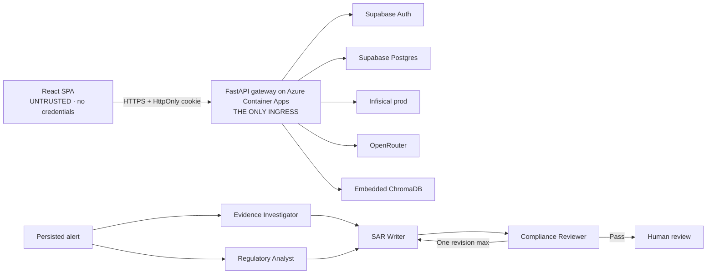

# Bounded multi-agent SAR workflow + gateway-only Azure deployment

> On approval, copy this file to `plans/2026-08-17-multi-agent-investigation-and-azure-deployment.md` (AGENTS.md Golden Rule 3) before any code change.

## Context

FraudLens runs one deterministic LangGraph pipeline — rules → XGBoost → SHAP → alert → RAG → **one** LLM SAR drafter ([`graph.py`](packages/fraudlens-ml/src/fraudlens_ml/pipeline/graph.py)). The single drafter is a black box: no record of which evidence supports which claim, no independent check for fabricated citations, and one undifferentiated cost number per draft.

This plan does two things:

1. **Phases 0–10** — add a **bounded four-agent enrichment branch** behind a feature flag, replacing only the SAR-drafting step for alerted runs. The detection pipeline is unchanged; edges are deterministic (no LLM supervisor).
2. **Phases 11–12** — close the perimeter (React becomes a fully external, credential-free client; the FastAPI gateway is the only ingress) and ship to Azure via GitHub Actions, keeping **Supabase** for Postgres+Auth, **Infisical** for secrets, and **OpenRouter** for every LLM call.



The multi-agent flag defaults `false` in `config/default.yaml` and `config/prod.yaml`, so `main` is deployable at the end of every phase and Phase 12 can ship with the flag off and flip it after.

---

## Architecture decisions

**A1 — `SarDrafter` stays the seam; the agent team is a third implementation.** [`sar/protocol.py`](packages/fraudlens-ml/src/fraudlens_ml/sar/protocol.py) already has two impls. Adding `MultiAgentSarDrafter` means `sar_drafts` persistence, cost rollup, review/approve, PDF generation, SSE, and regenerate all work with zero change. `LiveSarDrafter` already buffers the whole result and replays it through [`stream_result`](backend/src/fraudlens_backend/sar/streaming.py) ([`drafter_live.py:150`](backend/src/fraudlens_backend/sar/drafter_live.py:150)), so the typewriter UX is already synthetic.

**A2 — The agent graph lives in `backend/`, not `fraudlens-ml`.** The outer graph belongs in ml because it orchestrates ml. The agent graph orchestrates *nothing* in ml — every node is an LLM call plus DB tools, both backend-only. A "pure ml subgraph over Ports" buys a package boundary with exactly one implementation forever. Only `SarClaim`, `SarStreamEvent.agent`, and two `SarDraftResult` fields cross the seam.

**A3 — Native tool calling *and* JSON-Schema output are added to `fraudlens-llm`.** Today `Role` is `system|user|assistant` ([`models.py:77-83`](packages/fraudlens-llm/src/fraudlens_llm/models.py:77)), `LlmMessage` is `extra="forbid"` with `content: str` only, and [`openai_compatible.py:51-61`](packages/fraudlens-llm/src/fraudlens_llm/adapters/openai_compatible.py:51) rejects anything outside `_CHAT_PARAMS`. `response_format` is a *string*, so only `json_object` is expressible. Phase 1 adds both. `tools` and `response_schema` are explicit request arguments — **not** in `GenerationParams`, which stays a scalar allowlist so `params_to_dict` keeps working.

**A4 — Resume-by-replay over `agent_executions`, not a LangGraph checkpointer.** `run_id` is the thread id. Each node reads a completed row for `(run_id, agent, attempt)` **before** calling a provider. A checkpointer would require smuggling `agency_id` through a bare `thread_id` string — a tenancy footgun `check_tenancy.py` cannot catch — and pins the schema to langgraph's serde, which arrives transitively via langchain. Multi-replica safety comes from a Postgres advisory lock on `(agency_id, run_id)` taken before resume (no-op on SQLite for tests).

**A5 — Ground citations *after* the reviewer.** [`ground_citations`](backend/src/fraudlens_backend/sar/schema.py) silently drops ungrounded ids; grounding first means a fabricated citation is gone before the reviewer sees it and the check trivially always passes. Split `parse_and_ground` into `parse_content` + `ground_citations`, keeping `parse_and_ground` as their composition so the single-writer path is byte-identical.

**A6 — Deterministic checks run in Python *before* the reviewer LLM.** "Every claim carries ≥1 evidence ref" and "cited ids ⊆ available ids" are set operations. Compute them, feed the *result* into the reviewer prompt, let the LLM judge only materiality, tone, and regulatory fit.

**A7 — The parallel agents must not share an `AsyncSession`.** `EvidenceToolset` takes its own `async_sessionmaker`; the run store commits incrementally so tools see committed state. The parallel nodes write **disjoint** state keys or LangGraph raises `InvalidUpdateError`.

**A8 — Cost is bounded before the call, not after.** `BudgetGuard` is per-run, never process-wide (`_session_spent` accumulates forever at [`budget.py:71`](backend/src/fraudlens_backend/sar/budget.py:71)). On top of it, a **pre-flight worst-case estimate** (`Σ agents × max_output_tokens × catalog price`) denies a run *before* the first provider call. This closes the gap at [`factory.py:88`](backend/src/fraudlens_backend/sar/factory.py:88) where `BudgetGuard()` is uncapped and `llmDailyBudgetUsd` (already seeded) has no reader.

**A9 — Human approval needs no new machinery.** [`alert_workflow.py`](backend/src/fraudlens_backend/services/alert_workflow.py) already gates `SarStatus.APPROVED` behind `POST /alerts/{id}/sar/review`. The agent path terminates at `draft`. **No LangGraph HITL interrupt.** Tests assert no agent path reaches `approved`, `resolved`, or `dismissed`.

**A10 — Regenerate stays single-writer.** `regenerate_sar_for_run` has no `rag_context` and rebuilds citations from the prior draft's *already-grounded* subset, so an agentic regenerate can only lose citations; it also has no `emit`, so agent events would vanish. Documented in the module header.

**A11 — Extend, never duplicate, on the API surface.** No new business endpoints. `POST /investigations` gains `workflowMode` (mirroring the existing `modelOverride` + `require_permission` pattern); the snapshot, alert detail, dashboard metrics, `/readyz`, and the SSE stream are extended. The evaluation is a committed offline artifact — zero backend calls. The only genuinely new endpoints are the four gateway auth routes in Phase 11, which replace a capability the browser has today rather than adding one.

**A12 — Agents get a capability floor, stated and tested.** No agent may execute SQL, shell commands, arbitrary HTTP, client-supplied URLs, or any write action. **Tool argument schemas never contain `agency_id`** — the verified execution context supplies it, so a model cannot even express a cross-tenant request. Writer and Reviewer get an empty tool registry. Every tool result is fenced as untrusted data with the same `escape_as_data` treatment regulation excerpts already get ([`rag/citations.py`](packages/fraudlens-ml/src/fraudlens_ml/rag/citations.py)) — tool output is a new injection surface.

**A13 — Live means live.** In `llm_mode: live`, `/readyz` must report `ok` for `database`, `chromadb`, `supabaseAuth`, `infisical`, and a new `openrouter` check (key valid + every configured agent model resolvable). `skipped` is a **failure** in live profiles. No automatic live→mock fallback: `fallback_to_single_writer` degrades to the *other live drafter*, never the mock, and recorded demo runs are badged "Recorded".

**A14 — Supabase stays the database. I agree with you, but for a sharper reason than cost, and the tradeoff has a name.**

Cost is real: Azure Database for PostgreSQL Flexible Server has no persistent free tier (the 12-month new-account offer expires, then a burstable B1ms + storage + backups bills every month), which would exceed the entire rest of this stack running at scale-to-zero. But the stronger argument is **coupling**: Supabase is not just your Postgres, it is your **identity provider**. `supabase/2026-07-06-auth-claims.sql` installs the `custom_access_token_hook` that stamps `agency_id` and `user_role` into the access token; `JwksTokenVerifier` validates against Supabase JWKS; migration `0004_harden_supabase_access` force-enables RLS and revokes `anon`/`authenticated` grants. Moving to Azure Postgres means either keeping Supabase for Auth anyway — paying for both — or building an identity provider, which dwarfs this entire plan.

**The tradeoff you are accepting, named honestly:** Supabase Postgres is reachable from the internet. Azure Postgres could sit behind a private endpoint inside your VNet and be unreachable. Locking Supabase to your egress needs a static outbound IP, which needs NAT Gateway (~$36/month idle floor before data — more than the whole budget) *plus* Supabase network restrictions (a paid tier). So the mitigation is defence in depth at every other layer: enforced TLS, a least-privilege runtime role separate from the migration role, forced tenant RLS on every table, revoked PostgREST/browser grants, credentials only in Infisical, and — after Phase 11 — no browser anywhere near the database. That is appropriate for **synthetic data only**, and the security doc must say so plainly rather than imply a network allowlist exists.

**One thing to plan around:** free-tier Supabase projects **pause after ~7 days of inactivity**. A recruiter opening your demo three weeks later hits a dead backend. Phase 12 adds a cheap scheduled keep-alive to the existing GitHub Actions cron; Supabase Pro removes the pause if the demo ever matters more than the subscription.

**A15 — The gateway is the only ingress; React is an external entity.** Today the SPA holds `VITE_SUPABASE_URL` + `VITE_SUPABASE_ANON_KEY` and talks to Supabase directly via `@supabase/supabase-js` ([`frontend/src/lib/supabase.ts`](frontend/src/lib/supabase.ts)). Phase 11 removes that. What it actually buys, stated precisely: the anon key is publishable by design and RLS already blocks it, so this is **not** about the key leaking — it is that (a) a compromised SPA or XSS can no longer reach PostgREST at all, (b) tokens move from JS-readable storage into `HttpOnly` cookies so XSS cannot exfiltrate a bearer token, and (c) there is exactly one ingress to rate-limit, audit, and CORS-pin.

**A16 — Egress control is enforced at the application layer, not the network.** True FQDN egress filtering on Container Apps needs Azure Firewall (~$900/month) — categorically out of budget. The effective control is that **the application has no generic egress primitive**: no agent tool can issue HTTP, provider base URLs are pinned and https-validated in `config/llm/providers.yml`, and no client-supplied URL is ever fetched. On top of that, a subnet NSG with service-tag outbound rules removes the broad-internet default. State the residual clearly instead of claiming firewall-grade egress control.

**ADR-019 — Multi-agent SAR drafting: bounded enrichment, deterministic control, human authority.**
*Options:* keep the single writer only; add a model-directed supervisor; or add the selected fixed
four-agent graph behind the existing `SarDrafter` seam. *Why:* separate evidence and regulatory
analysis can improve grounding only if code still owns topology, termination, tool capability, cost,
and the human approval boundary. *Tradeoffs:* more latency, spend, persisted state, and reliance on a
subjective judge, plus synthetic-only evidence that does not authorize real-PHI use. *Reconsider:*
the paired evaluation shows no material benefit; a proposed role/tool cannot fit the fixed bounds; or
real PHI enters scope. Canonical record:
[`docs/architecture/adr/ADR-019-multi-agent-sar-drafting.md`](../docs/architecture/adr/ADR-019-multi-agent-sar-drafting.md).

---

## Configuration surface (no hardcoded values)

**New `config/llm/agents.yml`** — frozen `AgentsConfig` (pydantic, `extra="forbid"`), mirroring `SarLlmConfig` at [`sar/factory.py:41-63`](backend/src/fraudlens_backend/sar/factory.py:41). Every model ref must resolve in `config/llm/catalog.yml` **and** carry `tool_calling: true` if the agent declares tools; every tool name must resolve in the registry — all validated **at load**, so a typo fails fast. Duplicate YAML keys rejected.

```yaml
graph_version: agents-v1                  # stamped on analysis_runs beside rules/rag/prompt versions
workflow:
  max_revisions: 1
  parallel_investigation: true
  agent_timeout_s: 45
  workflow_timeout_s: 180
  max_cost_usd_per_investigation: 0.10    # pre-flight worst-case gate (A8)
  fallback_to_single_writer: true         # → LiveSarDrafter, never the mock (A13)
quotas:
  live_runs_per_ip_per_day: 3
  live_runs_total_per_day: 10
agents:
  evidence_investigator:
    model: openrouter/x-ai/grok-4.1-fast
    fallbacks: [openrouter/google/gemini-2.0-flash-001]
    prompt_id: v1
    max_output_tokens: 900
    max_tool_calls: 6
    tools: [transaction_history, rule_hits, shap_drivers, alert_history]
  regulatory_analyst:
    model: openrouter/google/gemini-2.0-flash-001
    fallbacks: [openrouter/x-ai/grok-4.1-fast]
    prompt_id: v1
    max_output_tokens: 900
    max_tool_calls: 4
    tools: [regulation_search]
    top_k: 6
  sar_writer:
    model: openrouter/openai/gpt-5-mini
    fallbacks: [openrouter/anthropic/claude-sonnet-4.6]
    prompt_id: v1
    max_output_tokens: 1400
    reasoning_effort: low
    tools: []                             # synthesizes only what it was handed
  compliance_reviewer:
    model: openrouter/anthropic/claude-sonnet-4.6
    fallbacks: [openrouter/openai/gpt-5-mini]
    prompt_id: v1
    max_output_tokens: 800
    tools: []                             # no tools, no network
```

All eight refs already exist as `callable: true` OpenRouter entries. Phase 1 adds `tool_calling` / `structured_output` capability flags (`ModelCard` is `extra="allow"`, so additive) and Phase 2 re-verifies the catalog against the live registry with `make llm-catalog-check --live`, refreshing `verified_at` and retiring anything no longer served. **Model ids change only on evidence from that live check.**

**New prompts** — `config/llm/prompts/agents/<agent>/v1.md`, same YAML-front-matter + hashed-body format as `config/llm/prompts/sar/v1.md`. Reuse `_split_front_matter` from [`sar/prompt.py:84-95`](backend/src/fraudlens_backend/sar/prompt.py:84) via a shared loader — do not copy it.

**`AppSettings`** (flat, `extra="forbid"`) gains `multi_agent_sar_enabled: bool = False` and `multi_agent_config_file`, mirroring `portfolio_demo_enabled` / `portfolio_demo_config_file`. `false` in `default.yaml`/`prod.yaml`, `true` in `dev.yaml`. Phase 11 adds `session_cookie_name`, `session_cookie_domain`, `csrf_cookie_name`, `frontend_origin`, `access_token_ttl_s`, `refresh_token_ttl_s`.

**Runtime per-agency enable** wires the existing-but-unread `system_config.featureFlags` key (seeded at [`scripts/seed.py:103`](scripts/seed.py:103)) with a `featureFlags.multiAgentSar` reader modeled on `load_label_maturity_days`. **ANDed** with the settings flag, **failing closed** on any DB error.

**Prompt-risk trap:** [`security/prompt_risk.py:23-63`](packages/fraudlens-llm/src/fraudlens_llm/security/prompt_risk.py:23) flags the bare words `run|execute|shell|terminal|curl|wget` and `token|secret|password|credential|api key`. Agent prompts and tool *descriptions* must avoid those verbs, and every agent call passes `TaskType.ANALYSIS` so injection-shaped regulatory text FLAGS rather than blocks.

---

## Phases

### Phase 0 — Contract extensions + parity guard (no behavior change)

| Action | Files |
|---|---|
| `SarClaim` (statement + evidenceRefs + citationIds); `SarDraftContent.claims = ()`; `SarAgentEvent`; `SarEventType.AGENT_*`; `SarStreamEvent.agent`; `SarDraftResult.workflow`/`revision_count` (defaults keep mock/live untouched) | [`sar/protocol.py`](packages/fraudlens-ml/src/fraudlens_ml/sar/protocol.py), `sar/__init__.py` |
| Add `agent.started`, `agent.completed`, `agent.revision.requested` to **both** enums, value-identical. `agent.tool.completed` is **ephemeral** (emit-only, no `seq`) like `sar.token` — the authoritative record is `agent_executions.tool_calls`, which replays fine, so live tool granularity costs zero extra commits | [`pipeline/events.py:65-75`](packages/fraudlens-ml/src/fraudlens_ml/pipeline/events.py:65), [`db/models/enums.py:106`](backend/src/fraudlens_backend/db/models/enums.py:106) |
| Split `parse_and_ground` → `parse_content` + `ground_citations`; `render_markdown` byte-identical when `claims` is empty | [`sar/schema.py`](backend/src/fraudlens_backend/sar/schema.py) |
| Fix: `except Exception: terminal = None` discards an already-captured terminal result | [`pipeline/graph.py:115-116`](packages/fraudlens-ml/src/fraudlens_ml/pipeline/graph.py:115) |
| Declare `langgraph` explicitly (today only transitive via `langchain`) | `backend/pyproject.toml` |

**No migration.** `analysis_run_events.event_type` uses `str_enum(...)` with `create_constraint=False` ([`db/base.py:61-68`](backend/src/fraudlens_backend/db/base.py:61)) → no DB CHECK, so new values need no DDL.

**Tests:** new `tests/unit/test_pipeline_event_parity.py` asserting `{e.value for e in PipelineEventType} == {e.value for e in AnalysisRunEventType}` — the invariant [`pipeline_wiring.py:249`](backend/src/fraudlens_backend/pipeline_wiring.py:249) depends on and nothing guards today. Plus `claims` default/alias round-trip and a `render_markdown` golden.

### Phase 1 — Native tool calling + JSON-Schema output in `fraudlens-llm`

| Action | Files |
|---|---|
| `Role.TOOL`; `ToolDefinition` / `ToolCall`; `LlmMessage` accepts `tool_calls` (assistant) and `tool_call_id` (tool role), `content` optional when `tool_calls` present; `LlmResult.tool_calls` | [`models.py`](packages/fraudlens-llm/src/fraudlens_llm/models.py) |
| `ModelCard.tool_calling` / `structured_output` flags | [`catalog.py`](packages/fraudlens-llm/src/fraudlens_llm/catalog.py), `config/llm/catalog.yml` |
| `tools`, `tool_choice`, `response_schema` as explicit request args; `CapabilityMismatchError` when passed to a card lacking the capability | [`client.py`](packages/fraudlens-llm/src/fraudlens_llm/client.py), `adapters/base.py` |
| `AdapterGenerateResult.tool_calls`; extend `ProviderAdapter` protocol | [`adapters/base.py`](packages/fraudlens-llm/src/fraudlens_llm/adapters/base.py) |
| Pass `tools`/`tool_choice`; emit `response_format={"type":"json_schema",…}`; parse `choice.message.tool_calls` | [`adapters/openai_compatible.py`](packages/fraudlens-llm/src/fraudlens_llm/adapters/openai_compatible.py) |
| Map to Anthropic `tool_use` / `tool_result` blocks | [`adapters/anthropic.py`](packages/fraudlens-llm/src/fraudlens_llm/adapters/anthropic.py) |
| PHI-mask and prompt-risk-scan **tool arguments and tool results** as message content; new `security/tools.py` validating arg shape against the declared schema and rejecting private-IP / file / non-allowlisted URL-shaped args (A16) | `security/`, `client.py` `_prepare_generation` |
| Require the capability flags on every model an `agents.yml` role references | [`scripts/check_llm_catalog.py`](scripts/check_llm_catalog.py) |

**Tests:** tool round-trip on both adapters against fakes; capability mismatch raises; PHI in a tool result is masked; an arg failing its schema is rejected before the provider call; a URL-shaped arg pointing at a private IP is rejected; fallback to a non-tool-capable model is refused; **existing non-tool calls byte-identical** (regression).

### Phase 2 — Agent runtime, config, prompts (dead code, fully tested)

New: `backend/src/fraudlens_backend/agents/{__init__,config,contracts,prompts,runtime}.py`; `config/llm/agents.yml`; four prompt templates.

`contracts.py` holds the typed I/O — `EvidenceBrief`, `RegulatoryBrief`, `ReviewVerdict`, `AgentExecutionRecord` — each also serving as its agent's `response_schema`.

`runtime.py` is the one bounded loop: build messages → `client.generate(..., tools=allowlist, response_schema=…, task_type=ANALYSIS)` → validate each returned tool call against **the agent's own allowlist** (an unlisted tool is refused, recorded as `unauthorized_tool_call`, loop continues with a refusal message) → execute → fence the result → append as `Role.TOOL` → repeat to `max_tool_calls` → parse the final structured output. Wrapped in `asyncio.timeout(agent_timeout_s)`; expiry yields a `degraded` execution, never a run failure. Cost priced by `estimate_cost_usd` against `llm_result.model` (the **served** ref after fallback), as `drafter_live.py:163-169` already does.

Also: re-verify the catalog live, refresh `verified_at`, retire dead entries.

**Tests** (fake `LlmClient`): final on turn 1; N tool calls then final; exceeds `max_tool_calls` → degraded; unlisted tool → refused + recorded + continue; malformed JSON → degraded; retryable vs non-retryable `LlmError`; timeout → degraded; guardrail FLAG recorded; cost priced from served ≠ requested ref; pre-flight estimate denies before any call.

### Phase 3 — Tenant-scoped tools (dead code, fully tested)

New: `backend/src/fraudlens_backend/agents/tools.py` — a `ToolSpec` registry (name, description, JSON arg schema, handler) and `EvidenceToolset(sessionmaker, agency_id, run_id)`.

Tools: `transaction_history`, `rule_hits`, `shap_drivers`, `alert_history` (via `TenantScopedRepository` subclasses, so `agency_id` filtering is by construction) and `regulation_search` (via the existing `RetrieverAdapter` — no new ChromaDB path). Every tool is **read-only**, returns a pydantic model of structured ids and aggregates — never free text, since the client masks message content and free text would reach the agent as `[MASKED]` — and takes its own session per A7. Per A12, **no tool argument schema contains `agency_id`**.

**Tests** (`tests/integration/test_agent_tools.py`): **parametrized over the registry** — seed two agencies, bind to A, assert B's rows are invisible and a cross-agency id returns empty. Assert `set(registry) == set(tested)` so a future tool added without an isolation test fails CI. Assert no schema declares `agency_id`.

### Phase 4 — Agent graph + drafter (still unreachable)

New: `agents/graph.py`, `agents/checks.py`, `sar/drafter_multi_agent.py`.
Modified: [`sar/factory.py`](backend/src/fraudlens_backend/sar/factory.py) (`build_agent_drafter_factory`, per-run `BudgetGuard` + pre-flight gate); [`pipeline/graph.py`](packages/fraudlens-ml/src/fraudlens_ml/pipeline/graph.py) `_drive_drafter` gains an agent-event branch routing `SarStreamEvent.agent` through `persist_and_emit` (or bare `emit` for the ephemeral tool event).

`checks.py` holds the deterministic gates (A6). `graph.py` wires `START → {evidence, regulatory} → writer → reviewer → conditional(END | writer)`; **the router reads `state["revision_count"]` and there is no back-edge at the cap** — the bound is structural, not prompted. A second revision request terminates at human review with the draft persisted and the verdict recorded as `review_unresolved`; a reviewer failure or timeout persists as `review_unavailable`. **Neither is ever auto-approved.**

**Tests:** pass first time (4 executions, 0 revisions); fail-then-pass (5, `revision_count == 1`); **fail twice → exactly two writer executions**, `review_unresolved`, no loop; reviewer times out → `review_unavailable`; investigator degrades → writer still runs on partial evidence; writer fails → terminal `failed` (run still completes with score+SHAP+RAG); reviewer degrades → deterministic checks decide alone; a fabricated citation survives to the reviewer (proves A5 ordering).

### Phase 5 — Persistence

New: `db/models/agents.py`, `db/repositories/agents.py`, `alembic/versions/0005_add_agent_executions.py`.

`agent_executions`: `AgencyScopedMixin` + `run_id` FK, `agent`, `attempt`, `model_id`, `prompt_version`, `prompt_hash`, `input_hash`, `result_hash`, `status` (`completed|degraded|failed`), `error_code`, `latency_ms`, `input/output/total_tokens`, `cost_usd NUMERIC(12,6)`, `result JSONB`, `tool_calls JSONB`. `Index("ix_agent_executions_agency_id_run_id", "agency_id", "run_id")` + `UniqueConstraint("run_id","agent","attempt")` — resume and duplicate-charge prevention both depend on it. `result` is the claim-to-evidence traceability artifact, PHI-masked on serialization via `fraudlens_core.phi.mask_text`. `input_hash` lets resume detect changed inputs and re-run rather than replay a stale result.

`analysis_runs` gains `workflow_mode` (the *requested/resolved* mode, alongside existing `model_version`/`rules_version`/`rag_version`/`prompt_version` provenance), `graph_version`, and a hashed tenant-scoped `idempotency_key` replacing `RunManager`'s in-process LRU — its own docstring calls that the "deferred queue-ready seam"; a DB-backed key survives restarts and second replicas.

`sar_drafts` gains `workflow` (which drafter produced *this artifact*) and `revision_count`. Both levels are needed and are **not** duplicates: when `fallback_to_single_writer` fires, `analysis_runs.workflow_mode = multi_agent` while `sar_drafts.workflow = single_writer` — that divergence is exactly the signal you want visible. **No `review_verdict` column** — it duplicates the reviewer's `agent_executions.result`; join instead. Surface all of it on `SarDraftView` / `sar_draft_to_view`.

**No RLS DDL in the migration.** [`0004_harden_supabase_access.py:124-140`](alembic/versions/0004_harden_supabase_access.py:124) installs a `ddl_command_end` trigger auto-hardening every new table; hand-written RLS would be redundant and would drift.

**Tests:** existing `tests/integration/test_migrations.py` asserts migrated tables == `Base.metadata.tables` exactly and that `downgrade(base)` leaves only `alembic_version` — so a real `drop_table` and SQLite-safe types (`JSONB_TYPE`, `Uuid`, `str_enum`). New: cross-tenant read empty; unique constraint conflicts; duplicate submission with the same idempotency key returns the same `runId` across a simulated restart. `agent_executions` is not in `PLATFORM_TABLES`, so `scripts/check_tenancy.py` covers it automatically.

### Phase 6 — Wiring, flags, fallback, API surface — **feature live, default off**

| Action | Files |
|---|---|
| `multi_agent_sar_enabled` + `multi_agent_config_file` | [`settings.py`](backend/src/fraudlens_backend/settings.py), `config/{default,dev,staging,prod}.yaml` |
| `load_feature_flags` from `system_config.featureFlags`, **ANDed** with the settings flag, **failing closed** | `db/repositories/` |
| `PipelineComponents.agent_drafter_factory`; drafter selection + per-run `EvidenceToolset` binding | [`pipeline_wiring.py:395-627`](backend/src/fraudlens_backend/pipeline_wiring.py:395) |
| `MockAgentTeam` for `llm_mode == "mock"` — deterministic, keyless, emits the **full** event sequence including exactly one `agent.revision.requested` on a designated scenario (required for browser validation without spend) | `agents/mock.py` |
| `workflowMode` on `POST /investigations`, admin/eval-restricted via `require_permission` | [`api/v1/investigations.py`](backend/src/fraudlens_backend/api/v1/investigations.py) |
| **Extend** the snapshot with `agentExecutions[]`, `workflowMode`, `graphVersion`, `revisionCount`, `sarContent` | `api/v1/investigations.py`, `models/investigations.py` |
| **Extend** alert detail with the same trace, top-level (it exists even when drafting failed) | [`api/v1/alerts.py`](backend/src/fraudlens_backend/api/v1/alerts.py) |
| **Extend** `LlmCostMetrics` with an agent-cost split | [`db/repositories/dashboard.py:135`](backend/src/fraudlens_backend/db/repositories/dashboard.py:135) |
| **Extend** `/readyz` with an `openrouter` check; `skipped` fails in live profiles (A13) | [`api/ops.py`](backend/src/fraudlens_backend/api/ops.py) |
| Wire `llmDailyBudgetUsd` + pre-flight gate + per-IP/per-day quotas through the existing limiter | `sar/factory.py`, `config/portfolio-demo.yaml` |
| Add the new routes' policy rows (nothing bypasses the routing table) | `config/gateway/routes.yaml` |

**Tests:** flag matrix (off / env-only / agency-only / both / DB-error); end-to-end asserting agent events land in `analysis_run_events` in order, replay from `Last-Event-ID` returns them, `sar_drafts.workflow == "multi_agent"`; **no agent path sets `SarStatus.APPROVED` or resolves/dismisses an alert**; an unrecoverable fault degrades to `LiveSarDrafter` and never the mock; quota exhaustion returns the existing `rate_limited` envelope; a run over the worst-case budget is denied before any provider call.

### Phase 7 — Resume + per-agent telemetry

Resume-by-replay (A4): at graph entry take a Postgres advisory lock on `(agency_id, run_id)`, load completed executions, short-circuit each node whose `input_hash` still matches. Tests: kill mid-graph, restart, assert completed agents are not re-invoked and cost does not double; two concurrent resumers do not both execute a node.

`log_llm_call` **per agent** with `latency_ms` populated. Today it fires once per draft ([`pipeline_wiring.py:315`](backend/src/fraudlens_backend/pipeline_wiring.py:315)) and never passes `latency_ms` — with 4–6 calls per draft it under-reports by ~5×. `sar_drafts.cost_usd` stays the **sum**, so existing dashboards and budget logic are unaffected.

### Phase 8 — Frontend: execution timeline + provenance

The timeline expands the **machine-progress** axis (today one status `Badge`), not the human wizard. It sits **alongside** `CaseStepper` in a right-hand rail using the existing `DecisionRail`. A stepper has one cursor; the agent workflow forks (parallel) and loops back (revision) — neither is renderable linearly, and replacing it would mean rewriting `currentStep`/`handlePrimary`/`canAdvance`/`primaryLabel`.

| Action | Files |
|---|---|
| `AgentRun`/`AgentTimelineRow` types, new `INVESTIGATION_EVENTS` entries, reducer cases with `upsertAgentRun` keyed on `agentRunId` (**not** agent — the revision loop produces two writer and two reviewer rows), pure `investigationTimeline(state)` builder | [`lib/investigation.ts`](frontend/src/lib/investigation.ts) |
| New `Disclosure` primitive — real `<button aria-expanded aria-controls>` + always-mounted panel toggled with `hidden`. None exists today (only a raw `<details>` at `Research.tsx:488`) | `components/ui/Disclosure.tsx` |
| New `AgentTimeline` — `<ol>`, nested `<ol>` for the parallel fork, **exactly one** `aria-live="polite"` region. Reused by Investigation **and** AlertDetail | `components/AgentTimeline.tsx` |
| `agentTone`/`agentGlyph` — semantic palette only; brand green never appears in the rail | [`lib/risk.ts`](frontend/src/lib/risk.ts) |
| `formatDurationMs` | [`lib/format.ts`](frontend/src/lib/format.ts) |
| Extend `InvestigationSnapshot` + `AlertDetailResponse` + `snapshot()` factory | [`lib/api.ts`](frontend/src/lib/api.ts), [`test/factories.ts`](frontend/src/test/factories.ts) |
| "How this SAR was produced" card + an **"Open the investigation run"** button | [`pages/AlertDetail.tsx`](frontend/src/pages/AlertDetail.tsx) |

Each card expands to purpose, evidence consumed, tool calls made, structured result, model + prompt + graph version, latency, tokens, cost, retry/degraded/failed state.

**`degraded` vs `failed`** separate on four axes, not just hue: degraded produced a *usable* result off the happy path (warning tone, `!`, badge names the reason, row expands to the result plus a consequence note, downstream continues); failed produced *none* (negative tone, `×`, panel shows only `humanize(errorCode)`, downstream rows render `skipped`). A single failed agent must **not** trigger the page-level `ErrorState` — that is reserved for `run.failed`.

**Flag-off renders the same component with four rows** (Rules → Risk scored → SAR drafted → Awaiting human review), header badge "Single-writer" instead of "4-agent review". One component, two arms, comparable screenshots. Recorded demo runs badged **"Recorded"** (A13).

**Three UI gaps this phase closes:** `AlertDetail.tsx` imports no router, so there is **no button** from an alert back to its run (only a typed URL — which the validation forbids); revisiting a completed run renders "No SAR draft yet" because `sarText` comes only from ephemeral `sar.token` events (fixed by `sarContent` from Phase 6); the Investigate affordance is a bare 20px chevron ([`Transactions.tsx:408-417`](frontend/src/pages/Transactions.tsx:408)) needing a visible label.

**Trap to test:** `INVESTIGATION_EVENTS` goes straight to `createSseClient({events})` and becomes a subscription `Set` — an omitted event is **silently dropped, not an error**. One test asserts the array covers every new event and the reducer handles each; a second feeds one sequence through live emission and through a fresh replay and asserts `investigationTimeline` deep-equals across both, plus the snapshot path.

Read `DESIGN.md` before any UI edit; tokens only.

### Phase 9 — Adversarial security pass

Dedicated hardening under the existing `tests/security/`, because tool calling is a genuinely new attack surface.

Cases: prompt injection embedded in **transaction free-text fields** and in **regulatory corpus documents**; forged/near-miss citation ids; a tool argument shaped as a private-IP or `file://` URL (SSRF); malformed or oversized tool calls; excessive model output; invalid JSON against the declared schema; per-agent timeout; OpenRouter outage; Infisical outage; Supabase outage mid-graph; SSE reconnect; duplicate submission with the same idempotency key; process restart mid-graph; an attempt to reach another tenant's transaction id through every tool.

**Acceptance gate (all must hold):** zero cross-tenant leaks · zero unauthorized tool calls executed · at most one revision · 100% of claims resolve to persisted evidence · 100% of cited ids resolve to corpus documents · no agent path reaches `approved`/`resolved`/`dismissed` · no regression vs the single-writer baseline on unsupported claims or citation correctness.

### Phase 10 — Published evaluation + ADR

LLM judge as the primary quality metric, following the Research/GFP precedent exactly: offline generator → committed JSON artifact → lazily-loaded page → ADR → Makefile targets → synthetic-data banner, **no backend call**.

New: `scripts/benchmark_sar_agents.py` + `scripts/lib/sar_eval/{config,scenarios,runner,judge,metrics,report,publish}.py`; artifacts in `docs/reference/benchmarks/` and `frontend/src/data/`; `frontend/src/pages/SarEvalStudy{,Route}.tsx`; `docs/architecture/adr/ADR-019-multi-agent-sar-drafting.md` (+ both index tables); a "Multi-agent SAR study" entry in the existing sidebar Research group.

**Scenarios:** 32 paired (8 typologies × 4 variants — `clean`, `thin_evidence`, `conflicting_evidence`, `citation_bait`), seeded and deterministic. Both arms drive through the **real API** using `workflowMode`, not a bypass path — so the study measures the shipped system.

**Judge protocol** — designed to survive "how do you know the judge is right?":
- Judge is a **different family** from the writer (`anthropic/claude-opus-4.6` vs writer `openai/gpt-5-mini`) to blunt self-preference; recorded in the artifact.
- Judge prompt versioned + content-hashed like the SAR prompt; both hashes published.
- **Blind and order-randomized** — the judge never learns which arm produced a narrative; A/B order shuffled per scenario.
- **3 independent samples per narrative**; report the median and publish inter-sample agreement so a reader can see the judge's own stability.
- The judge scores only what needs judgement: unsupported claims and narrative completeness (five FinCEN elements, each pass/fail with a quoted span).
- **Citations, cost, latency, and model calls stay programmatic** — citation ids are a closed vocabulary from `scripts/ingest_rag.py`, so precision/recall/fabricated-count involve no interpretation.
- Paired deltas with a BCa bootstrap 95% CI (10k resamples, fixed seed). `significant` is **derived** from the interval excluding zero and validated at parse time — a significance claim the interval doesn't support is a build failure.
- The headline sentence follows the **sign of the measured delta**. If multi-agent loses, the page says so.

**Makefile:** `sar-eval-scenarios` (free), `sar-eval-run` (**spends** — Infisical-wrapped, hard USD cap), `sar-eval-judge` (**spends**), `sar-eval-publish` (validate + atomic publish + SHA-256 binding so the two committed artifacts cannot drift), `sar-eval-test` (added to `make ci`). Only the two spending targets reach a provider, exactly as `gfp-benchmark` is separated from `gfp-publish`.

### Phase 11 — Gateway-only perimeter: React becomes a credential-free external client

Implements A15. **Nothing in the browser bundle may address Supabase, Infisical, or OpenRouter.**

| Action | Files |
|---|---|
| Four gateway auth routes — `POST /api/v1/auth/login`, `POST /api/v1/auth/refresh`, `POST /api/v1/auth/logout`, `GET /api/v1/auth/session`. The gateway calls Supabase Auth server-side and never returns the Supabase access token to the browser | new `backend/src/fraudlens_backend/api/v1/auth.py`, `api/v1/router.py` |
| Session state in a `Secure` + `HttpOnly` + `SameSite=Strict` cookie; refresh token in a separate cookie scoped to the refresh path only; CSRF double-submit token in a readable cookie + `X-CSRF-Token` header required on every state-changing request | new `middleware/csrf.py`, [`api/deps.py`](backend/src/fraudlens_backend/api/deps.py) |
| **Bearer auth stays supported** for CLI, smoke tests, and the eval harness — cookie and bearer resolve to the same `AccessClaims`, so RBAC/tenancy are untouched | `api/deps.py` |
| Exact-origin CORS (`frontend_origin`, no wildcard) with `allow_credentials: true`; add the auth routes to the routing table with their own tighter rate limit | `config/gateway/routes.yaml`, `config/{staging,prod}.yaml` |
| Delete `@supabase/supabase-js`, `VITE_SUPABASE_URL`, `VITE_SUPABASE_ANON_KEY`, `lib/supabase.ts`; rewrite `lib/session.ts` and the `send()` 401-refresh path to call the gateway; `credentials: "include"` on every request | [`frontend/src/lib/supabase.ts`](frontend/src/lib/supabase.ts) (removed), [`lib/config.ts`](frontend/src/lib/config.ts), [`lib/session.ts`](frontend/src/lib/session.ts), [`lib/api.ts`](frontend/src/lib/api.ts), [`pages/Login.tsx`](frontend/src/pages/Login.tsx), `vite-env.d.ts`, `package.json` |
| The SSE client already uses `fetch` (not `EventSource`) so it carries cookies with one `credentials` flag — no rework | [`lib/sse.ts`](frontend/src/lib/sse.ts) |
| A CI guard asserting the built bundle contains no `supabase.co`, no `VITE_SUPABASE_*`, and no non-gateway origin | `scripts/check_frontend_egress.py`, added to `make ci` |

**Tests:** login sets `HttpOnly` cookies and returns no token in the body; a state-changing request without `X-CSRF-Token` is 403; an expired session refreshes once then signs out; bearer clients still authenticate; cross-origin requests from a non-configured origin are rejected; **the bundle guard fails when a Supabase reference is reintroduced**.

**Honest scope note:** this hardens the browser surface (no PostgREST reachability, no JS-readable token, one auditable ingress). It does **not** make Supabase network-private — see A14.

### Phase 12 — Azure deployment via GitHub Actions

You have an Azure account and are new to Azure, so this phase is written to be followed step by step, and every irreversible action is gated. **Nothing here is applied without explicit permission (Golden Rule 1).**

Existing scaffolding is further along than a greenfield start: `infra/terraform/{modules,environments/{dev,prod}}` already has `networking`, `observability`, `acr`, `blob`, `identity`, `gateway_app` (external HTTPS-only, `revision_mode = "Multiple"`, ML-aware startup probe), `service_app` (inert), `jobs`; and `.github/workflows/deploy-backend.yml` already has `verify → build-push → infra → stage(0% revision) → migrate → smoke` with Azure OIDC login and Infisical OIDC secret fetch, all gated on `vars.AZURE_DEPLOY_ENABLED`. This phase fills the gaps.

**12.1 — Beginner runbook.** New `docs/runbooks/azure-deployment.md` with copy-pasteable commands for: `az login` → select subscription → **register resource providers** (`Microsoft.App`, `Microsoft.ContainerRegistry`, `Microsoft.OperationalInsights`, `Microsoft.Storage`, `Microsoft.Insights`, `Microsoft.Network`) → create the Terraform state storage → bootstrap apply → set GitHub repo variables → first deploy → verify → **rollback** → **teardown** (`az group delete`) → **check spend** (`az consumption budget list`). Also a "what this costs" table with the caveat that list prices change and the budget alert is the real guard.

**12.2 — Terraform: new `infra/terraform/bootstrap/` root** (run once, locally, by you):
- `fraudlens-tfstate-rg` + storage account + `tfstate` container matching the existing `backend.tf.template`.
- A user-assigned managed identity for GitHub with a **federated credential** bound to `repo:Kartik-Hirijaganer/FraudLens:environment:production` — **no client secret ever**.
- RBAC scoped to the prod resource group + the state container only, plus `AcrPush`.
- Chicken-and-egg note: the state container must exist before Terraform can use it remotely. The runbook creates it with two documented `az` commands (the one unavoidable manual step), then `terraform init` migrates bootstrap state into it.

**12.3 — Terraform: prod changes**

| Change | Where | Why |
|---|---|---|
| `acr_enabled = true`; identity gets `AcrPull`, GitHub identity `AcrPush`; drop public GHCR for deployed images | `environments/prod/prod.tfvars`, `modules/identity` | private registry; supply-chain hygiene |
| `lifecycle { ignore_changes = [template[0].container[0].image, ingress[0].traffic_weight] }` | `modules/gateway_app` | **critical** — otherwise Terraform fights the deploy job over the live image and traffic split and can silently roll back a promotion |
| New `modules/budget` — `azurerm_consumption_budget_resource_group`, default $25/mo, alerts at 50/80/100% | new module + prod root | you asked for cost safety; this is the real guard |
| NSG on the apps subnet: outbound deny-by-default plus service-tag allows (`AzureCloud` regional, `AzureMonitor`, `AzureContainerRegistry`, `Storage`) and HTTPS/443 for OpenRouter+Supabase+Infisical | `modules/networking` | removes the broad-internet default; see A16 for what it does not do |
| Daily ingestion cap + retention on Log Analytics | `modules/observability` | Log Analytics is the most likely bill surprise |
| Min TLS 1.2, no anonymous access, subnet restriction | `modules/blob` | verify, likely already set |
| New env vars: `FRAUDLENS_FRONTEND_ORIGIN`, session/CSRF cookie config, `FRAUDLENS_MULTI_AGENT_SAR_ENABLED`, non-secret Infisical project/identity/path refs | `modules/gateway_app` | Phase 11 + Phase 6 config; **Terraform never receives a DB password, Supabase key, or OpenRouter key** |
| Keep `services_split_enabled = false` | prod root | single external gateway is the whole point (ADR-004) |

**12.4 — GitHub Actions changes** to [`deploy-backend.yml`](.github/workflows/deploy-backend.yml):
1. `build-push` targets **ACR** (`az acr login` via OIDC) instead of GHCR; capture the **immutable digest** and deploy by digest, not tag.
2. Add a `production` GitHub environment with a required reviewer on `infra` and `promote`.
3. `infra` writes the plan to an artifact, waits for approval, then applies **that exact plan** (no re-plan drift).
4. `migrate` moves off the runner into a **Container Apps job** that fetches `DATABASE_URL` from Infisical with its managed identity — so GitHub runners never hold database credentials. (Today it runs Alembic on the runner.)
5. `smoke` requires `/healthz = 200` **and** `/readyz = 200` with `database`, `supabaseAuth`, `infisical`, `openrouter`, `chromadb` all explicitly `ok` (A13), then runs an authenticated synthetic multi-agent investigation asserting agent executions, citations, cost, and the human-review gate.
6. **Promote to 100% only after every gate**; otherwise deactivate the new revision and leave the prior one at 100%.
7. Frontend deploys **after** backend promotion; [`deploy-frontend.yml`](.github/workflows/deploy-frontend.yml) passes only `VITE_API_BASE_URL` — the Supabase vars are gone with Phase 11.
8. Add a Supabase **keep-alive** to the existing scheduled workflow so the free project never pauses (A14).
9. `AZURE_DEPLOY_ENABLED` / `VERCEL_DEPLOY_ENABLED` stay `false` until bootstrap, the local acceptance gate, production variables, and a rollback drill are all done.

**12.5 — Deployed browser UAT.** Repeat the click-path below against the deployed URL, plus: confirm in the browser Network tab that **no request targets `*.supabase.co`, Infisical, or OpenRouter**; confirm the session cookie is `HttpOnly` and `Secure`; confirm a request with a stripped CSRF header is rejected; drill a rollback by promoting the previous revision.

---

## Verification

Every phase ends with `make pre-pr` (fmt → docs → ci) plus `drift-check plans/2026-08-17-multi-agent-investigation-and-azure-deployment.md phase=<N>`. New source files need the SUMMARY header. `diff-cover --fail-under=90` runs on changed lines, so every new branch needs a named test. Nothing is committed, pushed, or provisioned without explicit permission.

### Browser validation — navigate by clicking only

Boot with **`make run`** (clean rebuild; exports `FRAUDLENS_LLM_MODE=mock` → **zero OpenRouter spend**), with `multi_agent_sar_enabled: true` in `config/dev.yaml`. **Not** `make run-live` / `make run-live-demo` — those spend. Read the printed `http://localhost:<port>`; that URL is the only address typed anywhere.

1. Open the printed URL → split-panel login.
2. Click **"Demo · sign in as"** → click **Reviewer** (analyst lacks `reviewSar` and dead-ends at approval) → click **Sign in**.
3. Click **Transactions** in the sidebar → click the **High** segment in the risk-band filter.
4. Click **Investigate** on the first row.
5. Observe the rail: Rules ✓ → Risk scored ✓ → ⟦parallel: Evidence investigator, Regulatory analyst⟧ → SAR drafted → Compliance review → Awaiting human review. On the designated mock scenario: **Revision requested**, a second **SAR drafted (attempt 2)** row, then review passes.
6. Click **Evidence investigator** → panel shows purpose, evidence consumed, tool calls, structured result, model + prompt + graph version, duration, tokens, cost. **Tab / Shift+Tab / Space** to confirm the keyboard contract. Click **Compliance reviewer** → verdict + revision reason.
7. Click the primary CTA four times. **Cross-check at Citations:** the citations shown are the ones the Regulatory Analyst row claimed — this is what makes the trace credible rather than decorative.
8. Click **Approve SAR** → toast → auto-navigates to Alerts.
9. Click **Review** on the top alert → SAR **Approved**; the **"How this SAR was produced"** card renders the same rows from the *persisted* trace.
10. Click **Open the investigation run** → the rail reconstructs identically from persisted replay. **Replay proof.**
11. Kill the backend mid-run, restart, reconnect from the same page → stream resumes, no completed agent re-runs (Phase 7 proof).
12. `make local-demo-down`, flip the flag `false`, `make run`, repeat 2–5 → four rows, no agent rows, wizard identical. Reopen the approved alert → **"Single-writer draft"**, not a broken card.
13. Click **Research → Multi-agent SAR study** → banner, ADR-019 link, delta tiles, per-scenario table; Network tab shows **zero** `/api/v1/` requests.
14. Click **Sign out** → returns to login; no protected route renders. Network tab shows **zero** requests to `*.supabase.co` for the whole session (Phase 11 proof).

### Pre-existing gaps this work closes

`langgraph` undeclared (P0) · `_drive_drafter` discarding a captured terminal result (P0) · no event-enum parity guard (P0) · `BudgetGuard()` uncapped and `llmDailyBudgetUsd` unread (P6) · `system_config.featureFlags` seeded with no reader (P6) · `/readyz` reporting `skipped` in live profiles with no OpenRouter check (P6) · in-process-only idempotency that dies on restart or a second replica (P5) · `log_llm_call` never receiving `latency_ms` (P7) · no click-path from an alert to its run (P8) · completed runs rendering "No SAR draft yet" (P8) · the browser holding Supabase credentials and reaching Supabase directly (P11) · Terraform able to clobber the live image/traffic split (P12).
