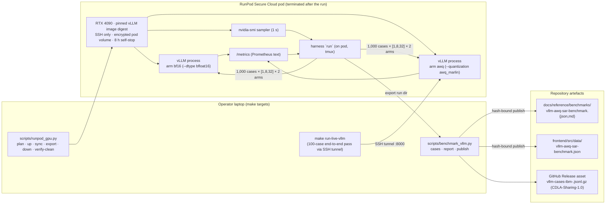
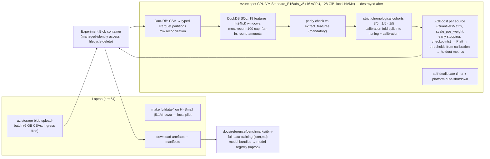
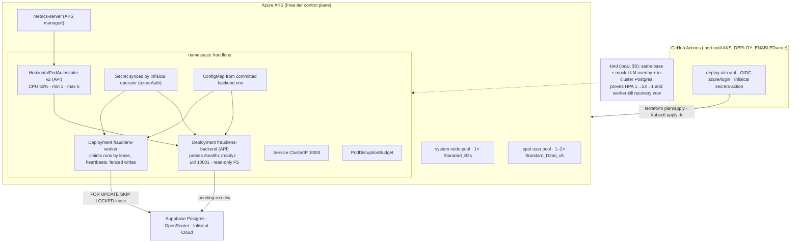

# vLLM + AWQ SAR-inference benchmark (1,000 cases), full-scale IBM training on Azure, Kubernetes (AKS) with HPA, durable execution, and quality/privacy gates — release 0.3.0

> **Status:** implemented and release evidence published 2026-09-15. Provider amendment approved
> 2026-09-14: RunPod Secure Cloud RTX 4090 was used for Phase 11 because the required Azure GPU
> quota remained unavailable. The temporary Pod and encrypted volume were deleted after export.
> Every phase below is audited with
> `drift-check plans/2026-09-13-vllm-awq-benchmark-fulldata-training-and-aks-deployment.md phase=<N>`.

## 0. Executive summary (plain language)

### The statements this plan makes true

| # | Statement (target wording) | True today? | What this plan adds |
|---|---|---|---|
| 1 | *Optimized SAR inference with vLLM and 4-bit AWQ, reducing model-weight memory >50% versus BF16; benchmarked GPU utilization, p95 latency, throughput, and cost on **1,000 synthetic cases** across 3 concurrency levels.* | **Yes.** The measured report records 63.5% lower model-weight memory and 60.8% higher throughput at concurrency 32. | Complete; the failed reference-validity criterion is disclosed, so no quality-parity claim is made. |
| 2 | *Built a Python AML pipeline using LangGraph, XGBoost/SHAP, and ChromaDB for citation-grounded SAR drafts; made it deployable to **Azure AKS** with Terraform/HPA, proved autoscaling and durability on kind, and added citation-quality and hallucination tests.* | **Yes.** The application pipeline, durable worker, Kubernetes manifests, kind evidence, validated AKS Terraform, and provider-free quality gates are present. | Complete for release 0.3. A live AKS apply remains later work, so “deployed on AKS” is not a current claim. |
| 3 (new, optional) | *Processed all 68.2 million IBM AML transactions on ephemeral Azure compute with a memory-bounded DuckDB→XGBoost pipeline (temporal evaluation, calibration-derived thresholds); trained and evaluated one candidate per dataset.* | **Yes.** The published report reconciles all 68,228,066 source rows and three evaluated candidates. | Complete; only HI-Medium passed the frozen promotion gates. |

The bullet originally said "AWS EKS". Per your decision the project is Azure-only, so the wording becomes **Azure AKS**. Nothing is deployed to AWS. We do **not** describe 68.2 million transactions as SAR cases: a transaction is one financial event; an investigation case is a trigger transaction plus its history, risk explanation and evidence.

### What each unfamiliar term means (one line each)

- **SAR** — Suspicious Activity Report, the narrative a compliance analyst files to regulators. FraudLens drafts it with an LLM, grounded in retrieved regulation excerpts ("citations").
- **vLLM** — an open-source inference server with an OpenAI-compatible HTTP API that packs many concurrent requests onto one GPU (continuous batching + PagedAttention KV-cache management).
- **BF16 vs 4-bit AWQ** — BF16 stores each weight in 16 bits; AWQ (Activation-aware Weight Quantization) stores most weights in 4 bits, so the same model needs roughly a quarter of the memory for weights at a small accuracy cost. Freed memory becomes KV cache, which is what lets the server serve more concurrent requests.
- **p50 / p95 / p99 latency** — the time within which 50% / 95% / 99% of requests finished. **TTFT** is time-to-first-token. **Throughput** is requests/s and generated tokens/s. A **concurrency level** is how many drafts are in flight at once (1, 8 and 32 here, configurable).
- **XGBoost / SHAP** — the gradient-boosted risk model and the method that explains each score by feature contribution. **Calibration** maps raw scores to probabilities. **Thresholds** turn probabilities into risk bands; they must come from calibration data, never from the test fold.
- **DuckDB** — an in-process analytical database that runs SQL window functions over files far larger than RAM by spilling to disk; used here for the 68M-row feature build.
- **Terraform** — infrastructure as code. **AKS** — Azure's managed Kubernetes. **HPA** — Kubernetes' HorizontalPodAutoscaler. **kind** — Kubernetes in Docker, a free local cluster used to prove manifests and the HPA before spending anything.
- **Lease / fencing token** — the mechanism that lets a worker "own" an investigation for a bounded time so another worker can take over if it dies, without two workers writing the same result.
- **Infisical** — the secrets manager already in use (free tier: 5 identities, 3 projects, 3 environments; one environment `prod`).
- **ADR** — Architecture Decision Record. The repo has 19; this plan adds 9.

### Why this shape

- **Reuse first.** The AML pipeline, XGBoost/SHAP scoring, ChromaDB RAG, citation grounding, the SAR LLM-judge study, SSE replay and the IBM loader already exist and are tested. The plan extends them.
- **Honest measurements.** Every published number carries run id, config hash, data hash, hardware, software versions and price provenance; headlines are generated from data, never authored; the >50% memory claim is asserted by a validator. If AWQ is slower at concurrency 1, the report says so.
- **Bounded spend.** A **$75 ceiling** covers both paid experiments (Azure CPU training and the GPU benchmark) including pilots, retries and cleanup. Small pilots must prove the remaining work fits before full runs start. Expected actual spend is $8–14 at spot prices ($25–30 if pay-as-you-go is needed). Local `kind` proves Kubernetes for $0. AKS itself is applied next release with a free-tier control plane and stop/start.
- **Guardrails are code.** New CI gates: ≤500 lines per file, skills kept in sync for Claude Code and Codex, Kubernetes manifest validation, Terraform validation for every root, citation-quality/hallucination/model-egress thresholds, documentation link checks.

### How the work is organised

Fifteen phases, each drift-checkable with `drift-check plans/<file>.md phase=<N>`:

| Phase | Theme | Cloud spend |
|---|---|---|
| 0 | Governance, the 500-line gate, budget ledger, claim register, hygiene, Day-1 quota requests | $0 |
| 1 | Agent skills: one source for Claude Code and Codex, plus project skills | $0 |
| 2 | Split all 33 oversized files below 500 lines (behaviour-preserving) | $0 |
| 3 | Quality and privacy gates: citation quality, hallucination, model-egress allowlist with transport leak tests | $0 |
| 4 | vLLM as a real LLM provider for SAR drafting (+ live-readiness defect fix) | $0 |
| 5 | Full-data pipeline code: DuckDB feature build, temporal protocol, calibration-derived thresholds, manifests (HI-Small end-to-end locally) | $0 |
| 6 | Azure CPU experiment: pilot → admission decision → full run on the two Medium files → artefacts → teardown | ≤ $15 |
| 7 | Benchmark harness: 1,000 IBM-derived cases, fair-comparison controls, quality metrics, fully testable without a GPU | $0 |
| 8 | Durable investigation execution: leases, worker process, resume, idempotency, replay | $0 |
| 9 | Kubernetes manifests (API + worker + Postgres) and HPA + durability proven on kind, evidence published | $0 |
| 10 | Azure Terraform: shared batch-VM module, experiment storage, AKS module, budgets, inert OIDC workflow, IaC scanning | $0 (validate only) |
| 11 | Execute the GPU benchmark on RunPod Secure Cloud, end-to-end application pass, publish, tear down | ≤ $30 |
| 12 | Frontend: benchmark page (inference / autoscaling / training-at-scale), durable run states, risk drivers on case review, "what the model saw" panel | $0 |
| 13 | Docs: 9 ADRs, architecture, Scalar + OpenAPI YAML, runbooks, claim register, interview guide, README | $0 |
| 14 | Release 0.3.0 readiness and next-release handoff (AKS apply) | $0 |

### What only you can do

1. **Keep the viable Azure quota requests open.** A100 (24 vCPUs) and A10 (36 vCPUs) may remain pending as opportunistic alternatives. H100 requires 40 vCPUs, so a 24-vCPU request is insufficient. V710 is AMD and cannot run the frozen NVIDIA CUDA + `awq_marlin` protocol.
2. **Approve every billable action** (`terraform apply` for each VM, Blob uploads, later AKS) and each pilot→full-run admission decision. The plan never applies without an explicit go-ahead (new Golden Rule 7).
3. **Approve commits and pushes** (Golden Rule 1). Commit boundaries are proposed per phase; nothing is committed autonomously.
4. **Maintain the RunPod account controls** for Phase 11: restricted API key in Infisical `prod` `/ml`, auto top-ups disabled, and explicit approval before pod create/start/delete or data upload.
5. **Review 20 drafts blind** (10 per arm, model identity hidden) for the manual quality sample in Phase 11 — optional but recommended.

---

## 1. Context

FraudLens is a personal portfolio project exploring AML/fraud detection with production-grade hygiene. The repository (branch `release/0.3.0`, version `0.2.0`) already contains:

- a FastAPI backend (`backend/src/fraudlens_backend/`) with tenant-scoped persistence (Supabase Postgres, Alembic, 23 tables), a gateway middleware, an error envelope and fail-closed JWT/tenant checks;
- an ML package (`packages/fraudlens-ml`) with XGBoost scoring + SHAP explanations, a ChromaDB RAG index over FinCEN/BSA provisions, and a LangGraph investigation graph (`fraudlens_ml.pipeline.build_pipeline_graph`) whose pure step builders (`build_rag_query`, `build_sar_input`, `result_record`) can be reused offline;
- a bounded 4-agent LangGraph SAR workflow (`backend/src/fraudlens_backend/agents/graph.py`) and four SAR drafters behind one `SarDrafter` protocol, routed through OpenRouter via `packages/fraudlens-llm` (`LlmClient` with PHI masking, prompt-risk scanning, output scanning and governed fallbacks);
- citation grounding (`fraudlens_ml.rag.citations`, `fraudlens_backend.sar.schema.ground_citations`) and deterministic unsupported-claim checks (`fraudlens_backend.agents.checks.evaluate_draft_checks`);
- two published studies with strict artefact patterns (`scripts/lib/gfp`, `scripts/lib/sar_eval`) and matching frontend research pages;
- the IBM AML loader (`scripts/lib/aml_fraud.py`) that replicates `extract_features` exactly, plus `scripts/train_model.py` (SMOTE or rare-event class weighting, Platt calibration, promotion gates);
- durable SSE replay from `Last-Event-ID` over the `analysis_run_events` table (`api/v1/investigations.py`), but investigation execution itself is an in-process `asyncio` task inside `RunManager`;
- Azure Container Apps Terraform (ADR-007) and inert, OIDC-based deploy workflows gated by `AZURE_DEPLOY_ENABLED`.

Verified data facts (2026-09-13): the three IBM AML files are present under `.local/aml_data/` — `HI-Small_Trans.csv` (454 MB, **5,078,345** rows), `HI-Medium_Trans.csv` (2.8 GB, **31,898,238**), `LI-Medium_Trans.csv` (2.8 GB, **31,251,483**) — **68,228,066 transactions**, schema `Timestamp, From Bank, Account, To Bank, Account, Amount Received, Receiving Currency, Amount Paid, Payment Currency, Payment Format, Is Laundering`. Licence: **CDLA-Sharing-1.0** (derived data may be published under the same licence with attribution; results such as models and metrics are unrestricted). The remaining IBM variants are not downloaded and not used.

What is missing for the statements: any vLLM / quantization / GPU benchmarking code; any Kubernetes manifest, HPA or AKS Terraform; execution that survives an API pod being replaced; explicit CI gates named "citation quality", "hallucination" and "model egress"; a per-file line cap; a single source of truth for agent skills; a memory-bounded full-data path (the loader builds whole-dataset frames in RAM and the arm64 laptop OOMs on the Medium files); and README/docs coverage of all of the above.

Repository findings that shape the plan:

- 33 source files exceed 500 lines (21 production, 12 tests) plus the first Alembic migration (955 lines, exempted as generated history).
- `scripts/train_model.py::train_candidate` derives operational risk thresholds from **holdout** probabilities (`_derive_risk_thresholds(holdout_probability, …)`) — a test-fold leak into the operating point. The current chronological split keeps accounts whole but orders by each account's first transaction, so it is not a strict temporal split.
- `plans/README.md` is referenced by `AGENTS.md` but was deleted; four retired plans are still linked from ADRs and `AGENTS.md`; ~20 docstrings cite `plan §N` sections of a deleted file. `tests/integration/test_api_v1.py:34` hard-codes `"0.2.0"`.
- The frontend has no router/data/chart libraries by design; new pages must reuse the in-house hash router, `useAsync`, `StatTile`, `DataTable`, `SegmentedControl` and token-styled SVG.
- Coverage is ≥90% on both stacks plus a ≥90% gate on changed lines; `scripts/` is measured only by the two study harnesses; jscpd does not scan `scripts/`.
- Two latent defects are fixed by this plan: `backend/Dockerfile` runs as a **named** user (`USER app`), which Kubernetes `runAsNonRoot` rejects (Phase 9 switches to numeric uid/gid 10001); and live-mode `/readyz` requires an `infisical` check that production code never registers, so it can never return 200 (Phase 4).

## 2. Decisions taken with you (2026-09-13) and what I did not adopt

| Decision | Choice | Consequence |
|---|---|---|
| Deployment cloud | **Azure only**; nothing is deployed to AWS or RunPod | Bullet 2 reads "Azure AKS"; RunPod is temporary benchmark compute only and does not change the deployment architecture |
| Kubernetes runtime | **AKS with a Kubernetes HPA** | New Terraform `aks` module; ADR-021 positions AKS against ADR-007; Container Apps remains the documented deploy target and switch path |
| GPU for the benchmark | **RunPod Secure Cloud RTX 4090 on-demand** (24 GB) as the default; Azure A100/A10 only if usable quota lands before the gate | Provider-neutral harness; restricted API key via Infisical; SSH-only pod; encrypted pod volume; 8-hour self-stop; pod and storage deleted after export |
| Budget | **$75 one-time ceiling** for all paid experiments, with allocations, a ledger, pilot-first admission and watchdogs | Section "Cost, budget, risks"; expected actual spend $8–14 (spot) |
| Data scale | **All 68,228,066 downloaded IBM rows** are processed offline (DuckDB → Parquet → XGBoost) on a temporary Azure CPU VM; HI-Small runs end-to-end on the laptop first | New Phases 5–6; the application database receives curated cases and model artefacts only, never 68M rows |
| Benchmark cases | **1,000 cases** derived from the IBM final-test activity through the production pipeline steps (500 HI-Small / 250 HI-Medium / 250 LI-Medium), plus a small `sar_eval`-derived fixture for CI | Phase 7; concurrency levels **1, 8, 32**; `max_tokens` 1,024 |
| 500-line cap | **Hard cap everywhere in this release** | Phase 2 splits all 33 files; the checker runs with a temporary baseline only between Phase 0 and the end of Phase 2 |
| Deploy automation | **Inert OIDC workflow** for AKS (`deploy-aks.yml`, gated by `AKS_DEPLOY_ENABLED`) | Mirrors the Azure Container Apps pattern; `test_deploy_flow.py` extended |
| Timing | Actual AKS apply happens in the **next release** | This release: Terraform validated in CI, manifests proven on kind, evidence published; Phase 14 lists the next-release steps |

Ideas adopted from the teammate's plan: full-data processing with pilot-first admission and a shared ledger; strict temporal evaluation protocol with calibration-derived thresholds and a pre-registered application candidate; row reconciliation and account namespacing per source; 1,000 IBM-derived cases with stratification and separate dev/warm-up sets; explicit fair-comparison controls and metric definitions (deduplicated weight memory, useful throughput, failure rates); mechanical output-quality gates plus a small blind manual review; a strict model-input allowlist with provenance-derived eligibility and transport-level leak tests; durable execution with leases, fencing tokens and bounded retries; a worker Deployment in the Kubernetes demo; claim register, interview guide and OpenAPI YAML; watchdogs and platform auto-shutdown as independent cost safeguards.

Deliberately **not** adopted, with reasons:

- **Azure as a mandatory benchmark host** — quota/capacity is unavailable and would delay the release. Azure remains the deployment and AKS platform; using RunPod for temporary NVIDIA compute does not change that architecture.
- **Concurrency 1/4/8** — kept **1/8/32**: 32 exercises the 24 GB KV-cache ceiling where quantization pays off; the levels are configuration.
- **Equal explicit KV-cache allocation as the primary protocol** — the primary comparison uses equal `gpu_memory_utilization` (how quantization is actually deployed: freed weight memory becomes KV cache) and reports KV-cache capacity per arm; an equal-KV ablation is a config flag if budget remains.
- **Presidio/spaCy as a required detector** — ADR-006 already makes Presidio optional; the primary protection is the allowlisted projection and provenance gate, with deterministic masking and transport tests. Presidio stays an optional dependency group.
- **A local Terraform configuration for kind** — Kustomize + make targets suffice; Terraform is for Azure.
- **100-case manual review** — reduced to 20 blind cases; mechanical checks carry the quality gates.
- **Running all 1,000 cases through the full application on the GPU** — an end-to-end application pass on a 100-case subset proves integration; the harness proves scale.
- **Extending Golden Rule 1** — a separate Golden Rule 7 is clearer; local kind is exempt.

Assumptions (say so if wrong): Alembic migrations and generated files are exempt from the 500-line cap; the benchmark model pair defaults to `Qwen/Qwen2.5-7B-Instruct` vs `Qwen/Qwen2.5-7B-Instruct-AWQ` (official, Apache-2.0, ungated; the Qwen3 pair is a configured alternative); the Azure E-series CPU VM uses pay-as-you-go because the Spot bucket is insufficient; the RunPod pod uses Secure Cloud on-demand at the provider-reported $0.74/hour rate; the repo commits the aggregate report and case/config hashes, while publishing the 1,000-case file as a GitHub Release asset is an optional separately authorized distribution step; "UI should be user friendly, intuitive, minimal and professional" is met by following `DESIGN.md` and the existing page patterns for the new pages plus targeted fixes, not a redesign.

## 3. Target architecture

### 3.1 Inference benchmark topology (Phases 7 and 11)



### 3.2 Full-data preparation and training topology (Phases 5, 6, 10)



### 3.3 Kubernetes topology (Phase 9 now on kind; Phase 10 Terraform; next release on AKS)



## 4. Configuration surface (no hardcoded values)

| File | Purpose | New / changed |
|---|---|---|
| `config/quality.yaml` | `file_length` (max 500, roots, exemptions, temporary baseline), `sar_quality` thresholds (citation precision/recall, unsupported-claim recall, false-positive ceiling), `egress` policy reference | new |
| `config/llm/egress.yml` | Model-egress allowlist: allowed data classes and transaction sources, allowed field set, forbidden patterns, regulation-snippet digest verification, detector list (`deterministic`; `presidio` optional) | new |
| `config/experiments/budget.yaml` | $75 ceiling, per-allocation ceilings, quoted hourly rates with `price_source_url`/`price_verified_at`, admission margin (0.30), watchdog deadlines | new |
| `config/fulldata.yaml` | Dataset files + SHA-256 + expected rows, usable-row rules, account namespacing, fold fractions (exact rationals), calibration split, feature spec pins, XGBoost settings (max trees 1,200, early stopping, `scale_pos_weight`), `application_candidate: hi-medium`, gates, pilot row targets, paths under `.local/`, budget hook | new |
| `config/vllm-bench.yaml` | Benchmark protocol: model pair, server flags, workload (`case_count: 1000`, `concurrency_levels: [1, 8, 32]`, `max_tokens: 1024`), fairness controls (`enable_prefix_caching: false`, no speculative decoding, SDK retries 0), telemetry, RunPod 4090 default plus Azure A100/A10 alternatives with price provenance, acceptance thresholds, `profiles.smoke/full`, case sources (`ibm-final-test` quotas 500/250/250, `sar-eval` fixture) | new |
| `config/runpod-gpu.yaml` | Secure Cloud pod contract: exact RTX 4090 GPU id, pinned vLLM amd64 digest, encrypted pod volume, SSH-only ports, minimum host resources, API-key env name, local state path, readiness timeout and 8-hour watchdog | new |
| `config/llm/providers.yml`, `config/llm/catalog.yml`, `config/llm/sar-vllm.yml` | `vllm` provider (`base_url_env`, `allow_plain_http`), two self-hosted model cards, SAR routing profile for vLLM | changed / new |
| `config/default.yaml` (+ overlays) | `sar_config_file`, `run_execution_mode: inline|worker`, lease/heartbeat/attempt/deadline settings, `egress_policy_file` | changed |
| `config/k8s-demo.yaml` | Kubernetes demo protocol: namespace, image, Kubernetes/kind node-image pin, HPA sampling and evidence settings, load modes (`healthz`, `investigations`), secret key lists, Infisical operator chart pin | new |
| `deploy/k8s/base/backend.env`, overlay `.env` files, `deploy/k8s/load/load.env` | Non-secret `FRAUDLENS_*` overrides for kind (mock LLM, local backends, worker mode) and AKS (live); load-generator knobs | new |
| `infra/terraform/environments/{aks-demo,data-batch}/*.tfvars` | Non-secret sizing: CPU VM SKU, node counts, k8s version, CIDRs, budget amounts, auto-shutdown | new |
| `.checkov.yaml`, kubeconform settings in `config/k8s-demo.yaml` | IaC scanner configuration with justified skips | new |
| `.claude/settings.json` | `ask` for billable/mutating cloud commands; read-only `allow` list | changed |

Secrets stay in Infisical `prod` (paths `/backend`, `/llm`, `/ml`); the plan adds **one** machine identity (AKS operator, `azureAuth`), keeping the total at 3 of 5. The experiment VMs carry **no** application database or LLM credentials (Blob access via managed identity; the vLLM API key is generated per host and also stored in Infisical `/ml` as `VLLM_API_KEY` for the end-to-end pass). Optional `HF_TOKEN` (not required for Qwen) would live under `/ml`.

---

## 5. Phase overview and conventions

Each phase lists **What / Why / How / Files / Tests / Acceptance**. Phases are ordered by dependency; Phases 12–13 may proceed in parallel with Phases 6 and 11 using smoke-profile artefacts flagged `provenance: sample`. Every phase ends with `make pre-pr` green and `drift-check plans/<file>.md phase=<N>`; nothing is committed or pushed without explicit permission. Every new `.py`/`.ts`/`.tsx` file carries the SUMMARY header, is ≤ 500 lines, uses Pydantic models with `Field(..., description=...)`, reads values from `config/` or env, and ships with behavioural tests keeping both stacks ≥ 90% (total and changed lines). Paid experiments run only through explicitly invoked make targets that print the projected cost and require `CONFIRM=yes`; ordinary development and CI stay keyless, GPU-less and mock-based.

Proposed commit boundaries (Conventional Commits, for your approval): `chore(quality): file-length gate, budget ledger, governance` (0) · `chore(skills): single-source agent skills` (1) · `refactor: split oversized modules below 500 lines` (2, several) · `test(quality): citation, hallucination and egress gates` (3) · `feat(llm): vLLM provider for SAR inference` (4) · `feat(ml): memory-bounded full-data pipeline with temporal protocol` (5) · `docs(ml): publish IBM full-data training study` (6) · `feat(bench): vLLM AWQ benchmark harness` (7) · `feat(runs): durable investigation execution` (8) · `feat(k8s): manifests, HPA and kind evidence` (9) · `feat(infra): Azure batch VMs, AKS, inert deploy-aks workflow` (10) · `docs(bench): publish vLLM AWQ SAR inference study` (11) · `feat(frontend): benchmark page, run states, case-review drivers` (12) · `docs: ADRs, architecture, API reference, README` (13) · `chore(release): 0.3.0` (14).

---

## Phase 0 — Governance, the 500-line gate, budget ledger, claim register, hygiene, Day-1 requests

### What

1. **Governance text.** Amend `AGENTS.md` (canonical) and the `CLAUDE.md` shim:
   - Cloud & Deployment: Azure only; **AKS is the Kubernetes demonstration runtime (ADR-021)**, Container Apps modules remain the deploy target and switch path; **temporary Azure VMs for paid experiments** (data batch, GPU benchmark) are created and destroyed per run under the $75 ceiling; the AWS profile stays local/scratch and is only a documented last-resort fallback; the actual AKS apply is a next-release step.
   - New **Golden Rule 7 — no billable or mutating cloud action without explicit human permission**: `terraform apply|destroy`, `az` create/update/delete/start verbs, Blob uploads to experiment storage, `kubectl apply|delete` against non-kind contexts, `helm install|upgrade|uninstall`, `docker push`, `gh workflow run`, `gh variable set`. Every ephemeral resource has a paired teardown target and a "nothing left behind" verification. Local `kind` clusters are exempt ($0).
   - New **code convention 12 — ≤ 500 physical lines per source file**, enforced by `make file-length-check`; only Alembic migrations and generated files are exempt; no baseline after Phase 2; facades use explicit `__all__`.
   - New **experiment governance** paragraph: every paid experiment has a budget allocation in `config/experiments/budget.yaml`, a ledger row in `docs/reference/experiments/ledger.md`, a pilot with a projection, and a teardown verification; no recurring paid jobs.
   - Skills section rewritten for the single-source model (Phase 1); repository-layout table gains `deploy/`, `infra/terraform/modules/{aks,budget,batch_vm,experiment_storage}`, `infra/terraform/environments/{aks-demo,data-batch}`, `.agents/`, `scripts/lib/{vllm_bench,runpod_gpu,fulldata,k8s_demo,study,quality}`, `tests/quality/`, `config/{quality,fulldata,k8s-demo,runpod-gpu}.yaml`, `config/experiments/`, `docs/reference/{experiments,claims.md,interview-guide.md}`.
   - Fix the broken `plans/README.md` link and the link to the deleted tech-stack plan.
2. **Permissions.** `.claude/settings.json`: `ask` entries for the Golden-Rule-7 commands (`terraform apply|destroy|import|state rm|state mv`, `az aks create|delete|start|stop|update|upgrade|nodepool`, `az group create|delete`, `az vm`, `az storage blob upload*`, `az acr build`, `az role assignment create|delete`, `kubectl apply|delete|create|patch|scale|set|rollout restart`, `helm install|upgrade|uninstall`, `docker push`, `gh workflow run`, `gh variable set`) and for the billable make targets (`make runpod-gpu-up|sync|start|down`, `make data-batch-up|down|start|upload`, `make aks-up|deploy|down|stop|start|operator-install|secrets-*|hpa-demo`, `make k8s-secrets-sync`); read-only or laptop-local `allow` entries (`terraform plan|validate|fmt|output|show|state list|init -backend=false`, `kubectl get|describe|logs|top|kustomize|diff|config|version`, `kubectl --context kind-fraudlens-demo`, `kind …`, `kubeconform`, `az account show`, `az aks show|list|get-versions|get-credentials`, `az group show|list`, `az resource list`, `az disk list`, `az network public-ip list`, `az network lb list`, `az consumption`, `az vm list-skus|list-usage`, `az quota`, `make kind-*`, `make k8s-validate|k8s-demo-test|tf-validate|iac-scan|aks-plan|aks-verify-clean|runpod-gpu-plan|runpod-gpu-status|runpod-gpu-export|runpod-gpu-verify-clean|data-batch-plan|data-batch-verify-clean|file-length-check|fulldata-*` (local stages)). Mirror the intent in `.codex/config.toml` comments.
3. **File-length gate.** `config/quality.yaml` (`file_length:` — `max_lines: 500`, `roots`, `extensions`, `exclude_globs` incl. `alembic/versions/*.py`, optional `baseline_file`) + engine `scripts/lib/file_length.py` (discovery mirroring `scripts/lib/headers.py::iter_source_files`, physical-line count equal to `wc -l`, baseline ratchet: a listed file may only shrink and must be delisted once compliant) + CLI `scripts/check_file_length.py`. Temporary `config/quality/file-length-baseline.yaml` records today's 33 offenders; **Phase 2 deletes it**. Wire `file-length-check` into `make ci` and the CI `quality` job.
4. **Budget ledger and admission tool.** `config/experiments/budget.yaml` (ceiling 75; allocations: `azure_cpu_batch` 15, provider-neutral `gpu_benchmark` 25, `e2e_application_pass` 5, `supporting_resources` 5, `reserve` 25; rates per SKU with price provenance; `admission_margin: 0.30`; `watchdog_hours` per experiment) validated by `scripts/lib/experiments/budget.py` (`BudgetConfig`, `project_cost(pilot_measurements) -> Projection`, `admit(projection, allocation) -> Decision`); CLI `scripts/experiment_budget.py estimate|admit|ledger-check`. `docs/reference/experiments/ledger.md` (one row per resource session: date, provider, SKU, purchase option, start/stop, hours, quoted rate, projected cost, actual cost when billing lands, run id) — `ledger-check` verifies totals ≤ ceiling and that every experiment run id in published reports has a ledger row.
5. **Claim register.** `docs/reference/claims.md`: every resume/README claim → status (`implemented` / `tested` / `demonstrated` / `planned`) → evidence link. `scripts/check_docs_links.py` validates every relative link in `README.md`, `AGENTS.md`, `docs/**/*.md`, `plans/*.md` (fixes the dead-link problem globally); `make docs-links-check` in `make ci`.
6. **Hygiene.** Create `plans/README.md` (conventions, active-plan index, retired-plan list with the removing commit). Fix ADR-017/018/019 links to retired plans. Replace `tests/integration/test_api_v1.py:34`'s literal with `fraudlens_backend.__version__`. Should-do: replace `plan §N` references in ~20 docstrings/Makefile comments with ADR or doc references (tracked in `plans/README.md` backlog if deferred).
7. **Day-1 human actions (not code).** (a) File Azure quota requests for the viable A100/A10 families and EADSv5 CPU family; record the actual target region and status. (b) Confirm the Azure subscription and RunPod account billing controls; disable RunPod auto top-ups. (c) Create restricted `RUNPOD_API_KEY` and random `VLLM_API_KEY` secrets under Infisical `prod` `/ml`. (d) Record SHA-256 checksums of the three CSVs into `config/fulldata.yaml` (`make fulldata-verify` computes and compares). (e) Register the operator's SSH public key with RunPod before pod creation.

### Why

The statements depend on paid cloud actions and a large refactor; the rules that keep those safe (spend gates, size cap, ledger, freshness, link integrity) must exist first so drift-check can audit later phases against them.

### How

Governance docs first (`make docs-check` confirms nothing machine-owned changed) → file-length engine + tests on temporary trees → baseline generated from the real tree → budget/ledger models + tests → link checker + tests → plans/README, link fixes, version assertion → quota requests recorded in the ledger's "requests" section.

### Files

`AGENTS.md`, `CLAUDE.md`, `.claude/settings.json`, `.codex/config.toml`, `config/quality.yaml`, `config/quality/file-length-baseline.yaml` (temporary), `config/experiments/budget.yaml`, `scripts/lib/file_length.py`, `scripts/check_file_length.py`, `scripts/lib/experiments/{__init__,budget}.py`, `scripts/experiment_budget.py`, `scripts/check_docs_links.py`, `tests/unit/test_check_file_length.py`, `tests/unit/test_experiment_budget.py`, `tests/unit/test_check_docs_links.py`, `Makefile`, `.github/workflows/_ci-reusable.yml`, `plans/README.md`, `docs/reference/experiments/ledger.md`, `docs/reference/claims.md`, ADR link fixes, `tests/integration/test_api_v1.py`.

### Acceptance

- `make file-length-check` passes with the baseline and fails on a synthetic 501-line file (tests prove both); `make docs-links-check` passes and fails on a planted dead link.
- `make ci` and the CI `quality` job include `file-length-check` and `docs-links-check`; `make pre-pr` green.
- `AGENTS.md` contains Golden Rule 7, convention 12 and the experiment-governance paragraph; `plans/README.md` exists; `scripts/experiment_budget.py ledger-check` passes on the empty ledger.
- Quota request IDs and dates recorded; `VLLM_API_KEY` present in Infisical `/ml` (verified with `infisical secrets get … --plain >/dev/null`, never printed); CSV checksums recorded.

---

## Phase 1 — Agent skills: one source for Claude Code and Codex, plus project skills

### What

1. **Single source.** `.claude/skills/<name>/{SKILL.md, agents/openai.yaml}` is canonical; `scripts/sync_skills.py` mirrors it byte-for-byte into `.agents/skills/<name>/` (Codex's repo-scoped directory) — writer mode inside `make docs`, `--check` inside `make docs-check`/`make ci`. Delete `.agents/skills/source-command-*`. Validate frontmatter (`name` = folder, `description` ≤ 1,024 chars, body ≤ 500 lines, `agents/openai.yaml` with `interface.display_name` and a `default_prompt` that references `plans/`, not `.agents/plans/`).
2. **Convert the three commands to skills.** `.claude/commands/{pre-pr,docs,deadcode}.md` → skills; remove `.claude/commands/`; update AGENTS.md/CLAUDE.md.
3. **New project skills** (each: When to use · Rules · Steps · Verification · Never-do):
   - `benchmark-vllm` — drives `make vllm-bench-*` and provider-specific GPU lifecycle targets; smoke profile first; permission before RunPod create/start/sync/delete; checkpoint/resume; `vllm-bench-validate` before publish; teardown + verify-clean; **evidence checklist** (provenance, comparable arms, metric definitions, spend reconciled, claims defensible).
   - `azure-experiment` — the paid-experiment protocol for the data-batch VM: budget admission (`experiment_budget.py`), pilot → projection → `CONFIRM=yes`, watchdog, artefact export, teardown, ledger row.
   - `k8s-deploy` — kind flow and AKS flow with Golden-Rule-7 gates and evidence capture.
   - `adr` — house-format ADR + index row + plan pointer.
   - `split-module` — the Phase 2 procedure (seams, responsibility names, facades with `__all__`, tests by topic, `make docs`, `make ci`, `dup-check`, `deadcode`).
   - `quality-gates` — run and explain `make quality-gates`, `file-length-check`, `k8s-validate`, `vllm-bench-validate`, `fulldata-test`, `docs-links-check`; includes the **SAR grounding review** (evidence support, citations, uncertainty, edit invalidation) and the **data-egress review** (trace every model-bound field; verify failure paths at the transport boundary).
   - `design-review` — `DESIGN.md` compliance, accessibility, understandable investigation states.
4. **External skills review.** Check the `openai/skills` catalog and Anthropic's marketplace for `terraform`, `kubernetes`, `azure` skills; install only if they add value beyond project-authored ones (needs your OK). Record in ADR-024.

### Why / How / Files / Acceptance

Skills encode the safety rails later phases rely on; today two skills are hand-duplicated and three workflows are Claude-only. Implement `scripts/lib/skills.py` + `scripts/sync_skills.py` with tests on temp trees; author the SKILL.md files; `make docs` mirrors. Files: `scripts/lib/skills.py`, `scripts/sync_skills.py`, `tests/unit/test_sync_skills.py`, `.claude/skills/**`, `.agents/skills/**` (generated), `Makefile`, `AGENTS.md`, `CLAUDE.md`, `docs/architecture/adr/ADR-024-agent-skills-single-source.md`. Acceptance: `make docs-check` fails when a mirror differs (test) and passes after `make docs`; Codex (`codex /skills`) and Claude Code list all project skills; no `.claude/commands/`.

---

## Phase 2 — Split every oversized file below 500 lines (behaviour-preserving)

### What

Bring all 33 oversized files (21 production, 12 test) under the cap with **responsibility-named sibling modules** (target ≤ 400 lines each), keep every public import path working through facades/barrels, consolidate duplicated test scaffolding into shared fixtures, then delete the Phase 0 baseline. Also extract the shared study helpers (`scripts/lib/study/`) here, because the SAR-eval `runner.py`/`judge.py` splits touch exactly that code (Phases 5, 7, 9 consume it).

### Rules for every split

1. **Behaviour-preserving moves only**; run `make ci` after each file; tests split by topic, never rewritten.
2. **Prefer a package directory with `__init__.py`** where the path allows (header-exempt and F401-exempt, matching `db/repositories/__init__.py`): `scripts/lib/aml_fraud/`, `backend/.../agents/tools/`, `frontend/src/lib/api/` (TS barrel `index.ts` keeps all 28 `"../lib/api"` imports intact), `frontend/src/test/factories/`. Where the path must stay a file (`settings.py` — 84 importers; `pipeline_wiring.py` — 17; `scripts/local_demo.py` and `scripts/train_model.py` — invoked by path from the Makefile; `runner.py` cannot coexist with a `runner/` package), keep the file as a **facade** that defines what it still owns and re-exports the rest with an explicit `__all__` (ruff F401 relief — a new pattern for non-`__init__` modules; document in AGENTS.md convention 12).
3. **Facade headers list only what the facade defines** (`scripts/lib/headers.py` counts only module-level defs/exports; re-exports are invisible; a pure barrel carries `(none)`).
4. **No banned tokens** in names (`v2`, `new_`, `temp_`, `tmp_`, `old_`, `legacy_`, `copy_`, `_refactored`).
5. **Private names crossing module boundaries** (24 today): promote `_paired_facts_equal` → `paired_facts_equal`, `_artifacts_root`/`_FIXTURE_LABEL`/`_MANIFEST_SIDECAR` → public (used by three production scripts); re-export the rest (`_RunState`, `_resolve_config_path`, `_canonicalize_quote_integrity`, the eight `runner.py` privates used by tests, `_load_split`/`_smote_neighbors`/`_synthetic_manifest`/`_version_label`).
6. **Monkeypatch seams stay valid**: `tests/unit/test_local_demo.py` rebinds `local_demo.*` at 55 sites (a patched callee's caller stays in `scripts/local_demo.py`); `tests/integration/test_llm_integration.py:677` patches `fraudlens_llm.client.mask_texts` (keep the masking helpers in `client.py` or update the patch target explicitly); `tests/unit/test_backends.py` patches three module aliases (re-import in each half).
7. **Explicit test lists in the Makefile** (`SAR_EVAL_TESTS`, `GFP_PORTABLE_TESTS`) change in the same commit as any test split.
8. **Coverage**: add `make scripts-test` (`--cov=scripts/lib --cov=local_demo --cov=train_model … --cov-fail-under=90` over their existing tests) so `scripts/` siblings are protected; wire into `make ci`.
9. **Dead-code tooling**: add `packages/fraudlens-llm/src` to vulture's paths; keep frontend consumers on barrel specifiers (knip); remove zero-importer exports (`SAR_EVAL_STUDY_PATH`, `RESEARCH_PATH`) if truly unused.

### Split map — production Python

| File (lines) | New modules (target lines) | Facade / notes |
|---|---|---|
| `packages/fraudlens-llm/.../client.py` (957) | `client_resolution.py` (~210), `client_guardrails.py` (~330), `client_binding.py` (~110: `StreamGenerationRequest`, `BoundModel`, `_collect_adapter_stream`), `client.py` (~400: `LlmClient`) | Package `__init__` re-exports unchanged; `client.py` keeps `mask_texts` and `_estimate_cost` reachable |
| `backend/.../pipeline_wiring.py` (953) | `pipeline_ports.py` (~185: adapters + `_anchored`/`_config_anchored`), `pipeline_runs.py` (~375: `PipelineRunStore`, `_RunState`, `RunManager`), `pipeline_policy.py` (~235), `pipeline_wiring.py` (~300: `PipelineComponents`, `build_pipeline_components`, `build_pipeline_deps`) | Facade `__all__` incl. `_RunState`; cycle-breaking lazy imports move with `build_pipeline_*`; Phase 4 moves `_config_anchored` into `settings`; Phase 8 adds the worker on top of `pipeline_runs.py` |
| `backend/.../settings.py` (600) | `settings_defaults.py` (~40), `settings_cloud.py` (~130: `AzureRuntimeFields` mixin), `settings_gateway.py` (~60: CORS/rate-limit/security-header mixin), `settings.py` (~380: `AppSettings(...)`, `get_settings`) | Only `AppSettings`, `get_settings`, `find_config_dir` are imported externally; mixins change MRO/field order → regenerate the `config-keys` AUTOGEN region; test asserts the **set** of keys and YAML layering unchanged |
| `backend/.../agents/tools.py` (580) | package `agents/tools/`: `contracts.py` (~290), `toolset.py` (~290: `EvidenceToolset`), `__init__.py` barrel | Update the docstring pointing at `pipeline_wiring.RetrieverAdapter` |
| `backend/.../agents/graph.py` (549) | `graph_state.py` (~200), `graph.py` (~350: `AgentGraph`, `build_agent_graph`) | Facade `__all__` |
| `backend/.../agents/runtime.py` (526) | `runtime_contracts.py`, `runtime.py` (`AgentRuntime`) — seam confirmed with the same inventory method | Facade `__all__` |
| `backend/.../portfolio_demo/bootstrap.py` (686) | `bootstrap_guards.py` (~230), `bootstrap_workflow.py` (~230), `bootstrap.py` (~230) | Do **not** add siblings to `portfolio_demo/__init__.py` (keeps heavy wiring off the request path) |
| `backend/.../portfolio_demo/config.py` (684) | `config_models.py` (~265), `config_story.py` (~290: `PortfolioDemoConfig` + validators), `config.py` (~130: loaders) | `_load_validated` and `clear_…_cache` stay together (lru_cache identity) |
| `scripts/lib/sar_eval/runner.py` (899) | `runner_contracts.py` (~300), `runner_transport.py` (~145), `runner_facts.py` (~300), `runner_checkpoint.py` (~90, via `scripts/lib/study`), `runner.py` (~200) | Facade re-exports nine privates; `SAR_EVAL_TESTS` updated |
| `scripts/lib/sar_eval/judge.py` (752) | `judge_contracts.py` (~280), `judge_grounding.py` (~215), `judge.py` (~290) | Consolidate `_model_family` (report) with `model_family` (judge) |
| `scripts/lib/sar_eval/report.py` (641) | `report_contracts.py` (~310), `report.py` (~290) | Facade `__all__` |
| `scripts/lib/aml_fraud.py` (820) | package `scripts/lib/aml_fraud/`: `frames.py` (~330), `features.py` (~270), `case_pack.py` (~280), `__init__.py` barrel | 11 dependants unchanged; Phase 5 adds `scripts/lib/fulldata/` beside it and reuses `frames.py` column pins |
| `scripts/train_model.py` (665) | `scripts/lib/model_training.py` (~250), `scripts/lib/model_datasets.py` (~190), `scripts/train_model.py` (~290) | Stays at its path; promote `artifacts_root`/`FIXTURE_LABEL`/`MANIFEST_SIDECAR`; Phase 5 changes threshold derivation here |
| `scripts/local_demo.py` (767) | `scripts/lib/demo_environment.py` (~185), `scripts/lib/demo_processes.py` (~150), `scripts/lib/demo_dataset_steps.py` (~60), `scripts/local_demo.py` (~375) | `REPO_ROOT` monkeypatch targets at test lines 244/255/433 change explicitly |

### Split map — production TypeScript

| File (lines) | New modules | Notes |
|---|---|---|
| `frontend/src/lib/api.ts` (650) | `lib/api/alerts.ts` (~190), `lib/api/models.ts` (~215), `lib/api/index.ts` (~250) | 28 specifiers unchanged; `api.test.ts` → `lib/api/index.test.ts` |
| `frontend/src/lib/investigation.ts` (721) | `lib/investigationTypes.ts`, `lib/investigationReducer.ts`, `lib/investigation.ts` (barrel) | Seam confirmed at implementation |
| `frontend/src/lib/sarEvalStudy.ts` (594) | `lib/sarEvalStudyTypes.ts` (~150), `lib/sarEvalStudyGuards.ts` (~160), `lib/sarEvalStudy.ts` (~250) | 4 dependants unchanged |
| `frontend/src/pages/SarEvalStudy.tsx` (637) | `pages/sarEvalStudyMetrics.ts` (~180), `pages/SarEvalStudyTables.tsx` (~190), `pages/SarEvalStudy.tsx` (~280) | Re-export `sarEvalHeadline` |
| `frontend/src/pages/Research.tsx` (620) | `pages/researchGraphLabels.ts` (~150), `pages/ResearchDetailRail.tsx` (~90), `pages/ResearchGraphCanvas.tsx` (~180), `pages/Research.tsx` (~230) | Keep `Research`, `ADR_017_HREF` |
| `frontend/src/pages/Login.tsx` (524) | `pages/loginEnvironment.ts` (~65), `pages/LoginBrandMotif.tsx` (~95), `pages/Login.tsx` (~370) | `App.tsx` imports `isDemoPickerEnabled` from `./pages/Login` → re-export |
| `frontend/src/pages/Investigation.tsx` (523) | `pages/investigationView.ts` (~120), `pages/InvestigationStepBody.tsx` (~110), `pages/Investigation.tsx` (~290) | Only `Investigation` is imported externally |

### Split map — tests (and shared fixtures)

| File (lines) | Split into | Shared scaffolding moves to |
|---|---|---|
| `tests/security/test_agent_adversarial.py` (1198) | `…_tool_safety.py` (~330), `…_grounding.py` (~250), `…_durability.py` (~280) | `tests/security/conftest.py`; `tests/fixtures/agent_fakes.py` |
| `tests/unit/test_sar_eval_runner_judge.py` (1162) | `test_sar_eval_runner.py`, `test_sar_eval_judge.py` (split the API-stage tests further if > 450) | `tests/fixtures/sar_eval_fakes.py`; **update `SAR_EVAL_TESTS`** |
| `tests/integration/test_alerts_api.py` (1093) | `…_actions.py` (~430), `…_sar_review.py` (~370), `…_raise.py` (~300) | new `tests/integration/conftest.py` (removes verbatim duplicates with the investigations file); `tests/fixtures/storage_fakes.py` |
| `tests/integration/test_investigations_api.py` (974) | `…_start.py` (~380), `…_stream.py` (~340), `…_regeneration.py` (~200) | same conftest |
| `tests/unit/test_llm_adapters.py` (741) | `test_llm_adapter_openai.py` (~400), `test_llm_adapter_anthropic.py` (~300) | `tests/fixtures/llm_fakes.py` |
| `tests/integration/test_llm_integration.py` (721) | `test_llm_client_guardrails.py` (~400, keeps the `client_module` patch tests), `test_llm_client_governance.py` (~330) | `tests/fixtures/llm_fakes.py` |
| `tests/unit/test_local_demo.py` (549) | `test_local_demo_environment.py` (~200), `test_local_demo_lifecycle.py` (~360) | `tests/fixtures/local_demo_fakes.py` |
| `tests/unit/test_agent_runtime.py` (548) | `…_tool_loop.py` (~320), `…_budget.py` (~230) | `tests/fixtures/agent_fakes.py` (highest-value consolidation) |
| `tests/unit/test_agent_graph.py` (515) | `test_agent_graph_traversal.py` (~330), `test_agent_drafter_factory.py` (~185) | `tests/fixtures/agent_fakes.py` |
| `tests/unit/test_backends.py` (510) | `test_backends_storage.py` (~290), `test_backends_jobs.py` (~230) | `tests/fixtures/http_fakes.py` |
| `frontend/src/test/factories.ts` (540) | `test/factories/{domain,apiClient,session}.ts` + `index.ts` barrel | 20 specifiers unchanged |
| `frontend/src/pages/Investigation.test.tsx` (534) | `Investigation.wizard.test.tsx` (~260), `Investigation.sar.test.tsx` (~250) | `frontend/src/test/streamHarness.ts`; keep `vi.mock("../lib/toast")` in each file |

`alembic/versions/0001_initial_schema.py` (955) stays exempt via `config/quality.yaml`.

### How (order of work)

1. Shared fixtures/helpers first: `tests/fixtures/*_fakes.py`, `tests/integration/conftest.py`, `frontend/src/test/streamHarness.ts`, `frontend/src/test/factories/`, and `scripts/lib/study/` (`artifacts.py`: `canonical_json`, `atomic_write_text/model`, `install_bound_artifacts` with rollback; `redaction.py`: `FORBIDDEN_TOKENS` + `scan_forbidden`; `binding.py`: `sha256_hex`, `derive_run_id`, `validate_hash_binding`, `load_checkpoint_or_initialize`; `urls.py`: `validate_origin_url`) — verified duplicates today across `sar_eval/{runner,judge,scenarios,publish}.py` and `gfp/publish.py`.
2. Production Python in dependency order: `settings` → `pipeline_wiring` → `agents/*` → `fraudlens_llm/client` → `portfolio_demo/*` → `sar_eval/*` → `aml_fraud` → `train_model` → `local_demo`; `make docs` + `make ci` after each.
3. Frontend: `lib/api` → `lib/investigation` → `lib/sarEvalStudy` → pages; `make frontend-ci` + knip after each.
4. Test splits with Makefile list updates and `scripts-test`.
5. Delete the baseline; **ADR-022 — 500-line file cap and module-splitting policy**; AGENTS.md convention 12 gains the facade/`__all__` rule; add `scripts` to the jscpd `dup-check` paths.

### Acceptance

- `make file-length-check` passes with no baseline; every source file ≤ 500 lines.
- `make ci` green with total coverage ≥ the pre-split number; `make ci-changed` green; `make scripts-test` green.
- Every import site in the maps still resolves (`uv run python -c "import …"` matrix + `tsc --noEmit`); `make docs-check`, `make dup-check`, `make deadcode` clean of new findings; ADR-022 indexed.

---

## Phase 3 — Quality and privacy gates: citation quality, hallucination, model-egress allowlist

### What

Turn the existing grounding, unsupported-claim and masking machinery into **named, threshold-driven, deterministic test suites** that run in `make ci` without provider calls, and add a **model-egress allowlist** so only verified synthetic case facts and approved public regulation excerpts can ever reach a model.

1. **Metric module** `packages/fraudlens-ml/src/fraudlens_ml/evaluation/citations.py`: `citation_precision_recall`, `unsupported_claim_recall`, `false_positive_rate`, `required_fact_coverage` (Pydantic results; reused by the benchmark and the SAR-eval report).
2. **Quality config** `scripts/lib/quality/config.py` (`QualityConfig` for `config/quality.yaml`: `file_length`, `sar_quality` thresholds — `citation_precision_min: 1.0`, `citation_recall_min: 0.9`, `unsupported_claim_recall_min: 0.95`, `clean_draft_false_positive_max: 0.05`, `required_fact_coverage_min: 0.95`).
3. **Model-egress allowlist** (`backend/src/fraudlens_backend/sar/egress.py`, ≤ 400 lines): a frozen `SarModelInput` (`extra="forbid"`) enumerating exactly what may reach a prompt — case-scoped aliases, verified transaction facts (amount, currency, country, channel, direction, occurred-at), backend-calculated aggregates, risk band and probability, rule hits from the controlled `AmlRuleType` vocabulary with **templated** reasons, SHAP drivers restricted to `FEATURE_NAMES` with numeric values, regulation excerpts whose `(citation id, snippet digest)` match the ingested corpus, explicit unknowns. Excluded by construction: names, contact/address/DOB/SSN/medical identifiers, raw or partially masked account ids, tenant/user ids, JWT claims, database ids, secrets, free-text notes/uploads/edited narratives, laundering labels. `project_for_model(sar_input, provenance, policy) -> SarModelInput` derives eligibility from **recorded provenance** (`transactions.source` — new additive column set by every ingest path: `portfolio-demo`, `ibm-aml-synthetic`, `synthetic-generator`, `ieee-cis-sample`, `api-upload`) against `config/llm/egress.yml` (`allowed_data_classes: [synthetic]`, `allowed_sources: […]`, `forbidden_patterns`, `detectors: [deterministic]`, `presidio: optional`). A disallowed source **blocks live drafting with a safe reason code** (`egress_source_not_allowed`) while the deterministic analysis still completes and the mock drafter remains available; a caller-supplied classification can never authorise egress. `build_messages` consumes `SarModelInput` only. Applies to every outbound route: single-writer drafter, agent calls, tool-result resubmission, retries, fallbacks, benchmark requests.
4. **Edit invalidation**: an analyst edit (`reviewSar editedContent`) sets the draft's `quality_status` to `unevaluated` (additive JSON field on `sar_drafts.workflow`); the UI shows it (Phase 12).
5. **Test suites** (`tests/quality/`, marker `quality`):
   - `test_citation_quality.py` — all 32 `sar_eval` scenarios and the CI benchmark fixture through `MockSarDrafter` → `parse_and_ground`; produced ids ⊆ provided (precision 1.0 by construction); recall vs expected ≥ threshold; `render_markdown` contains grounded ids only.
   - `test_hallucination_detection.py` — adversarial fixtures (`tests/fixtures/adversarial_drafts.py`: fabricated regulation ids, altered amounts/dates/counterparties absent from evidence, PHI-shaped strings, invented identities); `ground_citations` leaks zero invented ids; `evaluate_draft_checks` flags planted claims with recall ≥ threshold and ≤ the false-positive ceiling on clean drafts; masking leaves no raw account/ID patterns.
   - `test_model_egress.py` — **transport-level**: a fake OpenAI-compatible server captures raw request bodies for a corpus of adversarial `SarInput`s (real-looking names, unmasked accounts, tenant ids, JWT-like strings, `DATABASE_URL`-like values, free text); assert none appears in any outbound byte, including retry and fallback paths; disallowed provenance blocks the call before any socket write; regulation snippets with a wrong digest are rejected; `extra="forbid"` rejects unknown fields; cache keys include tenant, evidence snapshot, prompt hash, model and generation settings; prompts/responses never appear in logs (structlog capture).
   - `test_published_study_consistency.py` — the committed SAR multi-agent study still validates and its unsupported-claim summary matches per-scenario records; judge quote anchors resolve.
6. `make quality-gates` (`pytest tests/quality -q -o addopts='' -m quality`) added to `make ci`; docs `docs/reference/quality-gates.md`; **ADR-023 — Citation-quality, hallucination and egress gates**; **ADR-026 — Synthetic-only model egress derived from provenance**; runbook `docs/runbooks/phi-guardrails.md` updated (threat model, field-flow inventory, limitations: detection is a layer, not proof of anonymisation; real customer data is out of scope).

### Why

Bullet 2 says "added citation-quality and hallucination tests"; a reader must be able to point at gates with those names and thresholds. Masking common identifiers cannot prove arbitrary text is safe; controlling **which fields can enter** the request can.

### How

Metric module + tests → `transactions.source` migration (`0008_add_transaction_source`, additive, backfilled from existing ingest metadata where known, else `unknown` = not allowed) → egress module + config → wire `build_messages`/drafters/agents/benchmark → fixtures → suites → Make/CI/docs/ADRs. Each test module < 400 lines.

### Files

`packages/fraudlens-ml/src/fraudlens_ml/evaluation/{__init__,citations}.py`, `scripts/lib/quality/{__init__,config}.py`, `backend/src/fraudlens_backend/sar/egress.py`, `backend/src/fraudlens_backend/sar/prompt.py`, `backend/src/fraudlens_backend/agents/*` (egress use), `alembic/versions/0008_add_transaction_source.py`, `config/quality.yaml`, `config/llm/egress.yml`, `tests/fixtures/{adversarial_drafts,openai_compatible_fake}.py`, `tests/quality/*`, `tests/unit/test_evaluation_citations.py`, `Makefile`, `pyproject.toml` (marker), `docs/reference/quality-gates.md`, ADR-023, ADR-026, `docs/runbooks/phi-guardrails.md`.

### Acceptance

- `make quality-gates` passes; tightening a threshold in a temp config makes an intentionally weakened fixture fail (gate bites).
- Zero provider calls and no network (socket guard); the transport test corpus shows no forbidden token leaving the process; a disallowed provenance produces the safe reason code and no request.
- ADR-023/026 indexed; README and ARCHITECTURE reference the gates.

---

## Phase 4 — vLLM as a real LLM provider for SAR drafting (+ readiness defect fix)

### What

1. `packages/fraudlens-llm/src/fraudlens_llm/providers.py` (`ProviderConfig`): add `base_url_env: str | None` (uppercase env-var name) and `allow_plain_http: bool = False`; openai_compatible requires `base_url` **or** `base_url_env`; static `base_url` stays https-only. New `resolve_base_url(config)`: env value wins when set (must be `https://`, or `http://` only if `allow_plain_http` **and** `LlmSettings.environment != "prod"` — fails closed in prod, tested); used by `adapters/openai_compatible.py`, `scripts/check_llm_catalog.py` (warn when unresolvable) and the readiness probe. `api_key_env` stays required: vLLM starts with `--api-key` (`VLLM_API_KEY`).
2. `config/llm/providers.yml`: `vllm` entry (`protocol: openai_compatible`, `base_url_env: VLLM_BASE_URL`, `allow_plain_http: true`, `api_key_env: VLLM_API_KEY`, `timeout_s: 300`, `max_retries: 0`, `region: self-hosted`, `data_retention: none`, `zdr_supported: true`, `training_opt_out: true`, `baa_required: false`, `allowed_data_classes: [synthetic, deidentified, internal, restricted]` — self-hosted is the strictest posture so no governed fallback slides to OpenRouter).
3. `config/llm/catalog.yml`: `vllm:` block with `Qwen/Qwen2.5-7B-Instruct` and `Qwen/Qwen2.5-7B-Instruct-AWQ` (Qwen3 pair `callable: false`): `kind: chat`, `context_window: 32768`, `max_token_output: 8192`, zero per-token prices, `reasoning_capable: false`, HF `source_url`, `verified_at`, `lifecycle: ga`, `callable: true`, `notes` pointing at the benchmark report.
4. `config/llm/sar-vllm.yml` (`model: vllm/Qwen/Qwen2.5-7B-Instruct-AWQ`, `fallbacks: []`, `max_output_tokens: 3000`) selected by `AppSettings.sar_config_file` (default `llm/sar.yml`); `_config_anchored` moves into `settings`; `build_sar_drafter` passes the anchored path.
5. `/readyz` — **provider rename (still to do).** Replace `_openrouter` with `_llm_provider` (provider = SAR config model prefix; URL from `resolve_base_url`; check name `llmProvider`, `detail=<provider>`). The check is still named `openrouter`, and that name is spelled out in five places that must change in the same commit: `_LIVE_REQUIRED_CHECKS` and the probe itself in `backend/src/fraudlens_backend/api/ops.py`, the expected check-name set in `tests/integration/test_ops.py`, the live-readiness status map in `tests/security/test_agent_adversarial.py`, and the secret-delivery comments in `config/prod.yaml` + `config/staging.yaml` (whose prose describes the `/llm` secret as OpenRouter's and whose `infisical_required_env_keys` list `OPENROUTER_API_KEY` — a vLLM SAR profile declares `VLLM_API_KEY` instead). No runbook references the check *name*; the `openrouter` hits under `docs/runbooks/` are all about the provider, not the readiness check.

   **Readiness defect fix — IMPLEMENTED (commit `8a05f7e`), by a different design than this plan first proposed.** *Superseded approach:* make the `infisical` check required only when a probe is registered, otherwise `skipped` and excluded from the live-required set. That would have weakened the live gate — nothing registers a probe in production, so a prod deploy whose secret sync silently failed would still report ready. The shipped fix keeps `infisical` **required** in live mode and instead makes it genuinely **satisfiable**:
   - `backend/src/fraudlens_backend/settings.py`: `infisical_secrets_delivery: SecretsDelivery` (`Literal["unconfigured", "externally_injected"]`, default `unconfigured`) and `infisical_required_env_keys: list[str]` holding env-var **names, never values**. A `@model_validator(mode="after")` rejects `externally_injected` with an empty key list at boot — an injection claim with nothing to verify fails closed.
   - `backend/src/fraudlens_backend/api/ops.py`: the `lambda: _skipped("infisical")` placeholder becomes a real `_infisical()` probe that verifies **delivery, not reachability** — the service never calls Infisical (probing `app.infisical.com` would tie pod readiness to an unrelated SaaS and still prove nothing); it checks that every declared name is present and non-blank in `os.environ`. `unconfigured` → `skipped`; all names present → `ok` (`detail="externally injected"`); any missing or blank → `down` with a **count** (`"N injected secret(s) missing"`) and never the key names, because `/readyz` is unauthenticated. The `app.state.infisical_readiness_probe` override seam is kept for tests/wiring.
   - `readyz()` and `_LIVE_REQUIRED_CHECKS` are **deliberately unchanged**: live mode still requires all five checks to report `ok`.
   - `config/prod.yaml` and `config/staging.yaml` declare `infisical_secrets_delivery: externally_injected` with `DATABASE_URL`, `SUPABASE_SERVICE_ROLE_KEY`, `OPENROUTER_API_KEY`.
   - Regression tests: `test_readyz_live_profile_is_ready_without_an_app_state_infisical_probe` (live mode reaches 200 from config alone, `infisical` `ok`, no `app.state` probe registered) and `test_readyz_live_profile_is_503_when_the_secret_injection_failed` (fail-closed on a missing injected secret) in `tests/integration/test_ops.py`, plus `skipped`/`ok`/`down`/blank-value cases there and the boot-validator + prod-overlay tests in `tests/unit/test_settings.py`.
6. `make run-live-vllm`: boots the backend with `FRAUDLENS_LLM_MODE=live FRAUDLENS_SAR_CONFIG_FILE=llm/sar-vllm.yml VLLM_BASE_URL=http://127.0.0.1:8000/v1` under `infisical run --path=/ml` (used for the Phase 11 end-to-end pass over an SSH tunnel; never for measured runs).

### Tests / Acceptance

Validator matrix (https ok; http loopback with flag ok; http public host rejected; http in prod rejected; env override precedence); `make llm-catalog-check` and `make no-hardcoding-check` pass; `tests/integration/test_sar_drafter_vllm_route.py` streams a SAR draft through `LiveSarDrafter` against a fake OpenAI-compatible server (`httpx.MockTransport`, same technique as `tests/unit/test_llm_adapters.py`) with the vLLM model ref and asserts provider `vllm`, `stream=True`, `response_format={"type":"json_object"}`, three messages `[policy, template, user]`, grounded citations only, `cost_usd == 0`; `/readyz` reports `llmProvider ok` with `detail="vllm"` when configured; the live-readiness regression test passes.

### Files

`packages/fraudlens-llm/src/fraudlens_llm/{providers,settings,adapters/openai_compatible}.py`, `config/llm/{providers.yml,catalog.yml,sar-vllm.yml}`, `scripts/check_llm_catalog.py`, `backend/src/fraudlens_backend/settings*.py`, `backend/src/fraudlens_backend/sar/factory.py`, `backend/src/fraudlens_backend/api/ops*.py`, `config/default.yaml`, `Makefile`, tests as named.

---

## Phase 5 — Full-data pipeline code: memory-bounded features, temporal protocol, calibration-derived thresholds

### What

A resumable, checkpointed, memory-bounded pipeline that turns the three IBM CSVs into feature matrices identical to what the live scorer computes, trains one fixed-configuration XGBoost candidate per source under a **strict temporal protocol**, derives operational thresholds from **calibration** data, and publishes reconciliation + evaluation reports. Runs end-to-end on the laptop for HI-Small (5.1M rows) as the local pilot; the two Medium files run on Azure in Phase 6.

1. **Dependency group** `fulldata = ["duckdb>=1.x", "pyarrow>=…"]` in the root `[dependency-groups]` (never a member dependency, like `gfp`); installed with `uv sync --all-packages --group fulldata`.
2. **`config/fulldata.yaml`** (`FullDataConfig`, frozen): `datasets` [{`source: ibm-aml|ibm-aml-hi-medium|ibm-aml-li-medium`, `file`, `sha256`, `rows_expected`}], `usable_rules` (drop: unparsable timestamp, non-positive amount, unknown currency (pinned `usd_rates` from `config/gfp-benchmark.yaml`), missing account), `namespace_accounts_by_source: true`, `folds {train: "3/5", calibration: "1/5", holdout: "1/5"}` (strict chronological, whole equal-timestamp cohorts — the GFP fold convention), `calibration_split {tuning: "1/2", calibration: "1/2"}` (chronological halves), `features {spec_version: 2, window_hours: 24, history_max: 100}`, `training {max_trees: 1200, early_stopping_rounds: 50, eval_metric: aucpr, threads: auto, seed: 1729, imbalance_strategy: scale_pos_weight, checkpoint_every_trees: 100, baseline_sample_rows: 5_000_000}`, `thresholds_from: calibration`, `candidates: [hi-small, hi-medium, li-medium]`, `application_candidate: hi-medium` (pre-registered before any final-test number is seen), `gates` (reuse `ModelGates`), `pilot {row_targets: [1_000_000, 5_000_000]}`, `paths {data_dir: .local/aml_data, work_dir: .local/fulldata, artifacts_dir: .local/fulldata/artifacts}`, `budget {allocation: azure_cpu_batch}`.
3. **`scripts/lib/fulldata/`** (each ≤ 400 lines, ≥ 90% covered): `config.py` · `ingest.py` (DuckDB `read_csv` in bounded batches → typed Parquet partitions by source and month; row reconciliation with rejection reasons) · `features.py` (DuckDB SQL implementing the 19 `FEATURE_NAMES` with the exact live semantics — `[t-24h, t)` half-open window, equal-time priors excluded, most-recent-100 cap, direction split, counterparty fan-in, `Decimal % 100` round-amount check, graded country/channel risk `CASE` tables **generated from the Python lookup tables** so parity holds by construction; output Parquet `features/<source>/part-*.parquet` with features + label + timestamp + cohort key + namespaced account) · `parity.py` (sample N rows → compare with `build_feature_matrix`/`extract_features` within 1e-9; a **mandatory** stage before training) · `folds.py` (cohort boundaries at exact rationals; tuning/calibration halves; fold manifests) · `train.py` (XGBoost `QuantileDMatrix` streamed from Parquet, `scale_pos_weight` from train prevalence, early stopping on the tuning half, checkpoint every `checkpoint_every_trees` (`save_model` + resume via `xgb_model`), Platt calibration on the calibration half, thresholds via the shared derivation on **calibration** probabilities, holdout metrics via `compute_metrics`/`evaluate_gates`, baseline logistic regression on a capped stratified sample (documented), SHAP background from train rows, `save_artifact` bundle) · `manifest.py` (`FullDataRunManifest`: per-source counts — source, parsed, usable, rejected by reason, fold counts, prevalence; config SHA; commit; durations; peak RSS; VM SKU; projected/actual cost) · `report.py` (Markdown + Mermaid: PR-AUC and recall@budget per candidate vs baseline; reconciliation table; timing/cost) · `publish.py` (via `scripts/lib/study`) → `docs/reference/benchmarks/ibm-full-data-training.{json,md}` + `frontend/src/data/ibm-full-data-training.json`.
4. **CLI `scripts/fulldata.py`**: `verify`, `ingest`, `features`, `parity`, `folds`, `train --candidate <source>`, `evaluate`, `report`, `publish`, `estimate` (pilot measurements → cost projection via `experiment_budget.py`), `pilot --rows N`.
5. **Fix the leak in `scripts/train_model.py`**: thresholds derive from calibration-fold probabilities (shared helper), never holdout; artefact metadata records `threshold_source: calibration|holdout` so historical bundles keep their label. **[ADR-025 — Temporal evaluation protocol and calibration-derived thresholds](../docs/architecture/adr/ADR-025-temporal-evaluation-and-calibration-thresholds.md)** (documents the change from the account-whole split: accounts may span folds; this measures performance on **future activity**, not unseen-account generalisation).
6. **Registration** happens on the laptop after download (`activate_model.py` scans `model_artifacts_dir`; the VM never holds database credentials). Historical reports and manifests are preserved; new reports distinguish source rows, usable rows, training rows, evaluation rows and benchmark cases. Cross-file account overlap is measured and reported before any claim of independent evidence.

### Tests

CI has no data files, so tests use a committed IBM-schema fixture (`tests/fixtures/ibm_sample.csv`, ~2,000 synthetic rows with laundering neighbourhoods): ingest reconciliation (planted bad rows), feature parity against `build_feature_matrix` bit-for-bit, cohort fold integrity (no equal-timestamp cohort split; fractions exact), checkpoint/resume (kill after k trees → identical model), threshold derivation uses calibration only (planted holdout-only signal must not move thresholds), manifest/report golden files, publish/validate binding, CLI stages. `make fulldata-test` (`--cov=scripts/lib/fulldata --cov=fulldata --cov-fail-under=90`) in `make ci`. Real-data parity runs as a mandatory local stage on HI-Small.

### Acceptance

- `make fulldata-verify` confirms the three checksums and row counts (68,228,066).
- HI-Small runs end-to-end on the laptop (`ingest → features → parity → folds → train → evaluate → report`) within laptop RAM; parity passes; report shows reconciliation and metrics; `make fulldata-test` ≥ 90%.
- `make train-aml-sample` still passes with thresholds now sourced from calibration; ADR-025 indexed.

---

## Phase 6 — Azure CPU experiment: pilot → admission → full run → artefacts → teardown

### What

Process the two Medium files (63.1M rows; HI-Small artefacts come from the laptop unless you prefer one homogeneous run) on a temporary Azure VM, publish the study, destroy everything. Allocation **≤ $15**; expected $2–4 at spot.

### Preconditions

`Standard EADSv5 Family` quota approved; Phase 5 green; Phase 10's `batch_vm` + `experiment_storage` modules validated; **your go-ahead** for `make data-batch-up` and for the Blob upload (Golden Rule 7).

### How (make targets; the `azure-experiment` skill walks them)

1. `make data-batch-plan` → review (RG, VNet/subnet, NSG SSH-only from `TF_VAR_operator_cidr`, Standard public IP, `Standard_E16ads_v5` spot VM with `Deallocate` eviction, 128 GiB Premium OS disk, local NVMe temp disk for DuckDB spill and Parquet, system-assigned identity, experiment storage account + container with `Storage Blob Data Contributor` scoped to the container, platform auto-shutdown schedule, budget alert).
2. `make data-batch-up` (**permission**) → `make data-batch-upload` (**permission**; `az storage blob upload-batch` of the two Medium CSVs, ≈ 5.6 GB, ingress free; ledger row).
3. `make data-batch-ssh` → on the VM (tmux): `azcopy`/`az storage blob download-batch` via managed identity → `uv sync --group fulldata` → **pilot**: `scripts/fulldata.py pilot --rows 1000000` then `--rows 5000000` (ingest + features + parity + one training pass) → `scripts/fulldata.py estimate` projects the full run (measured throughput × remaining rows + training × 2 candidates, ×1.30 margin) → `experiment_budget.py admit --allocation azure_cpu_batch` prints the decision.
4. **Admission decision (yours).** Proceed only if the projection fits the $15 allocation while leaving the GPU and reserve allocations intact; otherwise stop with an incomplete report stating remaining work and the updated estimate (never silently shrink the scope).
5. Full run: `ingest → features → parity → folds` for both sources → `train --candidate hi-medium` → `train --candidate li-medium` → `evaluate` → `report`; checkpoints land on the OS disk and are synced to Blob every stage; a spot eviction resumes with the same command after `make data-batch-start`.
6. Artefacts (model bundles, manifests, reports — MBs) upload to Blob; laptop `make data-batch-download`; `make fulldata-publish` → docs + frontend projection; register candidates locally (`activate_model.py` flow; the HI-Medium candidate is the pre-registered application candidate — promotion still requires the existing gates).
7. `make data-batch-down` (**permission**) → `terraform destroy` → `make data-batch-verify-clean` (RG gone, no orphan disks/IPs/NICs, storage account gone) → ledger row with hours, rate and projected cost; actual cost added when Cost Management reports (8–24 h lag).

Watchdogs: platform auto-shutdown (default 8 h after start), an in-VM `systemd` timer that deallocates the VM via its managed identity at `watchdog_hours` (Virtual Machine Contributor scoped to itself), and the ledger deadline. Operating-system shutdown alone does not stop billing — only deallocation/destroy does.

### Acceptance

- Reconciliation: source rows = 63,149,721 for the two files (+ 5,078,345 HI-Small), usable/rejected counts by reason, fold counts, prevalence per source in the manifest.
- Parity stage passed on real data; three candidate artefacts with `threshold_source: calibration`; holdout metrics reported against baselines; the application candidate was named before results were inspected.
- `docs/reference/benchmarks/ibm-full-data-training.{json,md}` published and validated; ledger reconciled; `data-batch-verify-clean` passes; total Azure CPU spend ≤ $15.

---

## Phase 7 — Benchmark harness: 1,000 IBM-derived cases, fair comparison, quality metrics (no GPU needed to test)

### What

A staged, hosting-agnostic benchmark harness in the house "study" pattern, measuring the **exact production SAR prompt** against any OpenAI-compatible vLLM endpoint, with GPU telemetry, output-quality metrics and a cloud-neutral cost model. Design decisions:

- **D1 — production prompt and evidence.** Cases are `SarInput`s produced by the production step builders (`fraudlens_ml.pipeline.steps.build_rag_query`/`build_sar_input`) from the trained application candidate's scores, `RuleEvaluator` hits, SHAP top-8 and the baked offline RAG index; rendered through `SarPromptTemplate` + the Phase 3 egress projection with the same policy prepend and masking `LlmClient` applies; requests mirror `LiveSarDrafter` (`response_format=json_object`, `max_tokens`).
- **D2 — raw SSE client** over httpx: TTFT at the first content delta; token usage from the final `stream_options.include_usage` chunk; a missing `usage` object is an error, never an estimate.
- **D3 — cases.** `cases.source: ibm-final-test` builds **1,000 measured cases** from the final-test folds: 500 HI-Small / 250 HI-Medium / 250 LI-Medium, eligible only if the pre-registered application candidate's **actual** SAR-triggering policy fires (`RiskPolicy.assess` → alert), stratified by payment format, amount band, history length and prompt-length band, preferring distinct subject accounts (overlap recorded), plus a separate **40-case development set** and **10 warm-up cases**; prompts over the context limit are excluded and reported; an unfillable quota **stops** case preparation with an explicit deficiency. `required_facts` per case (amount, currency, date, typology terms) and 20 **abstention fixtures** (evidence removed) support the quality metrics. `cases.source: sar-eval` builds the small CI fixture from the 8×4 scenario matrix. Cases carry `data_class: synthetic`, `source: ibm-aml-synthetic` and pass the egress gate.
- **D4 — checkpoint per (arm, concurrency level)**; partial levels discarded on resume; on restart the parsed weight memory must match within 1%.
- **D5 — two arms**: `bf16` (`--dtype bfloat16`) and `awq` (`--quantization awq_marlin`), identical `max_model_len`, `gpu_memory_utilization`, `max_num_seqs`.
- **D6 — fairness controls** frozen in the manifest: pinned image tag **and digest**, model revisions (HF commit hashes) and tokenizer, `--no-enable-prefix-caching`, no speculative decoding, SDK `max_retries 0` (the harness counts its own retries), temperature 0, per-request seeds, identical case order per level across arms, application caching off. Primary comparison at **equal `gpu_memory_utilization`** (deployment-realistic; KV-cache capacity per arm reported); optional `kv_cache_mode: equal_kv_gib` ablation if the pinned vLLM supports an explicit KV-cache size and budget remains.
- **D7 — acceptance enforced at publish**: weight-memory reduction ≥ 0.50 (from the parsed `Model loading took … GiB` lines, deduplicated by allocation; `safetensors_total_gib` as the secondary check), both arms × all levels × all cases complete, error rate ≤ cap, GPU telemetry present, token-accounting drift ≤ 5%, schema-valid rate ≥ 0.99, reference validity 100%, `profile == full`; `--allow-unmet-acceptance` forces a headline stating which criteria failed.
- **D8 — hosting-agnostic run**: base URL + `GpuSampler` (`nvidia_smi` with configurable command prefix, `dcgm`, `none`) + `LogSource` (`docker`/`kubectl`/`file`).
- **D9 — cloud-neutral cost**: `cost.hosts.<key>` (Azure `Standard_NC24ads_A100_v4` default, `Standard_NV36ads_A10_v5`, RunPod `RTX 4090`, AWS `g5.xlarge` last resort) with PAYG/spot prices, `price_source_url`, `price_verified_at`; cost per level, per 1,000 drafts, **useful throughput** (quality-passing drafts/s), optional token-cost comparison to `openrouter/openai/gpt-5-mini`.
- **D10 — quality per arm** (mechanical, via `fraudlens_ml.evaluation.citations`): schema-valid rate, reference validity, citation recall vs the offered set, required-fact coverage, abstention correctness on the 20 fixtures, fabricated-reference attempts (counted before filtering), truncation rate (`finish_reason == length`), unsupported-claim flags from `evaluate_draft_checks`; AWQ-vs-BF16 deltas reported with a configurable warning threshold (5 pp).

### Module layout (each ≤ 500 lines)

`scripts/benchmark_vllm.py` (CLI: `cases`, `serve`, `stop`, `run`, `report`, `publish`, `validate`) · `scripts/lib/vllm_bench/{config, cases_ibm, cases_fixture, client, telemetry, server, load, state, metrics, quality, report_models, report, render, publish}.py` — responsibilities as in the Phase-5 design of the previous draft: `VllmBenchConfig` + profiles; case builders; `OpenAiCompatibleStreamClient`; Prometheus/nvidia-smi/DCGM samplers + window aggregation; startup-log parsing (`Model loading took`, `GPU KV cache size`, `Maximum concurrency`) and `docker run` rendering; closed-loop `asyncio.Semaphore` level runner with warm-up exclusion; run manifest/checkpoint; percentiles/throughput/cost/token accounting; quality metrics; report models (`VllmBenchReport`, `FrontendVllmBenchData`) with mechanical headline; Markdown + `xychart-beta`; 3-file atomic publish via `scripts/lib/study`.

### `config/vllm-bench.yaml` (protocol keys)

`seed`, `protocol_version` · `cases {source: ibm-final-test, count: 1000, quotas {hi-small: 500, hi-medium: 250, li-medium: 250}, dev_count: 40, warmup_count: 10, abstention_fixtures: 20, strata: [payment_format, amount_band, history_length_band, prompt_length_band], fulldata_config: config/fulldata.yaml, application_candidate: hi-medium, fixture_source: config/sar-eval.yaml}` · `arms` (Qwen2.5-7B pair) · `server {image, image_tag (pinned; digest recorded), port, base_url, base_url_env: VLLM_BENCH_BASE_URL, api_key_env: VLLM_API_KEY, max_model_len: 8192, gpu_memory_utilization: 0.90, max_num_seqs: 64, enable_prefix_caching: false, extra_args, log_source}` · `request {max_tokens: 1024, temperature: 0.0, json_object_mode: true, seed_requests: true, timeout_s: 300, max_attempts: 2, allowed_plain_http_hosts}` · `load {concurrency_levels: [1, 8, 32], warmup_requests: 10, cooldown_s, case_order: shuffled, max_error_rate: 0.0}` · `telemetry {…}` · `cost {default_host: azure-nc24ads-a100, hosts…, comparison_model, drafts_per_unit: 1000}` · `quality {schema_valid_min: 0.99, reference_validity_min: 1.0, coverage_warn_min: 0.95, awq_delta_warn_pp: 5}` · `acceptance {…}` · `kv_cache_mode: equal_utilization` · `paths.output_dir: .local/vllm-bench` · `profiles {smoke: {cases_count: 8, concurrency_levels: [1, 2], warmup_requests: 1}, full: {}}`.

### Make targets

`vllm-bench-cases [PROFILE=…] [SOURCE=ibm-final-test|sar-eval]` (free; needs the Phase 6 artefacts for IBM cases) · `vllm-bench-serve ARM=bf16|awq` / `vllm-bench-stop` (GPU host) · `vllm-bench-run ARM=… [RUN=<id>] [HOST=<key>] [PURCHASE=spot|pay_as_you_go] [PROFILE=…]` · `vllm-bench-report RUN=<id>` · `vllm-bench-publish RUN=<id>` · `vllm-bench-validate` (free; in `make ci`; regenerates the fixture cases and checks the IBM cases' SHA when the file is present) · `vllm-bench-test` (≥ 90% coverage on `scripts/lib/vllm_bench`, `benchmark_vllm`; in `make ci`) · `vllm-bench-cases-release RUN=<id>` (attaches `vllm-cases-ibm-<sha16>.jsonl.gz` + manifest to a GitHub Release under CDLA-Sharing-1.0 with attribution; **permission**).

### Tests (CI: no GPU, no network, no data files)

Shared fake OpenAI-compatible streaming server fixture (from Phase 3); `test_vllm_bench_{config,cases_fixture,cases_ibm (on the Phase 5 IBM-schema fixture + a tiny trained candidate),client,load,telemetry,server,metrics,quality,report,render,publish,cli}.py` covering the validation matrix, deterministic regeneration and hash binding, SSE/TTFT with a fake clock, closed-loop concurrency equals the level, checkpoint/resume/hash drift, Prometheus/nvidia-smi/DCGM parsing, startup-log regexes, exact `docker run` argv per arm (incl. `--no-enable-prefix-caching`), percentile/throughput/cost/drift math, quality metrics and deltas, mechanical headline wording (incl. "AWQ slower" and "NOT met"), golden Markdown, atomic publish with rollback, CLI refusals (`run` without `VLLM_API_KEY`, `publish` of a smoke profile, unfillable quota stops `cases`).

### Acceptance

- `make vllm-bench-test` ≥ 90% green; the CLI against the fake server produces a report whose validator asserts every criterion from data; `make ci` includes `vllm-bench-test` and `vllm-bench-validate`.
- `make vllm-bench-cases SOURCE=ibm-final-test` (after Phase 6) yields exactly 1,000 + 40 + 10 + 20 cases with the quotas and strata satisfied, or stops with an explicit deficiency.

---

## Phase 8 — Durable investigation execution: leases, worker process, resume, idempotency, replay

### What

Accepted investigations must survive API pod replacement and worker failure, so the Kubernetes HPA demonstration is credible and "reliable" is true. Bounded scope, mock-mode testable:

1. **Persist before accept.** `POST /api/v1/investigations` writes the `analysis_runs` row as `pending` transactionally before returning `202` + `runId` (verify current behaviour; adjust). Idempotency keys bind to a request fingerprint; conflicting reuse returns the existing conflict envelope.
2. **Execution modes.** `AppSettings.run_execution_mode: inline|worker` (default `inline` = today's in-process `RunManager`; `worker` = the API only enqueues). Additive migration `0009_add_run_leases`: `lease_owner`, `lease_expires_at`, `heartbeat_at`, `attempt`, `next_attempt_at`, `deadline_at`, `fencing_token` on `analysis_runs`; indexes on `(status, next_attempt_at)`. Settings: `run_lease_seconds: 60`, `run_heartbeat_seconds: 10`, `run_max_attempts: 3`, `run_deadline_seconds: 300`, `run_claim_batch: 1`.
3. **Worker** `python -m fraudlens_backend.worker` (same image): loop → claim one `pending`/expired-lease run with `UPDATE … WHERE … FOR UPDATE SKIP LOCKED … RETURNING` (Postgres; SQLite path for unit tests uses a serialised transaction) → build deps via the existing `build_pipeline_deps` → run the LangGraph pipeline through the existing `Runner`/`PipelineRunStore` → heartbeat task extends the lease → release. **Fenced writes**: `PipelineRunStore` rejects writes whose fencing token does not match the current lease; stage outputs and events persist atomically; uniqueness on stage results, alerts, draft versions and event sequences.
4. **Recovery.** A stale-lease reaper (worker loop + API startup hook) moves expired runs to `retrying` (`next_attempt_at` with backoff) or `failed` after `run_max_attempts`/`deadline`; completed stages are reused on resume (the run store already persists results, inference logs, RAG and events); uncertain external-call spend is conservatively counted against the budget guard; **no exactly-once inference claim**.
5. **Observation.** SSE keeps replaying from `analysis_run_events` (`Last-Event-ID` exists); in worker mode the live tail becomes bounded polling of the events table (`run_event_poll_ms`, backoff) with connection heartbeats; `GET /investigations/{runId}` remains the authoritative snapshot and exposes `pending|running|retrying|completed|failed` and `attempt`.
6. **Admission.** Shared spend reservations and quotas already exist for agents (`config/llm/agents.yml`); the worker honours them so extra replicas cannot multiply spend.

### Tests

Unit: lease claim/expiry/fencing semantics (SQLite), reaper transitions, idempotency conflicts. Integration (`tests/integration/test_run_leases_postgres.py`, marker `postgres`, run in a new CI job with a `postgres:16` service container): two workers race for one run → exactly one claims; worker killed mid-run (task cancel) → lease expires → second worker resumes and completes; fenced stale write rejected; SSE reconnect with `Last-Event-ID` after API "replacement" replays exactly once. Security suite extended for tenant scoping of claims.

### Files

`backend/src/fraudlens_backend/{worker.py, runs/leases.py, runs/reaper.py}`, `db/models/analysis.py`, `db/repositories/analysis.py`, `pipeline_runs.py`, `api/v1/investigations.py`, `alembic/versions/0009_add_run_leases.py`, `config/default.yaml`, `Makefile` (`make worker`), `.github/workflows/_ci-reusable.yml` (postgres job), tests as named, **[ADR-027 — Durable investigation execution (leases, fencing, bounded retries)](../docs/architecture/adr/ADR-027-durable-investigation-execution.md)**.

### Acceptance

- In `worker` mode, killing the worker during a run leads to completion by another worker within `run_lease_seconds` + backoff (test); API replacement never loses accepted runs; `make ci` green including the Postgres job; ERD regenerated with the new columns.

---

## Phase 9 — Kubernetes manifests (API + worker + Postgres) and HPA + durability proven on kind

### What

Cloud-agnostic Kustomize manifests, a real `autoscaling/v2` HPA, a config-driven demo harness that runs the whole proof on kind for $0 and publishes hash-bound evidence, and CI validation of the manifests. Repo findings that shape it: named `USER app` → **numeric uid/gid 10001** in `backend/Dockerfile`; baked ChromaDB index + local storage under `/app/.local` → `readOnlyRootFilesystem: true` with one `emptyDir` seeded by an init container; `/healthz`/`/readyz` are rate-limit exempt → clean load target; the image already contains Python + `scripts/` → the load generator runs from the same image; Apple Silicon → kind uses a native `linux/arm64` build (`make docker-build DOCKER_PLATFORM=linux/$(HOST_ARCH)`), CI/AKS keep `linux/amd64`.

### Layout

```
deploy/
├── kind/cluster.yaml                     # control-plane + worker; node image pinned via config/k8s-demo.yaml
└── k8s/
    ├── base/                             # namespace (PSA restricted), serviceaccount (automount false), backend.env → ConfigMap (hash suffix),
    │                                     # deployment-api, deployment-worker, service, hpa (API), pdb, networkpolicies (default-deny; API ingress 8000;
    │                                     # egress DNS + 443/5432/6543 minus IMDS + RFC1918; worker egress to Postgres)
    ├── overlays/kind/                    # small requests (100m/512Mi), IfNotPresent, local tag, in-cluster postgres:16 (Deployment + PVC;
    │                                     # POSTGRES_PASSWORD=changeme — gitleaks-allowlisted placeholder, kind-only), FRAUDLENS_RUN_EXECUTION_MODE=worker
    ├── overlays/aks-demo/                # GHCR image, spot toleration + affinity, aks-demo.env, infisical/ (InfisicalSecret CRs)
    ├── load/                             # Job fraudlens-load + load.env: LOAD_MODE=healthz|investigations, LOAD_TARGET_URL, LOAD_CONCURRENCY=32,
    │                                     # LOAD_DURATION_SECONDS=240, LOAD_RECONNECT_EVERY=200, LOAD_CASES (investigations mode: synthetic transactions)
    └── addons/metrics-server-kind/       # kind ONLY: pinned upstream components.yaml + --kubelet-insecure-tls / --metric-resolution=15s
```

**API Deployment** (no `spec.replicas`; RollingUpdate 1/0; pod securityContext uid/gid/fsGroup 10001 + seccomp; init container seeds the RAG index; `envFrom` ConfigMap + two `optional: true` secretRefs; requests 500m/1Gi, limits 1/1536Mi mirroring `gateway_app`; hardened container context; probes startup `/healthz` 10 s × 10, liveness `/healthz` @30 s, readiness `/readyz` @10 s; `emptyDir` for `/app/.local` and `/tmp`; topology spread; `terminationGracePeriodSeconds 30`). **Worker Deployment** (`command: python -m fraudlens_backend.worker`, replicas 1 in kind (2 for the kill test), same hardening, liveness via a heartbeat file, `terminationGracePeriodSeconds ≥ run_lease_seconds`). **HPA** (API): `minReplicas 1` (no scale-to-zero — KEDA would; ADR-021), `maxReplicas 5`, CPU 60%, scale-up `Pods 2 / 30 s` and `Percent 100 / 30 s`, scale-down stabilisation 60 s (demo-tuned; production default 300 s noted). PDB `minAvailable 1`; Service ClusterIP 8000.

### Harness — `config/k8s-demo.yaml`, `scripts/k8s_demo.py`, `scripts/lib/k8s_demo/`

`config.py` (`K8sDemoConfig`), `kubectl.py` (injectable runner; JSON parsers for HPA status, pod metrics, Deployment/Job status), `render.py` (temp-copy overlay + `images:` override → `kubectl kustomize`), `kind.py` (create/delete with the pinned node image, addon apply, wait for `kubectl top`, `kind load`), `load.py` (stdlib thread-pool HTTP generator with periodic reconnect; `investigations` mode posts synthetic transactions and investigations with idempotency keys; JSON summary), `evidence.py` (`HpaEvidenceReport`: platform, commit, cluster facts, HPA spec snapshot, requests/limits/image tag, load summary, `samples[]` replicas + CPU %, `summary{replicasMinObserved, replicasMaxObserved, secondsToFirstScaleUp, secondsToMaxReplicas, secondsToScaleBackToMin}`, **`durability{runsSubmitted, runsCompleted, runsCompletedAfterWorkerKill, maxRunAttempts}`**, disclosures; fails loudly if `maxReplicas` not reached or any run lost), `report.py` (Markdown + two `xychart-beta` charts + table; redaction via `scripts/lib/study`), `secrets.py` (env → Secret manifests via `kubectl apply -f -`; key names only in logs), `cleanup.py` (Azure `verify-clean`). CLI: `kind-up|kind-down|kind-load`, `render`, `deploy --platform kind|aks`, `smoke`, `load`, `hpa-demo [--kill-worker]`, `evidence-render`, `evidence-validate`, `secrets-sync`, `verify-clean`. Tests with fake runners/fixtures, a local `http.server` thread and `tmp_path`; `make k8s-demo-test` (≥ 90%) in `make ci`.

### Make targets

`k8s-tools-check` · `k8s-validate` (render overlays + `load/` → `kubeconform -strict -kubernetes-version <pin> -skip InfisicalSecret` → `uvx checkov --config-file .checkov.yaml` → `pytest tests/integration/test_k8s_manifests.py`) · `k8s-demo-test` · `hpa-evidence-validate` · `kind-image` · `kind-up` · `kind-load` · `kind-deploy` · `kind-smoke` (port-forward `18080→8000`, `/healthz` `/readyz`, `pytest -m smoke --no-cov`) · `kind-hpa-demo` (healthz mode → HPA staircase; then investigations mode with `--kill-worker` → durability evidence) · `kind-down` · `kind-demo` (umbrella ≈ 25–35 min) · `k8s-secrets-sync`.

### CI validation

New `_ci-reusable.yml` job `k8s-validate` (pinned `kubeconform`). `.checkov.yaml` with **justified** skips only (SHA tags; `IfNotPresent` for `kind load`; operator-managed Secret via `envFrom`; Container Insights off; Free tier and public API + Entra RBAC as documented decisions; B-series has no ephemeral disk). `tests/integration/test_k8s_manifests.py` asserts: every container hardened (`allowPrivilegeEscalation false`, `readOnlyRootFilesystem true`, `drop [ALL]`, `runAsNonRoot`, `runAsUser ≥ 10000`, seccomp), requests+limits everywhere incl. init/Job/worker/postgres, probes with `failureThreshold × periodSeconds > 75`, HPA `autoscaling/v2` targets the API Deployment which has no `spec.replicas`, `minReplicas ≥ 1`, scale-down stabilisation present, no `latest` tags, no secret-like keys in `deploy/**/*.env` except the allowlisted kind placeholder, secretRefs `optional: true`, default-deny NetworkPolicy with the IMDS exclusion, PSA `restricted`, SA automount false, aks overlay tolerates the spot taint, kind-only addons and Postgres not referenced by the aks overlay.

### Evidence

`make kind-hpa-demo` writes `docs/reference/benchmarks/k8s-hpa-scaling.{json,md}` + `frontend/src/data/k8s-hpa-scaling.json`. Expected: replicas 1 → 3 → 5 within ≈ 90 s of load, 5 → 1 within ≈ 3–4 min after the Job; investigations mode: all submitted runs complete, including those in flight when the worker pod was deleted. kindnet does not enforce NetworkPolicy (structural tests now; Cilium enforces on AKS).

### Acceptance

- `make k8s-validate`, `make k8s-demo-test`, `make ci` and the CI `k8s-validate` job green.
- `make kind-demo`: `/healthz` and `/readyz` 200 via port-forward; HPA observed **1 → ≥ 3 → 1** within ≤ 15 min; **0 lost runs** after a worker kill; evidence committed and `hpa-evidence-validate` passes; `kind-down` leaves no containers.
- `docker run --rm fraudlens-backend:local id -u` prints `10001`; `make local-demo-smoke` still passes.

---

## Phase 10 — Azure Terraform: data-batch VM, experiment storage, AKS, budgets, inert deploy workflow, IaC scanning

### What

Validated-in-CI Terraform for two Azure ephemeral roots — the CPU data-batch VM (Phase 6) and the Kubernetes demonstration cluster (applied next release) — plus the inert `deploy-aks.yml`, IaC scanning, runbooks and ADR-021. The shared `batch_vm` module retains its GPU mode so an approved Azure A100/A10 can still be used opportunistically, but a `gpu-bench` Azure root is not required for this release. House style: one `main.tf` per module with a leading `#` comment citing the ADR, inline `variable`/`resource`/`output`, `locals.tags = {project, environment, managed_by}`, names `"${var.name_prefix}-<suffix>"`, account ids via `TF_VAR_*`, committed non-secret tfvars and lock files, `backend.tf` generated from `backend.tf.template` (gitignored) so CI validates with `-backend=false`.

```
infra/terraform/
├── modules/
│   ├── networking/          # EXTENDED: apps subnet count-gated; optional aks subnet (no delegation)
│   ├── batch_vm/            # NEW: shared by gpu-bench and data-batch (gpu_enabled flag) + cloud-init.yaml.tftpl
│   ├── experiment_storage/  # NEW: storage account + container, lifecycle delete, RBAC for a principal
│   ├── aks/                 # NEW
│   ├── budget/              # NEW: azurerm_consumption_budget_subscription filtered to RGs
│   └── observability/ acr/ identity/ blob/ gateway_app/ service_app/ jobs/   # unchanged
└── environments/
    ├── dev/ prod/           # unchanged (plans stay byte-identical)
    ├── aks-demo/ data-batch/              # NEW roots
```

**`modules/batch_vm/main.tf` (~280) + cloud-init.** VNet + subnet, Standard static public IP, NSG with one inbound rule (TCP 22 from `var.operator_cidr`; nothing else exposed), NIC, `azurerm_linux_virtual_machine` (`size` validated against an allowlist — GPU: `Standard_NC24ads_A100_v4`, `Standard_NV36ads_A10_v5`, `Standard_NC4as_T4_v3`; CPU: `Standard_E16ads_v5`, `Standard_E32ads_v5`; `priority = Spot` when `spot_enabled`, `eviction_policy` default `Deallocate`, `max_bid_price`, Ubuntu 22.04 Gen2, OS disk size/type variables, SSH key only, system-assigned identity, cloud-init: Docker CE, git, tmux, uv, `azcopy`; GPU extras (NVIDIA container toolkit, pre-pull of the pinned vLLM image) and the `NvidiaGpuDriverLinux` extension (`Microsoft.HpcCompute`) only when `gpu_enabled`), `azurerm_dev_test_global_vm_shutdown_schedule` (cost backstop), optional role assignment `Virtual Machine Contributor` scoped to the VM for the self-deallocate timer. Outputs `public_ip`, `ssh_command`, `vm_size`, `spot`, `identity_principal_id`. Notes: fractional `NV6/12/18ads` slices cannot hold the 15.2 GiB BF16 weights; `NC4as_T4_v3` is AWQ-smoke-only.

**`modules/experiment_storage/main.tf` (~90).** Storage account (LRS, TLS 1.2, no public blob, shared-key disabled), container `experiments`, lifecycle rule deleting blobs after `var.retention_days` (30), `Storage Blob Data Contributor` for `var.principal_ids` scoped to the container; output `container_url`.

**`modules/aks/main.tf` (~260).** As designed: Free tier, explicit node RG, SystemAssigned identity, OIDC issuer + workload identity, `run_command_enabled = false`, Entra RBAC + `local_account_disabled` knobs, optional authorized IP ranges, Azure CNI overlay + Cilium data plane/policy, system pool `Standard_B2s` (`only_critical_addons_enabled = var.user_pool_enabled`), spot user pool `Standard_D2as_v5` (1–2, autoscaling), patch/NodeImage upgrade channels, optional OMS agent, role assignments (RBAC Cluster Admin for `cluster_admin_object_ids`; AcrPull when `acr_id`), outputs incl. `kubelet_identity_object_id`; **no** `kube_config` output. metrics-server is AKS-managed.

**`modules/budget/main.tf` (~70).** Monthly subscription budget filtered by resource-group names (demo RG + node RG; experiment RGs), notifications 50/80/100% actual + 100% forecast, `contact_emails` via `TF_VAR_budget_contact_emails`.

**Roots.** `aks-demo` (composes RG, networking aks subnet, optional observability/ACR, `aks`, `budget`; `use_oidc = var.use_oidc`; backend key `aks-demo.terraform.tfstate`, `use_azuread_auth = true`; committed tfvars: `sku_tier Free`, `Standard_B2s`, spot user pool 1–2, `acr_enabled false`, `monitoring_enabled false`, `budget_amount_usd 15`) and `data-batch` (`batch_vm` with `gpu_enabled false`, `Standard_E16ads_v5`, pay-as-you-go, `Deallocate`, 128 GiB Premium OS disk, `experiment_storage` granting the VM identity, auto-shutdown 8 h after start, budget 15). `operator_cidr`, `ssh_public_key`, `budget_contact_emails`, account ids arrive as `TF_VAR_*`.

**`make tf-validate`** discovers roots (`TF_ROOTS ?= $(patsubst %/main.tf,%,$(wildcard infra/terraform/environments/*/main.tf))`); `make iac-scan` = `uvx checkov --config-file .checkov.yaml`.

**Make targets.** AKS (next release; `CONFIRM=yes`, prints the hourly estimate): `aks-init|plan|up|credentials|operator-install|secrets-operator|secrets-sync|deploy IMAGE_TAG=|smoke|hpa-demo|stop|start|down|verify-clean`. CPU host: `data-batch-plan|up|upload|download|ssh|start|down|verify-clean|watchdog`. The RunPod GPU operator is implemented in Phase 11 rather than Terraform.

**Secrets on AKS.** Infisical Kubernetes Operator with `azureAuth` (kubelet identity; identity `aks-demo-infisical-operator`, allowed SP id = `terraform output kubelet_identity_object_id`, read-only on `/backend` + `/llm`; **+1 identity → 3 of 5**); two `InfisicalSecret` CRs with templated derived keys (`FRAUDLENS_AUTH_JWKS_URL`, `FRAUDLENS_AUTH_JWT_ISSUER`); fallbacks Universal Auth or `make aks-secrets-sync`; IMDS blocked for app pods by NetworkPolicy, allowed for the operator namespace.

**Inert workflow `deploy-aks.yml`.** `workflow_dispatch` only (`action: plan | apply-and-verify | destroy`, `stop_cluster_after`, `confirm_destroy` phrase); every cloud job `if: vars.AKS_DEPLOY_ENABLED == 'true'`; jobs `verify` → `build-push` (GHCR, SHA tag) → `plan` → `apply` → `deploy` (kubelogin, operator or `Infisical/secrets-action` + `secrets-sync`, `k8s_demo.py deploy --platform aks`) → `smoke` → `hpa-evidence` (artifact upload; never commits) → optional `stop-cluster`; `destroy` with the phrase then `verify-clean`. `tests/integration/test_deploy_flow.py` gains the contracts (dispatch-only and gated, image built once, template backend + tfvars, kubelogin, smoke before evidence, evidence uploaded never committed, destroy phrase, timeouts, module posture, cost gates in tfvars, `tf-validate` root discovery, startup-probe budget).

**Docs.** `docs/runbooks/{aks-deploy,vllm-benchmark,data-batch}.md`, `infra/terraform/README.md`, **ADR-021 — AKS as the ephemeral Kubernetes demonstration runtime** (ADR-007 not superseded; options, cost comparison, tradeoffs incl. `minReplicas 1`, reconsider-when), **ADR-028 — Paid-experiment governance** (ledger, allocations, pilot admission, watchdogs, teardown verification).

### Acceptance

- `make tf-validate` validates `dev`, `prod`, `aks-demo`, `data-batch`; lock files committed; `make iac-scan` passes with justified skips only; `dev`/`prod` plans unchanged.
- `pytest -k deploy` passes; `deploy-aks.yml` inert; **zero Azure resources created in this phase**.
- Runbooks, ADR-021 and ADR-028 written and indexed.

---

## Phase 11 — Execute the GPU benchmark on RunPod Secure Cloud, end-to-end application pass, publish, tear down

### Preconditions

Phase 6 artefacts present (application candidate + folds) so `make vllm-bench-cases SOURCE=ibm-final-test PROFILE=full` produced the 1,000 + 40 + 10 + 20 cases with recorded SHA; restricted `RUNPOD_API_KEY` and random `VLLM_API_KEY` in Infisical `prod` `/ml`; auto top-ups disabled; `make vllm-bench-test runpod-gpu-test` green; **your go-ahead** for `make runpod-gpu-up` (Golden Rule 7). Allocation **≤ $25** for the benchmark + **≤ $5** for the end-to-end pass; the pod has an independent 8-hour self-stop backstop.

### How

1. `make runpod-gpu-plan RUN=<id>` validates the restricted request, Secure Cloud RTX 4090 availability, live price against the $0.74/hour pin, and worst-case budget → review → `make runpod-gpu-up CONFIRM=yes RUN=<id>` (**permission**) → `make runpod-gpu-sync CONFIRM=yes RUN=<id>` copies the committed tree, hash-bound cases, and the vLLM token without exposing secrets; `make runpod-gpu-ssh` verifies `nvidia-smi`, the pinned image and the 8-hour watchdog; ledger row opened.
2. **Smoke profile** (`PROFILE=smoke`, AWQ arm, 8 cases × [1, 2]) → inspect the report; fix anything before spending more. The **development set** (40 cases) runs on both arms to project the full matrix duration; `experiment_budget.py admit --allocation gpu_benchmark` must pass (projection × 1.30 within $25) — otherwise stop and report.
3. **Full protocol on the pod in tmux** (never through a laptop tunnel): process-runtime `vllm-bench-serve ARM=bf16` → `vllm-bench-run ARM=bf16 HOST=runpod-rtx4090` (prints run id) → `vllm-bench-stop` → `vllm-bench-serve ARM=awq` → `vllm-bench-run ARM=awq RUN=<id> HOST=runpod-rtx4090` → `vllm-bench-stop`. Checkpoints are per (arm, level); a stopped pod resumes after `make runpod-gpu-start CONFIRM=yes RUN=<id>` and re-syncing the ephemeral container tree while retaining the encrypted `/workspace` volume.
4. **End-to-end application pass (100 cases).** With the AWQ server still up: SSH tunnel `:8000` → laptop `make run-live-vllm` → `scripts/benchmark_vllm.py e2e --cases 100 --concurrency 4` submits investigations through the real API/worker path (`LiveSarDrafter` → vLLM) and records completion, quality metrics and `/readyz` `llmProvider=vllm`; flagged **functional, not a latency measurement**.
5. `make runpod-gpu-export RUN=<id>` downloads the run directory → `make vllm-bench-report RUN=<id>` → review acceptance table → `make vllm-bench-publish RUN=<id>` (docs + frontend, hash-bound, redaction scan). Optional distribution: `make vllm-bench-cases-release RUN=<id>` requires separate permission and publishes a Release asset under CDLA-Sharing-1.0 with attribution; it is not required for the aggregate benchmark claim.
6. **Blind manual sample (optional, recommended):** `scripts/benchmark_vllm.py review-sample --cases 20` writes 20 drafts (10 per arm, model hidden, interleaved) to `.local/`; you score factual support / citation support / unsupported allegations; `review-record` stores the scores + unblinding in `docs/reference/benchmarks/vllm-awq-manual-review.md`.
7. `make runpod-gpu-down CONFIRM=yes RUN=<id>` (**permission**) terminates the pod and its encrypted pod volume → `make runpod-gpu-verify-clean` confirms no prefixed pod or network volume remains → ledger row completed (hours, observed price, projected cost; actual cost when billing lands).

### Provider gate

| Option | What changes | Cost |
|---|---|---|
| **RunPod Secure Cloud RTX 4090 (default)** | Governed REST operator, pinned vLLM image digest, encrypted pod volume, SSH only, on-demand, 8-hour self-stop, explicit termination and absence proof | ≈ $3–6 |
| Azure A100/A10 (opportunistic) | Use only if the required family quota has actually landed and a current price/pilot fits the same `gpu_benchmark` allocation | provider-dependent |
| Wait | Phases 12–14 proceed with the smoke/sample artefact flagged `provenance: sample`; no measured headline is claimed | $0 |

The published artefact records the actual provider/SKU; headlines never claim Azure if the run happened elsewhere.

### Acceptance

- Both arms × [1, 8, 32] × 1,000 cases complete (6,000 measured requests, warm-up excluded) with p50/p95/p99, TTFT p95, req/s, output tok/s, useful throughput, GPU utilisation mean/p95, memory max, KV-cache usage, queue max, cost per level and per 1,000 drafts (spot and PAYG), quality metrics per arm and AWQ-vs-BF16 deltas.
- Weight-memory reduction ≥ 50% asserted from the parsed load lines (expected ≈ 60–65%); provenance complete (run id, config/cases SHA, GPU/driver, vLLM version + image digest, model revisions, SKU/region/purchase option, prices with dates, timestamps).
- End-to-end pass: 100/100 investigations completed through the application with vLLM as the SAR provider; `make runpod-gpu-verify-clean` passes; ledger reconciled; spend within allocation.

### Execution record (2026-09-15)

- Run `vllm-bench-f810b57a7b8ae05a` completed all 6,000 measured requests with zero errors. AWQ reduced parsed model-weight memory by 63.5% and increased throughput by 60.8% at concurrency 32.
- Acceptance was intentionally published as **not met**: AWQ reference validity was 83.9% against the 100% structural target, with material citation-recall and required-fact-coverage regressions. The performance claim is demonstrated; no quality-parity claim is permitted.
- The 100-case functional pass completed through API → durable worker → vLLM under `vllm-e2e-61dcda4aef97b74a`. It used gates-passed scoring model `xgb-ibm-aml-fs2-9d43c5f92a` because the pre-registered HI-Medium model did not reliably trigger the generic SAR-eval fixtures. This proves the application/vLLM integration, not HI-Medium model promotion or quality.
- The optional case-corpus GitHub Release asset was not uploaded because that separate mutating permission was not granted. The committed report retains the case/config hashes needed to bind the quoted aggregate measurements.
- Pod `4epvpth1h7naxa` and its encrypted 50 GB volume were deleted; the provider cleanup query returned zero matching Pods and zero matching network volumes. Ledger projection is $5.92 pending provider settlement.

---

## Phase 12 — Frontend: benchmark page, durable run states, risk drivers on case review, "what the model saw"

### What

1. **Benchmark page** (four-file pattern per artefact: `frontend/src/data/<name>.json` → `frontend/src/lib/<name>.ts` strict parser → `frontend/src/data/<name>.data.ts` loader → lazy route) at `#/research/inference-benchmark`, sidebar **Research → "Inference benchmark"**, with a `SegmentedControl` across three views sharing one shell (`pages/InferenceBenchmark.tsx` ≤ 450 lines; sections in `components/benchmark/*`):
   - **Inference** — provenance banner (run id, GPU, vLLM version, spot vs PAYG, ADR-020), derived honest headline (`data-testid="study-finding"`), 4-up `StatTile`s (weight memory BF16 vs AWQ, p95 at the top level, output tok/s, cost per 1,000 drafts), per-level `DataTable`s (latency/TTFT/throughput/useful throughput/GPU/KV/cost/quality), token-styled SVG bar + line charts with table alternatives, quality comparison table, "Protocol & provenance" `StatTile as="dl"`, "Reproduce" `Disclosure` with the make commands and the Release-asset link.
   - **Autoscaling** — `k8s-hpa-scaling.json`: replicas and CPU% over time (SVG step chart + table), durability summary (runs submitted/completed/completed after worker kill), platform (kind now; AKS row appears next release).
   - **Training at scale** — `ibm-full-data-training.json`: reconciliation table (source → usable → folds), PR-AUC / recall@budget per candidate vs baseline, calibration note, timing and cost, pre-registered candidate marker, licence attribution.
2. **Investigation states.** `Investigation.tsx`/`AlertDetail.tsx` render `pending`, `running`, `retrying (attempt n/N)`, `completed`, `failed`, `drafting-blocked (reason)`; keep the completed risk analysis visible when drafting fails or is blocked; show `quality_status: unevaluated` after edits.
3. **Case review shows the risk score and SHAP drivers.** `AlertDetail` fetches `client.getInvestigation(detail.alert.runId)` in the same `useAsync` and renders `FraudGauge` + `ShapBarChart`.
4. **"What the model saw" panel.** A compact `Disclosure` on the SAR draft card listing the `SarModelInput` fields sent (aliases, facts, drivers, citation ids) — additive `modelInput` on `SarDraftView`; never raw records or credentials.
5. Design rules: `DESIGN.md` tokens only; Wise green never as a success colour; semantic status palette; `rounded-xl`; `motion-safe:`; every chart has a table alternative; keyboard/focus/contrast/announcements verified; responsive at 400 px.

### Acceptance

- Pages render from committed artefacts; corrupted artefacts fail the build (parser tests); no file > 500 lines; `make frontend-ci` and diff coverage ≥ 90%; browser preview screenshots (desktop + 400 px) of all three views, the states and the case-review gauge/SHAP.

---

## Phase 13 — Documentation: ADRs, architecture, API reference, runbooks, claim register, interview guide, README

### What

1. **ADRs** (index rows + files, house format): ADR-020 vLLM + 4-bit AWQ self-hosted SAR inference and benchmark protocol; ADR-021 AKS demonstration runtime; ADR-022 500-line cap; ADR-023 quality gates; ADR-024 skills single-source; ADR-025 temporal protocol + calibration-derived thresholds; ADR-026 synthetic-only model egress; ADR-027 durable execution; ADR-028 paid-experiment governance.
2. **Architecture doc** (hand-authored sections): "Inference serving and benchmark", "Full-data training on ephemeral compute", "Kubernetes deployment (kind → AKS)", "Durable execution", "Model-egress boundary" with Mermaid; C4 containers updated; AUTOGEN regions regenerated by `make docs`.
3. **API reference.** Keep Swagger UI and ReDoc; add **Scalar** (`scalar-fastapi`, `/scalar`, CSP docs origin from config); `update_docs.py` emits `openapi.json` **and** `openapi.yaml` plus a self-contained `docs/reference/generated/api/index.html` (Scalar standalone); README explains the options and "upload `openapi.json` to editor.swagger.io".
4. **ERD** regenerated (new columns: `transactions.source`, run leases; `quality_status`).
5. **Runbooks**: `vllm-benchmark.md`, `data-batch.md`, `aks-deploy.md`, `kind-local.md`, updates to `infisical-secrets.md` (new identity, `VLLM_API_KEY`), `cost.md` (budget table + ledger link), `security.md` (Golden Rule 7, egress boundary, VM NSG posture), `model-lifecycle.md` (temporal protocol, calibration thresholds, full-data path), `release.md` (new gates).
6. **Claim register and interview guide.** `docs/reference/claims.md` kept current (statuses flip from `planned` to `demonstrated` only with evidence links); `docs/reference/interview-guide.md` — a 10-minute demo script and the principal-engineering trade-offs (why AWQ, why equal-utilisation comparison, why leases not exactly-once, why AKS ephemeral, why thresholds from calibration).
7. **README** (hand-authored + AUTOGEN regions): "Inference benchmark: vLLM + 4-bit AWQ" with `<!-- AUTOGEN:vllm-benchmark -->` headline table from the published JSON; "Training at scale: 68.2M IBM transactions" with `<!-- AUTOGEN:fulldata-training -->` reconciliation/metrics table; "Kubernetes deployment (AKS, Terraform, HPA)" with status and evidence links; "Quality and privacy gates"; "Working with AI agents"; `## Cloud deployment status` rows for AKS (scaffolded/validated/HPA proven on kind; apply next release), the GPU benchmark VM and the data-batch VM (ephemeral, executed on <date>, destroyed, cost); `### Developer commands` as `<!-- AUTOGEN:make-targets -->`; badges. Clear statements: 68.2M is the source-row count, not the model-fitting count; the benchmark has 1,000 investigation cases; Azure training was temporary; application deployment to Azure is next release; future inference/retraining incurs new cost.
8. Handoff note `docs/handoff/0.3.0-additions.md`.

### Acceptance

- `make docs && make docs-check && make docs-links-check` clean; README AUTOGEN tables equal the published JSON and the Makefile (tests); `/scalar` renders with the docs CSP; static API HTML opens standalone; every ADR indexed; every Mermaid block renders; the claim register has no `demonstrated` row without an evidence link.

---

## Phase 14 — Release 0.3.0 readiness and next-release handoff

1. `make pr-check PR_TITLE='chore(release): 0.3.0'` green (pre-pr → ci-changed → docker-build → tf-validate → deps-audit → k8s-validate); `make local-release-check` green.
2. `make version-next` proposes `minor` → `0.3.0`; apply to the 7 version sources listed by `scripts/release_gate.py`; `make release-gate` passes; `make changelog-unreleased` reviewed; `make attribution-check` clean.
3. `drift-check plans/<file>.md all` reports no drift; `scripts/experiment_budget.py ledger-check` shows total spend ≤ $75 with every run id reconciled.
4. **Next-release (0.4.0) handoff only — do not implement in 0.3.0.** `plans/README.md` and
   `docs/handoff/0.3.0-additions.md` record the future SAR quality gate, AWQ-first fallback cascade,
   SSE/frontend decision trace, dedicated evaluation narrative, FinCEN-aligned validator, and the
   separately approved AKS apply. Only after AKS evidence exists does "deployed on Azure AKS"
   become literally true; until then use "deployable to Azure AKS (Terraform/HPA validated in CI,
   autoscaling and durability proven on Kubernetes)".

---

## Verification (end to end)

| Check | Command / evidence | Phase |
|---|---|---|
| Whole-repo gate | `make pr-check PR_TITLE='chore(release): 0.3.0'` | every phase, final in 14 |
| Size cap | `make file-length-check` with **no baseline** | 2 |
| Skills mirrored | `make docs-check` (includes `skills-check`); `codex /skills` lists project skills | 1 |
| Quality + privacy gates | `make quality-gates` with network disabled and no provider key; transport corpus shows no forbidden bytes | 3 |
| vLLM route + readiness fix | `pytest tests/integration/test_sar_drafter_vllm_route.py`; live-mode `/readyz` 200 from config-declared secret delivery, 503 when an injected secret is missing | 4 |
| Full-data pipeline | `make fulldata-test` ≥ 90%; HI-Small end-to-end locally with parity passed | 5 |
| Azure CPU run | Published `ibm-full-data-training.{json,md}`; ledger row; `data-batch-verify-clean` empty | 6 |
| Harness | `make vllm-bench-test` ≥ 90%; `make vllm-bench-validate` on the committed artefact | 7, 11 |
| Durable execution | Postgres CI job: race, kill/resume, fenced write, replay tests | 8 |
| Kubernetes | `make k8s-validate`; `make kind-hpa-demo` → replicas 1 → ≥ 3 → 1 and 0 lost runs after a worker kill | 9 |
| Terraform | `make tf-validate` over all roots; `make iac-scan` | 10 |
| Deploy workflow | `pytest tests/integration/test_deploy_flow.py` covers `deploy-aks.yml` | 10 |
| Benchmark run | Artefacts published; end-to-end pass 100/100; `runpod-gpu-verify-clean` empty; ledger reconciled | 11 |
| UI | `make frontend-ci`; screenshots at desktop and 400 px | 12 |
| Docs | `make docs && make docs-check && make docs-links-check`; README AUTOGEN tables equal JSON + Makefile; `/scalar` renders | 13 |
| Budget | `scripts/experiment_budget.py ledger-check` ≤ $75 | 6, 11, 14 |
| Plan drift | `drift-check plans/<file>.md all` | 14 |
| Governance | `make attribution-check secrets-scan no-hardcoding-check tenancy-check` green | all |

## Cost, budget, risks and fallbacks

### Budget ($75 ceiling for all paid experiments; list/spot prices as of 2026-09 — verify in the calculator when filling `budget.yaml`)

| Allocation | Ceiling | Expected (spot) | Notes |
|---|---:|---:|---|
| Azure CPU data batch — `Standard_E16ads_v5` (≈ $1.05/h PAYG, ≈ $0.25–0.40/h spot), pilot + full run ≈ 3–5 h | $15 | $2–4 | PAYG worst case ≈ $5; `E32ads_v5` (≈ $2.10/h) only if the pilot shows memory pressure |
| GPU benchmark — RunPod Secure Cloud `NVIDIA GeForce RTX 4090` on-demand ($0.74/hour); 1,000 cases × [1, 8, 32] × 2 arms with `max_tokens` 1,024, pilot-projected before admission | $25 | $3–6 | Azure A100/A10 may replace it only if quota lands and the measured projection fits |
| End-to-end application pass (100 cases) + reruns | $5 | < $1 | Shares the GPU host |
| Supporting resources — Blob 6 GB, OS disks, public IPs, egress | $5 | ≈ $1 | Lifecycle delete on Blob |
| Reserve — provider unavailability, retries, or a materially slower pilot | $25 | $0 | Not a default allowance |
| **Total** | **$75** | **≈ $8–14** | PAYG everywhere ≈ $25–30 |
| AKS (next release, reference) | — | ≈ $0.45 per 4-hour session; ≈ $77/month running, ≈ $32/month stopped, $0 destroyed | Budget alert $15/month |

Admission rule: a pilot projection (measured stage throughput × remaining work, × 1.30) must fit its allocation while leaving the other allocations intact; otherwise stop with an incomplete report — never silently shrink the scope or claim completion.

### Risks and mitigations

| Risk | Impact | Mitigation |
|---|---|---|
| RunPod Secure Cloud RTX 4090 capacity is temporarily unavailable | Phase 11 delayed | Live availability check immediately before creation; wait without changing the frozen GPU type or use Azure A100/A10 only if quota is actually usable |
| Pod stops or host is interrupted mid-run | Lost time | Encrypted pod volume retains model cache and per-arm/per-level checkpoints; re-sync the committed tree and resume with the same run id |
| Feature parity between DuckDB SQL and `extract_features` drifts | Wrong training data | `CASE` tables generated from the Python lookups; mandatory parity stage on fixture (CI) and real data (pilot) |
| 63M-row feature build exceeds VM memory | Pilot fails | DuckDB spills to the local NVMe; partition by source and month; pilot at 1M and 5M rows measures peak RSS before admission |
| Threshold/protocol change alters existing model behaviour | Regressions | `threshold_source` recorded per artefact; existing gates unchanged; ADR-025 documents the change |
| BF16 7B arm OOMs / queues heavily on 24 GB | Arm fails or looks bad | A100 80 GB default removes the constraint; on A10 `max_model_len 8192`, `gpu_memory_utilization 0.90`, `max_num_seqs 64`; queueing measured (`requests_waiting_max`) and reported |
| AWQ slower at concurrency 1 or lower output quality | "Optimised" reads as overclaim | Headline and comparison booleans derived from data; quality deltas reported per arm; memory claim deterministic |
| Case quota unfillable from final-test activity | Fewer than 1,000 cases | Eligibility follows the real alert policy; `cases` stops with an explicit deficiency; adjust quotas only by config change recorded in the manifest |
| Model download / image pull slow | Setup time | Pre-pull in cloud-init; large OS disk; `readiness_timeout_s 1800`; smoke profile first; auto-shutdown backstop |
| Durable execution complexity (leases, fencing) | Subtle bugs | Bounded scope; Postgres CI job with race/kill/resume tests; `inline` mode remains the default until the kind proof passes |
| Splitting 33 files regresses behaviour | Broad breakage | Behaviour-preserving moves with facades; `make ci` after each; diff-cover forces tests for moved-but-untested lines |
| kind on Apple Silicon | Slow QEMU | Native arm64 build for kind; amd64 for CI/AKS |
| HPA never scales on kind | No evidence | metrics-server with `--kubelet-insecure-tls`; small requests; in-cluster load Job; evidence script fails loudly |
| Infisical identity budget (5) | Cannot add identities | Exactly one new identity (AKS operator) |
| `/readyz` check rename | Consumer breakage | Only one test and one runbook line reference `openrouter`; both updated |
| Publishing IBM-derived cases | Licence/size | CDLA-Sharing-1.0 attribution; Release asset, not repo; manifest + SHA committed |
| README numbers drift from artefacts | Misleading | AUTOGEN regions from JSON; `docs-check` in CI |
| Forgotten cloud resources | Ongoing spend | Platform auto-shutdown + self-deallocate timer + `verify-clean` targets + budget alerts + ledger + Golden Rule 7 |

## Out of scope / deferred

- Actual `terraform apply` for AKS and the Vercel/Container Apps go-live (next release; Phase 14 lists the steps).
- Downloading or processing the remaining IBM variants (HI-Large, LI-Small, LI-Large); re-running the GFP or SAR multi-agent studies; a hyperparameter search.
- Training or quantising a language model (we consume the published Qwen checkpoints and say so).
- Presidio/spaCy detection as a required layer (optional dependency group; ADR-006 stance unchanged).
- Any redesign of existing UI pages beyond the listed additions.
- Property-based testing (Hypothesis) — deterministic seeded fixtures remain the house style.
- KEDA / scale-to-zero on Kubernetes — accepted `minReplicas: 1` for the demonstration; documented in ADR-021.
- Exactly-once inference semantics — bounded retries with conservative spend accounting instead (ADR-027).
