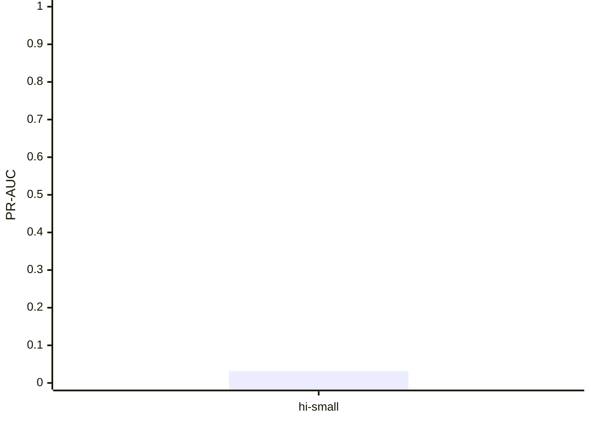

# IBM AML full-data temporal training study

- Run: `<RUN_ID>` (measured)
- Config SHA-256: `ffffffffffffffffffffffffffffffffffffffffffffffffffffffffffffffff`
- Commit: `<COMMIT>`
- Application candidate (pre-registered): `hi-small`

## Reconciliation and temporal evaluation

| Candidate | Input SHA | Model SHA | Source rows | Usable | Rejected | Train (prev.) | Tuning (prev.) | Calibration (prev.) | Holdout (prev.) |
|---|---|---|---:|---:|---:|---:|---:|---:|---:|
| hi-small | `5c9fa32d6f20871cfa0f9994a098349e25c76136339bc001be5ca46a3c9a0d6b` | `<MODEL_SHA>` | 2000 | 1996 | 4 | 1198 (0.02504174) | 198 (0.02525253) | 200 (0.02500000) | 400 (0.02500000) |

## Candidate versus capped logistic baseline

| Candidate | PR-AUC | Baseline PR-AUC | Recall@budget | Gates | Threshold source |
|---|---:|---:|---:|---|---|
| hi-small | 0.031480 | 0.050610 | 0.000000 | fail | calibration |

## Runtime and cost

| Stage | Seconds | Peak RSS MiB |
|---|---:|---:|
| train:ibm-aml | <SECONDS> | <RSS> |

Total recorded stage time: <SECONDS> seconds.

Peak RSS: <RSS> MiB. Host: `<HOST>`. Projected cost: 3.0. Actual cost: 0.0.

Cross-file overlap is reported in the JSON manifest before treating source files as independent evidence. Dataset rows are transactions, not SAR cases.
